# 代码实施技能

## 核心原则

1. **文档驱动**：所有实施决策必须可追溯到 generate-document 产出的文档（需求文档、需求任务、设计文档、动态检查清单）。
2. **测试先行**：在写任何项目代码之前，必须为每个用户故事场景生成可运行的 E2E 测试页面（最小原型 + Playwright 测试骨架）。
3. **动态检查门禁**：动态检查清单的全部 P0 项必须在原型页面上通过，才能解锁代码实施阶段。验证使用 **Playwright-MCP** 工具直接驱动浏览器完成。
4. **全项目模块预检**：写代码前必须对整个项目做完整的影响分析，使用 Grep 搜索所有引用处，产出引用清单，避免改动遗漏。
5. **逐模块验证**：每完成一个模块立即用 Playwright-MCP 验证对应 P0 项，发现偏差立即修正，避免缺陷累积。
6. **代码评审门禁**：代码实施完成后，必须通过 code-review + code-reviewer 审查，P0 问题修复后才能进入冒烟测试。
7. **冒烟测试门禁**：代码评审通过后，用 Playwright-MCP 对真实页面逐场景验收全部 P0 检查项，结果回写到动态检查清单。
8. **Mock 仅限测试**：`page.route`、`vi.mock`、stub 函数等只允许出现在 `tests/` 目录，禁止在任何生产代码中引入条件性 mock。
9. **一次成功**：通过充分的预检和规则约束争取一次写对；禁止在验证失败后不分析根因直接重试。
10. **停止时必总结**：无论在哪个阶段因阻断停止，必须先生成实施总结（`docs/00_rYr/<功能名>/实施总结.md`），记录已执行阶段、产物、阻断原因和建议操作，禁止直接终止流程。

## 何时使用

- 已有功能的 `docs/00_rYr/<功能名>/` 文档集（至少包含需求任务 + 动态检查清单）
- 用户明确希望开始写代码实现
- 需要从文档直接驱动 TDD / 原型验证后的安全实施

## 阶段划分（8 阶段）

```
阶段 0  文档驱动（解析 + 预检 + 文档 Grounding）
阶段 1  测试先行（E2E 测试页面生成）
阶段 2  动态检查门禁（Playwright-MCP × 原型页面）
阶段 3  模块预检（全项目范围影响分析 + 环境预检）
阶段 4  写项目代码（逐模块实施 + 逐模块验证）
阶段 5  代码评审（code-review × 真实代码）
阶段 6  冒烟测试（Playwright-MCP × 真实页面）
阶段 7  过程总结
```

---

## 阶段 0：文档驱动

> **目标**：解析请求、验证文档完备性、读取并 Ground 所有上游文档，提取实施所需的全部信息。

### 0.1 解析请求

从用户输入中提取：
- `{功能名}`：对应 `docs/00_rYr/<功能名>/` 目录
- `{文档集路径}`：默认 `docs/00_rYr/<功能名>/`

必填参数缺失时先向用户澄清，不继续执行。

### 0.2 文档完整性预检

读取以下文件，**任一 P0 文档缺失则停止并提示用户先运行 generate-document**：

| 文件 | 级别 | 用途 |
|------|------|------|
| `需求任务.md` | P0 | 提取用户故事 + 操作场景 |
| `设计文档.md` | P0 | 提取模块、接口、代码路径 |
| `动态检查清单.md` | P0 | 提取所有待验证的检查项 |
| `需求文档.md` | P1 | 补充背景信息 |
| `使用文档.md` | P2 | 辅助 UI 文案 |

**文档缺失时的停止流程**：
1. 记录缺失的文档名称和级别
2. ⛔ 停止执行
3. 生成实施总结（见"停止时实施总结生成规范" in `rules/process-summary.md`）
4. 提示用户先运行 generate-document 补齐缺失文档

### 0.3 文档 Grounding

读取全部 P0 文档，提取以下内容：

**从 `需求任务.md` 提取用户故事与场景**：
```
用户故事 US-{N}：
  场景：{场景名}
  前置条件：{条件}
  操作步骤：{步骤列表}
  预期结果：{结果}
```

**从 `设计文档.md` 提取实现约束**：
- 涉及模块列表（名称 + 文件路径）
- 接口规范（输入 / 输出 / 错误码）
- 状态管理方案（Store 工厂模式要求）
- 已有代码路径（避免重复造轮子）

**从 `动态检查清单.md` 建立检查项映射**：
- 按场景分组所有 P0 检查项
- 建立"场景 → 检查项列表"映射，供后续阶段门禁使用

### 0.4 技能与代理预加载

调用 `find-skills`，声明本次使用的技能：
- `e2e-testing`：生成测试页面和 Playwright 骨架
- `verification-loop`：构建 / 集成验证
- `code-review`：代码审查
- `search-first`：引入外部依赖时选型（按需）

调用 `find-agents`，按任务类型并行分派：

| 场景 | 代理 |
|------|------|
| 所有场景 | `test-page-builder`（生成测试页面） |
| 架构不确定时 | `architect` |
| 安全相关场景 | `security-reviewer` |
| 文档有歧义时 | `docs-lookup` |

### 0.5 MCP 可用性声明与探针检查

> **目标**：在进入阶段 1 之前，明确本功能所需的全部 MCP 工具，完成探针检查，确定可用状态与降级策略，避免在阶段 2 / 6 才发现缺失而静默降级。

#### 步骤一：从文档推导所需 MCP 工具

根据设计文档"模块文件路径"和动态检查清单"验证方式"，推导本功能所需 MCP 工具：

| MCP 工具 | 触发条件 | 用于阶段 |
|---------|---------|---------|
| `playwright`（浏览器自动化） | 检查清单含 UI 交互验证项 | 阶段 2（原型验证）、阶段 6（冒烟测试） |
| `filesystem`（文件读写） | 功能涉及本地文件读取 / 写入 / 下载 | 阶段 3（模块预检）、阶段 4（代码实施） |
| 其他工具 | 由设计文档外部依赖决定，按需声明 | 视具体阶段而定 |

#### 步骤二：执行探针检查

对声明的每个 MCP 工具执行最小探针操作：

```
playwright 探针：
  操作：browser_navigate → about:blank
  预期：返回成功，无报错
  结果：✅ 可用 / ❌ 不可用（错误：<原因>）

filesystem 探针：
  操作：读取 docs/00_rYr/<功能名>/需求任务.md（复用 0.2 已读取的结果）
  结果：✅ 可用 / ❌ 不可用

<其他工具>：
  操作：<最小探针命令>
  结果：✅ / ❌
```

#### 步骤三：确定降级策略

| MCP 工具 | 不可用时的降级方案 | 是否阻断 |
|---------|----------------|---------|
| `playwright` | 阶段 2 / 6 降级为 `npx playwright test`，结果需人工确认 | 否（必须在实施总结标注） |
| `filesystem` | 改用 Read / Write 工具直接操作 | 否 |
| 无降级方案的必要工具 | ⛔ 停止，提示用户配置后重试 | **是** |

#### 步骤四：输出 MCP 可用性声明块

完成探针后输出声明块，结果同步写入实施总结时序图的参与方列表：

```
=== MCP 可用性声明 ===
功能：<功能名>  检查时间：<ISO 时间戳>

| MCP 工具     | 探针结果 | 降级方案         | 影响阶段   |
|------------|---------|----------------|----------|
| playwright | ✅ 可用  | —              | 阶段 2、6 |
| filesystem | ✅ 可用  | —              | 阶段 3、4 |

结论：
  ✅ 全部 MCP 工具可用，继续执行阶段 1
  ⚠️ playwright 不可用 → 阶段 2/6 降级为 npx playwright test，已标注
  ⛔ <工具名> 不可用且无降级方案 → 停止执行，等待用户配置
```

**禁止**：跳过探针直接进入阶段 1；MCP 不可用时静默降级而不在声明块中标注。

---

## 阶段 1：测试先行

> **目标**：为每个用户故事场景生成可运行的 E2E 测试页面和 Playwright 骨架，覆盖真实复杂度。
> **规范依据**：`rules/e2e-testing.md` + `rules/test-page.md`

### 1.0 场景项目锚点定位（生成测试前必须完成）

生成任何测试页面或测试骨架之前，先从文档中提取每个场景的**项目锚点**，明确告知 Playwright-MCP 在哪里、用什么内容、按什么路径触发场景。

| 锚点 | 含义 | 来源文档 |
|------|------|---------|
| **入口 URL** | 功能在项目中的具体路由或文件路径，如 `/docs/example.md` 或 `http://localhost:8080/docs/` | 设计文档"模块文件路径"章节 |
| **前置内容** | 页面上必须存在的具体数据或 UI 内容，如"含至少一个 mermaid 代码块的 Markdown 文件" | 需求任务"前置条件"章节 |
| **触发路径** | 从页面加载到场景触发的具体操作序列，如"打开页面 → 等待渲染完成 → 鼠标悬停到 `.mermaid` 容器区域" | 需求任务"操作步骤"章节 |
| **可观测对象** | 断言时所观测的具体 `data-testid`，如 `mermaid-toolbar-container` | 动态检查清单 P0 检查项 |

**禁止**：用泛化描述代替项目锚点（如"打开任意页面"、"存在某个元素"）。锚点必须对应项目中的具体文件、路由或真实内容；缺少锚点的场景不得进入 1.1。

每个场景完成锚点定位后，输出以下确认块（**写入测试原型页面头部注释和 spec 文件顶部注释**）：

```
场景锚点: US-{N} <场景名>
  入口 URL  : <项目具体路由或本地文件路径>
  前置内容  : <页面需要存在的具体数据/内容>
  触发路径  : <从入口到场景触发的操作序列>
  可观测对象: <断言所用 data-testid 列表>
```

### 1.1 真实复杂场景建模

生成测试页面前，**先分析每个场景的真实复杂度**，识别：

| 复杂度维度 | 需要覆盖的内容 |
|-----------|--------------|
| 异步状态 | 加载中 → 成功 / 失败 完整状态机 |
| 多步骤流程 | 步骤 N 的输出是步骤 N+1 的前置条件 |
| 错误分支 | API 失败（4xx/5xx）、网络超时、输入校验失败 |
| 边界条件 | 空状态、最大值 / 最小值、并发操作、重复触发 |
| 交互副作用 | 操作后影响其他 UI 区域的状态 |

**禁止**：用单步骤、无状态变化的"点击即成功"简化场景。

### 1.2 生成测试原型页面

调用 `e2e-testing` 技能 + `test-page-builder` 代理，为**每个用户故事的每个操作场景**生成：

**测试原型页面**（`tests/e2e/pages/<功能名>/<场景名>.html`）：
- 包含场景所需全部 UI 元素（按设计文档）
- `data-testid` 标记所有可交互元素，格式：`data-testid="<功能名>-<元素名>"`
- 不含业务逻辑，仅展示 UI 结构（桩实现）
- 包含异步 / 错误状态的桩切换逻辑，无真实 fetch 调用

**Playwright 测试骨架**（`tests/e2e/<功能名>/<场景名>.spec.ts`）：
- 前置条件设置 + `page.route` API Mock 声明（涉及接口时必填）
- 操作步骤（`page.click`、`page.fill` 等）
- 断言来自动态检查清单预期结果，**禁止自行发明断言**
- Mock 数据使用与真实接口一致的数据结构，禁止 `{}` / `"test"` / `0` 等无意义占位

**API Mock 规范**：

```typescript
// ✅ 仅存在于测试文件，使用真实数据结构
test.beforeEach(async ({ page }) => {
  await page.route('**/api/diagrams/export', async route => {
    await route.fulfill({
      status: 200,
      contentType: 'application/json',
      body: JSON.stringify({
        id: 'export-abc123',
        url: 'https://cdn.example.com/exports/architecture.svg',
        filename: 'architecture.svg',
        size: 48320,
        format: 'svg',
        createdAt: '2024-01-15T10:30:00Z'
      })
    });
  });
});

// ✅ 同时覆盖失败分支
await page.route('**/api/diagrams/export', route =>
  route.fulfill({ status: 500, body: JSON.stringify({ error: 'Export service unavailable', code: 'EXPORT_FAILED' }) })
);

// ❌ 禁止：生产代码中任何形式的 mock / stub / 条件判断
```

### 1.3 data-testid 覆盖率检查

遍历动态检查清单中所有 UI 操作项，确认每个操作步骤对应的 `data-testid` 已在测试原型页面中定义。未覆盖项 → 补充到原型页面后才能进入阶段 2。

### 1.4 输出清单

```
测试先行产物：
  US-1 场景 A：tests/e2e/pages/<功能名>/场景A.html ✓
  US-1 场景 A：tests/e2e/<功能名>/场景A.spec.ts ✓
    └─ API Mock：<N> 个接口已覆盖（含成功 / 失败分支）
  US-2 场景 B：...
  data-testid 覆盖率：<N>/<M> 个操作项已覆盖
  复杂度维度：异步状态 ✓ / 错误分支 ✓ / 边界条件 ✓
```

---

## 阶段 2：动态检查门禁

> **目标**：用 Playwright-MCP 驱动浏览器，在原型页面上逐条验证动态检查清单全部 P0 项，通过后才能解锁代码实施。
> **规范依据**：`rules/verification-gate.md`

### 2.1 Playwright-MCP 执行验证

对每个场景，按以下步骤执行：

```
1. browser_navigate  → 打开原型页面（file:// 或 dev server）
2. browser_snapshot  → 确认初始状态与前置条件一致
3. （若有 API 依赖）→ 确认 .spec.ts 中 page.route mock 已声明
4. 按操作步骤顺序：browser_click / browser_fill / browser_select_option
5. browser_snapshot  → 截取操作后状态，与检查清单预期结果语义比对
6. browser_evaluate  → 执行断言逻辑
7. 记录：✅ 通过 / ❌ 未通过（含 MCP 操作记录）
```

逐条记录每个 P0 检查项的验证结果：
```
检查项：<描述>
来源：<需求任务/设计文档章节>
验证方式：Playwright-MCP 交互验证 / 静态分析 / 人工确认
MCP 操作记录：<使用的 MCP 工具序列>
状态：✅ 通过 / ❌ 未通过 / ⚠️ 需人工确认
```

### 2.2 门禁决策

```
P0 全部通过？
  是 → 执行阶段 2.3 状态回写 → 解锁阶段 3（模块预检）
  否 → 修复测试原型页面，重跑阶段 2（最多 2 轮自修复）
       2 轮仍失败 → ⛔ 停止
         输出验证门禁阻断报告
         生成实施总结（停止时总结）
         等待人工介入

严禁：P0 有未通过项时进入阶段 3。
```

### 2.3 状态回写动态检查清单

门禁通过后，**必须**将原型验证结果回写到 `docs/00_rYr/<功能名>/动态检查清单.md`：

| 验收结果 | 状态列更新 | 备注列追加 |
|---------|----------|----------|
| P0 通过 | 🏃（原型验证通过） | `原型验证通过 <YYYY-MM-DD>` |
| P0 未通过 | ❌ | 失败原因摘要 |

**状态标记含义**：

| 状态 | 含义 | 更新阶段 |
|------|------|---------|
| ⏳ | 未验证 | 初始状态 |
| 🏃 | 原型验证通过 | 阶段 2 |
| ✅ | 冒烟测试通过 | 阶段 6 |
| ❌ | 验证未通过 | 阶段 2 或 6 |
| ⚠️ | 需人工确认 | 阶段 2 或 6 |

**禁止**：
- ❌ 未实际执行 Playwright-MCP 验证时更新状态
- ❌ 将原型验证结果（🏃）误标为冒烟通过（✅）
- ❌ 修改检查项的预期结果以"通过"门禁

### 2.4 输出验证报告

```
=== 动态检查门禁报告 ===
P0 总计：<N> 项
  通过：<N1> 项（Playwright-MCP 验证）
  未通过：<N2> 项（列出具体项 + MCP 截图描述）
  人工确认：<N3> 项（不计入门禁）

动态检查清单回写：
  已回写：<N> 项 → 状态更新为 🏃（原型验证通过）
  回写文件：docs/00_rYr/<功能名>/动态检查清单.md

API Mock 验证：
  接口 <path>：mock 注入 ✓ / 响应结构验证 ✓

结论：通过 / 未通过（已阻断进入代码实施阶段）
```

---

## 阶段 3：模块预检（全项目）

> **目标**：在写任何项目代码之前，对整个项目做完整的环境预检和影响分析。充分预检是"一次写对"的前提。
> **规范依据**：`rules/code-implementation.md`

### 3.1 环境静态预检（verification-loop 阶段 1-3）

调用 `verification-loop` 技能执行：
- 读取 `package.json`、`vite.config.*`、`tsconfig.json`
- 确认目标文件路径存在（基于设计文档模块路径）
- 确认 import 路径合法，无循环依赖
- 确认环境变量已在 `.env` / `.env.example` 中定义

### 3.2 全项目范围影响分析（每个模块，禁止跳过）

对设计文档中每个待实施模块，在整个项目中搜索所有引用处：

```
┌─ 全项目影响分析清单 ─────────────────────────────────────────┐
│                                                               │
│ 对每个待实施模块的每个变更点，使用 Grep（ripgrep）对 src/      │
│ 目录全量搜索，禁止仅凭记忆或设计文档推断引用关系。             │
│                                                               │
│ a. 若新增/修改组件 → 搜索整个项目中所有使用该组件的位置        │
│    （模板引用 / import / 全局注册 / 动态组件 / 路由懒加载）    │
│                                                               │
│ b. 若新增/修改 Store → 搜索整个项目中所有调用该 Store 的位置  │
│    （composables / 组件 / 其他 Store / 路由守卫）             │
│                                                               │
│ c. 若新增/修改 composable / service → 搜索整个项目中所有      │
│    调用该 composable / service 的位置                         │
│                                                               │
│ d. 若新增/修改路由 → 搜索整个项目中所有导航到该路由的位置      │
│    （router-link / router.push / 路由守卫 / 面包屑）          │
│                                                               │
│ e. 若修改/删除现有导出 → 搜索整个项目中所有 import 该导出的位置│
│                                                               │
│ 每个变更点必须产出"引用清单"：                                │
│   <变更项> → 影响文件列表：<file1>:<line>, <file2>:<line>     │
│   需同步修改：是/否 + 原因                                    │
└───────────────────────────────────────────────────────────────┘
```

### 3.3 代码编写预检清单（写代码前逐项确认）

```
┌─ 代码编写预检清单（禁止跳过）──────────────────────────────┐
│                                                              │
│ □ 1. 读取该模块涉及的所有现有源文件（避免重复实现/冲突）       │
│ □ 2. 确认该模块的设计文档约束（接口规范/数据模型/状态管理）    │
│ □ 3. 确认该模块对应的动态检查清单 P0 检查项                  │
│ □ 4. 确认该模块所需的注册入口                               │
│      Store: src/stores/index.js                              │
│      组件: src/components/index.js                           │
│      路由: src/router/index.js                              │
│ □ 5. 确认 data-testid 对照表（原型页面 testid → 真实组件     │
│      testid，命名完全一致）                                  │
│ □ 6. 确认编码规范（Store 工厂模式/组件全局注册/代码结构）     │
│ □ 7. 确认依赖项就绪（package.json / 环境变量 / TS 类型）     │
│ □ 8. 确认该模块不会与已实施模块产生冲突                      │
│ □ 9. 3.2 全项目影响分析已完成，引用清单已产出                │
│                                                              │
│ 预检全部通过 → 解锁阶段 4（写项目代码）                       │
└──────────────────────────────────────────────────────────────┘
```

---

## 阶段 4：写项目代码

> **目标**：按设计文档模块顺序实施项目代码，每模块完成后立即 Playwright-MCP 验证，尽早发现偏差。
> **规范依据**：`rules/code-implementation.md`

### 4.1 实施顺序

```
1. Store / 状态层（数据模型 → 工厂函数 → src/stores/index.js 注册）
2. 业务逻辑层（composables → services）
3. UI 组件层（组件 + data-testid → src/components/index.js 注册）
4. 路由 / 入口注册（src/router/index.js → main.js / App.vue 确认）
```

### 4.2 每模块实施步骤

每开始编写一个模块：

1. **完成代码编写预检**（阶段 3.3 预检清单全部通过）
2. **读取相关现有代码**（避免重复造轮子，与现有代码保持一致）
3. **按 `rules/code-implementation.md` 编写**
   - Store 工厂模式（`export function createXxxStore()`）
   - 组件全局注册（`src/components/index.js`）
4. **移植 `data-testid`**（测试原型页面中的 testid 原样出现在真实组件中，不得更名或缺省）
5. **立即 ReadLints**（消除 P0 lint 错误）
6. **全项目回归搜索**（确认本模块改动的所有引用处均已同步）

### 4.3 逐模块验证门禁

每个模块完成 + ReadLints 通过后，立即用 Playwright-MCP 验证该模块对应的 P0 检查项：

```
1. browser_navigate → 导航至真实功能页面
2. browser_snapshot → 确认该模块渲染状态
3. 按该模块 P0 检查项逐条验证：
   browser_click / browser_fill / browser_evaluate
4. 记录每条结果：✅ 通过 / ❌ 未通过（含 MCP 操作记录）

该模块 P0 全部通过 → 标注"已完成：<模块名>"，继续下一模块
未通过 → 进入模块级自修复流程（4.4）
```

### 4.4 模块级自修复流程（每模块最多 1 轮）

```
模块修复轮次 1（唯一自修复机会）：

第一步：根因分析（禁止跳过）
  - 错误现象：MCP 工具实际返回 / browser_snapshot 中观察到的行为
  - 预期行为：动态检查清单中的预期结果原文
  - 根因分类（从 rules/verification-gate.md § 9.3 选择一项）
  - 影响范围：是否影响其他模块

第二步：修复预检（禁止跳过）
  □ 重新读取失败项涉及的源文件
  □ 确认修复不引入新 P0 问题
  □ 确认修复与设计文档约束一致
  □ 确认修复不破坏已通过的模块验证

第三步：精确修复
  □ 只修改根因定位到的代码
  □ 修复后立即 ReadLints
  □ 实施记录中标注"模块修复：<根因分类>"

第四步：模块重新验证（全部 P0 项，含防回归）

仍有失败 → ⛔ 模块阻断
  记录失败原因，若后续模块不依赖该失败模块则继续实施
  所有模块完成后，在阶段 5 代码评审中标记并在阶段 6 冒烟测试中处理
  若所有模块均有阻断且无法继续 → 生成实施总结后停止
```

### 4.5 模块验证结果汇总（进入阶段 5 前）

```
=== 模块验证结果汇总 ===
模块 1：<Store 层> ✅ 全部通过（初始通过 / 1 轮自修复后通过）
模块 2：<业务逻辑层> ✅ 全部通过
模块 3：<UI 组件层> ❌ 有阻断项（<N> 条 P0 未通过，阶段 6 处理）
模块 4：<路由/入口> ✅ 全部通过

总 P0 检查项：<M> 项
逐模块验证通过：<M - N> 项
待阶段 6 处理：<N> 项
```

---

## 阶段 5：代码评审

> **目标**：在进入冒烟测试之前，通过 code-review 和 code-reviewer 审查已实施代码，P0 问题必须修复。
> **规范依据**：`rules/e2e-testing.md § 8`（Mock 泄漏检查）

### 5.1 调用 code-review 技能 + code-reviewer 代理

审查重点：

| 审查维度 | P0 门禁 | 内容 |
|---------|---------|------|
| YiWeb 规范符合性 | ✅ | Store 工厂模式、组件全局注册、代码结构 |
| data-testid 完整性 | ✅ | 所有可操作元素均有 testid，与原型页面一致 |
| Mock 泄漏检查 | ✅ | 生产代码中无 mock/stub/条件 stub |
| 接口规范符合性 | ✅ | 接口调用方式与设计文档一致 |
| 无设计文档外代码 | ✅ | 无未经授权的新增文件或配置项 |
| lint 清洁度 | ✅ | 无 P0 lint 错误残留 |

**Mock 泄漏检查（必须执行）**：

```bash
# 检查生产代码是否含 mock 相关代码（期望结果：0 条匹配）
rg -n "vi\.mock|jest\.mock|page\.route|__mocks__|stub\(" src/ --type ts
rg -n "import\.meta\.env\.TEST|process\.env\.TEST|VITE_MOCK" src/ --type ts
```

任何匹配 → P0 问题，必须在进入阶段 6 前修复。

### 5.2 Playwright 测试替换桩断言

调用 `verification-loop` 阶段 4，将测试骨架中的桩断言替换为真实断言并运行完整测试：

```bash
npx playwright test tests/e2e/<功能名>/ --reporter=list
```

### 5.3 评审门禁决策

```
code-review 输出 P0 问题？
  是 → 修复 P0 问题 → 重新评审（直至无 P0 问题）
  否 → 解锁阶段 6（冒烟测试）

P1 / P2 问题：记录在实施总结的"未解决问题"章节，不阻断流程。
```

### 5.4 输出评审报告

```
=== 代码评审报告 ===
审查工具：code-review Skill + code-reviewer Agent
时间：<ISO 时间戳>

P0 问题：<N> 项（已全部修复）
P1 问题：<N1> 项（记录在实施总结，不阻断）
P2 建议：<N2> 项（记录在实施总结，不阻断）

Mock 泄漏检查：✅ 无泄漏（0 条匹配）
Playwright 测试：✅ 通过 / ❌ <N> 个测试失败（已修复）

结论：代码评审通过，解锁阶段 6（冒烟测试）。
```

---

## 阶段 6：冒烟测试

> **目标**：用 Playwright-MCP 对真实项目代码页面逐场景验收全部 P0 检查项，确保代码实施未引入回归。
> **规范依据**：`rules/verification-gate.md § 9`

### 6.1 核心目的

阶段 2 验证**原型页面**（桩实现），阶段 6 验证**真实项目代码**（Vue 组件 + Store + 路由完整集成）。两者之间的业务逻辑、异步状态、组件注册、路由集成等差距是缺陷高发区。**禁止跳过**。

### 6.2 Playwright-MCP 执行验证（逐场景）

与阶段 2 使用完全相同的验证流程，但验证对象替换为真实功能页面：

```
对每个场景（按动态检查清单顺序）：
  1. browser_navigate  → 导航至真实功能页面路由
                         （如 http://localhost:5173/<功能路径>）
  2. browser_snapshot  → 确认初始状态与前置条件一致
  3. 按操作步骤执行：
     browser_click / browser_fill / browser_select_option
  4. browser_snapshot  → 截取操作后状态，与预期结果语义比对
  5. browser_evaluate  → 执行断言逻辑
  6. 记录：✅ 通过 / ❌ 未通过（含 MCP 操作记录 + 实际行为描述）
```

**与阶段 2 的关键差异**：
- 无需 `page.route` Mock：真实页面使用真实 API 或测试环境后端
- 若后端不可用，允许在 `.spec.ts` 中 Mock，但**不得修改生产代码**
- 验证范围更广：除 P0 检查项外，还须验证组件注册、路由跳转、Store 状态持久化等集成行为

### 6.3 门禁决策与自修复（最多 1 轮）

```
P0 全部通过？
  是 → 执行阶段 6.4 状态回写 → 解锁阶段 7（过程总结）
  否 → 进入自修复流程（最多 1 轮）：

    第一步：根因分析（禁止跳过）
      - 错误现象 / 预期行为 / 根因分类（从 verification-gate.md § 9.3 选）
      - 影响范围

    第二步：充分预检（禁止跳过）
      □ 读取失败项涉及的所有源文件
      □ 确认修复不引入新 P0 问题
      □ 确认修复与设计文档约束一致
      □ 确认 dev server 运行且无编译错误

    第三步：精确修复（只修改根因定位到的代码）

    第四步：重新验证（全部 P0 项，含防回归）

    仍有失败 → ⛔ 停止
      输出冒烟测试阻断报告
      生成实施总结（停止时总结）
      等待人工介入

严禁：P0 有未通过项时进入阶段 7。
```

### 6.4 回写动态检查清单状态（必须执行，每场景验收后立即回写）

```
对每个已验收的检查项：
  P0 通过 → 状态列更新为 ✅，备注列追加"Playwright-MCP 验证 <YYYY-MM-DD>"
  P0 未通过 → 状态列更新为 ❌，备注列追加失败原因摘要
  P1/P2 通过 → 状态列更新为 ✅
  P1/P2 未通过 → 状态列更新为 ⚠️
```

回写后，同步更新动态检查清单底部的"检查总结"：
- **总体进度表**：更新"已完成"列和"通过率"列
- **待完成项**：`[ ]` → `[x]`
- **结论**：全部 P0 通过 → `✅ 所有 P0 检查项已通过（Playwright-MCP 冒烟测试 <YYYY-MM-DD>）`

**禁止**：
- ❌ 跳过回写直接进入阶段 7
- ❌ 未实际验证时将 ⏳ 改为 ✅
- ❌ 修改检查项优先级以绕过门禁

### 6.5 输出冒烟测试报告

```
=== 冒烟测试报告 ===
功能：<功能名>
执行轮次：<N>（1 = 一次通过 / 2 = 1 轮自修复后通过）
验证引擎：Playwright-MCP / 命令行降级（注明原因）
时间：<ISO 时间戳>

P0 总计：<N> 项，全部通过 ✅

场景验收明细：
  场景：<场景名>
  MCP 操作序列：navigate → snapshot → click → evaluate → ...
  P0 检查项：<N> 项，通过 <N> 项 ✅
  验收结论：✅ 通过

自修复记录（若有）：
  轮次 1 修复项：<N> 项
    - <根因分类>：<修复概述>
  回归验证：全部 P0 项重新通过 ✅

与阶段 2 对照：
  阶段 2 通过项：<N1> 项
  阶段 6 通过项：<N2> 项
  差异说明：<若无差异则填"无差异">

动态检查清单回写：
  已回写：<N> 项 → ✅（冒烟测试通过）
  回写文件：docs/00_rYr/<功能名>/动态检查清单.md

结论：冒烟测试通过，解锁阶段 7（过程总结）。
```

---

## 阶段 7：过程总结

> **目标**：生成完整的实施总结文档，供回溯和复盘使用。
> **规范依据**：`rules/process-summary.md`

调用 `impl-reporter` 代理生成总结文档，保存至 `docs/00_rYr/<功能名>/实施总结.md`。

必须包含（详见 `rules/process-summary.md`）：

### 7.1 工具调用流程图（Mermaid flowchart）

记录本次实施中所有 Skill / Agent / Tool 的调用顺序和分支决策（实际执行路径，非理想路径）。

### 7.2 完整时序图（Mermaid sequenceDiagram）

展示 Agent ↔ Skill ↔ 文件系统 ↔ Playwright-MCP 之间的完整交互时序，必须包含阶段 6 冒烟测试的逐场景验收消息。

### 7.3 阶段执行摘要

| 阶段 | 状态 | 关键结果 | 耗时（估计） |
|------|------|---------|-------------|
| 阶段 0：文档驱动 | ✅ | ... | ... |
| 阶段 1：测试先行 | ✅ | ... | ... |
| 阶段 2：动态检查门禁 | ✅ | ... | ... |
| 阶段 3：模块预检（全项目） | ✅ | ... | ... |
| 阶段 4：写项目代码 | ✅ | ... | ... |
| 阶段 5：代码评审 | ✅ | ... | ... |
| 阶段 6：冒烟测试 | ✅ | ... | ... |
| 阶段 7：过程总结 | ✅ | ... | ... |

### 7.4 验证门禁结果归档

原文引用阶段 2 动态检查门禁报告 + 阶段 4 逐模块验证结果汇总 + 阶段 6 冒烟测试报告。

### 7.5 变更文件清单

| 文件路径 | 变更类型 | 关联模块 | 说明 |
|---------|---------|---------|------|
| ... | 新增/修改/删除 | ... | ... |

### 7.6 未解决问题与后续建议

列出所有 P1 / P2 问题及后续优化建议。

---

## 完整流程图

```mermaid
flowchart TD
    Start([接收请求]) --> Phase0["阶段 0：文档驱动\n解析功能名\n预检文档完整性\n读取并 Ground 所有文档\n提取用户故事 / 约束 / 检查清单"]

    Phase0 -->|P0 文档缺失| StopDoc["⛔ 停止\n提示运行 generate-document\n生成实施总结（停止时总结）"]
    Phase0 -->|文档完整| LoadSkills["find-skills + find-agents\n声明技能：e2e-testing\nverification-loop / code-review\n分派代理：test-page-builder\n按需：architect / security-reviewer"]

    LoadSkills --> Phase1["阶段 1：测试先行\n真实复杂场景建模\n测试原型页面（含所有状态）\nPlaywright 骨架 + API Mock\ndata-testid 覆盖率检查"]

    Phase1 --> CoverCheck{"data-testid 全覆盖?\n+ Mock 完整?"}
    CoverCheck -->|否| FixTestid["补充 data-testid\n补充 API Mock"]
    FixTestid --> CoverCheck
    CoverCheck -->|是| Phase2["阶段 2：动态检查门禁\nPlaywright-MCP 驱动\n逐条验证 P0 检查项\n对原型页面"]

    Phase2 --> P0Gate{"P0 全部通过?"}
    P0Gate -->|否，第 1-2 次| FixPage["修复原型页面\n根因分析后精确修复"]
    FixPage --> Phase2
    P0Gate -->|否，第 3 次| StopGate["⛔ 停止\n输出验证门禁阻断报告\n生成实施总结（停止时总结）"]
    P0Gate -->|是| WriteBack2["阶段 2.3\n回写动态检查清单\n⏳ → 🏃（原型验证通过）"]

    WriteBack2 --> Phase3["阶段 3：模块预检（全项目）\nverification-loop 环境预检\n全项目 Grep 影响分析\n产出引用清单\n代码编写预检清单（逐项确认）"]

    Phase3 -->|预检有阻断| FixEnv["修复环境 / 路径问题\n处理影响清单中需同步的位置"]
    FixEnv --> Phase3
    Phase3 -->|预检全通过| Phase4["阶段 4：写项目代码\nStore → 业务逻辑 → UI 组件 → 路由"]

    Phase4 --> ModImpl["实施模块代码\n（逐模块，每模块完成后）"]
    ModImpl --> ModLints["ReadLints\n消除 P0 lint 错误\n全项目回归搜索"]
    ModLints --> ModVGate{"逐模块验证门禁\nPlaywright-MCP\n验证该模块 P0 项"}

    ModVGate -->|通过| ModDone["标注已完成\n继续下一模块"]
    ModDone -->|还有模块| ModImpl
    ModVGate -->|未通过| ModFix["模块级自修复（最多 1 轮）\n根因分析 → 修复预检 → 精确修复"]
    ModFix --> ModReVerify{"模块重新验证\n全部 P0 项"}
    ModReVerify -->|通过| ModDone
    ModReVerify -->|仍失败| ModBlock["⛔ 模块阻断\n记录失败原因\n若后续模块不依赖则继续"]

    ModDone --> AllDone{"所有模块已完成?"}
    ModBlock --> AllDone
    AllDone -->|否| ModImpl
    AllDone -->|是| ModSummary["模块验证结果汇总（4.5）"]

    ModSummary --> Phase5["阶段 5：代码评审\ncode-review + code-reviewer\nMock 泄漏检查（Grep）\nPlaywright 测试替换桩断言\n输出 P0/P1/P2 问题"]

    Phase5 --> CR_P0{"P0 评审问题?"}
    CR_P0 -->|是| FixP0["修复 P0 问题\n重新评审"]
    FixP0 --> Phase5
    CR_P0 -->|否| Phase6["阶段 6：冒烟测试\nPlaywright-MCP 逐场景验收\n对真实功能页面\n验证全部 P0 检查项"]

    Phase6 --> SmokeGate{"P0 全部通过?"}
    SmokeGate -->|否，首次失败| SmokeRCA["根因分析 → 充分预检 → 精确修复"]
    SmokeRCA --> SmokeReVerify{"重新验证全部 P0"}
    SmokeReVerify -->|通过| WriteBack6
    SmokeReVerify -->|仍失败| StopSmoke["⛔ 停止\n输出冒烟测试阻断报告\n生成实施总结（停止时总结）"]
    SmokeGate -->|是| WriteBack6["阶段 6.4\n回写动态检查清单\n🏃 → ✅（冒烟测试通过）\n同步更新检查总结"]

    WriteBack6 --> Phase7["阶段 7：过程总结\nimpl-reporter\n流程图 + 时序图\n阶段摘要 + 门禁归档\n变更清单 + 未解决问题"]

    Phase7 --> End([交付])

    classDef skill fill:#e1f5ff,stroke:#0066cc,stroke-width:2
    classDef agent fill:#e6ffe6,stroke:#006600,stroke-width:2
    classDef gate fill:#ffcccc,stroke:#cc0000,stroke-width:2
    classDef phase fill:#fff3cc,stroke:#cc8800,stroke-width:2
    classDef stop fill:#ffaaaa,stroke:#cc0000,stroke-width:2
    class LoadSkills skill
    class Phase1,Phase4,Phase7 phase
    class Phase2,ModVGate,ModReVerify,SmokeGate,SmokeReVerify,CR_P0,AllDone,CoverCheck,P0Gate gate
    class StopDoc,StopGate,StopSmoke stop
```



---

## 支持文件结构

```
.claude/skills/implement-code/
├── SKILL.md                        # 本文件（主技能）
└── rules/
    ├── e2e-testing.md              # E2E 测试页面规范（P0）
    ├── test-page.md                # 测试原型页面结构规范
    ├── verification-gate.md        # 验证门禁规范（P0）
    ├── code-implementation.md      # 代码实施规范（含预检 + 编码约束）
    └── process-summary.md          # 过程总结规范

.claude/agents/
    ├── test-page-builder.md        # 测试页面构建代理
    └── impl-reporter.md            # 实施过程报告代理
```

## 相关技能与代理（使用契约）

| 技能 / 代理 | 调用阶段 | 用途 |
|------------|---------|------|
| `find-skills` | 阶段 0 | 声明并加载所需技能 |
| `find-agents` | 阶段 0 | 分派并行代理 |
| `e2e-testing` | 阶段 1 | 生成 Playwright 骨架 + API Mock |
| `test-page-builder`（代理） | 阶段 1 | 构建测试原型页面（含复杂场景） |
| **Playwright-MCP** | 阶段 2、6 | 交互式浏览器验证（门禁执行引擎） |
| `verification-loop` | 阶段 3、5 | 环境预检 / Playwright 测试执行 |
| `code-review` | 阶段 5 | 实施后代码审查（含 Mock 泄漏检查） |
| `code-reviewer`（代理） | 阶段 5 | 代码架构一致性审查 |
| `architect`（代理） | 阶段 0 | 架构不确定时咨询 |
| `security-reviewer`（代理） | 阶段 0 | 涉及鉴权 / 敏感数据时 |
| `docs-lookup`（代理） | 阶段 0 | 文档歧义定位 |
| `search-first` | 阶段 4 | 引入外部依赖时选型 |
| `impl-reporter`（代理） | 阶段 7 | 生成过程总结文档 |

---

## Mock 隔离原则（全局约束）

> **适用范围**：整个实施周期的所有阶段。

| 规则 | 说明 |
|------|------|
| **仅测试文件可含 Mock** | `page.route`、`vi.mock`、`jest.mock`、stub 函数等**只允许出现在 `tests/` 目录**下 |
| **生产代码禁止条件 Mock** | 禁止 `if (process.env.TEST)` / `if (import.meta.env.VITE_MOCK)` 类型的条件分支 |
| **Mock 数据必须真实** | Mock 响应体必须使用与真实接口一致的数据结构（字段名、类型、嵌套层级） |
| **错误分支必须 Mock** | 每个接口 mock 必须同时包含成功路径和至少一个失败路径（4xx/5xx） |
| **评审时检查泄漏** | 阶段 5 代码评审必须包含 Mock 泄漏检查：grep 生产代码中是否含 mock/stub 关键词 |
