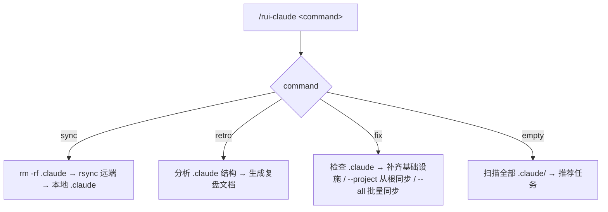
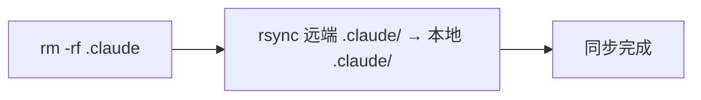
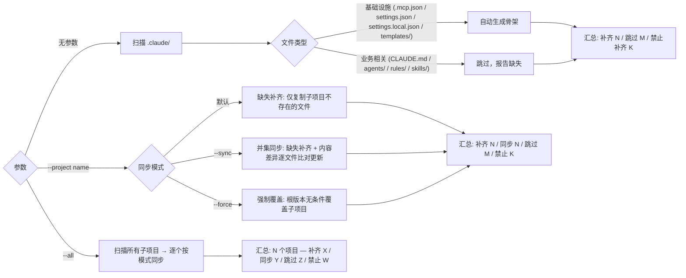

# rui-claude

> **作用范围：** `rui-claude` 对仓库中**所有** `.claude/` 目录生效——根项目、所有子项目。`sync` / `retro` / `fix` 均以 `.claude/` 为操作边界，空输入扫描全部子项目给出推荐。



---

## --help

`/rui-claude` 及其子命令均支持 `--help` 标志，输出对应层级用法说明后退出，不执行任何管线操作。

### 触发规则

| 输入 | 行为 |
|------|------|
| `/rui-claude --help` | 输出技能级总览（命令列表 + 参数速查） |
| `/rui-claude sync --help` | 输出 `sync` 子命令详细用法 |
| `/rui-claude retro --help` | 输出 `retro` 子命令详细用法（含 `--name`、`--json` 参数） |
| `/rui-claude fix --help` | 输出 `fix` 子命令详细用法（含 `--project`、`--all`、`--sync`、`--force`、`--dry-run`、`--json`） |

### 输出格式

```
📖 /rui-claude — Manage ALL .claude/ directories across the repo

Usage: /rui-claude <command> [options]

Commands:
  sync                  Delete local .claude, rsync from remote
  retro                 Analyze .claude health, write retro doc
  fix                   Fill missing infrastructure
    fix --project <name>  Union sync from root .claude to sub-project
    fix --all [--sync]    Batch sync all sub-projects
    fix --sync            Missing + outdated content sync (recommended)
    fix --force           Force overwrite all with root version
  (no args)             Scan all .claude/ directories, recommend tasks

Options:
  --help                Show this help

Use /rui-claude <command> --help for detailed usage.
```

输出后立即退出，不触发管线、不写文件、不发送通知。

---

## 命令概览

| 命令 | 流程 |
|------|------|
| `/rui-claude sync` | 删除本地 `.claude` → 从远端 rsync 拉取最新配置 |
| `/rui-claude retro` | 分析 `.claude` 结构健康度，生成复盘文档到 `docs/自改进故事面板/` |
| `/rui-claude fix` | 无参数：补齐基础设施。`--project <name>`：单项目并集同步（支持 `--sync`/`--force`）。`--all`：全部子项目批量同步 |
| `/rui-claude`（空输入） | 扫描全部 `.claude/` 目录 → 推荐可执行任务 |

---

## /rui-claude sync

从远端服务器同步最新 `.claude` 配置到本地项目。覆盖式更新：先删除本地 `.claude` 目录，再 rsync 拉取。



| Step | 操作 | 命令 |
|------|------|------|
| 1 | 删除本地 `.claude` | `rm -rf .claude` |
| 2 | rsync 远端到本地 `.claude` | `rsync -avz --exclude '.git' root@www.effiy.cn:/home/claude/YiKnowledge/static/${PROJECT}/.claude/ ./.claude/` |

> **前置条件**：本机 SSH key 已授权访问 `root@www.effiy.cn`。
>
> `${PROJECT}` 为当前项目根目录名（`basename "$PWD"`），如 `YrY`。执行时自动替换。

---

## /rui-claude retro

分析当前项目 `.claude/` 目录结构，生成配置复盘文档。


| Step | 操作 | 命令 |
|------|------|------|
| 1 | 采集 .claude/ 目录结构 | `node skills/rui-claude/scripts/retro.js` 遍历 agents/rules/templates/skills 统计 |
| 2 | 生成复盘文档 | 按 §1 配置结构 §2 健康度 §3 改进项 三段结构输出 md |
| 3 | 保存文档 | 写入 `${REPO_ROOT}/docs/自改进故事面板/${PROJECT}-${date}.md` |

> **参数：** `--name <story>` 关联故事名，`--json` 输出 JSON 到 stdout。
>
> 复盘聚焦 `.claude` 配置本身，不涉及执行记忆或项目代码分析。

---

## /rui-claude fix

检查 `.claude/` 目录缺失项，从根 `.claude/` 向子项目同步 skills/agents/rules/templates 配置。根 `.claude/` 是 skills/agents/rules/templates 的**唯一权威来源**（与具体业务无关），子项目应保持与根的**并集一致**。

**三种同步模式**：

| 模式 | 标志 | 行为 |
|------|------|------|
| 缺失补齐 | （默认） | 仅复制子项目中不存在的文件，已有文件不覆盖 |
| 并集同步 | `--sync` | 缺失补齐 + 内容差异时更新。确保子项目与根内容一致（推荐日常使用） |
| 强制覆盖 | `--force` | 无条件用根版本覆盖子项目所有文件 |



### 无参数（本地补齐）

| Step | 操作 | 命令 |
|------|------|------|
| 1 | 检查并补齐基础设施 | `node skills/rui-claude/scripts/fix.js` |
| 2 | 输出补齐报告 | 补齐/跳过/禁止 三类统计 |

| 类型 | 文件/目录 | 操作 | 原因 |
|------|----------|------|------|
| 基础设施 | `.mcp.json` | 写入 `{"mcpServers": {}}` | MCP 配置骨架，与业务无关 |
| 基础设施 | `settings.json` | 写入 `{"permissions": {}}` | 权限配置骨架，与业务无关 |
| 基础设施 | `settings.local.json` | 写入 `{}` | 本地覆盖骨架，与业务无关 |
| 基础设施 | `templates/` | 创建空目录 | 目录结构，与业务无关 |

禁止补齐：`CLAUDE.md`、`agents/*.md`、`rules/*.md`、`skills/` 仅报告缺失，不可自动生成空壳。

> **参数：** `--dry-run` 仅检查不写入，`--json` 输出 JSON。

### --project `<name>`（从根并集同步到子项目）

从根 `.claude/` 向子项目同步 skills/、rules/、agents/、templates/。同步以**文件为粒度**，确保子项目拥有根的完整并集。

| Step | 操作 | 命令 |
|------|------|------|
| 1 | 补齐子项目基础设施（同无参数模式） | `node skills/rui-claude/scripts/fix.js --project <name>` |
| 2 | 并集同步 `skills/`：逐 skill 目录逐文件比对 | 缺失文件复制，差异文件按模式处理 |
| 3 | 同步 `agents/`、`rules/` 单文件：逐文件比对 | 缺失复制，差异按模式处理 |
| 4 | 同步 `templates/`：递归逐文件比对 | 缺失复制，差异按模式处理 |
| 5 | 输出同步报告 | 补齐/同步/跳过/禁止 四类统计 |

| 同步项 | 操作 | 原因 |
|--------|------|------|
| `skills/<name>/` | 逐文件比对，缺失复制，差异按模式更新 | 共享 Skill 定义，确保并集一致 |
| `rules/*.md` | 逐文件比对，缺失复制，差异按模式更新 | 共享管线规则 |
| `agents/*.md` | 逐文件比对，缺失复制，差异按模式更新 | 共享 Agent 定义 |
| `templates/**` | 逐文件比对，缺失复制，差异按模式更新 | 共享模板 |
| `CLAUDE.md` | **禁止同步** | 项目哲学/原则特定于项目 |
| `README.md` | **禁止同步** | 项目说明特定于项目 |
| `.git` | **禁止同步** | Git 内部数据 |
| `docs/` | **禁止同步** | 项目特定文档 |

**并集同步 vs 缺失补齐**：

| 维度 | 缺失补齐（默认） | 并集同步（`--sync`） |
|------|-----------------|---------------------|
| 缺失文件 | 复制 | 复制 |
| 已有文件（内容一致） | 跳过 | 跳过 |
| 已有文件（内容差异） | 跳过 | **更新为根版本** |
| 用途 | 初始化、首次补齐 | 日常同步、根更新后传播 |

> 默认模式安全不覆盖已有内容。`--sync` 推荐在日常开发中使用，确保子项目配置与根保持同步。`--force` 用于强制统一场景。

### 输出示例

**无参数：**
```
🔧 rui-claude fix: YiAi

已补齐（2 项）：
  ✅ 创建: .mcp.json
  ✅ 创建: settings.json

跳过（1 项）：
  ⏭️  templates/ — 已存在

禁止补齐 — 业务相关内容（6 项）：
  🚫 CLAUDE.md — 文件缺失
  🚫 agents/AGENT.md — 文件缺失
  ...
```

**--project 模式（默认缺失补齐）：**
```
🔧 rui-claude fix --project YiAi

源: /path/to/static/.claude
目标: /path/to/static/YiAi/.claude

基础设施（2 项）：
  ✅ 创建: .mcp.json
  ✅ 创建: settings.json

缺失补齐（8 项）：
  📥 复制: skills/rui-claude/SKILL.md
  📥 复制: skills/rui-docs/SKILL.md
  📥 复制: rules/rui-claude.md
  📥 复制: rules/rui-docs.md
  ...

跳过（14 项）：
  ⏭️  skills/rui — 已存在
  ⏭️  agents/pm.md — 已存在
  ...

禁止同步（2 项）：
  🚫 CLAUDE.md — 项目特定文件，禁止自动同步
  🚫 .git — 项目特定文件，禁止自动同步
```

**--project --sync 模式（并集同步，推荐）：**
```
🔧 rui-claude fix --project YiAi (--sync)

源: /path/to/static/.claude
目标: /path/to/static/YiAi/.claude

缺失补齐（3 项）：
  📥 复制: agents/reporter.md
  📥 复制: rules/self-improve.md
  📥 复制: skills/wework-bot/scripts/send.js

内容同步（14 项）：
  🔄 更新（内容差异）: skills/rui/SKILL.md
  🔄 更新（内容差异）: skills/rui-claude/SKILL.md
  🔄 更新（内容差异）: skills/rui-claude/scripts/fix.js
  🔄 更新（内容差异）: agents/coder.md
  🔄 更新（内容差异）: agents/tester.md
  🔄 更新（内容差异）: rules/code-pipeline.md
  🔄 更新（内容差异）: rules/rui-claude.md
  ...

跳过（23 项）：
  ⏭️  skills/rui/scripts/rui-state.js — 已存在且内容一致
  ⏭️  agents/pm.md — 已存在且内容一致
  ...

禁止同步（2 项）：
  🚫 CLAUDE.md — 项目特定文件，禁止自动同步
  🚫 .git — 项目特定文件，禁止自动同步
```

### --all（批量同步所有子项目）

从根 `.claude/` 批量同步所有子项目。自动发现 `REPO_ROOT` 下所有含 `.claude/` 的子目录，逐个执行 `syncFromRoot`（按当前模式）。

| Step | 操作 |
|------|------|
| 1 | 扫描 `REPO_ROOT` 下所有含 `.claude/` 的子目录 |
| 2 | 对每个子项目执行完整同步（同 `--project` 流程，支持 `--sync`/`--force`） |
| 3 | 输出汇总报告（含补齐/同步分类统计） |

**输出示例（默认模式）：**
```
🔧 rui-claude fix --all

  Arter: 跳过 40
  Blog: 跳过 40 / 禁止 1
  Duck: 跳过 40 / 禁止 1
  News: 跳过 40 / 禁止 1
  YiAi: 跳过 40 / 禁止 1
  YiPet: 跳过 40
  YiPot: 跳过 40 / 禁止 1
  YiWeb: 跳过 40 / 禁止 1

合计: 8 个项目 — 补齐 0 / 跳过 320 / 禁止 6
```

**输出示例（--sync 模式）：**
```
🔧 rui-claude fix --all --sync

  Arter: 同步 14 / 跳过 26
  Blog: 补齐 3 / 同步 14 / 跳过 23 / 禁止 1
  Duck: 补齐 3 / 同步 14 / 跳过 23 / 禁止 1
  News: 补齐 3 / 同步 14 / 跳过 23 / 禁止 1
  YiAi: 同步 14 / 跳过 26 / 禁止 1
  YiPet: 补齐 1 / 同步 14 / 跳过 25
  YiPot: 补齐 3 / 同步 14 / 跳过 23 / 禁止 1
  YiWeb: 补齐 3 / 同步 14 / 跳过 23 / 禁止 1

合计: 8 个项目 — 补齐 16 / 同步 112 / 跳过 196 / 禁止 6
```

> `--all` 与 `--project` 互斥。支持 `--dry-run`、`--json`、`--sync`、`--force` 参数。推荐组合：`/rui-claude fix --all --sync --dry-run` 先预览，再执行。

---

## /rui-claude（空输入）

当 `/rui-claude` 无参数时，扫描已有 `.claude/` 的所有子项目，推荐 5~10 条可执行任务。

### 推荐生成规则

扫描根项目 `${REPO_ROOT}/` 下所有存在 `.claude/` 的子目录，综合生成推荐：

| 扫描源 | 提取信息 |
|--------|---------|
| `<project>/.claude/agents/` | Agent 数量、角色覆盖 |
| `<project>/.claude/rules/` | 规则文件数、约束覆盖 |
| `<project>/.claude/templates/` | 模板文件数 |
| `<project>/.claude/skills/` | 技能文件数 |
| `<project>/.claude/CLAUDE.md` | 存在性、行数 |
| `<project>/.claude/.mcp.json` | 是否存在 |
| `docs/自改进故事面板/<project>-*.md` | 复盘历史 |

### 推荐分类

| 类型 | 说明 | 示例 |
|------|------|------|
| 首次复盘 | 有 .claude/ 但无复盘记录 | `cd <project> && /rui-claude retro` |
| 增量复盘 | 复盘过期 >7 天 | `cd <project> && /rui-claude retro` |
| 基础设施补齐 | .mcp.json / settings.json 缺失 | `cd <project> && /rui-claude fix` |
| 配置补齐 | agents/rules/skills 为空或 CLAUDE.md 缺失 | `cd <project> && /rui-claude sync` |
| 结构优化 | 某子目录文件数异常（过多/过少） | 手动审查并精简 |
| 定期巡检 | 近期有复盘、配置完整 | 标记为健康 |

### 输出格式

```
🧭 rui-claude 任务推荐（共 N 条）

<project-1>:
1. [首次复盘] cd <project-1> && /rui-claude retro
   理由: .claude/ 存在但无复盘记录 | 来源: docs/自改进故事面板/

<project-2>:
2. [增量复盘] cd <project-2> && /rui-claude retro
   理由: 上次复盘 12 天前 | 来源: docs/自改进故事面板/<project-2>-2026-04-27.md

3. [基础设施补齐] cd <project-2> && /rui-claude fix
   理由: .mcp.json 缺失 | 来源: .claude/ 结构检查

4. [配置补齐] cd <project-2> && /rui-claude sync
   理由: agents/ 为空 | 来源: .claude/ 结构检查

...
```

> 按项目分组，每个子项目的 `.claude` 互相独立推荐。

---

## 核心规则

1. **操作范围仅限 `.claude/`**：不得触及 `.claude/` 以外文件
2. **禁止自动合并**：功能分支不得自动合并到 main，合并操作一律由开发者手动执行
3. **sync 覆盖式更新**：先删除本地 `.claude` 再 rsync，执行前需确认
4. **retro 纯本地分析**：不连接远端，仅分析本地 `.claude/` 结构
5. **retro 输出到根项目**：文档写入 `docs/自改进故事面板/<project>-<date>.md`
6. **fix 补齐范围**：无参数只补齐基础设施骨架。`--project` 从根并集同步单子项目（默认缺失补齐，`--sync` 差异更新，`--force` 强制覆盖）。`--all` 批量同步全部子项目。根 `.claude/` 是 skills/agents/rules/templates 的唯一权威来源
7. **空输入只推荐不执行**：扫描状态后推荐任务，不触发管线
8. **不管理凭据**：SSH key 由系统管理员配置
9. **禁止自动提交和推送**：技能执行完毕后不得自动执行 `git commit` 或 `git push`，所有 git 操作一律由开发者手动执行

详见 [`rules/rui-claude.md`](../../rules/rui-claude.md)。

---

## 安全约束

- SSH key 授权由系统管理员配置，本 skill 不管理凭据
- 远端地址中 `${PROJECT}` 为当前项目根目录名，执行时自动解析
