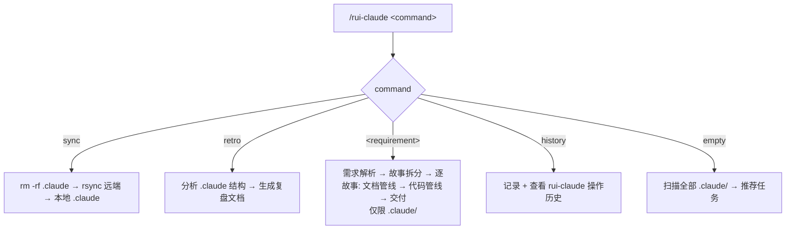
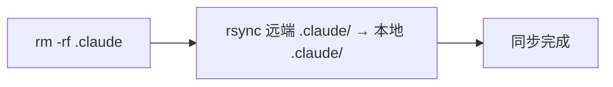
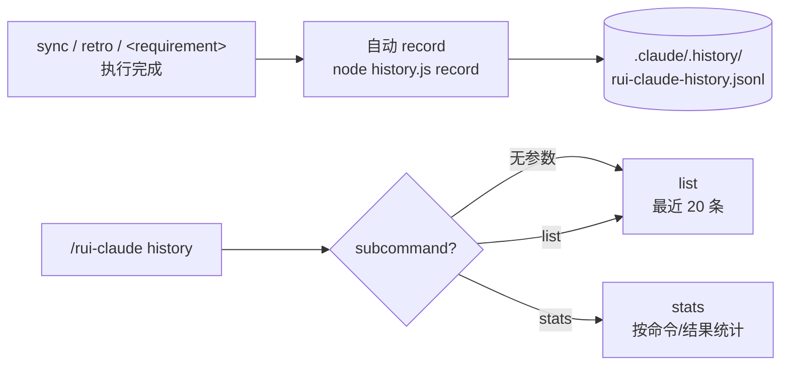
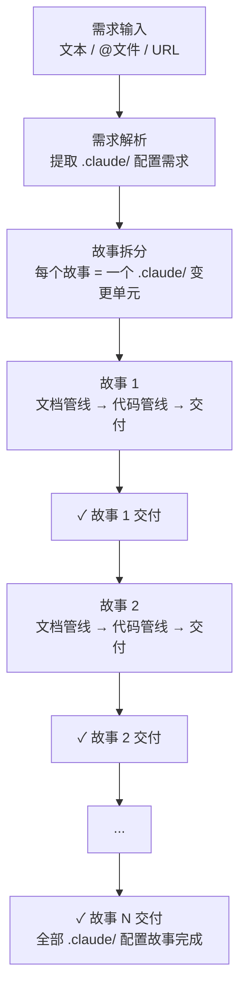

# rui-claude

> **作用范围：** `rui-claude` 对当前项目的 `.claude/` 目录生效。每个 `.claude/` 独立自治，无共享依赖。`sync` / `retro` 均以 `.claude/` 为操作边界。



---

## --help

`/rui-claude` 及其子命令均支持 `--help` 标志，输出对应层级用法说明后退出，不执行任何管线操作。

### 触发规则

| 输入 | 行为 |
|------|------|
| `/rui-claude --help` | 输出技能级总览（新人引导 + 命令列表 + 常见场景） |
| `/rui-claude sync --help` | 输出 `sync` 子命令详细用法（含何时使用、注意事项、前置条件） |
| `/rui-claude retro --help` | 输出 `retro` 子命令详细用法（含何时运行、报告解读、`--name`/`--json` 参数） |
| `/rui-claude <requirement> --help` | 输出 `<requirement>` 子命令详细用法（含输入格式、管线流程、适用范围、阻断规则） |
| `/rui-claude history --help` | 输出 `history` 子命令详细用法（含 record/list/stats 子命令及参数） |

### 输出格式

#### `/rui-claude --help`（技能级总览）

```
📖 /rui-claude — Manage ALL .claude/ directories across the repo

🆕 新人引导 — 按顺序走一遍即可接入项目：

  1. /rui-claude sync       ← 从远端拉取最新 .claude/ 配置（一次性）
  2. /rui-claude retro      ← 生成第一份配置健康报告，了解当前状态
  3. /rui-claude            ← 此后日常运行，获取个性化任务推荐

  搞定。三个命令覆盖 90% 的场景。

Usage: /rui-claude <command> [options]

Commands:
  sync                  Remote sync: rm -rf .claude → rsync from remote
  retro                 Analyze .claude/ health, write retro doc (run weekly)
  history               View rui-claude operation history (list / stats)
  <requirement>         End-to-end: parse config requirement → doc pipeline → code pipeline
                        (all changes limited to .claude/)
  (no args)             Scan .claude/ health, recommend 5-10 actionable tasks
                        (covers: sync gaps, retro staleness, infra holes,
                         full-doc gaps where code exists but 05-08 missing)

常见场景:
  新加入项目        → sync → retro（按新人引导走）
  配置变更后        → /rui-claude retro
  改 .claude 配置    → /rui-claude <requirement> 端到端交付（如新增 agent/rule/skill）
  定期健康检查      → /rui-claude retro（建议每周一次）
  查看操作历史      → /rui-claude history（含操作统计）

Options:
  --help                Show this help (also per sub-command: sync|retro|history|<requirement>)

Use /rui-claude <command> --help for detailed per-command usage.
```

#### `/rui-claude sync --help`（sync 子命令）

```
📖 /rui-claude sync — Remote sync .claude/ configuration

Usage: /rui-claude sync [options]

  从远端服务器 root@www.effiy.cn 拉取最新 .claude/ 配置，覆盖本地。
  这是破坏性操作：先 rm -rf 本地 .claude/，再 rsync 远端完整替换。

何时使用:
  - 新人首次接入项目（获取团队最新配置）
  - 本地 .claude/ 损坏或错误修改后需要恢复
  - 团队标准配置升级，从远端拉取新版本

⚠️ 注意: 本地 .claude/ 的未提交修改会丢失。修改前确认无未同步的自定义内容。

流程:
  1. rm -rf .claude
  2. rsync -avz root@www.effiy.cn:/home/claude/YiKnowledge/static/${PROJECT}/.claude/ → ./.claude/

前置条件:
  - SSH key 已授权访问 root@www.effiy.cn
  - ${PROJECT} = 当前项目根目录名（basename $PWD），执行时自动替换

Options:
  --help                Show this help
```

#### `/rui-claude retro --help`（retro 子命令）

```
📖 /rui-claude retro — Analyze .claude/ health, write retro doc

Usage: /rui-claude retro [options]

  采集 .claude/ 目录统计（agents/rules/templates/skills 文件数、行数
  、完整性），生成三节复盘文档写入 docs/自改进故事面板/<project>-<date>.md。

何时运行:
  - 新人接入后：生成第一份基线报告，了解当前配置健康度
  - 日常：建议每周一次，连续运行可对比趋势
  - 根配置变更后：验证变更是否传播到位

报告解读:
  §1 配置结构概览  — 当前有哪些 agent/rule/template/skill，数量是否合理
  §2 健康度检查    — 完整性（该有的有没有）、异常指标（空文件/超大文件）
  §3 改进项        — P0 必须修（阻断级）/ P1 建议修 / P2 可选优化
               每项附可执行命令，直接复制运行

  复盘聚焦 .claude/ 配置本身，不涉及执行记忆或代码分析。
  只看纯本地文件，不连远端。

Options:
  --help                Show this help
  --name <story>        Associate output with a story name（故事关联）
  --json                Output raw stats as JSON to stdout (no file written)

Output path: docs/自改进故事面板/<project>-<date>.md
```

#### `/rui-claude <requirement> --help`（requirement 子命令）

```
📖 /rui-claude <requirement> — End-to-end .claude/ config change pipeline

Usage: /rui-claude <requirement> [options]

  <requirement> 描述 .claude/ 配置变更需求，rui-claude 自动拆分故事并逐故事
  走完文档管线 + 代码管线，端到端交付。所有变更限制在 .claude/ 目录内。

<requirement> 可以是:
  - 文本描述（如 "所有 agent 需要支持安全审查步骤"）
  - @文件引用（如 @docs/req/claude-config.md）
  - URL（如 https://example.com/claude-config-req.md）

管线流程:
  需求解析 → 故事拆分 → 逐故事串行:
    文档管线: 自适应规划 → 影响分析 → 架构设计 → 文档生成（01~08）
    代码管线: 预检 → 测试先行 → 实现 → 验证 → 自改进（05~08）

适用范围:
  - 新增/修改 agent 定义
  - 新增/修改 rule 文件
  - 新增/修改 skill 及其 SKILL.md
  - 新增/修改 template 文件
  - 更新 CLAUDE.md 项目配置
  - .mcp.json MCP 服务配置变更
  - skills/ 脚本变更

阻断规则: 同 /rui 管线（H1~H12），详见 rui SKILL.md。

Options:
  --help                Show this help
```

#### `/rui-claude history --help`（history 子命令）

```
📖 /rui-claude history — View and manage rui-claude operation history

Usage: /rui-claude history [subcommand] [options]

  记录 rui-claude 每次命令执行（sync/retro/<requirement>），
  支持查看历史、统计摘要。

Subcommands:
  (no args)            等同于 list，显示最近操作记录
  list                 列出最近操作历史（默认 20 条）
  stats                按命令/结果统计操作摘要

Options:
  --help                Show this help
  --limit <n>          显示最近 N 条（list 子命令，默认 20）
  --json               输出 JSON 格式（list/stats 子命令）

记录位置: .claude/.history/rui-claude-history.jsonl（JSONL，append-only）
每条记录含 session_id、timestamp、command、args、project、outcome、duration_ms、summary。

自动记录: sync / retro / <requirement> 执行完成后自动调用 record。
手动记录: /rui-claude history record --command <cmd> --outcome <outcome>
```

输出后立即退出，不触发管线、不写文件、不发送通知。

### 交叉引用的 /rui 操作

`/rui-claude` 在推荐和常见场景中会引用以下 `/rui` 子命令。此处列出其用途，方便查阅——完整文档见 [rui SKILL.md](../rui/SKILL.md)。

| 命令 | 做什么 | rui-claude 何时引用 |
|------|--------|-------------------|
| `/rui doc --from-code <requirement>` | 从源码路径 / 代码片段 / 代码描述反推故事，生成 01-08 全文档基线（**只读，禁止改动任何源代码**） | 推荐分类「全文档补齐」——项目有源码但缺故事文档 |
| `/rui doc --from-code <requirement> --full` | 同上，在 01-08 基线上追加补充文档 09+10+（页面设计/API契约/数据迁移等，全部从代码推导，**只读**） | 推荐分类「全文档补齐」——存量代码需完整文档化 + 拓展 |
| `/rui doc --from-code --all` | 识别全项目独立源码模块，逐模块反推故事（跳过已有故事目录的模块，**只读**） | 大规模存量代码文档化 |
| `/rui code --from-doc <name>` | 对已有 01-故事任务.md，生成缺失的 02-08 全文档（不覆盖已有文档，**只读，禁止改动任何源代码**） | 故事目录文档不完整时推荐 |
| `/rui code --from-doc <name> --full` | 同上，在 02-08 基础上追加补充文档 09+10+（**只读**） | 补充文档化 |
| `/rui code --from-doc --all` | 扫描所有 02-08 缺失的故事，逐故事补齐（**只读**） | 批量补齐全文档 |
| `/rui doc <requirement>` | 从需求描述拆分故事，走文档管线生成 01-08 | .claude 配置变更的文档管线入口 |
| `/rui update <name> [ctx]` | 老故事流程升级 + 结构补齐 + 内容更新 | 故事文档版本过旧或内容需更新时推荐 |
| `/rui code <name>` | 预检 → 测试先行 → 实现 → 验证 → 自改进，端到端交付代码 | 文档齐全后推荐进入代码管线 |
| `/rui <requirement>` | 端到端：需求拆分 → 逐故事文档管线 + 代码管线 | 全新需求的全自动入口 |
| `/rui list` | 列出所有未完成故事及进度 | 查看全局故事状态 |
| `/rui`（空输入） | 扫描项目状态，推荐 5-10 条任务 | 项目日常入口，与 `/rui-claude`（空输入）互补 |

> **核心约束：`doc --from-code` 和 `code --from-doc` 均为只读操作。** 二者只根据项目真实情况补充全文档，**禁止创建、修改、删除任何源代码文件**（`.js` `.ts` `.py` `.vue` `.html` `.css` 等）。违反此规则等同于 H12 阻断。
>
> 命名逻辑：`doc --from-code` = 从代码反推文档（code → doc），`code --from-doc` = 从文档补全项目知识（doc → 补齐缺失文档）。方向不同，约束相同——都不碰源码。

---

## 命令概览

| 命令 | 流程 | 新人提示 |
|------|------|---------|
| `/rui-claude sync` | 删除本地 `.claude` → 从远端 rsync 拉取最新配置 | 接入第一步，获取团队配置 |
| `/rui-claude retro` | 分析 `.claude` 结构健康度，生成复盘文档到 `docs/自改进故事面板/` | 了解当前配置状态，周常运行 |
| `/rui-claude history` | 查看 rui-claude 操作历史（list / stats），自动记录每次命令执行 | 排查问题、审计追溯 |
| `/rui-claude <requirement>` | 需求解析 → 故事拆分 → 逐故事: 文档管线 + 代码管线 → 交付（所有变更仅限 `.claude/`） | .claude 配置变更的端到端入口 |
| `/rui-claude`（空输入） | 扫描 `.claude/` 目录 → 推荐可执行任务 | 日常入口，跑它就对了 |

---

## /rui-claude sync

> 🆕 **新人理解**：这是「获取团队标配」的命令。加入项目后第一步运行它，拿到团队最新的 agent、rule、skill、template 配置。相当于 clone 完代码后的「配置初始化」。

从远端服务器同步最新 `.claude` 配置到本地项目。覆盖式更新：先删除本地 `.claude` 目录，再 rsync 拉取。



| Step | 操作 | 命令 |
|------|------|------|
| 1 | 删除本地 `.claude` | `rm -rf .claude` |
| 2 | rsync 远端到本地 `.claude` | `rsync -avz --exclude '.git' root@www.effiy.cn:/home/claude/YiKnowledge/static/${PROJECT}/.claude/ ./.claude/` |

> **前置条件**：本机 SSH key 已授权访问 `root@www.effiy.cn`。
>
> `${PROJECT}` 为当前项目根目录名（`basename "$PWD"`），如 `static`。执行时自动替换。
>
> **自动记录**：sync 完成后自动调用 `node skills/rui-claude/scripts/history.js record --command sync --outcome <result>` 写入操作历史。

---

## /rui-claude retro

> 🆕 **新人理解**：这是「配置体检」命令。sync 拉到了配置，但配置健康吗？有缺失吗？retro 生成一份报告告诉你答案。建议 sync 之后跑一次，建立基线认知。此后每周跑一次，对比变化。

分析当前项目 `.claude/` 目录结构，生成配置复盘文档。


| Step | 操作 | 命令 |
|------|------|------|
| 1 | 采集 .claude/ 目录结构 | `node skills/rui-claude/scripts/retro.js` 遍历 agents/rules/templates/skills 统计 |
| 2 | 生成复盘文档 | 按 §1 配置结构 §2 健康度 §3 改进项 三段结构输出 md |
| 3 | 保存文档 | 写入 `${REPO_ROOT}/docs/自改进故事面板/${PROJECT}-${date}.md` |

> **参数：** `--name <story>` 关联故事名，`--json` 输出 JSON 到 stdout。
>
> 复盘聚焦 `.claude` 配置本身，不涉及执行记忆或项目代码分析。
>
> **自动记录**：retro 完成后自动调用 `node skills/rui-claude/scripts/history.js record --command retro --outcome <result>` 写入操作历史。

---

## /rui-claude history

> 查看 rui-claude 操作历史记录。每次 sync / retro / \<requirement\> 执行完成后自动记录，无需手动操作。



| Step | 操作 | 命令 |
|------|------|------|
| 1 | 查看最近操作 | `node skills/rui-claude/scripts/history.js list [--limit N] [--json]` |
| 2 | 查看统计摘要 | `node skills/rui-claude/scripts/history.js stats [--json]` |
| 3 | 手动记录（罕见） | `node skills/rui-claude/scripts/history.js record --command <cmd> --outcome <val>` |

### 自动记录

sync / retro / \<requirement\> 三个命令在完成或阻断后，自动调用 `record` 写入一条历史记录：

| 字段 | 说明 | 示例 |
|------|------|------|
| session_id | 8 位唯一标识 | `a1b2c3d4` |
| timestamp | ISO 8601 时间戳 | `2026-05-10T12:34:56.789Z` |
| command | 执行的命令 | `sync` / `retro` / `requirement` |
| args | 命令参数 | `{"name": "claude-security-agent"}` |
| project | 当前项目名 | `static` |
| outcome | 执行结果 | `success` / `failure` / `blocked` |
| duration_ms | 耗时（毫秒） | `3200` |
| summary | 单行摘要 | `sync from remote: 12 files` |

### 历史记录文件

存储路径：`.claude/.history/rui-claude-history.jsonl`（JSONL，append-only）。同一 `.claude/` 内所有 rui-claude 操作共享一个记录文件，按时间追加。

> 此文件属于 `.claude/` 内部状态，不入库、不同步、不参与 sync。rsync 时自动被 `--exclude '.git'` 忽略。

### 输出示例

`list`（无参数）：
```
📋 rui-claude 操作历史（最近 5 条，共 12 条）

✅ 2026-05-10 12:30:00  /rui-claude retro  {"name":"claude-security-agent"}
   retro completed: agents=6 rules=4 skills=4
✅ 2026-05-10 11:00:00  /rui-claude sync
   sync from remote: 15 files
🚫 2026-05-09 18:00:00  /rui-claude requirement
   blocked: H3 影响链不闭合
...

> 完整记录: .claude/.history/rui-claude-history.jsonl
```

`stats`：
```
📊 rui-claude 操作统计（共 12 条）

按命令:
  requirement: 6
  retro: 3
  sync: 2
  history: 1

按结果:
  成功: 10
  阻断: 2
```

---

## /rui-claude \<requirement\>

> 🆕 **新人理解**：想改 `.claude/` 配置时（新增 agent、修改 rule、更新 skill），不用手动编辑文件。描述你要什么，rui-claude 自动拆分故事、走文档管线 + 代码管线，端到端交付。

从 `.claude/` 配置需求出发，拆分故事，逐故事走完文档管线 + 代码管线，端到端交付。**所有文件变更限制在 `.claude/` 目录内。**



每个故事内部管线（与 `/rui <requirement>` 一致）：


### 需求输入

`<requirement>` 支持三种格式：
- **文本描述**: 直接输入 `.claude/` 配置需求文字
- **@文件引用**: 使用 `@path/to/requirement.md` 引用本地需求文档
- **URL**: 提供需求文档的在线地址

**适用需求示例**：

| 需求类型 | 示例 |
|---------|------|
| 新增 agent | "为所有 skill 添加 security agent，在架构设计阶段自动注入安全约束" |
| 新增 rule | "为 code-pipeline 新增一条规则：所有 content script 必须 IIFE 封装" |
| 新增 skill | "新建一个 code-review skill，支持 pre-commit 和 CI 两种模式" |
| 修改 template | "后端技术评审模板增加「消息通道」和「存储模型」两个评审维度" |
| CLAUDE.md 更新 | "CLAUDE.md 编码规范新增：禁止使用 any 类型" |
| MCP 配置 | "添加 GitHub MCP server，支持 issue 和 PR 操作" |
| 脚本变更 | "self-improve.js 增加六维架构推演维度" |
| 组合变更 | "新增 security review agent + 对应 rule + 更新所有 template 的安全章节" |

### 故事拆分规则

1. 分析需求，识别独立的 `.claude/` 配置变更单元
2. 每个变更单元对应一个故事目录
3. 故事目录名使用**英文简洁描述**，以 `claude-` 为前缀，便于区分（如 `claude-security-agent`、`claude-iife-rule`、`claude-code-review-skill`）
4. 拆分后逐故事走完文档管线 + 代码管线，不并行
5. 每个故事所有文件变更限制在 `.claude/` 目录内

### 管线阶段

| 阶段 | 做什么 | Agent | 关键产出 | 约束 |
|------|--------|-------|---------|------|
| 需求解析 | 读取需求输入，提取 `.claude/` 配置需求<br>pm | pm | 需求摘要 | — |
| 故事拆分 | 拆分为独立变更单元，每个单元创建故事目录<br>pm | pm | `docs/故事任务面板/<story-name>/` | — |
| 自适应规划 | 读取执行记忆，判定 T1/T2/T3 变更级别<br>pm | pm | rui-state.json | — |
| 影响分析 | 单个故事在 `.claude/` 范围内的全项目影响链分析<br>coder, reporter | coder, reporter | 01-故事任务.md（§3 设计概述 + 影响链） | 仅分析 `.claude/` 内文件 |
| 架构设计 | 单个故事的 `.claude/` 结构设计、文件规划、测试策略<br>coder, security, tester | coder, security, tester | 02-后端技术评审.md、03-前端技术评审.md、04-测试用例评审.md | — |
| 文档生成 | agent 协作产出完整 01-故事任务.md<br>pm (§1,§2,§4), coder (§3), tester (§1.1,§5), reporter (§4 依赖), security (安全面判定) | pm, coder, tester, security, reporter | 01-故事任务.md（完整） | — |
| 预检 | 双边影响分析 + 功能分支（`feat/<name>` 从 main 创建）+ 文档补齐<br>coder, pm, reporter | coder, pm, reporter | 功能分支 + 影响链闭合 | 必须从 main 创建分支 |
| 测试先行 | Gate A：测试方案+原型<br>tester | tester | 04-测试用例评审.md | Gate A 未过不得修改 `.claude/` |
| 实现 | 逐模块编码（`.claude/` 文件变更），每模块后 P0 审查<br>coder, security, tester | coder, security, tester | `.claude/` 文件变更 + P0 清零 | **仅修改 `.claude/` 内文件** |
| 验证 | Gate B：环境快照 → 静态预检 → 对齐 → 单次执行 → 三报告产出<br>coder, tester, reporter | coder, tester, reporter | 05/06/07 实施报告 | >2 轮修复阻断 (H7) |
| 自改进 | self-improve-loop：效果评估 + 基线配置复盘<br>pm, reporter, self-improve | pm, reporter, self-improve | 08-自改进复盘.md | H11 降级 |
| 交付 | import-docs（CP1 文档同步 + CP2 报告同步 + CP3 最终全量同步）→ wework-bot | rui 系统 | — | H9 降级（仅 Token 缺失） |

### 实现约束

> **核心约束：所有通过 `/rui-claude <requirement>` 发起的代码变更，必须且仅能修改 `.claude/` 目录内的文件。** 不得创建、修改、删除 `.claude/` 以外的任何文件（故事文档 `docs/故事任务面板/` 除外）。

| 允许修改 | 禁止修改 |
|---------|---------|
| `.claude/CLAUDE.md` | 项目源码（`src/`、`app/` 等） |
| `.claude/agents/*.md` | `README.md` |
| `.claude/rules/*.md` | `package.json`、`tsconfig.json` 等 |
| `.claude/skills/*/SKILL.md` | `.gitignore`、`.env` 等 |
| `.claude/skills/*/scripts/*.js` | `docs/` 以外任何目录 |
| `.claude/skills/*/templates/*.md` | — |
| `.claude/.mcp.json` | — |
| `.claude/settings.json` | — |

### 与 /rui \<requirement\> 的对比

| 维度 | `/rui <requirement>` | `/rui-claude <requirement>` |
|------|---------------------|---------------------------|
| 需求范围 | 项目功能需求 | `.claude/` 配置需求 |
| 代码变更范围 | 项目源码 | 仅 `.claude/` 目录 |
| 故事前缀 | 无固定前缀 | `claude-` 前缀 |
| 故事目录 | `docs/故事任务面板/<name>/` | 同 |
| 文档管线 | 自适应规划→影响分析→架构设计→文档生成（01~08） | 同 |
| 代码管线 | 预检→测试先行→实现→验证→自改进（05~08） | 同 |
| 交付 | import-docs + wework-bot | 同 |
| 阻断规则 | H1~H12 | 同 |

### 交付

与其他命令一致的交付流程：多检查点强制同步——文档生成后（CP1）→ 验证后（CP2）→ 交付阶段（CP3）依次触发 `Skill(import-docs, --workspace)` 同步文档，最后 `Skill(wework-bot, --name <name>)` 发送通知。H9 仅限 API_X_TOKEN 缺失时跳过。同 `/rui` 交付机制，详见 rui SKILL.md 交付章节。

**自动记录**：\<requirement\> 完成或阻断后自动调用 `node skills/rui-claude/scripts/history.js record --command requirement --outcome <result>` 写入操作历史。

---

## /rui-claude（空输入）

> 🆕 **新人理解**：日常不记得该跑什么时，直接 `/rui-claude` 回车。它会扫描当前项目配置健康状态，给你 5~10 条可直接执行的命令推荐。相当于配置管理的「今日待办」。

当 `/rui-claude` 无参数时，扫描当前 `.claude/` 目录，推荐 5~10 条可执行任务。

### 推荐生成规则

扫描当前项目 `.claude/` 及关联目录：

| 扫描源 | 提取信息 |
|--------|---------|
| `.claude/agents/` | Agent 数量、角色覆盖 |
| `.claude/rules/` | 规则文件数、约束覆盖 |
| `.claude/skills/rui/templates/` | 模板文件数（05-08 模板存在性 → 全文档生成就绪度） |
| `.claude/skills/` (递归) | 技能文件数（按 skill 子目录统计） |
| `.claude/CLAUDE.md` | 存在性、行数 |
| `.claude/.mcp.json` | 是否存在 |
| `docs/自改进故事面板/*.md` | 复盘历史 |
| `docs/故事任务面板/<name>/` | 故事目录全文档状态（仅 01-04 → 待补齐 05-08+） |

### 推荐分类

| 类型 | 说明 | 示例 |
|------|------|------|
| 首次复盘 | 有 .claude/ 但无复盘记录 | `cd <project> && /rui-claude retro` |
| 增量复盘 | 复盘过期 >7 天 | `cd <project> && /rui-claude retro` |
| 配置补齐 | agents/rules/skills 为空或 CLAUDE.md 缺失 | `cd <project> && /rui-claude sync` |
| 全文档补齐 | 项目有源码但故事目录仅含 01-04（缺 05-08），或模板不全无法支持全文档生成 | `cd <project> && /rui doc --from-code <requirement> --full` |
| 结构优化 | 某子目录文件数异常（过多/过少） | 手动审查并精简 |
| 定期巡检 | 近期有复盘、配置完整 | 标记为健康 |

### 输出格式

```
🧭 rui-claude 任务推荐（共 N 条）

1. [首次复盘] /rui-claude retro
   理由: .claude/ 存在但无复盘记录 | 来源: docs/自改进故事面板/

2. [增量复盘] /rui-claude retro
   理由: 上次复盘 12 天前 | 来源: docs/自改进故事面板/static-2026-04-27.md

3. [配置补齐] /rui-claude sync
   理由: agents/ 为空 | 来源: .claude/ 结构检查

4. [全文档补齐] /rui doc --from-code "src/components/ 目录下的 Vue 组件..." --full
   理由: 源码存在但故事目录仅 01-04，缺 05-08 实施/测试/复盘 | 来源: docs/故事任务面板/ 结构检查

...
```

---

## 核心规则

1. **操作范围仅限 `.claude/`**：不得触及 `.claude/` 以外文件
2. **禁止自动合并**：功能分支不得自动合并到 main，合并操作一律由开发者手动执行
3. **sync 覆盖式更新**：先删除本地 `.claude` 再 rsync，执行前需确认
4. **retro 纯本地分析**：不连接远端，仅分析本地 `.claude/` 结构
5. **retro 输出到当前项目**：文档写入当前项目 `docs/自改进故事面板/<project>-<date>.md`
6. **空输入只推荐不执行**：扫描当前项目状态后推荐任务，不触发管线
7. **不管理凭据**：SSH key 由系统管理员配置
8. **禁止自动提交和推送**：技能执行完毕后不得自动执行 `git commit` 或 `git push`，所有 git 操作一律由开发者手动执行

详见 [`rules/rui-claude.md`](../../rules/rui-claude.md)。

---

## 安全约束

- SSH key 授权由系统管理员配置，本 skill 不管理凭据
- 远端地址中 `${PROJECT}` 为当前项目根目录名，执行时自动解析
