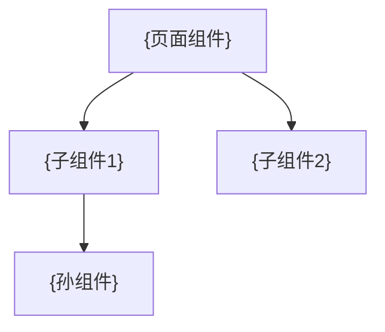

# {Number}-页面设计文档: {故事名称}

> | v{version} | {YYYY-MM-DD} | {模型} | 🌿 {branch} |
> 关联: [01-故事任务.md](./01-故事任务.md) · [03-前端技术评审.md](./03-前端技术评审.md)

---

## 1. 页面清单

| 页面 | 路由 | 布局 | 加载状态 | 空状态 | 错误状态 |
|------|------|------|---------|--------|---------|
| {页面名} | {路由/入口} | {布局描述} | {骨架屏/spinner/...} | {空态文案+引导} | {错误提示+恢复} |

---

## 2. 组件构成

### {页面名}

**组件树**:

**状态管理**:

| 状态 | 类型 | 来源 | 消费组件 |
|------|------|------|---------|
| {状态名} | ref / computed / store | {API / 用户输入 / 计算} | {组件列表} |

---

## 3. 响应式策略

| 断点 | 布局变化 | 组件行为 |
|------|---------|---------|
| ≥{width}px | {桌面布局} | {组件展示方式} |
| <{width}px | {移动端布局} | {组件折叠/隐藏/重构} |

---

## 4. 评审清单

| # | 检查项 | 结果 |
|---|--------|------|
| 1 | 页面状态矩阵覆盖正常/加载/空/错误四态 | ✅ / ❌ |
| 2 | 组件树与 03-前端技术评审一致 | ✅ / ❌ |
| 3 | 响应式断点已明确 | ✅ / ❌ |
