# 文档生成技能

## 核心原则

1. **规范优先，模板为辅**：`rules/<类型>.md` 是唯一的"契约"（强约束），`templates/<类型>.md` 只在适用时作为"起手骨架"。
2. **设计文档 与 动态检查清单 不使用模板**：它们必须 **完全基于规范 + 上游文档 + 实际代码** 动态生成，以避免模板槽位诱导模型编造内容。
3. **Grounding 防幻觉**：任何技术事实（模块、路径、接口、行为、场景）都必须可追溯到 **已读取的上游文档或代码**；无据可依时 **宁缺毋滥**，需在文档中显式标注"待补充（原因：未找到来源）"。
4. **结构即契约**：文档结构严格以 `rules/<类型>.md` 为准，不得新增未约定章节，也不得省略 P0 章节。
5. **使用 find-skills / find-agents 扩展能力**：关键节点（搜索参考、专家审查、E2E 验证）显式调用，不做"凭感觉"。

## 何时使用

- 生成需求文档、需求任务、设计文档、使用文档
- 生成项目报告或通用文档
- 生成"全文档"（需求文档 + 需求任务 + 设计文档 + 使用文档 + 动态检查清单 + 项目报告）

## 支持的文档类型

| 类型 | 模板 | 规范 | 保存路径 | 依赖文档 | 生成方式 |
|------|------|------|---------|---------|---------|
| 需求文档 | ✅ | ✅ | `docs/01_需求文档/` | - | 模板骨架 + 规范约束 |
| 需求任务 | ✅ | ✅ | `docs/02_需求任务/` | 需求文档 | 模板骨架 + 规范约束 |
| 设计文档 | ❌（禁用） | ✅ | `docs/03_设计文档/` | 需求任务 | **仅规范驱动**（基于上游 + 代码） |
| 使用文档 | ❌ | ✅ | `docs/04_使用文档/` | 设计文档 | 规范驱动 |
| 项目报告 | ❌ | ✅ | `docs/05_项目报告/` | 设计文档 | 规范驱动 + 真实变更数据 |
| 通用文档 | ✅ | ✅ | `docs/` | - | 模板骨架 + 规范约束 |
| 动态检查清单 | ❌（禁用） | ✅ | `docs/00_rYr/<功能名>/` | 需求任务、设计文档 | **仅规范驱动**（从上游场景抽取） |

> 说明：**"禁用模板"** 意味着即使 `templates/` 目录下存在同名文件，也不作为生成输入；改为仅读取 `rules/<类型>.md` 并从上游文档/代码中提取事实。

## 快速开始

```bash
/generate-document 生成一份"功能名"的需求文档
/generate-document 生成一份"功能名"的需求任务
/generate-document 生成一份"功能名"的设计文档
/generate-document 生成"简洁功能名-用户故事简短描述"的全文档
```

**全文档说明**：
- 保存位置：`docs/00_rYr/简洁功能名/`
- 包含：需求文档、需求任务、设计文档、使用文档、动态检查清单、项目报告

## 核心工作流

### 阶段划分（9 步）

1. **解析请求** → 识别 `{文档类型, 功能名, 参考文档}`，缺失必填参数则先向用户澄清。
2. **发现相关技能（find-skills）** → 根据文档类型预检相关技能，显式列出将调用的技能。
3. **加载规范** → 读取 `rules/<类型>.md`（以及 `rules/通用文档.md`、`rules/编码规范.md` 等项目通用规范）。
4. **模板决策**：
   - **设计文档 / 动态检查清单** → **跳过模板**，进入"规范驱动模式"。
   - 其他类型 → 若 `templates/<类型>.md` 存在，读取作为结构骨架；否则退回"规范驱动模式"。
5. **读取上游文档（Grounding）** → 按依赖关系读取前一阶段文档；若是设计文档/项目报告，同时阅读相关源码（路径取自需求任务或用户输入）。
6. **专家分派（find-agents）** → 按类型选择并行代理：
   - 设计文档 → `planner` + `architect`
   - 项目报告 → `code-reviewer` + `docs-lookup`
   - 含 E2E 场景的检查清单 → `e2e-tester`
7. **生成文档** → 严格按 `rules/<类型>.md` 的章节顺序产出；**每个技术断言必须在文中关联到来源**（上游文档链接或代码路径）；无据可依的章节标注"待补充"。
8. **质量自检** → 加载 `checklists/<类型>.md`：**P0 全部通过**才能保存；未通过则回到第 7 步修复（最多自修复 1 轮）。
9. **保存 + 审查（可选）** → 保存后可触发 `doc-reviewer` / `code-reviewer` / `doc-updater` 并行审查；记录未修复问题。

### 流程图

```mermaid
flowchart TD
    Start([接收请求]) --> Parse["1 解析：类型 / 功能名 / 参考文档\n必填参数缺失 → 向用户澄清"]

    Parse --> FS["2 find-skills\n按类型枚举候选技能\nsearch-first / e2e-testing\nverification-loop / code-review"]

    FS --> LoadRules["3 加载规范\nrules/类型.md\nrules/通用文档.md\nrules/编码规范.md（若涉及代码）"]

    LoadRules --> TplGate{"4 模板决策\n设计文档 或 动态检查清单?"}

    TplGate -->|是| RulesOnly["规范驱动模式\n禁用模板\n章节顺序完全来自 rules\n每个事实必须来自上游文档或代码"]
    TplGate -->|否| TplCheck{"templates/类型.md 存在?"}
    TplCheck -->|是| ReadTpl["读取模板作为骨架\n仅作结构提示\n内容仍依据规范与上游"]
    TplCheck -->|否| RulesOnly
    ReadTpl --> Upstream

    RulesOnly --> Upstream["5 读取上游 + Grounding\n按依赖读 docs/前一阶段/功能名.md\n设计文档或项目报告：读取相关源码\n建立事实-来源映射表"]

    Upstream --> FA["6 find-agents\n分派并行代理\n设计文档：planner + architect\n项目报告：code-reviewer + docs-lookup\n含 E2E 场景：e2e-tester"]

    FA --> Gen["7 生成文档\n严格按 rules 章节顺序\n每条技术断言关联来源\n无来源时写 待补充\n禁止虚构模块/接口/路径"]

    Gen --> SelfCheck["8 质量自检\n加载 checklists/类型.md\n统计 P0 / P1 / P2"]

    SelfCheck --> P0{"P0 全部通过?"}
    P0 -->|否| FixOnce{"已自修复?"}
    FixOnce -->|否| Fix["按 P0 问题回修\n重跑自检"]
    Fix --> SelfCheck
    FixOnce -->|是| Record["记录未解决 P0\n在文档顶部显式标注"]
    P0 -->|是| Save
    Record --> Save

    Save["9 保存\ndocs/阶段/功能名.md"] --> FullDoc{"是全文档?"}

    FullDoc -->|是| DynCL["生成动态检查清单\n从需求任务抽取场景\n从设计文档抽取实现路径\n使用 find-skills 映射验证技能\n完全基于规范 不使用模板"]
    FullDoc -->|否| ReviewGate

    DynCL --> ReviewGate{"进入 Agents 审查?"}
    ReviewGate -->|否| End
    ReviewGate -->|是| Reviewers["并行审查\ndoc-reviewer / code-reviewer / doc-updater"]
    Reviewers --> End([交付])

    classDef skill fill:#e1f5ff,stroke:#0066cc,stroke-width:2
    classDef rules fill:#ffe6cc,stroke:#e67300,stroke-width:2
    classDef guard fill:#ffcccc,stroke:#cc0000,stroke-width:2
    class FS,FA,DynCL skill
    class LoadRules,RulesOnly,Upstream rules
    class P0,SelfCheck guard
```



### 防幻觉约束（强制）

- **规范驱动模式下**（设计文档 / 动态检查清单）：
  - **不得读取** `templates/<类型>.md`，即便存在。
  - 章节顺序、命名、图表要求严格来自 `rules/<类型>.md`。
  - 禁止从模板占位符反推内容（例如"因为模板有'架构设计'章节，就虚构一套架构"）。
- **事实-来源映射**：生成文档前在内部维护一张表 `事实 → {上游文档章节 | 代码路径:行}`；写作时逐条核对。
- **未知处理**：若某 P1/P2 章节无来源，写入 `> 待补充（原因：未在 <上游文档名> 中找到相关描述）`，**不虚构**。若缺失内容属于 P0，则 **拒绝输出**，要求用户补齐前置材料。
- **代码路径真实性**：任何引用的文件路径必须 **实际存在于仓库**；生成设计文档时先用文件搜索校验路径。
- **Mermaid 图真实性**：节点/模块必须对应真实模块或已规划模块，不得为"让图好看"而编造节点。

## 关键要求

### 项目报告（强制要求）

必须包含：
1. **变更文件列表** - 所有修改文件的完整列表、路径、变更类型
2. **变更前后内容对比** - 每个变更文件的"变更前"和"变更后"内容对比
3. **变更汇总表** - 文件路径、变更类型、影响评估、关键变更说明

### 动态检查清单（规范驱动，不使用模板）

完全基于规范和上游文档生成，**禁止读取** `templates/动态检查清单.md`：

1. **抽取主要操作场景**：读取 `docs/02_需求任务/<功能名>.md`，按"场景名 / 前置条件 / 操作步骤 / 预期结果"结构化抽取；抽不到则中止并告知用户需求任务缺失信息。
2. **抽取实现细节**：读取 `docs/03_设计文档/<功能名>.md`，对每个场景定位"主要操作场景实现"章节，提取"涉及模块 / 关键代码路径 / 验证要点"。
3. **映射验证技能**：用 `find-skills`（见下文）对每个场景选出最合适的验证技能，禁止臆造能力：
   - UI / 用户流程 → `e2e-testing` + Playwright
   - 代码实现 → `code-review`
   - 安全相关 → `security-review`
   - 构建 / 集成 → `verification-loop`
4. **结构按规范生成**：章节骨架来自 `rules/动态检查清单.md`（若不存在，以 `rules/通用文档.md` 的通用头部 + 每场景一节的固定结构合成），**不得** 凭记忆套用历史模板。
5. **来源标注**：每条检查项必须标注来源（需求任务章节锚点 / 设计文档章节锚点 / 代码路径）。

### 检查清单优先级

- **P0 - 必须通过**：文档头部完整、必需章节存在、无断链、引用的代码路径真实存在、无事实-来源缺失
- **P1 - 应该通过**：段落结构、章节命名清晰、代码块标注语言
- **P2 - 可以有**：Mermaid 节点样式、图标使用一致性

## 相关技能与代理（使用契约）

### 技能：find-skills

**触发条件**：
- 解析请求后立即运行（流程第 2 步），用于 **预声明** 本次会用到的技能。
- 生成动态检查清单时，**每个场景** 都调用一次，用于映射验证技能。
- 遇到生成过程中出现的未知领域（如"需要做 E2E 验证"）时即时调用。

**输入**：
- 文档类型与功能描述摘要（≤ 100 字）
- 关键词列表（如 `["E2E", "Store 架构", "加密", ...]`）

**期望输出**：
- 候选技能列表 `[{name, 适用场景, 置信度}]`
- 至少一条"推荐技能"与一条"备选技能"

**使用规则**：
- 若 find-skills 未找到匹配技能，**不要编造** 一个不存在的技能名；在文档中标注"未找到合适验证技能，建议人工复核"。
- 候选技能的名称必须与 find-skills 返回值一致，不做大小写 / 别名变换。

### 技能：find-agents

**触发条件**（按文档类型）：
- **设计文档**（生成前）：获取 `planner` + `architect`
- **项目报告**（生成前）：获取 `code-reviewer` + `docs-lookup`
- **含 E2E 场景的检查清单**：获取 `e2e-tester`
- **保存后审查阶段**（可选）：获取 `doc-reviewer` + `code-reviewer` + `doc-updater`

**输入**：
- 当前文档类型
- 当前任务目标（"生成设计文档" / "审查刚生成的设计文档" 等）
- 可用的上游上下文摘要（上游文档路径 + 关键事实 3-5 条）

**期望输出**：
- 可并行调用的代理列表 `[{name, 角色, 输入契约, 输出契约}]`
- 每个代理的"必答问题"（供生成时填充到对应章节）

**使用规则**：
- 代理调用必须并行发起（独立任务），不等一个完成再起下一个。
- 代理返回内容只作为 **候选输入**，最终是否写入文档由本技能依据 `rules/<类型>.md` 决定。
- 代理声明未覆盖的领域不得由本技能"脑补"补齐。

### 其他相关技能

| 技能 | 用途 | 何时用 |
|------|------|--------|
| `search-first` | 并行搜索 npm / PyPI / MCP / GitHub / Web | 写设计文档时选型、引用外部库 |
| `e2e-testing` | E2E 测试方案与用例 | 动态检查清单中 UI 场景 |
| `verification-loop` | 构建 / 集成全面验证 | 动态检查清单中构建场景 |
| `code-review` | 代码审查 | 项目报告 / 动态检查清单中代码实现场景 |

### 代理清单

| 代理 | 用途 | 触发阶段 |
|------|------|---------|
| `docs-lookup` | 查询项目文档结构与上游定位 | 第 5 步（Grounding） |
| `planner` | 需求任务 → 实施策略与风险 | 设计文档生成前 |
| `architect` | 系统架构 / 接口 / 数据流 | 设计文档生成前 |
| `e2e-tester` | UI / 流程场景测试方案 | 动态检查清单 E2E 场景 |
| `code-reviewer` | 代码示例 / 架构一致性审查 | 项目报告生成 + 保存后审查 |
| `security-reviewer` | 安全与敏感内容 | 涉及鉴权 / 数据安全时 |
| `doc-reviewer` | 结构 / 规范 / 可读性审查 | 保存后审查 |
| `doc-updater` | 时效性 / 链接有效性 / codemap 同步 | 保存后审查 |

## 支持文件结构

```
.cursor/skills/generate-document/
├── SKILL.md                 # 本文件
├── README.md                # 快速开始
├── checklist.md             # 主检查清单入口
├── checklists/              # 各文档类型检查清单
├── rules/                   # 各文档类型规范（唯一契约）
└── templates/               # 模板（设计文档、动态检查清单 不使用）
```
