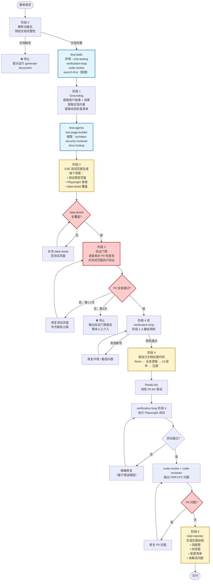

# 代码实施技能

## 核心原则

1. **文档驱动**：所有实施决策必须可追溯到 generate-document 产出的文档（需求文档、需求任务、设计文档、动态检查清单）。
2. **测试页面先行**：在写任何项目代码之前，必须为每个用户故事场景生成可运行的 E2E 测试页面（最小原型 + Playwright 测试骨架）。
3. **验证门禁**：动态检查清单的全部 P0 项必须在测试页面上通过，才能解锁"写项目代码"阶段。
4. **一次成功**：通过充分的预检和规则约束，争取一次写对；禁止在验证失败后不分析原因直接重试。
5. **过程可溯**：完成后生成包含完整流程图和时序图的过程总结文档。

## 何时使用

- 已有功能的 `docs/00_rYr/<功能名>/` 文档集（至少包含需求任务 + 动态检查清单）
- 用户明确希望开始写代码实现
- 需要从文档直接驱动 TDD/原型验证后的安全实施

## 阶段划分（5 阶段）

```
阶段 0  解析 + 预检
阶段 1  文档 Grounding（读取上游文档）
阶段 2  E2E 测试页面生成
阶段 3  验证门禁（动态检查清单 × 测试页面）
阶段 4  项目代码实施
阶段 5  过程总结
```

---

## 阶段 0：解析 + 预检

### 0.1 解析请求

从用户输入中提取：
- `{功能名}`：对应 `docs/00_rYr/<功能名>/` 目录
- `{文档集路径}`：默认 `docs/00_rYr/<功能名>/`

必填参数缺失时 **先向用户澄清**，不继续执行。

### 0.2 文档完整性预检

读取以下文件，**任一 P0 文档缺失则停止并提示用户先运行 generate-document**：

| 文件 | 级别 | 用途 |
|------|------|------|
| `需求任务.md` | P0 | 提取用户故事 + 操作场景 |
| `设计文档.md` | P0 | 提取模块、接口、代码路径 |
| `动态检查清单.md` | P0 | 提取所有待验证的检查项 |
| `需求文档.md` | P1 | 补充背景信息 |
| `使用文档.md` | P2 | 辅助 UI 文案 |

### 0.3 技能预加载（find-skills）

调用 `find-skills`，声明本次将使用的技能：
- `e2e-testing`：生成测试页面和 Playwright 骨架
- `verification-loop`：构建/集成验证
- `code-review`：代码实施后审查
- `search-first`：需要引入外部依赖时选型

---

## 阶段 1：文档 Grounding

### 1.1 提取用户故事与场景

从 `需求任务.md` 中按以下结构提取：

```
用户故事 US-{N}：
  场景：{场景名}
  前置条件：{条件}
  操作步骤：{步骤列表}
  预期结果：{结果}
```

无法提取时，停止并提示"需求任务缺少结构化场景"。

### 1.2 提取实现约束

从 `设计文档.md` 提取：
- 涉及模块列表（名称 + 文件路径）
- 接口规范（输入 / 输出 / 错误）
- 状态管理方案（Store 工厂模式要求）
- 已有代码路径（用于避免重复造轮子）

### 1.3 提取动态检查清单

从 `动态检查清单.md` 提取所有 P0 检查项，按场景分组，建立"场景 → 检查项列表"映射。

### 1.4 调用 find-agents

按任务类型并行分派代理：

| 场景 | 调用代理 |
|------|---------|
| 所有场景 | `test-page-builder`（生成测试页面） |
| 架构不确定时 | `architect` |
| 安全相关场景 | `security-reviewer` |
| 文档有歧义时 | `docs-lookup` |

---

## 阶段 2：E2E 测试页面生成

> **规范依据**：`rules/test-page.md` + `rules/e2e-testing.md`

### 2.1 为每个场景生成测试页面

调用 `e2e-testing` 技能 + `test-page-builder` 代理，为**每个用户故事的每个操作场景**生成：

**测试原型页面**（`tests/e2e/pages/<功能名>/<场景名>.html` 或 Vue 组件）：
- 包含场景所需的全部 UI 元素（按设计文档）
- 使用 `data-testid` 属性标记所有可交互元素
- 不含业务逻辑，仅展示 UI 结构（桩实现）

**Playwright 测试骨架**（`tests/e2e/<功能名>/<场景名>.spec.ts`）：
- 前置条件设置
- 操作步骤（`page.click`、`page.fill` 等）
- 断言（对应动态检查清单的验证要点）

### 2.2 数据 testid 覆盖率检查

遍历动态检查清单中的 UI 操作项，确认每个操作步骤对应的 `data-testid` 已在测试页面中定义。
未覆盖项 → 补充到测试页面后才能进入阶段 3。

### 2.3 输出清单

```
E2E 测试页面生成完成：
  US-1 场景 A：tests/e2e/pages/<功能名>/场景A.html ✓
  US-1 场景 A：tests/e2e/<功能名>/场景A.spec.ts ✓
  US-2 场景 B：...
  data-testid 覆盖率：<N>/<M> 个操作项已覆盖
```

---

## 阶段 3：验证门禁

> **规范依据**：`rules/verification-gate.md`

### 3.1 在测试页面上运行动态检查清单

逐条核对动态检查清单的 P0 项：

```
检查项：<项目描述>
来源：<需求任务/设计文档章节>
验证方式：<Playwright 测试 / 静态分析 / 人工确认>
状态：✅ 通过 / ❌ 未通过 / ⚠️ 需人工确认
```

**P0 通过标准**：
- UI 元素存在且可操作（Playwright `isVisible` + `isEnabled`）
- 操作步骤可执行（无 JS 错误）
- 断言条件可判断（`expect` 不抛出）
- 不需要验证业务逻辑正确性（桩实现即可）

### 3.2 门禁决策

```
┌─────────────────────────────────────┐
│ P0 全部通过？                        │
│   是 → 解锁阶段 4（项目代码实施）     │
│   否 → 修复测试页面，重跑阶段 3       │
│         最多自修复 2 轮               │
│         2 轮仍失败 → 停止，报告问题   │
└─────────────────────────────────────┘
```

**严禁**：P0 有未通过项时进入阶段 4。

### 3.3 输出验证报告

```
=== 验证门禁报告 ===
P0 总计：<N> 项
  通过：<N1> 项
  未通过：<N2> 项（列出具体项）
  人工确认：<N3> 项

结论：通过 / 未通过（已阻断进入代码实施阶段）
```

---

## 阶段 4：项目代码实施

> **规范依据**：`rules/code-implementation.md`

### 4.1 实施前预检（verification-loop 阶段 1-3）

调用 `verification-loop` 技能执行静态预检：
- 读取 `package.json`、`vite.config.*`、`tsconfig.json`
- 确认目标文件路径存在（基于设计文档中的模块路径）
- 确认 import 路径合法
- 环境对齐

### 4.2 按设计文档实施代码

按设计文档的模块划分顺序实施，**每个模块**：

1. **读取相关现有代码**（避免重复造轮子）
2. **按 `rules/code-implementation.md` 编写**（Store 工厂模式、组件全局注册等）
3. **补充 `data-testid`**（将测试页面中的 testid 移植到真实组件）
4. **立即自检**（ReadLints，消除 P0 lint 错误）

实施顺序：
```
1. Store / 状态层（数据模型 + 工厂函数）
2. 业务逻辑层（composables / services）
3. UI 组件层（组件 + data-testid）
4. 路由/入口注册
```

### 4.3 用 Playwright 测试替换原型

将测试骨架中的桩断言替换为真实断言，运行真实测试：
- 调用 `verification-loop` 阶段 4 执行测试
- 利用 `code-review` 技能审查已实施代码

### 4.4 代码审查

调用 `code-review` 技能 + `code-reviewer` 代理，输出 P0/P1/P2 问题，P0 问题必须修复才能进入阶段 5。

---

## 阶段 5：过程总结

> **规范依据**：`rules/process-summary.md`

调用 `impl-reporter` 代理生成总结文档，保存至 `docs/00_rYr/<功能名>/实施总结.md`，必须包含：

### 5.1 工具调用流程图（Mermaid flowchart）

记录本次实施中所有 Skill / Agent / Tool 的调用顺序和分支决策。

### 5.2 完整时序图（Mermaid sequenceDiagram）

展示 Agent ↔ Skill ↔ 文件系统 ↔ 测试框架之间的交互时序。

### 5.3 变更文件清单

| 文件路径 | 变更类型 | 说明 |
|---------|---------|------|
| ... | 新增/修改/删除 | ... |

### 5.4 验证门禁结果归档

将阶段 3 的验证报告原文嵌入总结。

### 5.5 未解决问题

列出所有 P1/P2 问题及后续优化建议。

---

## 完整流程图



---

## 支持文件结构

```
.cursor/skills/implement-code/
├── SKILL.md                        # 本文件（主技能）
└── rules/
    ├── e2e-testing.md              # E2E 测试页面规范（P0）
    ├── test-page.md                # 测试原型页面结构规范
    ├── verification-gate.md        # 验证门禁规范（P0）
    ├── code-implementation.md      # 代码实施规范
    └── process-summary.md          # 过程总结规范

.cursor/agents/
    ├── test-page-builder.md        # 测试页面构建代理（新增）
    └── impl-reporter.md            # 实施过程报告代理（新增）
```

## 相关技能与代理（使用契约）

| 技能 / 代理 | 调用阶段 | 用途 |
|------------|---------|------|
| `find-skills` | 阶段 0 | 声明并加载所需技能 |
| `find-agents` | 阶段 1 | 分派并行代理 |
| `e2e-testing` | 阶段 2 | 生成 Playwright 骨架 |
| `test-page-builder`（代理） | 阶段 2 | 构建测试原型页面 |
| `verification-loop` | 阶段 3、4 | 构建/集成/测试验证 |
| `code-review` | 阶段 4 | 实施后代码审查 |
| `code-reviewer`（代理） | 阶段 4 | 代码架构一致性审查 |
| `architect`（代理） | 阶段 1 | 架构不确定时咨询 |
| `security-reviewer`（代理） | 阶段 1 | 涉及鉴权/敏感数据时 |
| `docs-lookup`（代理） | 阶段 1 | 文档歧义定位 |
| `search-first` | 阶段 4 | 引入外部依赖时选型 |
| `impl-reporter`（代理） | 阶段 5 | 生成过程总结文档 |
