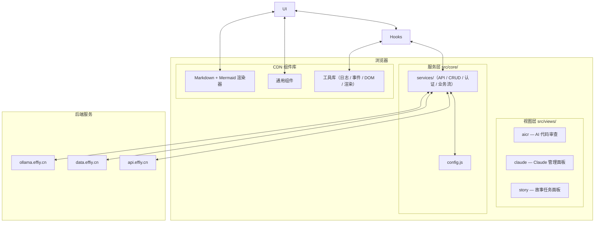
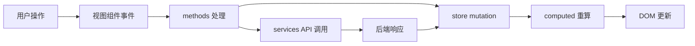

# YiWeb

> AI 辅助的代码审查与协作平台。零构建、纯 ESM、浏览器原生运行。

## 系统视图



## 命令流



## 快速开始

1. 本地启动任意静态文件服务器（如 `npx serve .` 或 Python `http.server`）
2. 打开 `http://localhost:3000`（或对应端口）
3. 默认连接 `prod` 环境；如需切换：
   - URL 参数：`?env=local`
   - 或执行 `localStorage.setItem('env', 'local'); location.reload()`
4. 首次使用需在登录弹窗中输入 API Token

## 项目结构

```
YiWeb/
├── cdn/                          # CDN 托管的通用组件与工具
│   ├── components/               # YiModal, YiButton, YiLoading 等
│   ├── markdown/                 # MarkdownRenderer + 插件系统
│   ├── mermaid/                  # MermaidRenderer + 交互插件
│   └── utils/                    # 日志、DOM、事件、验证、存储等
├── src/
│   ├── core/
│   │   ├── config.js             # 环境配置（local/prod）
│   │   └── services/
│   │       ├── index.js          # 服务聚合导出
│   │       ├── aicr/             # AICR 专用服务
│   │       ├── business/         # 业务流程/场景分析器
│   │       ├── helper/           # API 请求、认证、错误处理
│   │       └── modules/          # CRUD、 goals 等通用模块
│   └── views/
│       ├── aicr/                 # AI 代码审查视图
│       │   ├── components/         # 业务组件
│       │   ├── hooks/              # computed / methods / state / store
│       │   ├── styles/             # 视图级样式
│       │   ├── utils/              # 视图工具（resizer、listenerManager）
│       │   ├── constants/          # 常量
│       │   ├── index.html          # 视图模板
│       │   └── index.js            # 视图入口
│       ├── claude/               # Claude 管理面板视图
│       └── story/                # 故事任务面板视图
├── docs/故事任务面板/              # rui 故事文档
├── index.html                    # 根入口（当前仅占位）
└── CLAUDE.md                     # 项目画像与执行准则
```

## 故事任务

> 由 rui 驱动生成，详细内容见 `docs/故事任务面板/`。

| 故事 | 文档数 | 版本 | 说明 |
|------|:------:|------|------|
| yiweb-arch | 8 | v1.1.0 | 系统架构知识固化（父故事，含 5 子故事） |
| └ yiweb-arch-layers | 7 | v1.0.0 | FP1: 提取系统分层结构 |
| └ yiweb-arch-modules | 7 | v1.0.0 | FP2: 建立模块关系图谱 |
| └ yiweb-arch-dataflow | 7 | v1.0.0 | FP3: 绘制数据流转路径 |
| └ yiweb-arch-security | 7 | v1.0.0 | FP4: 标注安全防护边界 |
| └ yiweb-arch-deps | 7 | v1.0.0 | FP5: 生成依赖关系矩阵 |
| yiweb-self-test | 8 | v1.0.0 | 项目自主测试方案 |

## 领域语言

| 术语 | 定义 | 关系 |
|------|------|------|
| **AICR** | AI Code Review 的缩写，YiWeb 的核心业务视图 | 承载会话、文件树、代码查看、AI 聊天 |
| **createBaseView** | 自研视图框架函数，注册 store、computed、methods、组件列表 | 每个视图必须调用；语义类似 Vue 的 `createApp` |
| **vueRef** | 响应式引用实现，用于 store state | 被 `createBaseView` 消费；变更触发 computed 重算 |
| **session** | AICR 中的 AI 对话会话，包含多轮消息 | 与 fileTree 关联；可搜索、可打标签 |
| **fileTree** | 项目文件树结构，支持懒加载、展开、选中、批量操作 | 被 session 引用以定位代码上下文 |
| **streamPrompt** | 向后端发起 SSE 流式请求，用于 AI 聊天响应 | CRUD 模块提供；methods 层消费并驱动 UI 增量更新 |

### 示例对话

- "在 AICR 的 fileTree 中新增一个批量重命名功能"
- "session 的流式输出需要支持中断，请修改 streamPrompt 的 AbortController 逻辑"
- "createBaseView 的 computed 没有正确响应 vueRef 变更，检查依赖收集"

### 歧义标记

- "视图" 可能指浏览器页面（`index.html`）或 `createBaseView` 实例 — 需结合上下文区分
- "组件" 可能指 `cdn/components/` 通用组件或 `src/views/aicr/components/` 业务组件 — 默认指通用组件，业务组件需加前缀

## Testing

YiWeb 使用 Vitest + jsdom 进行自主测试。测试工具为 dev 依赖，App 本身保持零构建。

```bash
npm install        # 安装 vitest + jsdom（dev only）
npm test           # 运行全部测试（6 个文件 · 110 个用例 · 15 条规则）
npm run test:watch # watch 模式
```

测试文件位于 `tests/`，验证 15 条项目健康检查规则，覆盖 4 种执行模式：

| 模式 | 说明 |
|------|------|
| 全量（runFull） | 15 条规则全量扫描，按类别分组并行 |
| 增量（runIncremental） | 仅扫描 git diff 变更文件，按扩展名过滤规则 |
| 顺序（runSequential） | 逐规则执行，P0 失败中断 |
| 降级（runDegraded） | 按工具可用性过滤规则 |

规则覆盖 5 个类别：document（文档完整性）、structure（结构合规）、branch（分支隔离）、version（版本一致性）、security（安全检查）。

新增规则：在 `tests/rules/` 下创建模块，在 `tests/ruleRegistry.js` 注册。
