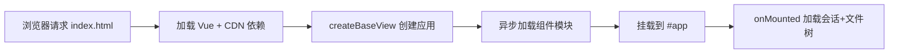

# YiWeb

> 纯前端静态应用，AI 代码审查助手。基于 Vue 3 原生 ESM + CDN 零构建架构。

## 项目画像

| 属性 | 值 |
|------|-----|
| 项目名 | YiWeb |
| 类型 | Frontend（纯静态，零构建） |
| 运行时 | 浏览器原生 ESM |
| UI 框架 | Vue 3.5.26（CDN 全局 `Vue`） |
| 渲染增强 | marked@9.1.6 + mermaid@10.9.1（CDN） |
| 图标 | Font Awesome 6.4.0（CDN） |
| 构建工具 | 无 |
| 包管理器 | 无 |
| 测试框架 | 无 |
| 部署方式 | 静态文件托管（Nginx / CDN） |

## 命令流



## 快速开始

本项目无构建步骤，直接以静态文件方式部署即可。

### 本地开发

1. 使用任意静态文件服务器托管项目根目录：
   ```bash
   # 示例：使用 Python http.server
   python3 -m http.server 8080
   ```
2. 打开浏览器访问 `http://localhost:8080/src/views/aicr/`

### 环境切换

- 通过 URL 参数：`?debug=true`
- 通过 localStorage 设置 `env` 为 `local` 或 `prod`
- 配置源文件：`src/core/config.js`

## 项目结构

```
YiWeb/
├── index.html              # 入口占位页
├── src/
│   ├── core/               # 核心服务层（配置、请求、业务服务）
│   └── views/
│       └── aicr/           # AI 代码审查主视图
│           ├── index.html  # 视图入口
│           ├── index.js    # 应用初始化
│           ├── components/ # 视图级组件
│           ├── hooks/      # store 工厂与业务方法
│           ├── styles/     # 视图级样式
│           └── utils/      # 视图级工具
└── cdn/                    # 共享资产库（可被其他项目复用）
    ├── components/         # 通用组件
    ├── markdown/           # Markdown 渲染引擎
    ├── mermaid/            # Mermaid 渲染引擎
    ├── styles/             # 主题 CSS
    └── utils/              # 通用工具
```

## 管线一览

| 管线 | 入口 | 说明 |
|------|------|------|
| 需求文档 | `/rui doc <req>` | 拆需求为故事 + 生成设计文档 |
| 代码实现 | `/rui code <name>` | 测试先行 → 实现 → 验证 |
| 端到端 | `/rui <req>` | doc + code 全自动串联 |
| 增量更新 | `/rui update <name>` | T1/T2/T3 裁剪更新 |
