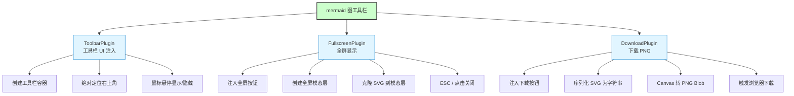
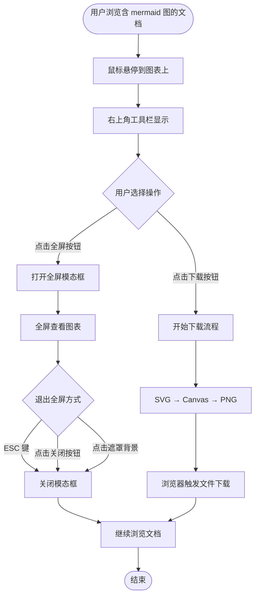
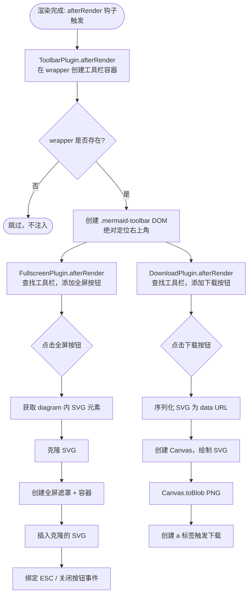
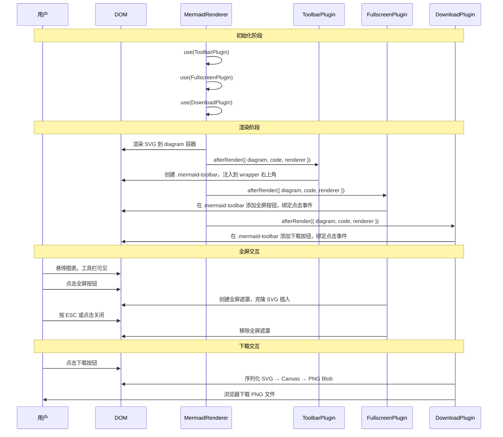
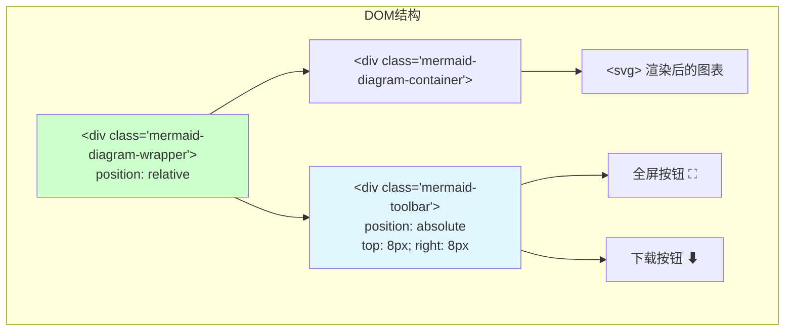

# mermaid 图工具栏

> **文档版本**: v1.0 | **最后更新**: 2026-04-23 | **维护者**: YiAi 团队
>
> **关联文档**: [需求文档](./需求文档.md) | [设计文档](./设计文档.md) | [使用文档](./使用文档.md)
>

[功能概述](#功能概述) | [功能分析](#功能分析) | [主要操作场景](#主要操作场景) | [功能详情](#功能详情) | [验收标准](#验收标准) | [使用场景示例](#使用场景示例)

---

## 功能概述

mermaid 图工具栏功能通过实现三个已有的占位插件（`ToolbarPlugin`、`FullscreenPlugin`、`DownloadPlugin`），为每张渲染后的 mermaid 图表右上角添加包含全屏显示和下载 PNG 两个按钮的浮动工具栏。工具栏在鼠标悬停时显示，全屏模式支持 ESC 退出，下载功能通过 SVG → Canvas → PNG 链路实现高质量导出。

**核心价值**
- 🎯 **零学习成本**：工具栏自动注入，用户无需任何配置即可使用全屏和下载功能
- ⚡ **Plugin 扩展架构**：基于已有的 Plugin 系统（`MermaidRenderer.use()`），新功能以插件形式插入，不侵入核心渲染逻辑
- 📖 **主题适配**：使用项目 CSS 变量（`--primary`、`--bg-secondary` 等），自动适配暗色主题

---

## 功能分析

[功能分解图](#功能分解图) | [用户流程图](#用户流程图) | [功能流程图](#功能流程图) | [完整时序图](#完整时序图)

### 功能分解图

**功能分解图说明**：功能由三个插件协同实现——`ToolbarPlugin` 负责 UI 容器，`FullscreenPlugin` 和 `DownloadPlugin` 各自向工具栏添加按钮并实现对应逻辑。三个插件均通过 `MermaidRenderer.use()` 注册，渲染完成后按注册顺序依次执行 `afterRender` 钩子（来源：`cdn/mermaid/core/MermaidRenderer.js:200-204`）。

### 用户流程图

**用户流程图说明**：用户操作路径分为两条——全屏查看路径（悬停→点击全屏→查看→退出）和下载路径（悬停→点击下载→自动保存文件），两条路径互相独立，可按任意顺序使用。

### 功能流程图

**功能流程图说明**：渲染后插件按注册顺序执行，`ToolbarPlugin` 先建立容器，后续两个插件向容器注入按钮。全屏和下载功能各自独立处理点击事件，互不干扰。

### 完整时序图

**时序图说明**：三个插件在 `renderDiagram` 完成后依序运行；全屏和下载交互均在浏览器端通过 DOM 操作完成，无需服务端调用。

---

## 用户故事与验收标准

**优先级图标说明**：🔴 P0 - 必须有 | 🟡 P1 - 应该有 | 🟢 P2 - 可以有

| 用户故事 | 验收标准 | 过程生成文档 | 产出智能文档 |
|----------|----------|--------|----------|
| 🔴 作为文档读者，我想要在 mermaid 图右上角看到工具栏按钮（全屏显示、下载 PNG），以便方便地查看复杂图表并将图表保存为图片文件  **主要操作场景**： - 鼠标悬停到 mermaid 图上，右上角出现工具栏 - 点击全屏按钮，图表以全屏模态框展示 - 在全屏模式下按 ESC 或点击关闭按钮退出全屏 - 点击下载 PNG 按钮，浏览器自动下载图表的 PNG 图片 | 1. 所有 mermaid 图渲染后右上角均有工具栏 2. 全屏按钮点击后展示全屏模态框 3. 全屏模式支持 ESC 键和关闭按钮退出 4. 下载按钮触发 PNG 文件下载 | [mermaid图工具栏-需求任务](./需求任务.md) [mermaid图工具栏-设计文档](./设计文档.md) [mermaid图工具栏-项目报告](./项目报告.md) | [生成文档 Skill](../../.cursor/skills/generate-document/SKILL.md) [需求任务规范](../../.cursor/skills/generate-document/rules/需求任务.md) [需求任务模板](../../.cursor/skills/generate-document/templates/需求任务.md) [需求任务检查清单](../../.cursor/skills/generate-document/checklists/需求任务.md) |

---

## 主要操作场景

### 场景一：悬停显示工具栏

#### 🎯 主要操作场景：鼠标悬停显示工具栏

**场景描述**：用户在包含 mermaid 图表的文档页面中，将鼠标悬停到任一图表上，图表右上角出现包含全屏和下载按钮的工具栏。

**前置条件**：
- 页面已加载并渲染了至少一个 mermaid 图表
- `ToolbarPlugin`、`FullscreenPlugin`、`DownloadPlugin` 均已注册到 `MermaidRenderer`（来源：`cdn/mermaid/index.js:14-16`）

**操作步骤**：
1. 用户将鼠标移动到 `.mermaid-diagram-wrapper` 区域内
2. CSS `:hover` 或 JS `mouseenter` 事件触发工具栏可见
3. 工具栏出现在图表右上角，显示全屏按钮（⛶）和下载按钮（⬇）

**预期结果**：工具栏以绝对定位浮于图表右上角，两个按钮图标清晰可见，不遮挡图表主要内容

**验证关注点**：
- 工具栏 DOM 存在于 `.mermaid-diagram-wrapper` 内部
- 工具栏定位在右上角（`position: absolute; top: 8px; right: 8px`）
- 按钮具有可识别的图标和 aria-label

**相关设计文档章节**：[架构设计 - ToolbarPlugin 实现](./设计文档.md#架构设计)

---

#### 🎯 主要操作场景：点击全屏按钮查看图表

**场景描述**：用户点击工具栏中的全屏按钮，图表以全屏模态框形式展示，可用整个视口查看图表细节。

**前置条件**：
- mermaid 图表已渲染完成，工具栏已注入
- 浏览器视口宽高足够显示全屏模态框

**操作步骤**：
1. 用户悬停图表，工具栏显示
2. 用户点击全屏按钮（⛶图标）
3. 页面出现黑色半透明遮罩，图表内容居中展示
4. 图表 SVG 克隆后插入全屏容器，自适应视口大小

**预期结果**：全屏模态框出现，图表内容完整可见，右上角有关闭按钮（✕）

**验证关注点**：
- 模态遮罩覆盖整个视口（`position: fixed; inset: 0`）
- 图表 SVG 在模态框中完整显示，无截断
- 按 ESC 键可关闭模态框
- 点击遮罩背景可关闭模态框
- 点击关闭按钮（✕）可关闭模态框

**相关设计文档章节**：[实现细节 - FullscreenPlugin](./设计文档.md#实现细节)

---

### 场景二：下载 PNG 图片

#### 🎯 主要操作场景：点击下载按钮保存 PNG

**场景描述**：用户点击工具栏中的下载按钮，浏览器将当前 mermaid 图表的 SVG 内容转换为 PNG 图片并自动触发文件下载。

**前置条件**：
- mermaid 图表已渲染完成，SVG 内容存在于 `.mermaid-diagram-container` 内
- 浏览器支持 Canvas API 和 Blob URL（现代浏览器均支持）

**操作步骤**：
1. 用户悬停图表，工具栏显示
2. 用户点击下载按钮（⬇图标）
3. 前端从 `.mermaid-diagram-container` 获取 SVG 元素
4. 序列化 SVG → 绘制到 Canvas → 导出 PNG Blob
5. 创建临时 `<a>` 元素触发浏览器文件保存对话框

**预期结果**：浏览器下载文件名为 `mermaid-diagram-{timestamp}.png` 的 PNG 图片，图片内容与页面显示的图表一致

**验证关注点**：
- 下载文件格式为 PNG（非 SVG）
- 文件名包含时间戳
- 图片内容完整，不裁剪
- Canvas 背景色为白色（或与主题一致的深色背景）

**相关设计文档章节**：[实现细节 - DownloadPlugin](./设计文档.md#实现细节)

---

## 功能详情

### ToolbarPlugin - 工具栏容器

**功能说明**：实现 `ToolbarPlugin.afterRender`，在每个 `.mermaid-diagram-container` 的父节点 `.mermaid-diagram-wrapper` 内创建绝对定位的工具栏容器 `
`。工具栏默认透明，悬停时显示。

**价值**：集中管理工具栏 DOM 和样式，其他插件只需向工具栏追加按钮，无需各自处理布局定位。

**解决的痛点**：避免多个插件各自注入独立 UI 导致右上角堆叠按钮不对齐；统一 CSS 变量样式确保主题一致性。

**收益**：工具栏逻辑与功能逻辑分离，新增按钮（如剪贴板、AI修复）只需追加到已有工具栏，无需修改现有插件。

---

### FullscreenPlugin - 全屏显示

**功能说明**：实现 `FullscreenPlugin.afterRender`，在工具栏添加全屏按钮，点击后在 `document.body` 附加全屏遮罩层。将 diagram 容器中的 SVG 克隆后插入遮罩层，自适应视口尺寸。支持三种退出方式：ESC 键、点击关闭按钮、点击遮罩背景。

**价值**：复杂的多层 mermaid 图（graph TB、sequenceDiagram）在文档容器宽度限制下往往缩小显示，全屏模式利用整个视口，让用户清晰阅读所有细节。

**解决的痛点**：受限于文档页面布局，图表通常被压缩在 600-800px 宽度内；全屏模式可利用整个浏览器窗口，在 1920px 以上显示器上大幅提升阅读体验。

**收益**：无需离开当前页面即可详细查看图表，提升文档阅读效率。

---

### DownloadPlugin - 下载 PNG

**功能说明**：实现 `DownloadPlugin.afterRender`，在工具栏添加下载按钮，点击后获取 diagram 容器的 SVG 元素，通过 `XMLSerializer` 序列化为字符串，使用 `Image` + `Canvas` 转换为 PNG Blob，最终通过 `URL.createObjectURL` 触发浏览器下载。

**价值**：用户可将图表保存为 PNG 图片，用于 PPT、邮件、Wiki 等场景分享，无需截图工具。

**解决的痛点**：手动截图操作繁琐，截图清晰度受屏幕分辨率限制；程序化导出可保证清晰度，并可扩展支持 2x 高清输出。

**收益**：一键导出，文件名规范（含时间戳），可直接用于文档分享。

---

## 验收标准

### P0 - 必须通过

- [ ] **工具栏注入**：每个 mermaid 图渲染后，`.mermaid-diagram-wrapper` 内均包含 `.mermaid-toolbar` 元素
- [ ] **全屏功能**：点击全屏按钮后，全屏模态框出现，图表 SVG 完整显示
- [ ] **退出全屏**：全屏模式下支持 ESC 键、点击关闭按钮、点击遮罩背景三种退出方式
- [ ] **下载 PNG**：点击下载按钮后，浏览器触发下载，文件格式为 PNG

### P1 - 应该通过

- [ ] **悬停显示**：工具栏在鼠标悬停时显示，离开时隐藏
- [ ] **样式适配**：工具栏按钮使用 CSS 变量（`--primary`、`--bg-secondary` 等），适配暗色主题
- [ ] **文件名规范**：下载文件名格式为 `mermaid-diagram-{timestamp}.png`
- [ ] **全屏自适应**：全屏模态框中的 SVG 自适应视口大小

### P2 - 可以有

- [ ] **工具提示**：按钮 hover 时显示 tooltip 文字（"全屏查看" / "下载 PNG"）
- [ ] **高清导出**：Canvas 使用 `devicePixelRatio` 实现 2x 高清导出
- [ ] **全屏缩放**：全屏模式下支持鼠标滚轮缩放

---

## 使用场景示例

#### 📋 场景一：阅读复杂架构图

> **背景**：技术文档中嵌入了一张 `graph TB` 系统架构图，在文档页面中因宽度限制，节点文字过小。
>
> **操作**：将鼠标移动到图表上，右上角工具栏出现；点击全屏按钮（⛶），全屏模态框打开。
>
> **结果**：图表以全屏模式展示，所有节点和连线文字清晰可见。按 ESC 键退出，继续阅读文档。

---

#### 🎨 场景二：导出时序图到 PPT

> **背景**：需要将 `sequenceDiagram` 时序图插入到团队周报 PPT 中。
>
> **操作**：将鼠标移动到图表上，点击工具栏下载按钮（⬇）。
>
> **结果**：浏览器自动下载 `mermaid-diagram-1714780800000.png` 文件，图片内容与页面图表一致，可直接插入 PPT。
