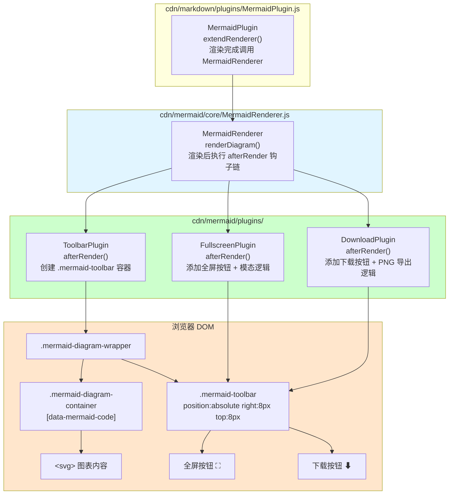
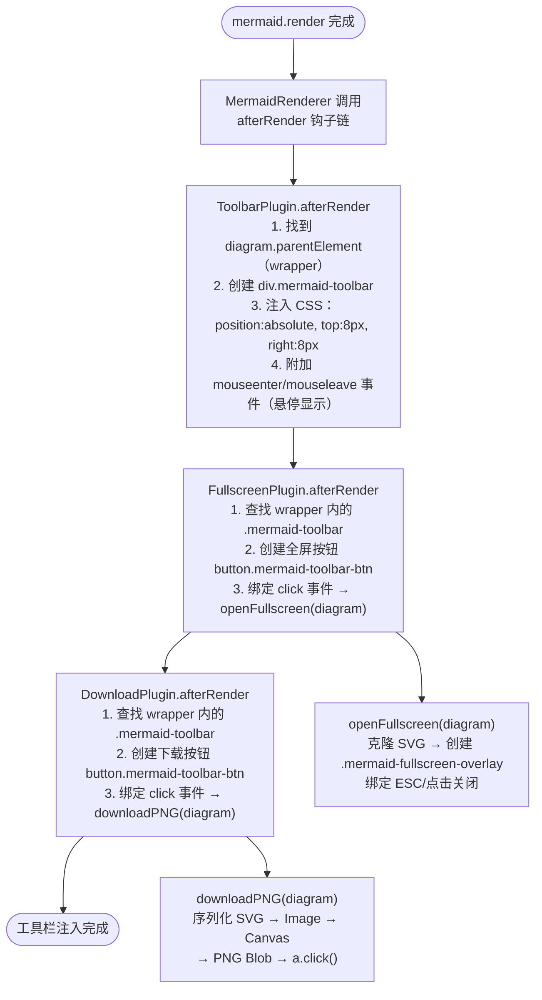
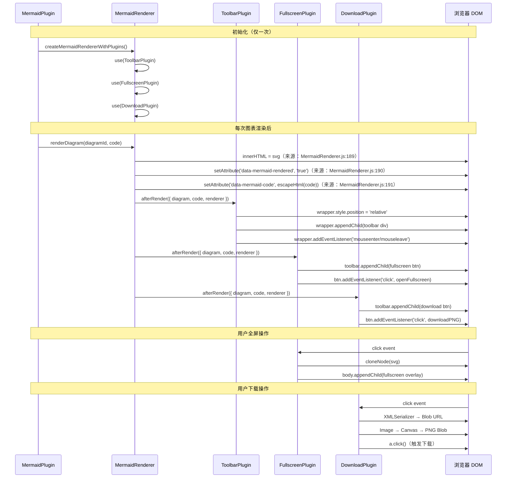

# mermaid 图工具栏设计

> **文档版本**: v1.0 | **最后更新**: 2026-04-23 | **维护者**: YiAi 团队
>
> **关联文档**: [需求任务](./需求任务.md) | [使用文档](./使用文档.md) | [CLAUDE.md](../../CLAUDE.md)
>

[设计概述](#设计概述) | [架构设计](#架构设计) | [修复内容](#修复内容) | [实现细节](#实现细节) | [数据结构](#数据结构)

---

## 设计概述

本设计基于 YiWeb 已有的 mermaid Plugin 架构（来源：`cdn/mermaid/core/MermaidRenderer.js`），通过实现三个占位插件的 `afterRender` 钩子，为每张渲染后的 mermaid 图表右上角注入浮动工具栏，包含全屏显示和下载 PNG 两个功能。

设计的核心约束是：所有修改仅限于三个插件文件（`ToolbarPlugin.js`、`FullscreenPlugin.js`、`DownloadPlugin.js`），不修改 `MermaidRenderer.js` 核心逻辑，也不修改 `MermaidPlugin.js`（markdown 集成层）。

**设计原则**
- 🎯 **最小侵入**：仅实现现有占位插件的 `afterRender` 钩子，不新增文件，不修改 core 层
- ⚡ **依赖注入**：FullscreenPlugin 和 DownloadPlugin 通过查找已由 ToolbarPlugin 创建的工具栏容器来注入按钮，避免各自创建独立 UI
- 🔧 **纯前端**：全屏和下载功能完全在浏览器端实现（DOM 操作 + Canvas API），无需后端接口

---

## 架构设计

### 整体架构



**架构说明**：Markdown 层的 `MermaidPlugin` 调用 `createMermaidRenderer()` 创建渲染器（来源：`cdn/markdown/plugins/MermaidPlugin.js:38-39`），注意当前 MermaidPlugin 使用的是无插件的 `createMermaidRenderer()`，需改为 `createMermaidRendererWithPlugins()` 以启用工具栏功能（来源：`cdn/mermaid/index.js:12-19`）。三个插件按注册顺序依次执行 `afterRender` 钩子（来源：`cdn/mermaid/core/MermaidRenderer.js:200-204`）。

### 模块划分

| 模块名称 | 职责 | 文件位置 |
|----------|------|----------|
| ToolbarPlugin | 在 `mermaid-diagram-wrapper` 右上角创建工具栏容器，管理悬停显示/隐藏 | `cdn/mermaid/plugins/ToolbarPlugin.js` |
| FullscreenPlugin | 向工具栏添加全屏按钮，点击后创建全屏模态层展示 SVG | `cdn/mermaid/plugins/FullscreenPlugin.js` |
| DownloadPlugin | 向工具栏添加下载按钮，点击后将 SVG 转为 PNG 并触发下载 | `cdn/mermaid/plugins/DownloadPlugin.js` |
| MermaidPlugin（修改） | 改用 `createMermaidRendererWithPlugins()` 以启用插件 | `cdn/markdown/plugins/MermaidPlugin.js` |
| index.js（已有） | `createMermaidRendererWithPlugins()` 已注册全部插件（无需修改） | `cdn/mermaid/index.js` |

### 核心流程图



**流程说明**：三个插件依次执行，`ToolbarPlugin` 建立容器后，`FullscreenPlugin` 和 `DownloadPlugin` 通过 `wrapper.querySelector('.mermaid-toolbar')` 找到容器并追加按钮。若容器不存在（`ToolbarPlugin` 未运行），则两个插件直接跳过，不抛出错误（防御性编程）。

---

## 修复内容

### 问题分析

三个插件（`ToolbarPlugin`、`FullscreenPlugin`、`DownloadPlugin`）当前均为空占位实现（来源：`cdn/mermaid/plugins/ToolbarPlugin.js:10-12`、`FullscreenPlugin.js:10-12`、`DownloadPlugin.js:10-12`）：

```javascript
afterRender({ diagram, code, renderer }) {
    // Fullscreen functionality will be added here
}
```

此外，`MermaidPlugin.js` 使用 `createMermaidRenderer()` 创建渲染器，不带任何插件（来源：`cdn/markdown/plugins/MermaidPlugin.js:39`）：

```javascript
_mermaidRendererCache = createMermaidRenderer();
```

这意味着即使插件实现完成，在 markdown 渲染场景下也不会生效，因为插件未被注册。

### 修复方案

**修改文件清单**：
1. `cdn/mermaid/plugins/ToolbarPlugin.js` - 实现工具栏容器注入逻辑
2. `cdn/mermaid/plugins/FullscreenPlugin.js` - 实现全屏按钮和模态逻辑
3. `cdn/mermaid/plugins/DownloadPlugin.js` - 实现下载按钮和 PNG 导出逻辑
4. `cdn/markdown/plugins/MermaidPlugin.js` - 改用 `createMermaidRendererWithPlugins()`

**选择当前方案的理由**：
- 不修改 `MermaidRenderer.js` 核心层，降低回归风险
- `createMermaidRendererWithPlugins()` 已在 `cdn/mermaid/index.js` 中定义，只需更换导入（来源：`cdn/mermaid/index.js:12`）
- 工具栏、全屏、下载三个关注点分离到三个独立文件，便于各自维护和测试

### 修复前后对比

| 内容项 | 修复前 | 修复后 | 说明 |
|--------|--------|--------|------|
| ToolbarPlugin.afterRender | 空函数体 | 创建 `.mermaid-toolbar` 注入到 wrapper | 核心变更 |
| FullscreenPlugin.afterRender | 空函数体 | 添加全屏按钮 + 模态层逻辑 | 核心变更 |
| DownloadPlugin.afterRender | 空函数体 | 添加下载按钮 + SVG→PNG 逻辑 | 核心变更 |
| MermaidPlugin 渲染器创建 | `createMermaidRenderer()` | `createMermaidRendererWithPlugins()` | 启用插件注册 |
| mermaid 图右上角 | 无工具栏 | 有全屏和下载按钮 | 用户可见变化 |

```diff
--- a/cdn/markdown/plugins/MermaidPlugin.js
+++ b/cdn/markdown/plugins/MermaidPlugin.js
@@ -36,7 +36,7 @@
     try {
-      const { createMermaidRenderer } = await import('../../mermaid/index.js');
-      _mermaidRendererCache = createMermaidRenderer();
+      const { createMermaidRendererWithPlugins } = await import('../../mermaid/index.js');
+      _mermaidRendererCache = createMermaidRendererWithPlugins();
       this._mermaidRenderer = _mermaidRendererCache;
       return this._mermaidRenderer;
     } catch (e) {
```

---

## 实现细节

### 技术实现要点

**1. ToolbarPlugin - 工具栏容器**

做什么：在每个 `diagram.parentElement`（即 `.mermaid-diagram-wrapper`）内创建 `.mermaid-toolbar` 容器。

怎么做：检测 wrapper 存在后，创建 `<div>` 并设置 `position: absolute; top: 8px; right: 8px; z-index: 10; opacity: 0`，通过 wrapper 的 `mouseenter`/`mouseleave` 事件控制 `opacity` 切换（CSS transition 实现过渡效果）。wrapper 需设置 `position: relative`。

为什么这么做：使用绝对定位而非固定定位，让工具栏跟随各自的图表容器，不影响页面其他元素。使用 opacity + transition 而非 display:none 切换，避免重排，动画更流畅。

**2. FullscreenPlugin - 全屏模态**

做什么：向工具栏添加全屏按钮，点击后创建覆盖全屏的遮罩层，将 SVG 克隆到遮罩层中展示。

怎么做：使用 `position: fixed; inset: 0; z-index: 9999` 的遮罩层，SVG 通过 `cloneNode(true)` 克隆后插入，设置 `max-width: 90vw; max-height: 90vh` 自适应视口。绑定 `document.addEventListener('keydown', escHandler)` 监听 ESC，卸载时 `removeEventListener` 避免内存泄漏。

为什么这么做：克隆 SVG 而不是移动 SVG，避免原图表内容消失；`fixed` + `inset: 0` 比 `position:fixed; top:0; left:0; width:100%; height:100%` 更简洁，兼容性一致（现代浏览器均支持 `inset`）。

**3. DownloadPlugin - PNG 导出**

做什么：将 diagram 容器内的 SVG 导出为 PNG 文件并触发浏览器下载。

怎么做：
1. 获取 `diagram.querySelector('svg')`，用 `XMLSerializer().serializeToString(svg)` 序列化
2. 创建 `Blob([svgStr], { type: 'image/svg+xml' })`，生成 `objectURL`
3. 创建 `Image` 元素加载 SVG，`onload` 后绘制到 `Canvas`
4. `canvas.toBlob(callback, 'image/png')` 生成 PNG Blob
5. 创建隐藏 `<a>` 元素，设置 `href = URL.createObjectURL(blob)`，设置 `download = 'mermaid-diagram-{Date.now()}.png'`，触发 `.click()`，然后 `URL.revokeObjectURL` 释放内存

为什么这么做：SVG → Canvas → PNG 是纯浏览器端无依赖方案，无需引入 `html2canvas` 等三方库。Canvas 的 `toBlob` 异步导出，内存占用比 `toDataURL` 更小。

### 关键代码说明

```javascript
// ToolbarPlugin.js - 工具栏注入核心逻辑
afterRender({ diagram, code, renderer }) {
    const wrapper = diagram.parentElement;
    if (!wrapper) return;

    // wrapper 需要 position:relative 以支持工具栏绝对定位
    if (getComputedStyle(wrapper).position === 'static') {
        wrapper.style.position = 'relative';
    }

    const toolbar = document.createElement('div');
    toolbar.className = 'mermaid-toolbar';
    toolbar.style.cssText = `
        position: absolute; top: 8px; right: 8px; z-index: 10;
        display: flex; gap: 4px;
        opacity: 0; transition: opacity 0.2s ease;
        pointer-events: none;
    `;

    // 悬停显示工具栏
    wrapper.addEventListener('mouseenter', () => {
        toolbar.style.opacity = '1';
        toolbar.style.pointerEvents = 'auto';
    });
    wrapper.addEventListener('mouseleave', () => {
        toolbar.style.opacity = '0';
        toolbar.style.pointerEvents = 'none';
    });

    wrapper.appendChild(toolbar);
}
```

```javascript
// FullscreenPlugin.js - 全屏模态核心逻辑
function openFullscreen(diagram) {
    const svg = diagram.querySelector('svg');
    if (!svg) return;

    const overlay = document.createElement('div');
    overlay.className = 'mermaid-fullscreen-overlay';
    overlay.style.cssText = `
        position: fixed; inset: 0; z-index: 9999;
        background: rgba(0,0,0,0.85);
        display: flex; align-items: center; justify-content: center;
    `;

    const clonedSvg = svg.cloneNode(true);
    clonedSvg.style.cssText = 'max-width:90vw; max-height:90vh; width:auto; height:auto;';
    overlay.appendChild(clonedSvg);

    const closeBtn = createCloseButton();
    overlay.appendChild(closeBtn);

    const close = () => {
        document.removeEventListener('keydown', escHandler);
        document.body.removeChild(overlay);
    };
    const escHandler = (e) => { if (e.key === 'Escape') close(); };

    closeBtn.addEventListener('click', close);
    overlay.addEventListener('click', (e) => { if (e.target === overlay) close(); });
    document.addEventListener('keydown', escHandler);
    document.body.appendChild(overlay);
}
```

```javascript
// DownloadPlugin.js - PNG 导出核心逻辑
function downloadPNG(diagram) {
    const svg = diagram.querySelector('svg');
    if (!svg) return;

    const svgStr = new XMLSerializer().serializeToString(svg);
    const svgBlob = new Blob([svgStr], { type: 'image/svg+xml;charset=utf-8' });
    const url = URL.createObjectURL(svgBlob);

    const img = new Image();
    img.onload = () => {
        const canvas = document.createElement('canvas');
        const dpr = window.devicePixelRatio || 1;
        canvas.width = (img.width || 800) * dpr;
        canvas.height = (img.height || 600) * dpr;

        const ctx = canvas.getContext('2d');
        ctx.fillStyle = '#0f172a'; // 暗色背景（来源：MermaidConfig.js background 变量）
        ctx.fillRect(0, 0, canvas.width, canvas.height);
        ctx.scale(dpr, dpr);
        ctx.drawImage(img, 0, 0);
        URL.revokeObjectURL(url);

        canvas.toBlob((blob) => {
            const a = document.createElement('a');
            a.href = URL.createObjectURL(blob);
            a.download = `mermaid-diagram-${Date.now()}.png`;
            a.click();
            URL.revokeObjectURL(a.href);
        }, 'image/png');
    };
    img.src = url;
}
```

### 依赖关系

| 依赖 | 用途 | 版本要求 |
|------|------|---------|
| `XMLSerializer` | 将 SVG DOM 序列化为字符串 | 浏览器原生 API，无版本限制 |
| `Canvas API` | 将 SVG 绘制为位图，导出 PNG | 浏览器原生 API，现代浏览器均支持 |
| `URL.createObjectURL` | 创建 Blob URL 触发下载 | 浏览器原生 API |
| `Blob` | 封装 PNG 数据 | 浏览器原生 API |

无新增 npm 依赖，完全基于浏览器原生 API。

### 测试考虑

- **功能测试**：渲染 mermaid 图后，检查 `.mermaid-toolbar` 是否存在于 `.mermaid-diagram-wrapper` 内
- **交互测试**：模拟 mouseenter 事件验证工具栏可见性；模拟点击全屏按钮验证模态框创建；模拟 ESC 键验证模态框关闭
- **下载测试**：模拟点击下载按钮，拦截 `<a>` 元素的 `click` 事件，验证 `download` 属性和 `href` 格式
- **边界情况**：diagram 容器内 SVG 未加载完成时点击按钮；多个 mermaid 图并存时各自独立工具栏

---

## 主要操作场景实现

### 场景实现：鼠标悬停显示工具栏

**关联需求任务场景**：[主要操作场景 - 悬停显示工具栏](./需求任务.md#场景一悬停显示工具栏)

**实现概述**：`ToolbarPlugin.afterRender` 在 `diagram.parentElement`（`.mermaid-diagram-wrapper`）上绑定 `mouseenter`/`mouseleave` 事件，通过修改 `.mermaid-toolbar` 的 `opacity` 和 `pointer-events` 实现显示/隐藏切换。

**涉及模块**：
- `ToolbarPlugin`：创建工具栏容器，绑定悬停事件

**关键代码路径**：
- `cdn/mermaid/plugins/ToolbarPlugin.js`：`afterRender` 函数中的 `wrapper.addEventListener('mouseenter', ...)` 逻辑

**验证要点**：
- `.mermaid-toolbar` 初始 `opacity: 0`
- mouseenter 后 `opacity: 1`，mouseleave 后 `opacity: 0`
- `.mermaid-diagram-wrapper` 的 `position` 为 `relative`（非 `static`）

---

### 场景实现：点击全屏按钮查看图表

**关联需求任务场景**：[主要操作场景 - 点击全屏按钮查看图表](./需求任务.md#场景一悬停显示工具栏)

**实现概述**：`FullscreenPlugin.afterRender` 在工具栏添加按钮，按钮点击后调用 `openFullscreen(diagram)`，函数克隆 SVG 并创建 `position:fixed` 全屏遮罩层。退出时通过 ESC、关闭按钮或点击遮罩三种路径调用 `close()` 函数移除遮罩层，并 `removeEventListener` ESC 监听。

**涉及模块**：
- `FullscreenPlugin`：全屏按钮注入、模态层创建/销毁、事件绑定
- `ToolbarPlugin`（依赖）：提供 `.mermaid-toolbar` 容器

**关键代码路径**：
- `cdn/mermaid/plugins/FullscreenPlugin.js`：`afterRender` 函数中的 `openFullscreen` 实现

**验证要点**：
- `document.body` 中存在 `.mermaid-fullscreen-overlay` 元素
- 遮罩层内包含克隆的 `<svg>` 元素，内容与原图一致
- ESC 键可关闭遮罩层（`keydown` 监听被 `removeEventListener` 清理）
- 遮罩关闭后 `document.body` 中不再存在 `.mermaid-fullscreen-overlay`

---

### 场景实现：点击下载按钮保存 PNG

**关联需求任务场景**：[主要操作场景 - 点击下载按钮保存 PNG](./需求任务.md#场景二下载-png-图片)

**实现概述**：`DownloadPlugin.afterRender` 在工具栏添加按钮，按钮点击后调用 `downloadPNG(diagram)`，函数通过 `XMLSerializer` 序列化 SVG，创建 Blob URL，用 `Image` 加载后绘制到 `Canvas`，最终通过 `canvas.toBlob` 导出 PNG Blob 并触发下载。

**涉及模块**：
- `DownloadPlugin`：下载按钮注入、SVG→PNG 转换、文件下载触发
- `ToolbarPlugin`（依赖）：提供 `.mermaid-toolbar` 容器

**关键代码路径**：
- `cdn/mermaid/plugins/DownloadPlugin.js`：`afterRender` 函数中的 `downloadPNG` 实现

**验证要点**：
- 创建的 `<a>` 元素的 `download` 属性符合 `mermaid-diagram-{timestamp}.png` 格式
- `canvas` 宽高与 SVG 一致（或缩放后的合理尺寸）
- Canvas 背景色填充（避免透明背景导致 PNG 背景为黑色/白色不一致）
- Blob URL 在下载触发后通过 `URL.revokeObjectURL` 释放

---

## 数据结构

### 数据流程图



**数据流程说明**：图表代码在渲染完成后存储在 `data-mermaid-code` 属性中（来源：`MermaidRenderer.js:191`），DOM 中 SVG 内容在插件运行时直接从 `diagram.querySelector('svg')` 获取，不需要重新解析或请求。全屏操作在纯内存中操作（克隆 DOM），下载操作在内存中完成 SVG→Canvas→Blob 转换，不产生持久化存储。
