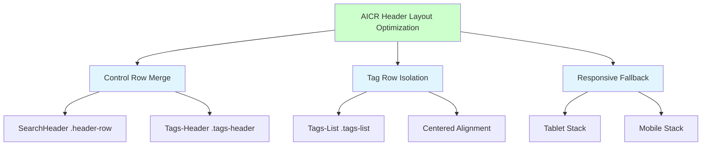
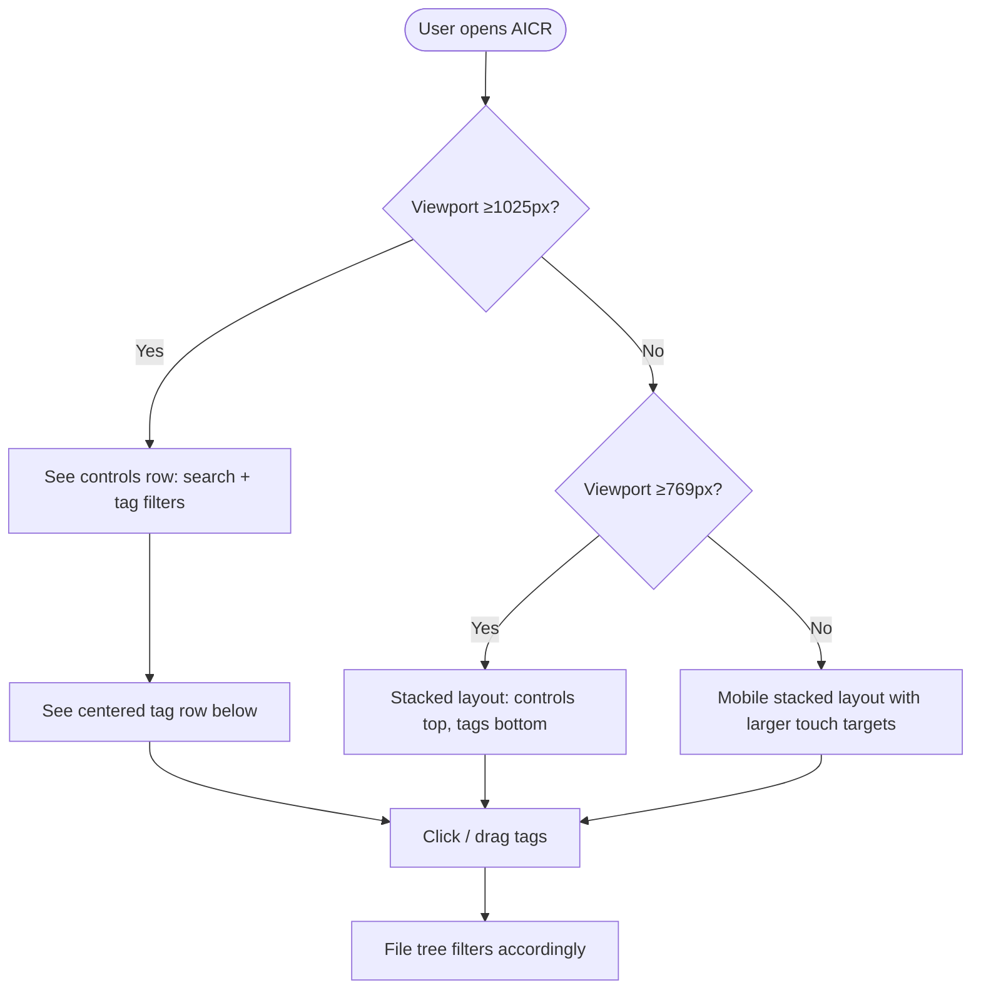
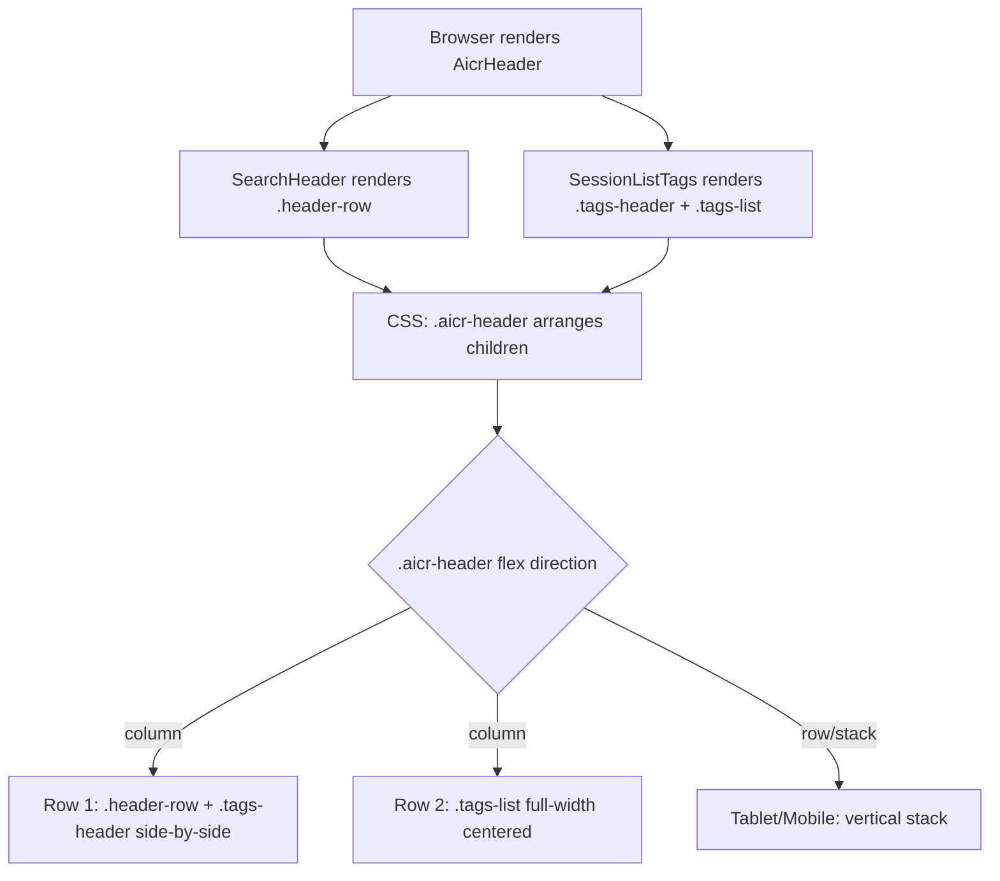
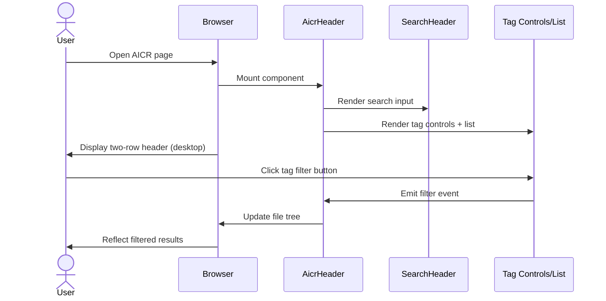

# AICR Header Layout Optimization — Requirement Tasks

> **Document Version**: v1.0 | **Last Updated**: 2026-05-02 | **Upstream**: [01 Requirement Document](./01_requirement-document.md) | **Downstream**: [03 Design Document](./03_design-document.md)
>

[Feature Overview](#feature-overview) | [Feature Analysis](#feature-analysis) | [Feature Details](#feature-details) | [Acceptance Criteria](#acceptance-criteria) | [Usage Scenario Examples](#usage-scenario-examples)

---

## Feature Overview

The AICR page header currently crams the global search bar, tag filter controls, and the actual tag chips into a single horizontal band on desktop. The `session-list-tags` container uses a flex-row layout that forces `.tags-header` and `.tags-list` to compete for horizontal space, making tag scanning and clicking uncomfortable. This feature refactors the header into a clear two-row structure: the top row unifies the global search (`header-row`) and tag controls (`tags-header`), while the second row gives the tag chips (`tags-list`) full width with centered alignment. The change is scoped to CSS/HTML layout within `AicrHeader` and `SessionListTags`; no business logic, state management, or API contracts are altered.

🎯 **Precision**: Surgical layout refactor with zero functional drift.  
⚡ **Impact**: Immediately improves tag scannability and click targets.  
📖 **Clarity**: Separates "controls" from "content" via spatial hierarchy.

---

## Feature Analysis

### Feature Decomposition Diagram

The feature splits into three primary workstreams: merging the control elements into a single row, isolating the tag list into its own centered row, and ensuring the layout degrades gracefully on smaller viewports.

### User Flow Diagram

On desktop the user enjoys a compact two-row header; on smaller screens the layout stacks vertically to prevent clipping.

### Feature Flow Diagram

The rendering flow is driven entirely by CSS flex direction changes inside `.aicr-header` and `.session-list-tags`.

### Sequence Diagram

No new network or store interactions are introduced; the sequence is identical to the current implementation, only the visual arrangement changes.

---

## User Story Table

| Priority | User Story | Main Scenarios |
|----------|-----------|----------------|
| 🔴 P0 | As an AICR user, I want the search bar and tag filter controls to sit on the same row, so that the header feels compact and the controls are grouped logically. | 1. Desktop user sees new two-row header 2. User interacts with tag search and filter buttons 3. Responsive fallback on tablet/mobile |
| 🔴 P0 | As an AICR user, I want the tag list to be centered on its own row, so that tags are easier to read and click. | 1. User scans tags on dedicated centered row 2. User clicks or drags tags in new layout 3. User expands/collapses tag list |
| 🟡 P1 | As an AICR user, I want the layout to remain responsive, so that the experience is consistent across devices. | 1. User resizes browser to tablet width 2. User opens AICR on mobile device |

---

## Main Operation Scenario Definitions

### Scenario 1 — Desktop user views optimized header layout

- **Scenario description**: User opens AICR on a desktop browser and sees the reorganized header.
- **Pre-conditions**: Viewport width ≥ 1025px; AICR page loaded; user has at least one tag or "no tags" count > 0.
- **Operation steps**:
  1. Navigate to AICR page.
  2. Observe the header area.
- **Expected result**:
  - Top row contains the global search bar on the left and the tag search input + filter buttons on the right.
  - Second row contains the tag chips, horizontally centered.
- **Verification focus points**: Visual alignment, spacing between rows, no overlap or clipping.
- **Related design document chapters**: [Changes](./03_design-document.md#fixeschanges-mandatory), [Implementation Details](./03_design-document.md#implementation-details-mandatory)

### Scenario 2 — User interacts with tag filters on the new layout

- **Scenario description**: User uses tag search, filter buttons, expand/collapse, and clear-all in the merged control row.
- **Pre-conditions**: Same as Scenario 1; tag data loaded.
- **Operation steps**:
  1. Type into the tag search input.
  2. Click the "no tags" filter button.
  3. Click the expand button to show all tags.
  4. Click the clear-all button.
- **Expected result**: Each action updates the tag list and/or file tree filtering state exactly as it did before the layout change.
- **Verification focus points**: Event emission correctness, state synchronization, button active/highlight states.
- **Related design document chapters**: [Main Operation Scenario Implementation](./03_design-document.md#main-operation-scenario-implementation-mandatory)

### Scenario 3 — User drags and reorders tags

- **Scenario description**: User drags a tag chip to reorder it within the centered tag row.
- **Pre-conditions**: Same as Scenario 1; at least two tags exist.
- **Operation steps**:
  1. Mouse-down on a tag chip.
  2. Drag left or right over another chip.
  3. Drop to insert.
- **Expected result**: The tag order updates visually and persists to `localStorage`. Drop indicators show left/right (not top/bottom) because tags are laid out horizontally.
- **Verification focus points**: Drag image, drop indicator direction, `localStorage` persistence, `tagOrderVersion` increment.
- **Related design document chapters**: [Implementation Details](./03_design-document.md#implementation-details-mandatory), [Data Structure Design](./03_design-document.md#data-structure-design)

### Scenario 4 — Tablet/mobile user views responsive layout

- **Scenario description**: User opens AICR on a tablet or phone and sees a vertically stacked header.
- **Pre-conditions**: Viewport width ≤ 1024px (tablet) or ≤ 768px (mobile).
- **Operation steps**:
  1. Open AICR page on target device or resize browser.
  2. Observe header area.
- **Expected result**: Controls and tags stack vertically; touch targets are large enough; no horizontal overflow.
- **Verification focus points**: Breakpoint behavior, touch target sizes, font/icon scaling.
- **Related design document chapters**: [Changes](./03_design-document.md#fixeschanges-mandatory)

---

## Impact Analysis

### Search Terms and Change Point List

| # | Search Term | Found In | Change Point |
|---|-------------|----------|--------------|
| 1 | `.aicr-header` | `src/views/aicr/components/aicrHeader/index.css` | Flex direction and child arrangement |
| 2 | `.session-list-tags` | `src/views/aicr/components/aicrHeader/index.html`, `src/views/aicr/components/sessionListTags/index.html`, `src/views/aicr/components/sessionListTags/index.css` | Internal flex direction and alignment |
| 3 | `.tags-header` | `src/views/aicr/components/aicrHeader/index.html`, `src/views/aicr/components/sessionListTags/index.html`, `src/views/aicr/components/sessionListTags/index.css` | Position within parent; may move to sibling of `.header-row` |
| 4 | `.tags-list` | Same as above | Alignment changed to `center`; gets own row |
| 5 | `isHorizontalDrag()` | `src/views/aicr/components/aicrHeader/index.js`, `src/views/aicr/components/sessionListTags/sessionListTagsMethods.js` | Logic depends on `.aicr-header` flex direction; must be updated |
| 6 | `@media (min-width: 1025px)` | `src/views/aicr/components/aicrHeader/index.css`, `src/views/aicr/components/sessionListTags/index.css` | Desktop breakpoint rules need rewrite |
| 7 | `registerGlobalComponent({ name: 'SessionListTags'` | `src/views/aicr/components/sessionListTags/index.js` | Component registered but never used as a tag; dead code consideration |
| 8 | `.header-row` | `src/views/aicr/components/aicrHeader/index.css` | Width and flex properties in new layout |

### Change Point Impact Chain

| Change Point | Direct Impact | Transitive Impact | Closure |
|--------------|---------------|-------------------|---------|
| `.aicr-header` flex direction changes to `column` on desktop | `aicrHeader/index.css` | `.aicr-header > .header-row` width rules; `.aicr-header .session-list-tags` overflow rules | Closed: all selectors already scoped to `.aicr-header` |
| `.session-list-tags` flex direction changes to `column` on desktop | `sessionListTags/index.css` | `.tags-header` width/gap; `.tags-list` justify-content | Closed: scoped to component class |
| `isHorizontalDrag()` logic update | `aicrHeader/index.js`, `sessionListTags/sessionListTagsMethods.js` | Drag indicator CSS classes (`.drag-over-left`, `.drag-over-right`, etc.) | Closed: CSS classes unchanged; only JS detection changes |
| Unused `SessionListTags` component | `sessionListTags/index.js`, `sessionListTags/index.html`, `sessionListTags/index.css` | None (component is not referenced anywhere) | Closed: confirmed no `<session-list-tags>` tags in codebase |

### Dependency Closure Summary

| Dependency | Status | Verification |
|------------|--------|--------------|
| `SearchHeader` component (CDN) | ✅ No change required | Props/events unchanged; only CSS positioning affected |
| `YiIconButton` component (CDN) | ✅ No change required | Used inside `.tags-header`; untouched |
| `AicrSidebar` / `AicrCodeArea` | ✅ No change required | Siblings in `aicrPage/index.html`; header height change is minor and CSS handles flow |
| `localStorage` tag order persistence | ✅ No change required | Key `aicr_file_tag_order` unchanged |
| `--spacing-md`, `--border-primary` CSS vars | ✅ No change required | Variables exist in global theme |

### Uncovered Risks

| Risk | Likelihood | Mitigation |
|------|------------|------------|
| Drag-and-drop drop indicators switch to top/bottom if `isHorizontalDrag()` is not updated | High | Update detection to query `.tags-list` flex direction instead of `.aicr-header` |
| `sessionListTags/index.css` is loaded by `AicrHeader` (via `css: '/src/views/aicr/components/sessionListTags/index.css'`) but also by the unused `SessionListTags` component | Low | Keep CSS consistent; or remove unused component to avoid confusion |
| Centered tag row may look disconnected from controls on very wide screens | Low | Add subtle divider or keep vertical gap tight (≤12px) |

### Change Scope Summary

- **Directly modify**: 3 files (`aicrHeader/index.html`, `aicrHeader/index.css`, `aicrHeader/index.js`)
- **Verify compatibility**: 2 files (`sessionListTags/index.css`, `sessionListTags/index.html`)
- **Trace transitive**: 1 file (`sessionListTags/sessionListTagsMethods.js`)
- **Need manual review**: 1 file (`aicrPage/index.html` — confirm no hard-coded height dependencies)

---

## Feature Details

### 1. Control Row Merge

- **Feature description**: On desktop, `.header-row` (global search) and `.tags-header` (tag search + action buttons) are arranged side-by-side in a single flex row.
- **Value**: Reduces vertical space while keeping all controls in one scannable line.
- **Pain point**: Currently `.tags-header` is nested inside `.session-list-tags`, which is itself nested inside `.aicr-header`, making it impossible to place `.tags-header` at the same level as `.header-row` without restructuring.
- **Benefit**: Logical grouping improves user expectation—users see "input controls" on top, "content tags" below.

### 2. Tag Row Isolation and Centering

- **Feature description**: `.tags-list` is removed from the flex row shared with `.tags-header` and placed on its own full-width row. Tags within are horizontally centered via `justify-content: center`.
- **Value**: Tags are no longer squeezed; the full viewport width is available.
- **Pain point**: In the current desktop layout, `.tags-list` has `flex: 1` with `overflow: hidden`, causing tags to be truncated or hidden behind the expand button prematurely.
- **Benefit**: More tags are visible at a glance; centered alignment feels balanced and intentional.

### 3. Responsive Degradation

- **Feature description**: At ≤1024px the layout reverts to a vertical stack similar to the current tablet/mobile behavior.
- **Value**: No degradation in usability on smaller screens.
- **Pain point**: N/A (existing breakpoints are reused).
- **Benefit**: Consistent responsive behavior without introducing new breakpoint complexity.

---

## Acceptance Criteria

### P0 — Core

1. Desktop: `header-row` and `tags-header` share one visual row.
2. Desktop: `tags-list` is on a dedicated second row, horizontally centered.
3. All tag filter interactions (search, no-tags, reverse, expand, clear) remain functional.
4. Tag click-selection and drag-and-drop reordering work correctly with left/right drop indicators.
5. No visual regressions in adjacent components.

### P1 — Important

1. Tablet and mobile layouts stack gracefully without overflow.
2. Mobile touch targets meet 44×44dp minimum.
3. `prefers-reduced-motion` continues to disable transitions.

### P2 — Nice-to-have

1. Smooth CSS transition when layout shifts on window resize.

---

## Usage Scenario Examples

### Scenario 1 — Desktop user scans and selects tags

**Background**: User opens AICR on a 1920px monitor.  
**Operation**: Observe the top control row, then click a tag in the centered row below.  
**Result**: Tag highlights and file tree filters.  
📋 Controls grouped logically; 🎨 tags centered and spacious.

### Scenario 2 — User drags to reorder tags

**Background**: User wants to reorder tags.  
**Operation**: Drag a tag chip left or right within the centered row.  
**Result**: Drop indicators appear left/right; order persists.  
📋 Drag-and-drop unchanged; 🎨 clear visual feedback.

### Scenario 3 — Tablet user views responsive layout

**Background**: User opens AICR on an iPad (≈1024px).  
**Operation**: Observe the header.  
**Result**: Stacked vertical layout with no overflow.  
📋 Breakpoint respected; 🎨 no clipping.

---

## Postscript: Future Planning & Improvements

- Consolidate the duplicated `sessionListTags` markup into the actual `<session-list-tags>` component, or remove the unused component files to reduce maintenance overhead.
- Consider exposing a CSS custom property (e.g. `--header-row-gap`) so the gap between the control row and tag row can be themed without editing the component stylesheet.
