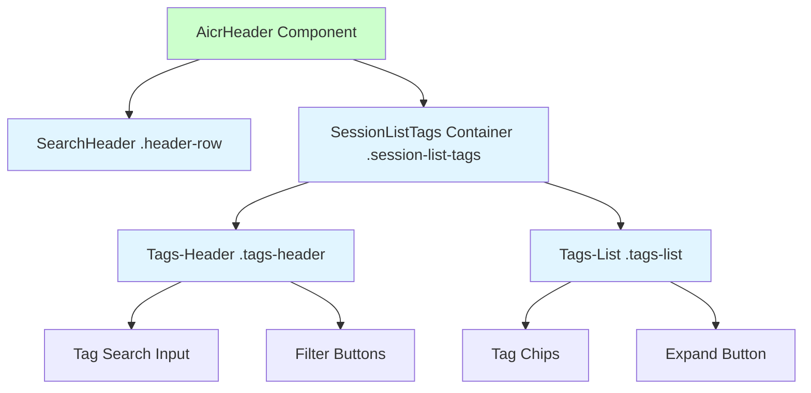
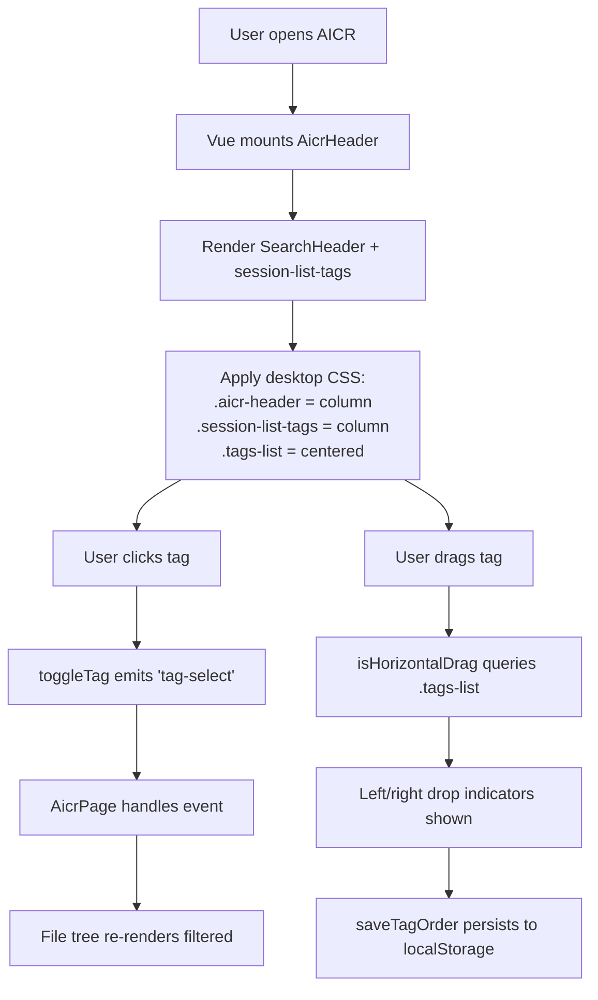
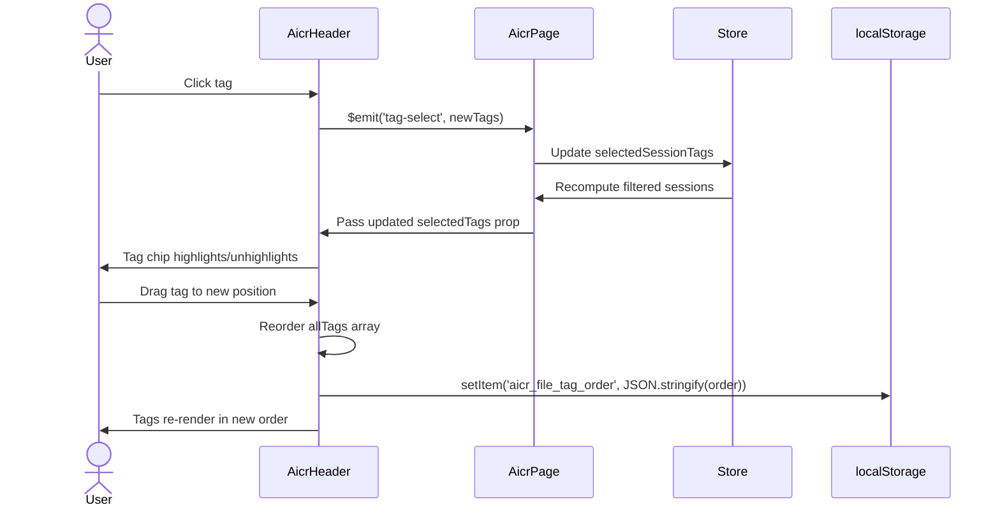

# AICR Header Layout Optimization — Design Document

> **Document Version**: v1.0 | **Last Updated**: 2026-05-02 | **Upstream**: [02 Requirement Tasks](./02_requirement-tasks.md) | **Downstream**: [04 Usage Document](./04_usage-document.md)
>

[Design Overview](#design-overview) | [Architecture Design](#architecture-design) | [Changes](#fixeschanges-mandatory) | [Implementation Details](#implementation-details-mandatory) | [Impact Analysis](#impact-analysis-mandatory)

---

## Design Overview

This design restructures the AICR page header from a single-band flex row into a two-row layout. The top row merges the global search component (`SearchHeader`, class `.header-row`) and the tag filter controls (`.tags-header`) side-by-side. The second row isolates the tag chips (`.tags-list`) into a full-width, horizontally centered strip. The change is strictly presentational: all Vue props, events, computed properties, and drag-and-drop logic remain intact. Only the HTML nesting, CSS flex directions, and the drag-orientation detection heuristic require updates.

The design favors minimal HTML restructuring over heavy CSS trickery. By keeping `.tags-header` and `.tags-list` inside `.session-list-tags` but changing `.session-list-tags` from `flex-direction: row` to `column`, we preserve the existing component boundary while achieving the visual goal. The `.aicr-header` wrapper also switches from `row` to `column` on desktop, allowing its two direct children (`.header-row` and `.session-list-tags`) to stack vertically.

🎯 **Separation of concerns**: Controls row vs. content row.  
⚡ **Minimal touch**: Reuse existing classes and breakpoints.  
🔧 **Fix the root cause**: `isHorizontalDrag()` should query the actual tag container, not the ancestral header.

---

## Architecture Design

### Overall Architecture



`AicrHeader` owns the entire header area. It renders `SearchHeader` as its first child and a `.session-list-tags` div as its second child. Inside `.session-list-tags`, `.tags-header` groups the tag-specific search and action buttons, while `.tags-list` renders the selectable/draggable tag chips.

### Module Division

| Module | Responsibility | Location |
|--------|---------------|----------|
| `AicrHeader` | Orchestrates header children; emits tag and search events upward | `src/views/aicr/components/aicrHeader/index.js` |
| `SearchHeader` | Global search input, home/news buttons, composition handling | `cdn/components/SearchHeader/` (external; unchanged) |
| `.session-list-tags` (inline) | Hosts tag controls and tag list; provides computed/methods for filtering and drag-and-drop | Inline in `aicrHeader/index.html`; logic in `aicrHeader/index.js` |
| `SessionListTags` (unused component) | Registered but never instantiated as a tag; template/CSS duplicated in `AicrHeader` | `src/views/aicr/components/sessionListTags/` |
| `AicrPage` | Parent view; passes tag state and listens to header events | `src/views/aicr/components/aicrPage/index.js` |

### Core Flow



On desktop, the CSS engine produces the two-row layout. User interactions follow the existing event flow; only the drag-orientation detection changes its query target.

---

## Fixes/Changes

### Problem Analysis

The current desktop layout nests two horizontal flex containers:

1. `.aicr-header` is `flex-direction: row`, placing `.header-row` and `.session-list-tags` side-by-side.
2. `.session-list-tags` is also `flex-direction: row` (via `@media (min-width: 1025px)`), forcing `.tags-header` and `.tags-list` to share a single row.

This double-horizontal nesting leaves very little horizontal room for `.tags-list`, causing tags to be prematurely hidden behind the expand button. Additionally, the user's mental model treats "global search" and "tag filter controls" as a single control surface, while "tag chips" are the content output of that control surface. The current layout violates that mental model by mixing controls and content in the same band.

### Solution

#### Idea
Make `.aicr-header` a vertical flex container (`flex-direction: column`) on desktop, so its two children (`.header-row` and `.session-list-tags`) stack vertically. Then make `.session-list-tags` also a vertical flex container, so `.tags-header` and `.tags-list` stack vertically. Finally, introduce a new wrapper (`.header-top-row`) inside `.aicr-header` that horizontally aligns `.header-row` and `.tags-header`.

#### File List and Selection Rationale

| # | File | Change Type | Rationale |
|---|------|-------------|-----------|
| 1 | `src/views/aicr/components/aicrHeader/index.html` | Restructure | Insert `.header-top-row` wrapper around `.header-row` and `.tags-header`; keep `.tags-list` as a sibling below |
| 2 | `src/views/aicr/components/aicrHeader/index.css` | Rewrite desktop rules | Change `.aicr-header` to `column`; add `.header-top-row` flex row styles; adjust responsive breakpoints |
| 3 | `src/views/aicr/components/aicrHeader/index.js` | Patch method | Update `isHorizontalDrag()` to query `.tags-list` instead of `.aicr-header` |
| 4 | `src/views/aicr/components/sessionListTags/index.css` | Align styles | Update desktop media query so the standalone component matches the inline markup if ever used |
| 5 | `src/views/aicr/components/sessionListTags/index.html` | Align markup | Same structural change as `aicrHeader/index.html` to keep the unused component consistent |

#### Before/After Comparison

**Before (desktop ≥1025px)**:
```
.aicr-header [flex row]
├── .header-row [auto width]
└── .session-list-tags [flex row, flex:1]
    ├── .tags-header [auto width]
    └── .tags-list [flex:1, overflow hidden]
```

**After (desktop ≥1025px)**:
```
.aicr-header [flex column]
├── .header-top-row [flex row]
│   ├── .header-row [auto width]
│   └── .tags-header [auto width]
└── .tags-list [flex row, centered, full width]
```

---

## Impact Analysis

### Search Terms and Change Point List

| # | Search Term | Found In | Change Point |
|---|-------------|----------|--------------|
| 1 | `.aicr-header` | `aicrHeader/index.css` | Flex direction `row` → `column` on desktop |
| 2 | `.session-list-tags` | `aicrHeader/index.html`, `sessionListTags/index.html`, `sessionListTags/index.css` | Flex direction `row` → `column` on desktop |
| 3 | `.tags-header` | Same as #2 | Moved inside new `.header-top-row` wrapper |
| 4 | `.tags-list` | Same as #2 | `justify-content` added `center`; no longer shares row with `.tags-header` |
| 5 | `isHorizontalDrag()` | `aicrHeader/index.js`, `sessionListTags/sessionListTagsMethods.js` | Query target changed from `.aicr-header` to `.tags-list` |
| 6 | `@media (min-width: 1025px)` | `aicrHeader/index.css`, `sessionListTags/index.css` | Desktop rules rewritten |

### Change Point Impact Chain

| Change Point | Direct Impact | Transitive Impact | Closure |
|--------------|---------------|-------------------|---------|
| `.aicr-header` flex direction `column` | `aicrHeader/index.css` | `.aicr-header > .header-row` loses `max-width` constraint in column context; requires `.header-top-row` to restore it | Closed: new wrapper handles horizontal sizing |
| `.session-list-tags` flex direction `column` | `sessionListTags/index.css` | `.tags-header` width/gap rules; `.tags-list` `flex:1` becomes unnecessary | Closed: CSS rewritten within component scope |
| `isHorizontalDrag()` query target | `aicrHeader/index.js`, `sessionListTags/sessionListTagsMethods.js` | Drag indicator classes remain the same (`.drag-over-left`/`.drag-over-right`) | Closed: no CSS class renames needed |
| Unused `SessionListTags` component alignment | `sessionListTags/index.html`, `sessionListTags/index.css` | None (component is not referenced) | Closed: no transitive callers |

### Dependency Closure Summary

| Dependency | Status | Verification |
|------------|--------|--------------|
| `SearchHeader` (CDN) | ✅ Compatible | No props/events changed; only CSS positioning affected |
| `YiIconButton` (CDN) | ✅ Compatible | Used inside `.tags-header`; untouched |
| `AicrSidebar` / `AicrCodeArea` | ✅ Compatible | Flow layout below header; height increase is natural |
| `localStorage` tag order | ✅ Compatible | Key and serialization unchanged |
| CSS custom properties | ✅ Compatible | `--border-primary`, `--bg-secondary`, etc. remain valid |

### Uncovered Risks

| Risk | Likelihood | Disposal |
|------|------------|----------|
| If `isHorizontalDrag()` is not updated, drop indicators flip to top/bottom on desktop | High | Patch method before CSS change lands |
| `.header-top-row` may wrap on medium widths (1025px–1200px) if search + controls exceed width | Medium | Allow wrap with `flex-wrap: wrap`; gap preserves spacing |
| Unused `SessionListTags` component drifts out of sync | Low | Align `index.html` and `index.css` in same PR, or add deprecation note |

### Change Scope Summary

- **Directly modify**: 3 files (`aicrHeader/index.html`, `aicrHeader/index.css`, `aicrHeader/index.js`)
- **Verify compatibility**: 2 files (`sessionListTags/index.css`, `sessionListTags/index.html`)
- **Trace transitive**: 1 file (`sessionListTags/sessionListTagsMethods.js`)
- **Need manual review**: 1 file (`aicrPage/index.html` — no hard-coded heights found during analysis)

---

## Implementation Details

### Technical Points

1. **HTML Nesting**: Introduce `.header-top-row` as a direct child of `.aicr-header`. Move `.tags-header` out of `.session-list-tags` and into `.header-top-row`, so it becomes a sibling of `search-header`. Keep `.tags-list` inside `.session-list-tags` (or make it a direct child of `.aicr-header` below `.header-top-row`).
   - *What*: Add wrapper; move `.tags-header`.
   - *How*: Edit `aicrHeader/index.html`.
   - *Why*: Flex containers can only align their direct children. To place `.header-row` and `.tags-header` on the same row, they must share a parent flex container.

2. **CSS Flex Directions**:
   - `.aicr-header`: desktop changes from `row` to `column`.
   - `.header-top-row`: new rule, `flex-direction: row`, `align-items: center`, `gap: 16px`.
   - `.session-list-tags`: desktop changes from `row` to `column`.
   - `.tags-list`: add `justify-content: center` on desktop.

3. **Drag Orientation Detection**:
   - *Current*: `isHorizontalDrag()` queries `.aicr-header` flex direction.
   - *Problem*: When `.aicr-header` becomes `column`, this returns `false` even though `.tags-list` is still horizontal.
   - *Fix*: Change selector to `.tags-list` (or add a stable class like `.tags-list-row`).

### Key Code

**`aicrHeader/index.js` — updated `isHorizontalDrag()`**:
```javascript
isHorizontalDrag() {
    // FIXED: Query the actual tag list container instead of the ancestral header.
    // Previously this checked .aicr-header flexDirection, which becomes 'column'
    // after the layout refactor, causing incorrect top/bottom drop indicators.
    const list = this.$el
        ? this.$el.querySelector('.tags-list')
        : document.querySelector('.tags-list');
    if (!list) return false;
    return getComputedStyle(list).flexDirection === 'row';
}
```

**`aicrHeader/index.css` — desktop rules**:
```css
/* Desktop: two-row header */
@media (min-width: 1025px) {
    .aicr-header {
        flex-direction: column;
        align-items: stretch;
        gap: 12px;
    }

    .header-top-row {
        display: flex;
        flex-direction: row;
        align-items: center;
        gap: 16px;
    }

    .aicr-header > .header-row {
        flex: 0 1 auto;
        max-width: 420px;
        min-width: 280px;
    }

    .tags-header {
        flex: 0 0 auto;
        width: auto;
        gap: 8px;
    }

    .session-list-tags {
        flex-direction: column;
        align-items: center;
        gap: 10px;
    }

    .tags-list {
        justify-content: center;
        width: 100%;
    }
}
```

### Dependencies

- `SearchHeader` (CDN component): no version change.
- `YiIconButton` (CDN component): no version change.
- Existing CSS custom properties: no new variables required.

### Testing Considerations

1. Visual regression at 1025px, 1200px, 1440px, 1920px.
2. Drag-and-drop left/right indicators on desktop.
3. Drag-and-drop top/bottom indicators on tablet/mobile (where `.tags-list` may wrap or stack).
4. Expand/collapse button shows correct tag count.
5. Clear-all button disables/enables correctly.

---

## Main Operation Scenario Implementation

### Scenario 1 — Desktop user views optimized header layout

- **Linked requirement task**: [02 Requirement Tasks — Scenario 1](./02_requirement-tasks.md#scenario-1--desktop-user-views-optimized-header-layout)
- **Implementation overview**: Restructure `AicrHeader` HTML and CSS so that `.header-row` and `.tags-header` appear on the same line, with `.tags-list` centered below.
- **Modules and responsibilities**:
  - `AicrHeader` template: introduce `.header-top-row` wrapper.
  - `AicrHeader` styles: change desktop `.aicr-header` to `column`; style `.header-top-row` as `row`.
- **Key code paths**:
  - `aicrHeader/index.html` — wrapper insertion.
  - `aicrHeader/index.css` — `@media (min-width: 1025px)` block.
- **Verification points**:
  - `.header-row` and `.tags-header` share the same visual baseline.
  - `.tags-list` is below, centered, and full-width.

### Scenario 2 — User interacts with tag filters on the new layout

- **Linked requirement task**: [02 Requirement Tasks — Scenario 2](./02_requirement-tasks.md#scenario-2--user-interacts-with-tag-filters-on-the-new-layout)
- **Implementation overview**: No JavaScript changes required; all event bindings and emitters remain in their current locations.
- **Modules and responsibilities**:
  - `AicrHeader` computed/methods: unchanged.
- **Key code paths**:
  - `updateTagSearch` → `$emit('tag-filter-search')`
  - `toggleTag` → `$emit('tag-select')`
  - `toggleExpand` → `$emit('tag-filter-expand')`
- **Verification points**:
  - Each button click produces the correct emitted event.
  - Active/highlight CSS classes still apply.

### Scenario 3 — User drags and reorders tags

- **Linked requirement task**: [02 Requirement Tasks — Scenario 3](./02_requirement-tasks.md#scenario-3--user-drags-and-reorders-tags)
- **Implementation overview**: Update `isHorizontalDrag()` to query `.tags-list` so that drop indicators remain left/right on desktop.
- **Modules and responsibilities**:
  - `AicrHeader` methods: patch `isHorizontalDrag()`.
- **Key code paths**:
  - `handleDragStart` → caches `this._dragDirectionHorizontal` via `isHorizontalDrag()`.
  - `handleDragOver` / `handleDrop` → uses cached boolean to decide left/right vs. top/bottom.
- **Verification points**:
  - `isHorizontalDrag()` returns `true` when `.tags-list` is `row`.
  - Drop indicators are `drag-over-left` / `drag-over-right`, not top/bottom.
  - `saveTagOrder` writes to `localStorage` with key `aicr_file_tag_order`.

### Scenario 4 — Tablet/mobile user views responsive layout

- **Linked requirement task**: [02 Requirement Tasks — Scenario 4](./02_requirement-tasks.md#scenario-4--tabletmobile-user-views-responsive-layout)
- **Implementation overview**: Reuse existing tablet/mobile breakpoints; ensure `.header-top-row` can wrap if needed, and `.tags-list` remains centered.
- **Modules and responsibilities**:
  - `AicrHeader` styles: `@media (max-width: 1024px)` and `@media (max-width: 768px)` blocks.
- **Key code paths**:
  - `aicrHeader/index.css` — responsive media queries.
- **Verification points**:
  - No horizontal overflow at 768px.
  - Touch targets ≥ 44×44px.
  - `flex-wrap: wrap` on `.header-top-row` prevents clipping.

---

## Data Structure Design

No new data structures are introduced. The existing data flow is:



The layout refactor does not alter this sequence. Props (`allTags`, `selectedTags`, `tagCounts`, etc.) and events (`tag-select`, `tag-clear`, etc.) remain identical.

---

## Postscript: Future Planning & Improvements

- Evaluate removing the unused `SessionListTags` component files to reduce maintenance surface. If retained, consider auto-testing that `sessionListTags/index.html` stays byte-for-byte identical to the inline markup in `aicrHeader/index.html`.
- If the two-row header grows too tall on small laptops, consider collapsing `.tags-header` into an icon-only toolbar or a dropdown on widths between 1025px and 1200px.
