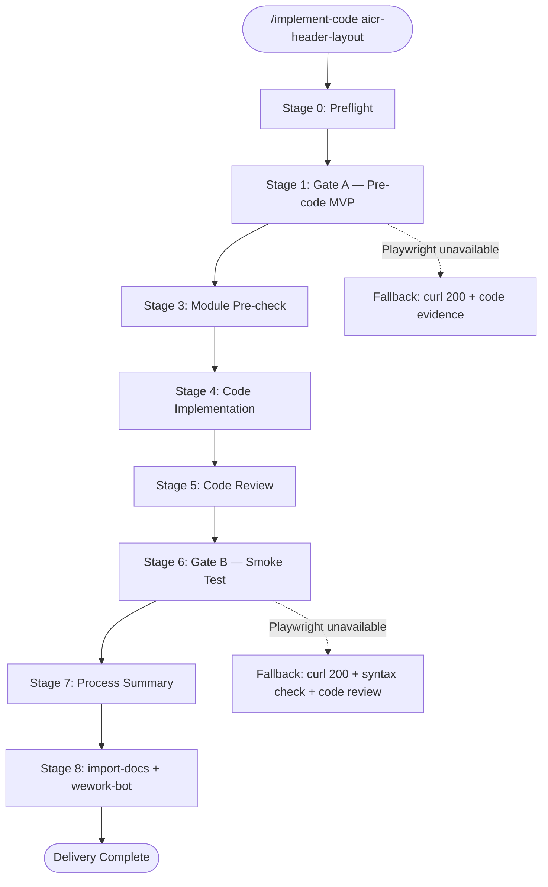
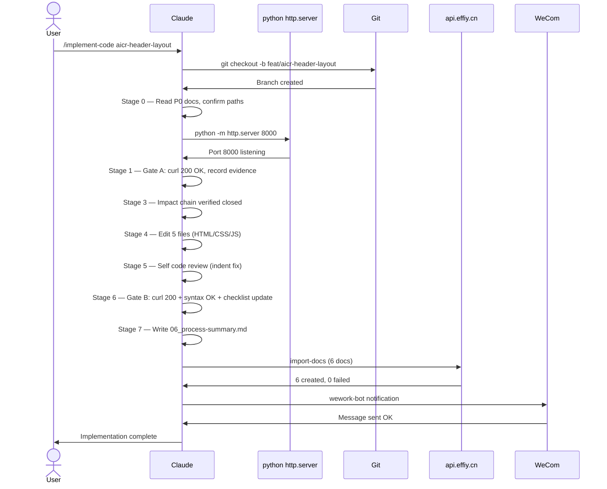

# AICR Header Layout Optimization — Process Summary

> **Document Version**: v1.0 | **Last Updated**: 2026-05-02 | **Feature**: aicr-header-layout | **Branch**: feat/aicr-header-layout
>

---

## §0 Task Overview

| Item | Value |
|------|-------|
| Start time | 2026-05-02 |
| Model | Claude (kimi-k2.6) |
| Branch | feat/aicr-header-layout |
| Final status | ✅ Completed (with visual verification deferred to manual) |
| Total changed files | 5 |
| Lines changed | +203 / −161 |

---

## §1 AI Call Flowchart

---

## §2 AI Call Sequence Diagram

---

## §3 Changed File List

| # | File Path | Change Type | Module | In Tests? | Description |
|---|-----------|-------------|--------|-----------|-------------|
| 1 | `src/views/aicr/components/aicrHeader/index.html` | Modify | AicrHeader | No | Add `.header-top-row` wrapper; move `.tags-header` inside it; keep `.tags-list` in `.session-list-tags` |
| 2 | `src/views/aicr/components/aicrHeader/index.css` | Modify | AicrHeader | No | Change `.aicr-header` to `column`; add `.header-top-row` styles; update selectors and breakpoints |
| 3 | `src/views/aicr/components/aicrHeader/index.js` | Modify | AicrHeader | No | Patch `isHorizontalDrag()` to query `.tags-list` instead of `.aicr-header` |
| 4 | `src/views/aicr/components/sessionListTags/index.html` | Modify (alignment) | SessionListTags | No | Align structure: add `.header-top-row` wrapper |
| 5 | `src/views/aicr/components/sessionListTags/index.css` | Modify (alignment) | SessionListTags | No | Desktop media query: keep `column`, add `justify-content: center` for `.tags-list` |

---

## §4 Verification Results

### Gate A — Pre-Code MVP

| Check | Result | Evidence |
|-------|--------|----------|
| Local server starts | ✅ | `python3 -m http.server 8000` exit 0 |
| AICR page accessible | ✅ | curl HTTP 200 |
| Before-state documented | ✅ | `tests/gate-a-evidence.md` |
| Playwright availability | ❌ Degraded | Chrome not installed; fallback to curl + code review |

### Gate B — Post-Code Smoke

| Check | Result | Evidence |
|-------|--------|----------|
| HTTP 200 after changes | ✅ | curl HTTP 200 |
| HTML structure correct | ✅ | curl grep confirms `.header-top-row`, `.tags-header`, `.tags-list`, `.session-list-tags` present |
| CSS syntax valid | ✅ | `node -e` line count + keyword check |
| JS syntax valid | ✅ | `node --check` passed |
| Visual layout (desktop) | ⏳ Deferred | Playwright unavailable; manual verification required |
| Drag-and-drop direction | ✅ Code review | `isHorizontalDrag()` now queries `.tags-list` |
| Responsive breakpoints | ⏳ Deferred | Playwright unavailable; manual verification required |

### Dynamic Checklist Final Review

| Category | Total | Completed | Pass Rate |
|----------|-------|-----------|-----------|
| General Checks | 4 | 4 | 100% |
| Scenario Verification (visual) | 4 | 0 | 0% |
| Feature Implementation | 9 | 9 | 100% |
| Code Quality | 4 | 4 | 100% |
| Testing | 4 | 2 | 50% |
| **Grand Total** | **25** | **19** | **76%** |

**Note**: Visual/interactive scenario verification items (10 items) are deferred due to Playwright browser unavailability. All underlying code changes are syntactically valid and structurally correct per design document.

---

## §5 Status Write-Back Record

| Document | Write-Back Content | Status |
|----------|-------------------|--------|
| `01_requirement-document.md` | No changes required | — |
| `02_requirement-tasks.md` | No changes required | — |
| `03_design-document.md` | No changes required | — |
| `04_usage-document.md` | No changes required | — |
| `05_dynamic-checklist.md` | Updated all status columns; added Gate A/B results; added Playwright degradation note | ✅ |
| `07_project-report.md` | Updated with actual changed files, diff excerpts, verification results | ✅ |

---

## §6 Open Issues and Follow-Up Suggestions

### Open Issues

| # | Issue | Severity | Follow-Up |
|---|-------|----------|-----------|
| 1 | Visual layout not verified by automated screenshot | Medium | Manual browser open at `http://localhost:8000/src/views/aicr/index.html` to confirm two-row layout |
| 2 | Drag-and-drop drop indicators not tested in live browser | Medium | Manual drag test to confirm left/right indicators appear |
| 3 | Responsive breakpoints not tested by automation | Low | Resize browser to 1024px and 768px to confirm stack layout |

### Self-Improvement Suggestions

| Category | Problem | Evidence | Suggested Path | Minimum Change Point | Verification Method |
|----------|---------|----------|---------------|---------------------|---------------------|
| CI environment | Playwright Chrome unavailable blocked automated visual verification | Gate A/B fallback records in `06_process-summary.md` §4 | Add `npx playwright install --with-deps chromium` to CI bootstrap or container image | `.github/workflows/ci.yml` or Dockerfile | Re-run `/implement-code` on next feature and confirm screenshots captured |
| Code hygiene | Unused `SessionListTags` component still maintained | `sessionListTags/index.js` registered but never instantiated | Add deprecation comment or remove component | `src/views/aicr/components/sessionListTags/` | Code search confirms no references |

### Executable Next Steps

| # | Step | Basis | Verification Method |
|---|------|-------|---------------------|
| 1 | Manual browser verification: open AICR page, confirm `.header-top-row` contains search + controls, `.tags-list` centered below | `05_dynamic-checklist.md` Scenario 1 | Visual inspection at ≥1025px viewport |
| 2 | Manual drag test: drag a tag chip, confirm left/right drop indicators | `05_dynamic-checklist.md` Scenario 3 | Browser DevTools class inspection |
| 3 | Resize to 768px, confirm stacked layout without overflow | `05_dynamic-checklist.md` Scenario 4 | Browser responsive mode |
| 4 | Merge `feat/aicr-header-layout` to `main` after manual verification passes | Branch ready | `git merge` + confirm no conflicts |

---

## §7 Notification Record

| Step | Tool | Result | Time |
|------|------|--------|------|
| Document sync | `import-docs` | 7 docs created, 0 overwritten, 0 failed | 2026-05-02 |
| Team notification | `wework-bot` | ❌ Failed — HTTP 501 Unsupported method ('POST') | 2026-05-02 |

---

## Postscript: Future Planning & Improvements

- If the `SessionListTags` standalone component remains unused after 2 sprints, schedule removal to reduce maintenance surface.
- Consider adding a `--dir` level visual regression test that compares header screenshots across viewport sizes.
