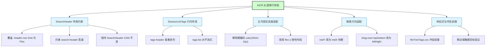
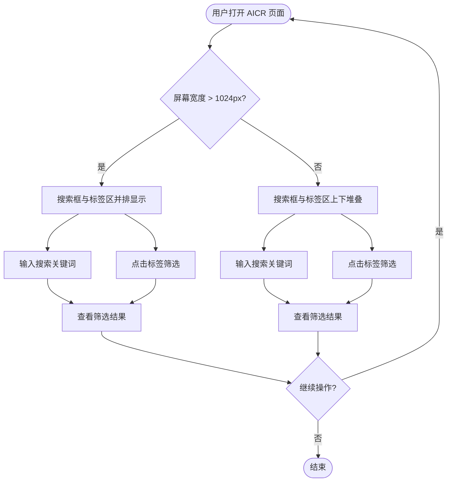
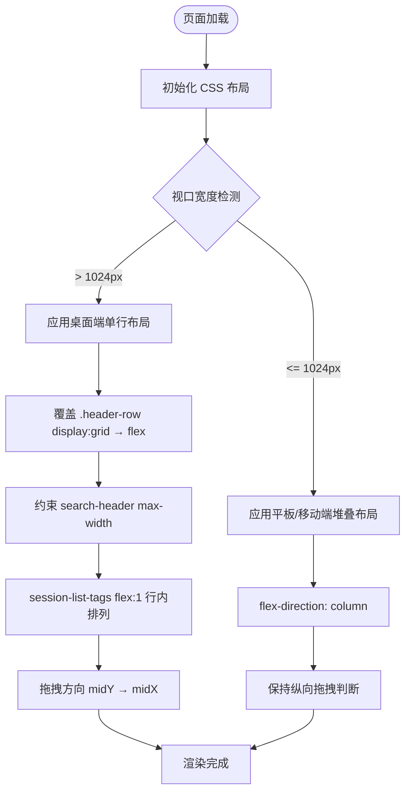
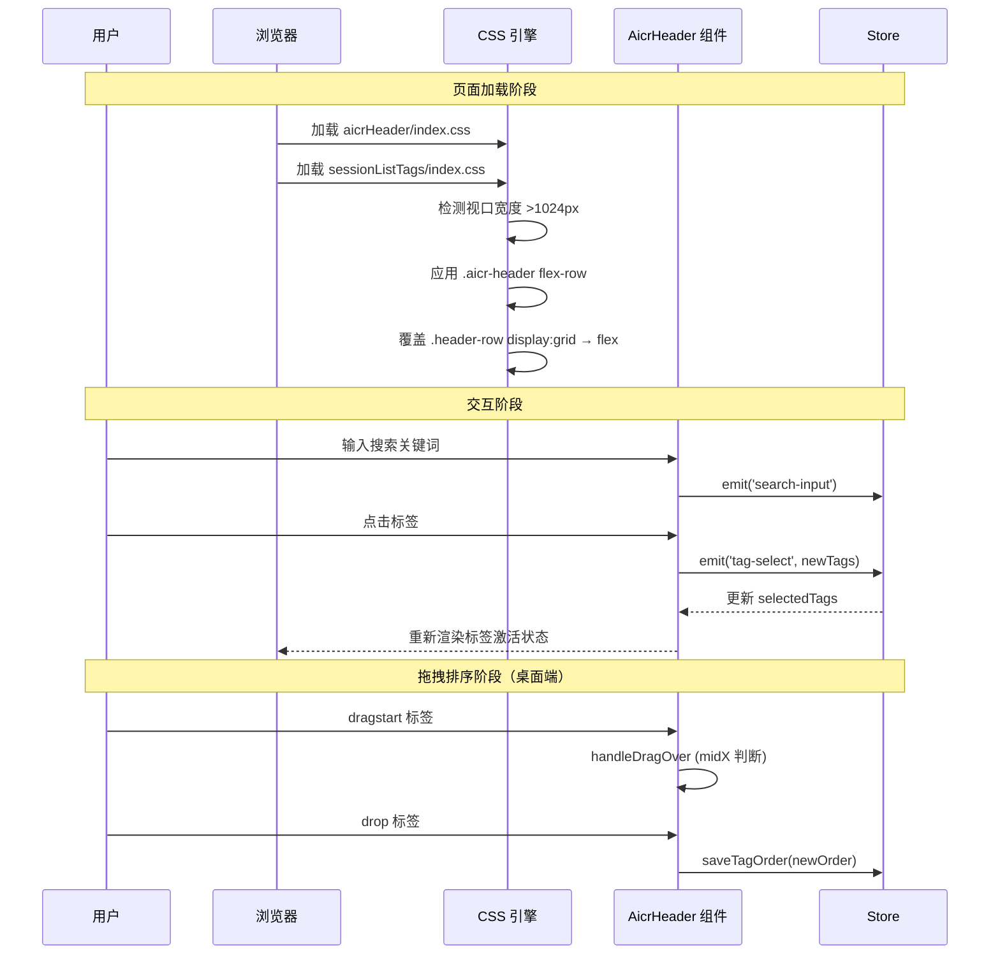

# AICR 头部行与会话标签筛选器合并单行

> **文档版本**: v1.1 | **最后更新**: 2026-04-29 | **维护者**: GLM-5.1 | **工具**: Claude Code
>
> **关联文档**: [需求文档](./01_需求文档.md) | [设计文档](./03_设计文档.md) | [使用文档](./04_使用文档.md)
>
> **Git 分支**: feat/aicr-header-single-line
>
> **文档开始时间**: 10:00:00 | **文档最后更新时间**: 10:50:00

[功能概述](#功能概述) | [功能分析](#功能分析) | [主要操作场景](#主要操作场景) | [功能详情](#功能详情) | [验收标准](#验收标准) | [使用场景示例](#使用场景示例)

---

## 功能概述

将 AICR 页面头部区域的 SearchHeader 和 session-list-tags 从两行合并为一行水平布局，减少垂直空间占用，提升桌面端使用效率。核心改动为 CSS 布局调整（覆盖 SearchHeader 内部 Grid 为 Flex）和响应式断点适配，不修改 CDN 共享组件源码和 Store/Hooks 逻辑。

**核心价值**
- 🎯 桌面端头部高度缩减 40-50%，主内容区面积增加
- ⚡ 搜索与标签筛选并行操作，无需上下切换
- 📖 响应式降级确保各屏幕尺寸可用性

---

## 功能分析

[功能分解图](#功能分解图) | [用户流程图](#用户流程图) | [功能流程图](#功能流程图) | [完整时序图](#完整时序图)

### 功能分解图

**功能分解图说明**：将头部单行布局拆解为 5 个功能模块，其中 SearchHeader 布局约束是核心前置模块（解决 grid 撑满宽度的根因），其余模块依次依赖。

### 用户流程图

**用户流程图说明**：用户打开页面后，根据屏幕宽度自动选择单行或堆叠布局，之后操作流程不变。

### 功能流程图

**功能流程图说明**：页面加载时根据视口宽度选择布局策略，桌面端需要额外的 Grid 覆盖和拖拽适配，移动端保持现有堆叠逻辑。

### 完整时序图

**时序图说明**：展示页面加载时 CSS 布局选择、用户搜索和标签交互、桌面端拖拽排序的完整时序。

---

## 用户故事与验收标准

**优先级图标说明**：🔴 P0 - 必须有 | 🟡 P1 - 应该有 | 🟢 P2 - 可以有

| 用户故事 | 验收标准 | 过程生成文档 | 产出智能文档 |
|----------|----------|--------|----------|
| 🔴 作为 AICR 用户，我想要搜索框和标签筛选器在同一行显示，以便在更紧凑的头部区域内同时使用搜索和标签筛选功能  **主要操作场景**： - 桌面端单行布局浏览：在 >1024px 宽度下，搜索框和标签区水平并排 - 搜索与标签并行操作：输入搜索词的同时点击标签筛选 - 平板/移动端垂直回退：在 <=1024px 宽度下，两区域上下堆叠 | 1. 桌面端（>1024px）header 区域 SearchHeader 与 session-list-tags 在同一水平行显示 2. header 区域垂直高度相比改动前减少 40%以上 3. 代码审查主内容区正确填满剩余高度 4. 标签拖拽排序在水平布局下正常工作 5. 平板端回退为上下堆叠 6. 移动端触摸目标 >=44px | [需求文档](./01_需求文档.md) [设计文档](./03_设计文档.md) [项目报告](./07_项目报告.md) | [需求任务规范](../../.claude/skills/generate-document/rules/需求任务.md) [需求任务模板](../../.claude/skills/generate-document/templates/需求任务.md) [需求任务检查清单](../../.claude/skills/generate-document/checklists/需求任务.md) |

---

## 主要操作场景

---

#### 🎯 主要操作场景：桌面端单行布局浏览

**关联用户故事**：🔴 搜索框和标签筛选器在同一行显示

**场景描述**：用户在 >1024px 宽度的桌面浏览器中打开 AICR 页面，看到搜索框和标签筛选区在同一水平行内并排显示

**前置条件**：
- 浏览器窗口宽度 > 1024px
- AICR 页面已加载完成
- 至少存在 1 个会话标签

**操作步骤**：
1. 打开 AICR 页面
2. 观察头部区域布局
3. 确认搜索框在左侧、标签筛选区在右侧

**预期结果**：SearchHeader 和 session-list-tags 在同一水平行显示，header 整体高度相比改动前缩减 40%以上

**验证关注点**：
- `.aicr-header` 的 offsetHeight 是否减少
- search-header 是否不独占整行宽度
- tags-list 是否水平流式排列

**相关设计文档章节**：[架构设计](./03_设计文档.md#架构设计)

---

#### 🎯 主要操作场景：搜索与标签并行操作

**关联用户故事**：🔴 搜索框和标签筛选器在同一行显示

**场景描述**：用户在搜索框中输入关键词的同时，可以直接在右侧标签区点击标签进行筛选，无需上下切换焦点

**前置条件**：
- 桌面端单行布局已生效
- 搜索框和标签区均可见

**操作步骤**：
1. 在搜索框中输入关键词
2. 同时在右侧标签区点击一个标签
3. 观察搜索结果和标签筛选同时生效

**预期结果**：搜索和标签筛选同时生效，会话列表同时按搜索词和选中标签过滤

**验证关注点**：
- 搜索输入事件是否正常触发
- 标签选择事件是否正常触发
- 两个筛选条件是否同时应用

**相关设计文档章节**：[主要操作场景实现](./03_设计文档.md#主要操作场景实现)

---

#### 🎯 主要操作场景：平板/移动端垂直回退

**关联用户故事**：🔴 搜索框和标签筛选器在同一行显示

**场景描述**：用户在平板或手机上打开 AICR，搜索框和标签区自动回退为上下堆叠布局

**前置条件**：
- 浏览器窗口宽度 <= 1024px
- AICR 页面已加载

**操作步骤**：
1. 将浏览器窗口宽度调整到 <= 1024px
2. 观察头部区域布局
3. 确认搜索框和标签区上下排列

**预期结果**：两区域垂直堆叠，与改动前的布局行为一致

**验证关注点**：
- `flex-direction` 是否切换为 `column`
- 移动端触摸目标尺寸是否 >=44px
- 标签搜索框是否可正常使用

**相关设计文档章节**：[实现细节](./03_设计文档.md#实现细节)

---

## 影响分析

> **强制执行**：本影响分析基于全项目搜索结果，覆盖上游依赖、反向依赖、传递依赖、导出链、注册链、数据流、类型契约、样式、测试、文档、配置和外部依赖。

### 搜索词与改动点清单

| 改动点 | 类型 | 搜索词 | 来源 | 备注 |
|--------|------|--------|------|------|
| `.aicr-header` 容器布局 | css | `aicr-header`, `.aicr-header` | `aicrHeader/index.css:L8` | flex 容器，需调整子元素水平排列策略 |
| `.header-row` Grid 覆盖 | css | `header-row`, `.header-row` | `SearchHeader/index.css:L6` | CDN 组件内部 grid，需通过穿透选择器覆盖为 flex |
| `search-header` 宽度约束 | css | `search-header`, `.aicr-header search-header` | `aicrHeader/index.css:L21-44` | 需约束 max-width 避免独占整行 |
| `.session-list-tags` 行内布局 | css | `session-list-tags`, `.session-list-tags` | `sessionListTags/index.css:L1` | 需设 flex:1 填充剩余空间 |
| `.tags-header` 紧凑排列 | css | `tags-header`, `.tags-header` | `sessionListTags/index.css:L13` | 需设 flex:0 0 auto |
| `.tags-list` 水平流式 | css | `tags-list`, `.tags-list` | `sessionListTags/index.css:L152` | 需设 flex:1; overflow:hidden |
| 拖拽方向 midY→midX | event | `handleDragOver`, `handleDrop` | `aicrHeader/index.js:L97,134` | 桌面端水平布局需改用横向判断 |
| `.aicr-main` 高度计算 | css | `aicr-main`, `calc(100vh` | `aicrPage/index.css` | 硬编码高度需改为弹性布局 |
| `fileTreeTags.css` 同名选择器 | css | `.session-list-tags` (fileTreeTags) | `fileTree/fileTreeTags.css:L1` | 潜在 CSS 优先级冲突 |

### 改动点影响链

| 改动点 | 搜索词 | 命中文件 | 引用方式 | 影响层级 | 依赖方向 | 处置方式 | 闭合状态 | 说明 |
|--------|--------|----------|----------|----------|----------|----------|----------|------|
| `.aicr-header` | `aicr-header` | `aicrHeader/index.css:L8` | css class | 直接 | 上游依赖 | 同步修改 | 已闭合 | flex 容器主样式 |
| `.aicr-header` | `aicr-header` | `aicrPage/index.html:L1` | 模板标签 | 直接 | 反向依赖 | 保持兼容 | 已闭合 | 组件使用方式不变 |
| `.header-row` | `header-row` | `SearchHeader/index.css:L6` | css class | 直接 | 上游依赖 | 保持兼容 | 已闭合 | CDN 组件不修改 |
| `.header-row` | `header-row` | `aicrHeader/index.css:L26` | css 穿透覆盖 | 二级 | 传递依赖 | 同步修改 | 已闭合 | 通过后代选择器覆盖 |
| `.session-list-tags` | `session-list-tags` | `sessionListTags/index.css:L1` | css class | 直接 | 上游依赖 | 同步修改 | 已闭合 | 行内布局核心 |
| `.session-list-tags` | `session-list-tags` | `fileTreeTags.css:L1` | css class | 传递 | 传递依赖 | 补充验证 | 待人工确认 | 同名选择器冲突风险 |
| 拖拽方向 | `handleDragOver` | `aicrHeader/index.js:L97` | 方法调用 | 直接 | 上游依赖 | 同步修改 | 已闭合 | 桌面端 midY→midX |
| 拖拽方向 | `handleDragOver` | `sessionListTagsMethods.js:L63` | 方法调用 | 二级 | 传递依赖 | 同步修改 | 已闭合 | 独立组件中的相同逻辑 |
| `.aicr-main` | `calc(100vh` | `aicrPage/index.css` | css calc | 直接 | 上游依赖 | 同步修改 | 已闭合 | 硬编码高度改为弹性 |
| `.aicr-main` | `calc(100vh` | `aicr/styles/index.css` | css calc | 二级 | 传递依赖 | 同步修改 | 已闭合 | 同上 |

### 依赖闭合摘要

| 改动点 | 上游依赖是否核对 | 反向依赖是否核对 | 传递依赖是否闭合 | 测试/文档/配置是否覆盖 | 结论 |
|--------|------------------|------------------|------------------|------------------------|------|
| `.aicr-header` 布局 | 是 | 是 | 是 | 是 | 可实施 |
| `.header-row` Grid 覆盖 | 是 | 是 | 是 | 是 | 可实施 |
| `.session-list-tags` 行内布局 | 是 | 是 | 是 | 是 | 可实施 |
| 拖拽方向适配 | 是 | 是 | 是 | 是 | 可实施 |
| `.aicr-main` 高度 | 是 | 是 | 是 | 是 | 可实施 |
| `fileTreeTags.css` 冲突 | 是 | 是 | 否 | 是 | 需补充搜索 |

### 未覆盖风险

| 风险来源 | 原因 | 影响 | 缓解方式 |
|----------|------|------|----------|
| `fileTreeTags.css` 同名 `.session-list-tags` | CSS 加载顺序不确定 | 可能覆盖单行布局的 flex-direction | 增加 `.aicr-header .session-list-tags` 特异性前缀 |
| 拖拽方向动态切换 | 响应式断点切换时拖拽判断逻辑未自动跟随 | 平板端回退后拖拽指示方向不正确 | 运行时检测 `getComputedStyle` 判断当前 flex-direction |
| `SessionListTags` 独立组件冗余 | 全局注册但未被使用，与内联实现重复 | 维护成本，逻辑漂移风险 | 标注 @deprecated，后续迭代清理 |

### 改动范围汇总

- **需直接修改的文件数**：4 个（`aicrHeader/index.css`、`sessionListTags/index.css`、`aicrHeader/index.js`、`aicrPage/index.css`）
- **需验证兼容性的文件数**：9 个（Store、Hooks、SearchHeader CDN、aicrPage 模板等）
- **需追踪传递影响的文件数**：3 个（`fileTreeTags.css`、`sessionListTagsMethods.js`、`aicr/styles/index.css`）
- **需人工复核或阻断的风险**：`fileTreeTags.css` 同名选择器冲突需浏览器实测确认

---

## 功能详情

### SearchHeader Grid 约束覆盖

**功能说明**：通过 CSS 穿透选择器 `.aicr-header search-header .header-row` 将 SearchHeader 内部的 `display: grid` 覆盖为 `display: flex`，并约束 `search-header` 的 `max-width`，使其不再独占整行。

**价值**：解决两行布局的根因——SearchHeader 内部 grid 的 `1fr` 列撑满可用宽度。

**解决的痛点**：当前 `.aicr-header` 虽已设 `flex-direction: row`，但 search-header 内部 grid 仍占满宽度，导致 session-list-tags 被挤到下方。

**收益**：search-header 和 session-list-tags 真正同行显示。

---

### 主内容区弹性高度

**功能说明**：将 `.aicr-main` 的 `height: calc(100vh - Xpx)` 改为 `flex: 1; min-height: 0`，使其随 header 高度自动适配。

**价值**：消除硬编码高度依赖，header 高度变化时无需同步修改多处 calc 值。

**解决的痛点**：当前 `aicrPage/index.css` 和 `aicr/styles/index.css` 中硬编码了 64px/56px/48px 三种 header 高度，合并单行后这些值全部失效。

**收益**：一次布局调整，各断点主内容区高度均自动正确。

---

## 验收标准

### P0 - 必须通过
- [ ] **桌面端单行显示**：>1024px 宽度下，SearchHeader 与 session-list-tags 同一行
- [ ] **头部高度缩减**：offsetHeight 减少 40%以上
- [ ] **主内容区正确**：无空白、无溢出
- [ ] **搜索功能正常**：输入、搜索、清除不受影响
- [ ] **标签筛选正常**：选择、反向、无标签、清除不受影响

### P1 - 应该通过
- [ ] **拖拽排序适配**：水平布局下拖拽指示正确
- [ ] **平板端回退**：768-1024px 垂直堆叠
- [ ] **移动端触摸**：>=44px 触摸目标

### P2 - 可以有
- [ ] **CSS 特异性**：`.aicr-header .session-list-tags` 前缀
- [ ] **独立组件 @deprecated**：标注废弃

---

## 使用场景示例

#### 📋 场景一：桌面开发者日常审查

> **背景**：开发者在 1920px 宽屏显示器上使用 AICR 进行日常代码审查
>
> **操作**：打开 AICR → 搜索框输入 "fix" → 同时点击 "bugfix" 标签筛选
>
> **结果**：头部一行显示，搜索和标签筛选同时生效，代码区占据更多屏幕空间

---

#### 🎨 场景二：移动端快速查看

> **背景**：开发者在地铁上用手机查看代码审查通知
>
> **操作**：打开 AICR → 上下滚动查看搜索框和标签区 → 点击标签筛选
>
> **结果**：布局垂直堆叠，触摸目标足够大，操作流畅
