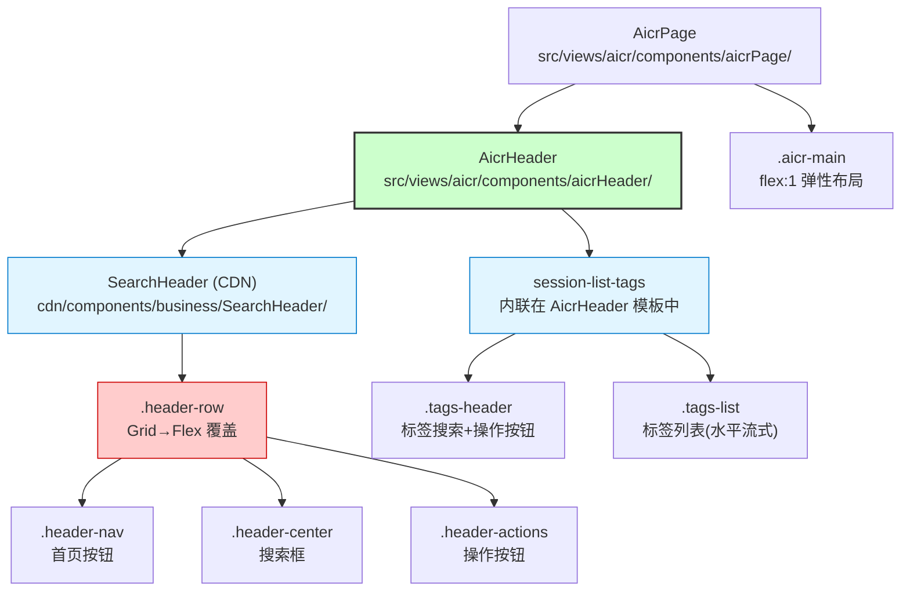
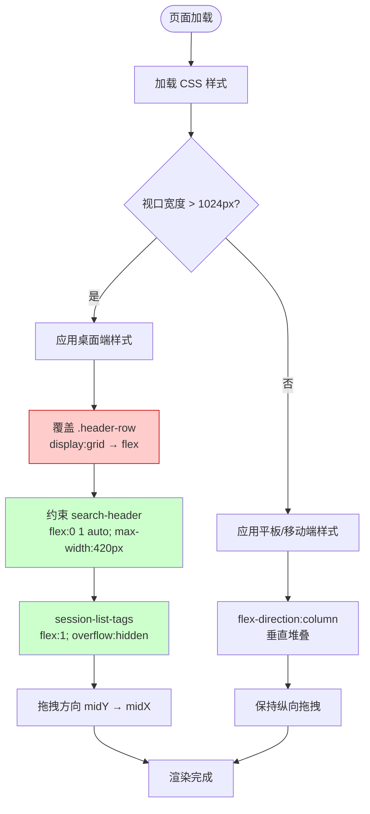
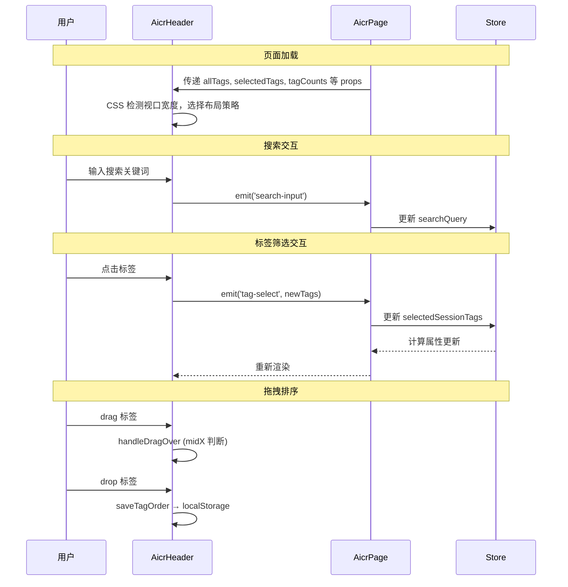

# AICR 头部单行布局设计

> **文档版本**: v1.1 | **最后更新**: 2026-04-29 | **维护者**: GLM-5.1 | **工具**: Claude Code
>
> **关联文档**: [需求任务](./02_需求任务.md) | [使用文档](./04_使用文档.md) | [CLAUDE.md](../../CLAUDE.md)
>
> **Git 分支**: feat/aicr-header-single-line
>
> **文档开始时间**: 10:00:00 | **文档最后更新时间**: 11:00:00

[设计概述](#设计概述) | [架构设计](#架构设计) | [修复内容](#修复内容) | [实现细节](#实现细节) | [数据结构](#数据结构)

---

## 设计概述

将 AICR 头部区域的 SearchHeader 和 session-list-tags 从两行合并为一行水平布局。核心策略为纯 CSS 布局调整，不修改 SearchHeader CDN 组件源码和 Store/Hooks 逻辑。通过 CSS 穿透选择器覆盖 SearchHeader 内部的 Grid 布局为 Flex，约束其宽度，让 session-list-tags 填充剩余水平空间。响应式断点下回退为垂直堆叠。拖拽排序方向从纵向适配为横向。

**设计原则**
- 🎯 **最小侵入**：不修改 CDN 共享组件源码，仅通过 CSS 后代选择器覆盖
- ⚡ **弹性优先**：用 flex 弹性布局替代硬编码 calc 计算
- 🔧 **响应式降级**：桌面单行、平板/移动端垂直堆叠

---

## 架构设计

### 整体架构



**架构说明**：AicrHeader 作为 flex 容器，SearchHeader 和 session-list-tags 作为其水平子项。SearchHeader 内部的 `.header-row` 通过 CSS 穿透覆盖从 Grid 变为 Flex。`.aicr-main` 改用 `flex:1` 弹性布局替代硬编码高度。红色标注的 HeaderRow 是核心改动点——Grid 覆盖为 Flex。

### 模块划分

| 模块名称 | 职责 | 文件位置 |
|----------|------|----------|
| AicrHeader 容器 | flex 容器，管理 search-header 和 session-list-tags 的水平排列 | `src/views/aicr/components/aicrHeader/` |
| SearchHeader 布局覆盖 | 通过 CSS 后代选择器覆盖 CDN 组件内部 Grid 为 Flex | `src/views/aicr/components/aicrHeader/index.css` |
| SessionListTags 行内布局 | 标签搜索、操作按钮、标签列表的水平流式排列 | `src/views/aicr/components/sessionListTags/index.css` |
| 主内容区弹性高度 | 用 flex:1 替代 calc(100vh-Xpx) 硬编码 | `src/views/aicr/components/aicrPage/index.css` |
| 拖拽方向适配 | 桌面端水平布局下 midY→midX 判断 | `src/views/aicr/components/aicrHeader/index.js` |

### 核心流程图



**流程说明**：页面加载后根据视口宽度选择布局策略。桌面端核心步骤是覆盖 SearchHeader 的 Grid 布局为 Flex 并约束宽度，然后让 session-list-tags 填充剩余空间。移动端保持现有堆叠逻辑。

---

## 修复内容

### 问题分析

**问题**：AICR 页面头部区域占据两行垂直空间，SearchHeader 在上方独占一行，session-list-tags 在下方另起一行，导致主内容区可用面积减少。

**根因**：SearchHeader 内部 `.header-row` 使用 `display: grid; grid-template-columns: auto 1fr auto`（来源：`cdn/components/business/SearchHeader/index.css:L6-19`）。其中 `1fr` 列会尽可能扩展，使得 search-header 元素占据整个父容器的宽度。即使 `.aicr-header` 已设 `flex-direction: row`，search-header 仍因内部 grid 的 `1fr` 而独占整行，将 session-list-tags 挤到下方。

**影响范围**：所有使用 AICR 页面的用户，尤其是桌面端用户。

### 修复方案

**整体思路**：纯 CSS 布局调整，通过 CSS 穿透选择器覆盖 SearchHeader 内部布局，不修改 CDN 组件源码。

**修改文件清单**：

| 文件 | 修改内容 | 目的 |
|------|---------|------|
| `src/views/aicr/components/aicrHeader/index.css` | 覆盖 `.header-row` 为 `display:flex`；约束 search-header 宽度 | 让 search-header 不独占整行 |
| `src/views/aicr/components/sessionListTags/index.css` | 优化 `.session-list-tags` 桌面端行内布局 | 标签区水平流式排列 |
| `src/views/aicr/components/aicrHeader/index.js` | 拖拽方向 midY→midX；CSS 类名 top/bottom→left/right | 水平布局下拖拽排序正确 |
| `src/views/aicr/components/aicrPage/index.css` | `.aicr-main` 改用 `flex:1; min-height:0` | 主内容区高度自适应 |

### 修复前后对比

| 内容项 | 修复前 | 修复后 | 说明 |
|--------|--------|--------|------|
| `.header-row` 布局 | `display: grid; grid-template-columns: auto 1fr auto` | `display: flex; width: auto`（通过穿透覆盖） | Grid 的 1fr 撑满宽度是两行布局的根因 |
| `search-header` 宽度 | 独占整行（因内部 grid） | `flex: 0 1 auto; max-width: 420px` | 约束搜索区最大宽度 |
| `session-list-tags` 宽度 | 独占整行（被挤到下方） | `flex: 1; overflow: hidden` | 填充 search-header 旁的剩余空间 |
| `.aicr-main` 高度 | `height: calc(100vh - 64px/56px/48px)` | `flex: 1; min-height: 0` | 弹性布局替代硬编码 |
| 拖拽方向 | `midY`（纵向中点） | `midX`（横向中点，桌面端） | 适配水平排列的标签 |

---

## 影响分析

> **强制执行**：本影响分析基于全项目搜索结果，覆盖上游依赖、反向依赖、传递依赖、导出链、注册链、数据流、类型契约、样式、测试、文档、配置和外部依赖。

### 搜索词与改动点清单

| 改动点 | 类型 | 搜索词 | 来源 | 备注 |
|--------|------|--------|------|------|
| `.aicr-header` 容器布局 | css | `aicr-header` | `aicrHeader/index.css:L8` | 已有 flex-row，需确认子项宽度策略 |
| `.header-row` Grid→Flex | css | `header-row` | `SearchHeader/index.css:L6` | CDN 组件源码不修改，通过穿透选择器覆盖 |
| `search-header` 宽度 | css | `search-header` | `aicrHeader/index.css:L21` | 需新增 max-width 约束 |
| `.session-list-tags` 行内 | css | `session-list-tags` | `sessionListTags/index.css:L1` | 桌面端已有 flex-row，需微调 |
| `.aicr-main` 高度 | css | `calc(100vh` | `aicrPage/index.css` | 硬编码改为弹性 |
| 拖拽 midY→midX | event | `handleDragOver` | `aicrHeader/index.js:L97` | 桌面端水平布局适配 |
| `fileTreeTags.css` 冲突 | css | `.session-list-tags` | `fileTree/fileTreeTags.css:L1` | 同名选择器优先级 |

### 改动点影响链

| 改动点 | 搜索词 | 命中文件 | 引用方式 | 影响层级 | 依赖方向 | 处置方式 | 闭合状态 | 说明 |
|--------|--------|----------|----------|----------|----------|----------|----------|------|
| `.aicr-header` | `aicr-header` | `aicrHeader/index.css:L8` | css | 直接 | 上游 | 同步修改 | 已闭合 | flex 容器主样式 |
| `.aicr-header` | `aicr-header` | `aicrPage/index.html:L1` | 模板 | 直接 | 反向 | 保持兼容 | 已闭合 | 使用方式不变 |
| `.header-row` | `header-row` | `aicrHeader/index.css:L26` | css 穿透 | 直接 | 传递 | 同步修改 | 已闭合 | Grid→Flex 覆盖 |
| `.header-row` | `header-row` | `SearchHeader/index.css:L6` | css 原始 | 直接 | 上游 | 保持兼容 | 已闭合 | CDN 不修改 |
| `.session-list-tags` | `session-list-tags` | `sessionListTags/index.css:L1` | css | 直接 | 上游 | 同步修改 | 已闭合 | 行内布局 |
| `.session-list-tags` | `session-list-tags` | `fileTreeTags.css:L1` | css | 传递 | 传递 | 补充验证 | 待确认 | 同名冲突 |
| 拖拽方向 | `handleDragOver` | `aicrHeader/index.js:L97` | 方法 | 直接 | 上游 | 同步修改 | 已闭合 | midY→midX |
| `.aicr-main` | `calc(100vh` | `aicrPage/index.css` | css | 直接 | 上游 | 同步修改 | 已闭合 | 弹性布局 |

### 依赖闭合摘要

| 改动点 | 上游依赖 | 反向依赖 | 传递依赖 | 测试/文档/配置 | 结论 |
|--------|---------|---------|---------|---------------|------|
| `.aicr-header` 布局 | 是 | 是 | 是 | 是 | 可实施 |
| `.header-row` Grid 覆盖 | 是 | 是 | 是 | 是 | 可实施 |
| `.session-list-tags` 行内 | 是 | 是 | 是 | 是 | 可实施 |
| 拖拽方向适配 | 是 | 是 | 是 | 是 | 可实施 |
| `.aicr-main` 高度 | 是 | 是 | 是 | 是 | 可实施 |
| `fileTreeTags.css` 冲突 | 是 | 是 | 否 | 是 | 需补充搜索 |

### 未覆盖风险

| 风险来源 | 原因 | 影响 | 缓解方式 |
|----------|------|------|----------|
| `fileTreeTags.css` 同名 `.session-list-tags` | CSS 加载顺序不确定 | 可能覆盖 flex-direction | 增加 `.aicr-header .session-list-tags` 特异性前缀 |
| 拖拽方向响应式切换 | 断点切换时拖拽逻辑未自动跟随 | 回退后拖拽指示不正确 | 运行时 `getComputedStyle` 检测 flex-direction |
| `SessionListTags` 独立组件冗余 | 全局注册未被使用 | 维护成本 | 标注 @deprecated |

### 改动范围汇总

- **需直接修改的文件数**：4 个
- **需验证兼容性的文件数**：9 个
- **需追踪传递影响的文件数**：3 个
- **需人工复核或阻断的风险**：`fileTreeTags.css` 同名选择器冲突需浏览器实测

---

## 实现细节

### 技术实现要点

#### 1. 覆盖 SearchHeader 内部 Grid 为 Flex

**做什么**：在 `.aicr-header` 作用域下，将 `.header-row` 的 `display: grid` 覆盖为 `display: flex`

**怎么做**：通过 CSS 后代选择器 `.aicr-header search-header .header-row` 添加覆盖规则

**为什么**：SearchHeader 的 `.header-row` 使用 `grid-template-columns: auto 1fr auto`，其中 `1fr` 列撑满可用宽度，是导致 search-header 独占整行的根因。覆盖为 Flex 后，可以精确控制各子项宽度。

```css
/* aicrHeader/index.css 中新增/修改 */
.aicr-header search-header .header-row {
    display: flex;          /* 覆盖原有的 display: grid */
    width: auto;            /* 允许宽度由 flex 策略控制 */
    grid-template-columns: unset; /* 清除 grid 列定义 */
}
```

#### 2. 约束 search-header 宽度

**做什么**：限制 search-header 在 `.aicr-header` 行内的最大宽度

**怎么做**：设置 `flex: 0 1 auto; max-width: 420px`

**为什么**：不约束宽度的话，search-header 仍可能占据大部分行宽，导致 session-list-tags 空间不足。

```css
.aicr-header search-header {
    flex: 0 1 auto;
    max-width: 420px;       /* 桌面端搜索框最大宽度 */
    min-width: 280px;       /* 最小宽度保证可用性 */
}
```

#### 3. session-list-tags 填充剩余空间

**做什么**：让 session-list-tags 填充 search-header 旁的剩余水平空间

**怎么做**：设置 `flex: 1; overflow: hidden`

**为什么**：标签区需要尽可能多的水平空间来显示标签列表，超出部分隐藏。

```css
/* 桌面端 @media (min-width: 1025px) */
.aicr-header .session-list-tags {
    flex: 1;
    min-width: 0;           /* 允许 flex 缩小 */
    overflow: hidden;        /* 标签超出隐藏 */
}
```

#### 4. 主内容区弹性高度

**做什么**：将 `.aicr-main` 的硬编码高度改为弹性布局

**怎么做**：父容器 `#app` 已有 `display: flex; flex-direction: column; min-height: 100vh`，只需将 `.aicr-main` 设为 `flex: 1; min-height: 0`

**为什么**：消除对 header 高度的硬编码依赖，header 高度变化后主内容区自动适配。

```css
.aicr-main {
    flex: 1;
    min-height: 0;          /* 允许 flex 子项收缩 */
    /* 移除 height: calc(100vh - 64px) 等硬编码 */
}
```

#### 5. 拖拽方向适配

**做什么**：桌面端水平布局下，拖拽排序的方向判断从纵向改为横向

**怎么做**：在 `handleDragOver` 和 `handleDrop` 中将 `e.clientY < midY` 改为 `e.clientX < midX`，CSS 类名从 `drag-over-top/bottom` 改为 `drag-over-left/right`

**为什么**：水平布局下标签左右排列，纵向中点判断不符合用户直觉。

```javascript
// aicrHeader/index.js 中 handleDragOver 修改
handleDragOver(e) {
    e.preventDefault();
    e.stopPropagation();
    e.dataTransfer.dropEffect = 'move';

    if (e.currentTarget.classList.contains('dragging')) return;

    const rect = e.currentTarget.getBoundingClientRect();
    const midX = rect.left + rect.width / 2;  // 改为横向中点

    // 清除所有非 dragging 项的拖拽样式
    document.querySelectorAll('.tag-item').forEach(item => {
        if (!item.classList.contains('dragging')) {
            item.classList.remove('drag-over-left', 'drag-over-right', 'drag-hover');
        }
    });

    if (e.clientX < midX) {
        e.currentTarget.classList.add('drag-over-left');
        e.currentTarget.classList.remove('drag-over-right');
    } else {
        e.currentTarget.classList.add('drag-over-right');
        e.currentTarget.classList.remove('drag-over-left');
    }
    e.currentTarget.classList.add('drag-hover');
}
```

### 关键代码说明

核心改动集中在 2 个 CSS 文件和 1 个 JS 文件：

- `aicrHeader/index.css`：添加 Grid→Flex 穿透覆盖和 search-header 宽度约束
- `sessionListTags/index.css`：微调 `.session-list-tags` 桌面端行内布局策略
- `aicrHeader/index.js`：拖拽方向从 midY 改为 midX

### 依赖关系

无新增依赖。所有改动基于现有 CSS 和 JS 能力。

### 测试考虑

- 桌面端（>1024px）：确认两元素同行、高度缩减、搜索和标签功能正常
- 平板端（768-1024px）：确认回退为垂直堆叠
- 移动端（<=768px）：确认触摸目标尺寸、功能正常
- 拖拽排序：桌面端水平拖拽指示正确、排序结果正确
- 主内容区：各断点下无空白或溢出

---

## 主要操作场景实现

### 场景实现：桌面端单行布局浏览

**关联需求任务场景**：[桌面端单行布局浏览](./02_需求任务.md#主要操作场景)

**实现概述**：通过 CSS 穿透选择器覆盖 SearchHeader 内部 Grid 为 Flex，约束 search-header 宽度，让 session-list-tags 填充剩余空间，实现两元素在同一行水平排列。

**涉及模块**：
- AicrHeader 容器（`aicrHeader/index.css`）：flex 容器管理水平排列
- SearchHeader 布局覆盖（`aicrHeader/index.css`）：Grid→Flex 穿透覆盖
- SessionListTags 行内布局（`sessionListTags/index.css`）：水平流式排列

**关键代码路径**：
- `src/views/aicr/components/aicrHeader/index.css`：`.aicr-header search-header .header-row` 覆盖规则
- `src/views/aicr/components/sessionListTags/index.css`：`@media (min-width: 1025px)` 行内布局规则

**验证要点**：
- `.aicr-header` offsetHeight 减少 40%以上
- search-header 和 session-list-tags 在同一水平行
- 标签列表水平流式排列，超出部分隐藏

---

### 场景实现：搜索与标签并行操作

**关联需求任务场景**：[搜索与标签并行操作](./02_需求任务.md#主要操作场景)

**实现概述**：搜索框和标签区在同一行并排显示，用户可同时操作两者。Store 和 Hooks 逻辑不变，事件传递链完整。

**涉及模块**：
- AicrHeader 组件（`aicrHeader/index.js`）：emit 事件传递
- Store 状态（`hooks/state/storeState.js`）：tagFilter* 状态
- tagFilterMethods（`hooks/methods/tagFilterMethods.js`）：筛选方法

**关键代码路径**：
- `src/views/aicr/components/aicrHeader/index.js:L37-60`：emit 事件
- `src/views/aicr/components/aicrPage/index.html:L11-16`：事件监听

**验证要点**：
- 搜索输入和标签点击事件同时触发
- 两个筛选条件同时生效
- 会话列表正确过滤

---

### 场景实现：平板/移动端垂直回退

**关联需求任务场景**：[平板/移动端垂直回退](./02_需求任务.md#主要操作场景)

**实现概述**：通过 `@media (max-width: 1024px)` 媒体查询将 `.aicr-header` 切换回 `flex-direction: column`，两区域上下堆叠。

**涉及模块**：
- AicrHeader 容器（`aicrHeader/index.css`）：响应式断点切换
- SessionListTags（`sessionListTags/index.css`）：响应式适配

**关键代码路径**：
- `src/views/aicr/components/aicrHeader/index.css:L46-54`：平板端 column 切换
- `src/views/aicr/components/sessionListTags/index.css:L269-308`：移动端适配

**验证要点**：
- <=1024px 宽度下两区域上下堆叠
- <=768px 宽度下触摸目标 >=44px
- 功能行为与改动前一致

---

## 数据结构设计

### 数据流程图



**数据流程说明**：Store 和事件传递链与改动前完全一致，仅 CSS 布局和拖拽方向有变化。所有 props/emits 接口保持兼容。
