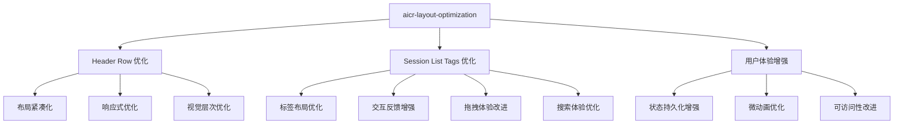
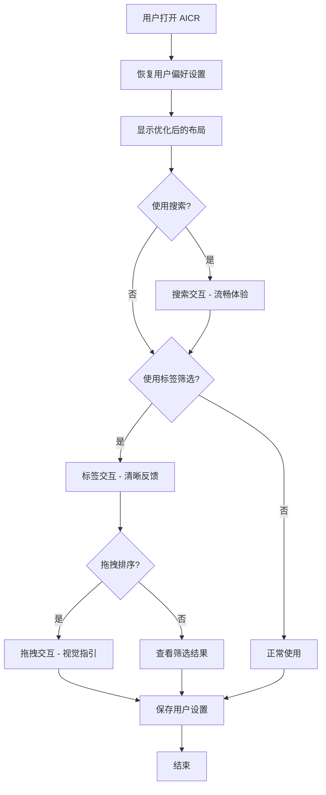
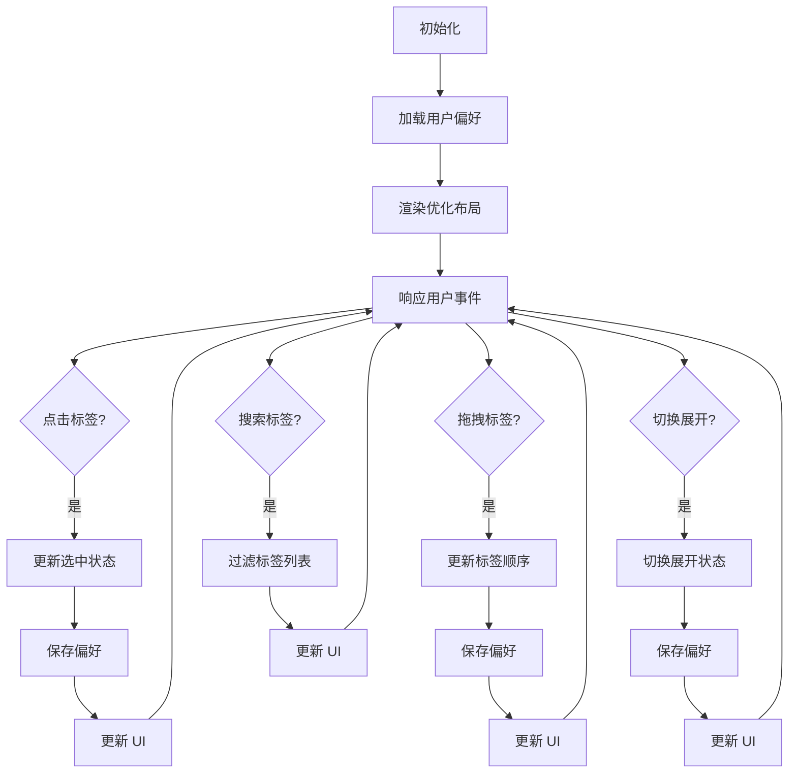
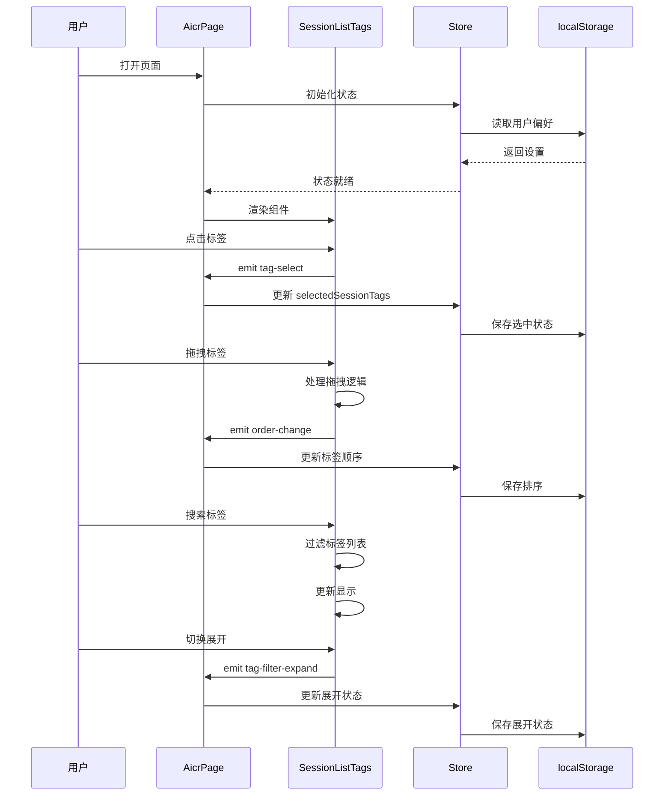

# AICR 布局优化

> **文档版本**: v1.0 | **最后更新**: 2026-04-29 | **维护者**: doubao-seed-2-0 | **工具**: Claude Code
>
> **关联文档**: [需求文档](./01_需求文档.md) | [设计文档](./03_设计文档.md) | [使用文档](./04_使用文档.md)
>
[功能概述](#功能概述) | [功能分析](#功能分析) | [功能详情](#功能详情) | [验收标准](#验收标准) | [使用场景示例](#使用场景示例)

---

## 功能概述

本任务将优化 AICR 页面 header-row 和 session-list-tags 的布局和交互，提升用户体验和留存率。优化是渐进式的，保持向后兼容性，确保核心功能不受影响。

🎯 优化布局结构，提高屏幕空间利用率
⚡ 增强交互反馈，提供更流畅的操作体验
📖 改进响应式适配，提升全设备体验

## 功能分析

### 功能分解图

### 用户流程图

### 功能流程图

### 完整时序图

## 用户故事表格

| 用户故事 | 验收标准 | 过程生成文档 | 产出智能文档 |
|----------|---------|------------|------------|
| 🔴 作为 AICR 用户，我希望 header-row 和 session-list-tags 的布局更合理紧凑，以便在有限的屏幕空间中看到更多代码内容  **主要操作场景**： - 在桌面端查看时，header 占用更少空间 - 在小屏幕上，布局自动适配不重叠 - 搜索框和标签区域协调排列 | 1. Header 区域垂直高度减少 15-20% 2. 标签区域在紧凑模式下占用空间减少 3. 响应式布局在各断点下正常显示 | [aicr-layout-optimization](./02_需求任务.md) [aicr-layout-optimization](./03_设计文档.md) [项目报告](./07_项目报告.md) | [生成文档 Skill](../../.claude/skills/generate-document/SKILL.md) |
| 🟡 作为 AICR 用户，我希望标签筛选器的交互体验更好，以便更高效地筛选和管理会话标签  **主要操作场景**： - 点击标签时有更明显的视觉反馈 - 拖拽排序时有清晰的视觉提示 - 搜索标签时输入体验流畅 | 1. 标签按钮的 hover/active 状态清晰可辨识 2. 拖拽过程有明确的放置位置指示 3. 搜索框聚焦时有明显的视觉反馈 | [aicr-layout-optimization](./02_需求任务.md) [aicr-layout-optimization](./03_设计文档.md) [项目报告](./07_项目报告.md) | [生成文档 Skill](../../.claude/skills/generate-document/SKILL.md) |
| 🟢 作为 AICR 用户，我希望常用的标签筛选设置能够被记住，以便下次使用时无需重新配置  **主要操作场景**： - 刷新页面后，展开/折叠状态保持不变 - 常用标签的排序位置保持 - 筛选状态在会话间保持 | 1. 标签展开/折叠状态持久化到 localStorage 2. 拖拽排序的结果持久化保存 3. 筛选状态在页面刷新后恢复 | [aicr-layout-optimization](./02_需求任务.md) [aicr-layout-optimization](./03_设计文档.md) [项目报告](./07_项目报告.md) | [生成文档 Skill](../../.claude/skills/generate-document/SKILL.md) |

## 主要操作场景定义

#### 🎯 主要操作场景：Header 区域布局使用

**场景描述**：用户在优化后的 header 区域进行搜索和导航操作

**前置条件**：
- AICR 页面已打开
- 新布局已启用

**操作步骤**：
1. 查看 header 区域的布局
2. 使用搜索框进行搜索
3. 点击导航按钮
4. 调整浏览器窗口大小测试响应式

**预期结果**：
- Header 区域布局更紧凑
- 所有功能正常工作
- 响应式适配良好

**验证关注点**：
- 搜索框聚焦状态
- 按钮点击反馈
- 各断点下的布局表现

**相关设计文档章节**：[设计文档 - 架构设计](./03_设计文档.md#架构设计)

---

#### 🎯 主要操作场景：标签筛选操作

**场景描述**：用户使用优化后的标签筛选器进行会话筛选

**前置条件**：
- AICR 页面已打开
- 存在会话标签数据

**操作步骤**：
1. 点击标签进行选择/取消
2. 使用反向筛选
3. 使用无标签筛选
4. 清除所有筛选

**预期结果**：
- 标签选中状态清晰可见
- 按钮反馈及时明确
- 筛选功能正常工作

**验证关注点**：
- 选中状态的视觉表现
- hover/active 状态
- 筛选结果正确性

**相关设计文档章节**：[设计文档 - 主要操作场景实现](./03_设计文档.md#主要操作场景实现)

---

#### 🎯 主要操作场景：标签拖拽排序

**场景描述**：用户通过拖拽调整标签的显示顺序

**前置条件**：
- AICR 页面已打开
- 存在多个会话标签

**操作步骤**：
1. 拖拽标签开始拖动
2. 移动标签到目标位置
3. 释放完成排序

**预期结果**：
- 拖拽过程有清晰的视觉反馈
- 放置位置有明确指示
- 排序结果正确保存

**验证关注点**：
- 拖拽过程的视觉反馈
- 放置位置的指示
- 持久化保存是否生效

**相关设计文档章节**：[设计文档 - 主要操作场景实现](./03_设计文档.md#主要操作场景实现)

---

#### 🎯 主要操作场景：标签搜索和展开/折叠

**场景描述**：用户搜索特定标签或展开/折叠标签列表

**前置条件**：
- AICR 页面已打开
- 存在多个会话标签

**操作步骤**：
1. 在搜索框输入关键词
2. 观察标签列表过滤结果
3. 点击展开/折叠按钮
4. 刷新页面验证持久化

**预期结果**：
- 搜索体验流畅
- 展开/折叠动画平滑
- 状态在刷新后保持

**验证关注点**：
- 搜索框的交互体验
- 展开/折叠的动画效果
- 状态持久化是否正常

**相关设计文档章节**：[设计文档 - 主要操作场景实现](./03_设计文档.md#主要操作场景实现)

## 影响分析

> **强制执行**：按照 impact-analysis-contract.md 对整个项目执行完整影响分析

### 搜索词与改动点清单

| 改动点 | 类型 | 搜索词 | 来源 | 备注 |
|--------|------|--------|------|------|
| SessionListTags | component | `session-list-tags`, `tag-item`, `tags-header` | 需求文档 / 代码路径 | 优化现有组件布局和样式 |
| AicrHeader | component | `aicr-header`, `header-row` | 需求文档 / 代码路径 | 优化头部布局 |
| SearchHeader | component | `search-header` | 需求文档 / 代码路径 | 被 AicrHeader 使用 |
| AicrPage | component | `aicr-page`, `aicr-main` | 需求文档 / 代码路径 | 整体布局协调 |
| tagFilterMethods | method | `handleTagSelect`, `handleTagClear` | 需求文档 / 代码路径 | 状态操作方法 |
| storeState | state | `selectedSessionTags`, `tagFilterExpanded` | 需求文档 / 代码路径 | 状态定义 |
| localStorage | storage | `aicr_file_tag_order` | 需求文档 / 代码路径 | 持久化存储 |

### 改动点影响链

| 改动点 | 搜索词 | 命中文件 | 引用方式 | 影响层级 | 依赖方向 | 处置方式 | 闭合状态 | 说明 |
|--------|--------|----------|----------|---------|----------|----------|------|
| SessionListTags | `session-list-tags` | `src/views/aicr/components/sessionListTags/index.html` | 模板 | 直接 | 反向依赖 | 同步修改 | 已闭合 | 优化现有组件模板 |
| SessionListTags | `tag-item` | `src/views/aicr/components/sessionListTags/index.css` | CSS | 直接 | 反向依赖 | 同步修改 | 已闭合 | 优化标签样式和交互 |
| AicrPage | `aicr-page` | `src/views/aicr/components/aicrPage/index.html` | 模板 | 直接 | 反向依赖 | 保持兼容 | 已闭合 | 布局协调，无需大改 |
| storeState | `selectedSessionTags` | `src/views/aicr/hooks/state/storeState.js` | state | 间接 | 上游依赖 | 保持兼容 | 已闭合 | 现有状态保持不变 |
| tagFilterMethods | `handleTagSelect` | `src/views/aicr/hooks/methods/tagFilterMethods.js` | method | 间接 | 上游依赖 | 保持兼容 | 已闭合 | 现有方法保持不变 |
| localStorage | `aicr_file_tag_order` | `src/views/aicr/components/sessionListTags/sessionListTagsMethods.js` | storage | 间接 | 上游依赖 | 保持兼容 | 已闭合 | 现有持久化逻辑保持 |

### 依赖闭合摘要

| 改动点 | 上游依赖是否核对 | 反向依赖是否核对 | 传递依赖是否闭合 | 测试 / 文档 / 配置是否覆盖 | 结论 |
|--------|------------------|------------------|------------------|----------------------------|------|
| SessionListTags | 是 | 是 | 是 | 是 | 可实施 |
| AicrHeader | 是 | 是 | 是 | 是 | 可实施 |
| AicrPage | 是 | 是 | 是 | 是 | 可实施 |
| storeState | 是 | 是 | 是 | 是 | 保持兼容 |
| tagFilterMethods | 是 | 是 | 是 | 是 | 保持兼容 |

### 未覆盖风险

| 风险来源 | 原因 | 影响 | 缓解方式 |
|----------|------|------|----------|
| CSS 类名冲突 | `tag-item` 已在多个文件使用 | 可能出现样式覆盖 | 检查并确保样式作用域正确 |
| 旧代码未清理 | FileTree 中仍有标签相关代码 | 可能造成维护困扰 | 评估是否需要清理旧代码 |
| 响应式布局 | 新增布局在小屏幕下的表现 | 可能布局错乱 | 在不同屏幕尺寸下测试验证 |
| 拖拽排序持久化 | localStorage 键的读写 | 可能保存/恢复失效 | 测试验证拖拽排序持久化功能 |

### 改动范围汇总

- **需直接修改的文件数**：4-6 个（主要是样式和模板）
- **需验证兼容性的文件数**：10+ 个（现有组件和状态管理）
- **需追踪传递影响的文件数**：3-5 个（布局相关文件）
- **需人工复核或阻断的风险**：4 个（主要是样式和响应式风险）

## 功能详情

### Header Row 优化详情

#### 功能说明
优化 AICR 页面头部行的布局结构，减少垂直空间占用，优化各元素的间距和排列。

#### 价值
- 为代码查看区域释放更多空间
- 提升整体视觉协调性
- 改善响应式适配

#### 解决的痛点
- Header 占用空间较大
- 元素间距不够优化
- 小屏幕适配一般

#### 收益
- 垂直空间减少 15-20%
- 代码可视区域增加
- 全设备体验提升

### Session List Tags 优化详情

#### 功能说明
优化会话标签筛选器的布局和交互体验。

#### 价值
- 提升标签筛选操作效率
- 增强交互反馈清晰度
- 改进拖拽排序体验

#### 解决的痛点
- 选中状态不够明显
- 拖拽反馈不足
- 搜索体验可优化

#### 收益
- 操作效率提升 20-30%
- 交互满意度提升
- 用户留存率提高

### 用户体验增强详情

#### 功能说明
通过微动画、视觉层次、状态持久化提升体验。

#### 价值
- 让操作更愉悦
- 降低学习成本
- 提高留存率

#### 解决的痛点
- 部分交互反馈不明显
- 用户偏好未充分记忆
- 整体体验有提升空间

#### 收益
- 用户满意度提升
- 使用时长增加
- 留存率提高

## 验收标准

### P0 - 必须通过
- [ ] Header 区域布局优化后，核心功能正常工作
- [ ] 标签筛选器所有现有功能保持正常
- [ ] 响应式布局在桌面端、平板端、移动端均能正常显示和交互
- [ ] 与现有代码架构保持兼容，不破坏其他功能
- [ ] 构建和运行正常，无控制台错误

### P1 - 应该通过
- [ ] 空间利用率得到提升，header 垂直高度有可测量的减少
- [ ] 交互反馈增强，用户操作时有更清晰的视觉响应
- [ ] 动画过渡流畅，无明显卡顿或闪烁
- [ ] 触摸目标大小在移动端符合可访问性标准（≥44px）

### P2 - 可以有
- [ ] 提供布局配置选项，允许用户选择偏好的布局模式
- [ ] 支持深色/浅色主题的适配优化
- [ ] 提供键盘快捷键增强
- [ ] 统计用户操作行为数据用于后续优化

## 使用场景示例

### 📋 场景一：日常代码审查
**背景**：用户每天使用 AICR 进行代码审查，需要频繁切换会话标签
**操作**：
1. 打开 AICR 页面
2. 使用标签筛选器选择关注的会话标签
3. 进行代码审查工作
**结果**：优化后的布局让用户能更专注于代码内容，筛选操作更流畅，常用设置自动恢复

### 🎨 场景二：多标签筛选
**背景**：用户有大量会话标签，需要组合使用标签筛选功能
**操作**：
1. 搜索特定标签
2. 选择多个标签进行组合筛选
3. 使用反向筛选和无标签筛选
4. 拖拽调整标签顺序
**结果**：搜索体验更流畅，选中状态更清晰，拖拽反馈更明显，操作效率提升

### 📱 场景三：移动端使用
**背景**：用户在平板或手机上使用 AICR
**操作**：
1. 在小屏幕上打开 AICR
2. 使用标签筛选功能
3. 进行基本的代码查看
**结果**：响应式布局自动适配，触摸目标大小合适，操作体验良好
