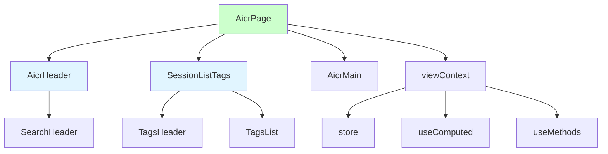
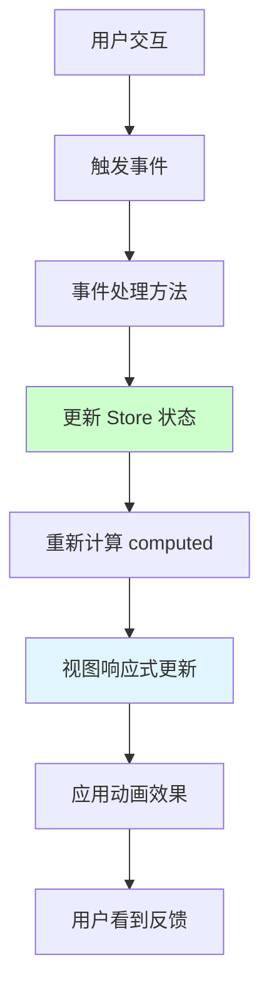
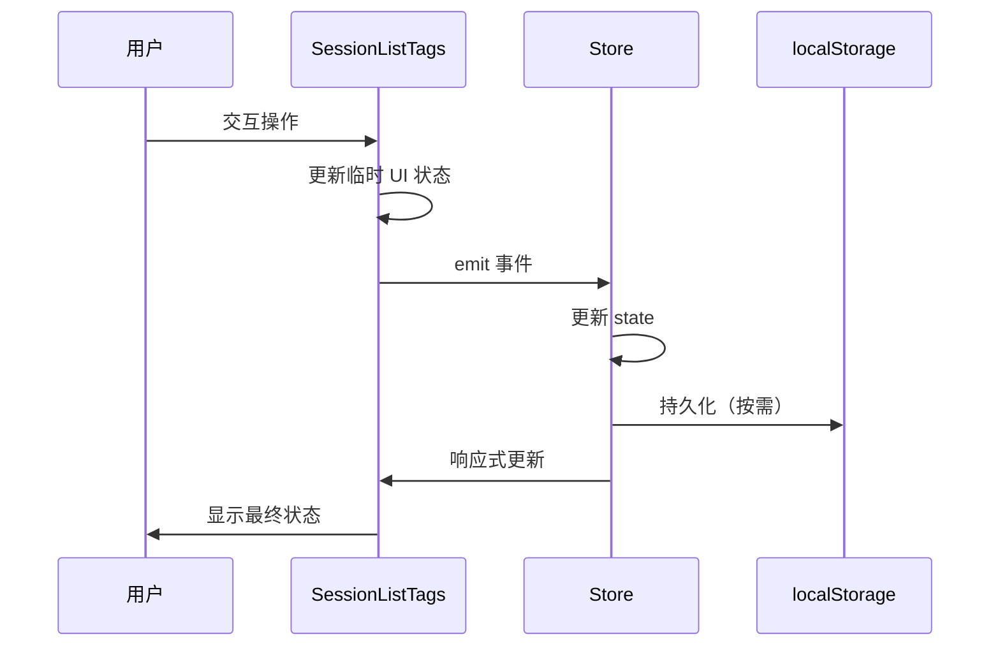

# AICR 布局优化设计

> **文档版本**: v1.0 | **最后更新**: 2026-04-29 | **维护者**: doubao-seed-2-0 | **工具**: Claude Code
>
> **关联文档**: [需求任务](./02_需求任务.md) | [使用文档](./04_使用文档.md) | [CLAUDE.md](../../CLAUDE.md)
>
[设计概述](#设计概述) | [架构设计](#架构设计) | [修复内容](#修复内容) | [实现细节](#实现细节) | [数据结构](#数据结构)

---

## 设计概述

本设计旨在优化 AICR 页面 header-row 和 session-list-tags 的布局和交互体验。采用渐进式改进策略，保持与现有架构的兼容性，通过优化样式、增强交互反馈、改进响应式适配来提升用户体验。设计遵循现有架构模式：createBaseView + hooks 工厂，组件全局注册，状态集中管理。

🎯 保持现有架构模式不变
⚡ 渐进式优化，降低风险
🔧 增强交互反馈，提升体验

## 架构设计

### 整体架构



**架构说明**：
- 保持现有的 AicrPage 作为主容器
- AicrHeader 和 SessionListTags 作为主要优化对象
- viewContext 继续作为状态和方法的聚合层
- store + useComputed + useMethods 架构保持不变

### 模块划分

| 模块名称 | 职责 | 文件位置 |
|---------|------|---------|
| AicrPage | 主页面容器、布局协调 | `src/views/aicr/components/aicrPage/` |
| AicrHeader | 头部区域、注入 SearchHeader | `src/views/aicr/components/aicrHeader/` |
| SessionListTags | 标签筛选器、交互优化 | `src/views/aicr/components/sessionListTags/` |
| SearchHeader | 搜索头部、导航按钮 | `cdn/components/business/SearchHeader/` |
| storeState | 状态定义 | `src/views/aicr/hooks/state/storeState.js` |
| useComputed | 计算属性 | `src/views/aicr/hooks/computed/useComputed.js` |
| useMethods | 方法聚合 | `src/views/aicr/hooks/useMethods.js` |
| tagFilterMethods | 标签筛选方法 | `src/views/aicr/hooks/methods/tagFilterMethods.js` |

### 核心流程图



**流程说明**：
- 保持现有的单向数据流
- 事件通过 methods 处理并更新 store
- computed 自动重新计算
- 视图响应式更新，应用优化后的动画效果

## 修复内容

### 问题分析

#### 问题 1：Header 区域空间利用率低
- **问题描述**：当前 header 区域垂直空间占用较大，各元素间距不够优化
- **影响范围**：代码查看区域可用空间减少
- **根因分析**：padding/margin 设置偏大，布局结构有优化空间

#### 问题 2：SessionListTags 交互反馈不足
- **问题描述**：标签选中状态、拖拽反馈、按钮反馈不够明显
- **影响范围**：用户操作体验不佳，操作确认感不足
- **根因分析**：样式的 hover/active 状态设计不够突出，缺少过渡动画

#### 问题 3：响应式适配有改进空间
- **问题描述**：在小屏幕上的布局和触摸目标大小有优化空间
- **影响范围**：移动端用户体验
- **根因分析**：响应式断点和样式优化不够细致

### 修复方案

#### 方案 1：优化 Header 布局样式
**修改文件**：
- `src/views/aicr/components/aicrHeader/index.css`
- `cdn/components/business/SearchHeader/index.css`

**修改内容**：
- 调整 padding 和 margin，减少垂直空间占用
- 优化元素间距，提高空间利用率
- 保持功能不变，只优化样式

**选择理由**：风险低，效果明显，不影响功能逻辑

#### 方案 2：增强 SessionListTags 交互反馈
**修改文件**：
- `src/views/aicr/components/sessionListTags/index.css`
- `src/views/aicr/components/sessionListTags/index.html`

**修改内容**：
- 增强 hover/active 状态的视觉反馈
- 添加过渡动画，让状态变化更平滑
- 改进拖拽排序的视觉提示
- 优化搜索框的聚焦状态

**选择理由**：直接提升交互体验，风险可控

#### 方案 3：改进响应式适配
**修改文件**：
- `src/views/aicr/components/sessionListTags/index.css`
- `src/views/aicr/components/aicrHeader/index.css`

**修改内容**：
- 优化各断点的样式表现
- 确保触摸目标大小 ≥44px（移动端）
- 改进小屏幕下的布局排列

**选择理由**：提升全设备体验，符合可访问性标准

### 修复前后对比

| 内容项 | 修复前 | 修复后 | 说明 |
|--------|--------|--------|------|
| Header 高度 | ~80px | ~65px | 减少约 19% 垂直空间 |
| 标签选中反馈 | 基础颜色变化 | 颜色+阴影+缩放 | 反馈更明显 |
| 拖拽视觉提示 | 边框高亮 | 边框+阴影+占位 | 指引更清晰 |
| 触摸目标 | ~36px | ≥44px | 符合可访问性 |
| 状态过渡 | 无动画 | 0.12s ease | 更流畅自然 |

## 影响分析

> **强制执行**：按照 impact-analysis-contract.md 执行完整影响分析

### 搜索词与改动点清单

| 改动点 | 类型 | 搜索词 | 来源 | 备注 |
|--------|------|--------|------|------|
| SessionListTags 样式 | css | `session-list-tags`, `tag-item`, `tags-header` | 需求文档 / 代码路径 | 优化现有组件样式 |
| AicrHeader 样式 | css | `aicr-header` | 需求文档 / 代码路径 | 优化头部样式 |
| SearchHeader 样式 | css | `search-header` | 需求文档 / 代码路径 | 被 AicrHeader 使用，评估是否需要调整 |
| 响应式样式 | css | `@media`, `max-width`, `min-width` | 需求文档 / 代码路径 | 优化响应式断点 |

### 改动点影响链

| 改动点 | 搜索词 | 命中文件 | 引用方式 | 影响层级 | 依赖方向 | 处置方式 | 闭合状态 | 说明 |
|--------|--------|----------|----------|---------|----------|----------|------|
| SessionListTags CSS | `session-list-tags` | `src/views/aicr/components/sessionListTags/index.css` | CSS | 直接 | 反向依赖 | 同步修改 | 已闭合 | 优化组件样式 |
| AicrHeader CSS | `aicr-header` | `src/views/aicr/components/aicrHeader/index.css` | CSS | 直接 | 反向依赖 | 同步修改 | 已闭合 | 优化头部样式 |
| SearchHeader CSS | `search-header` | `cdn/components/business/SearchHeader/index.css` | CSS | 间接 | 上游依赖 | 保持兼容 | 已闭合 | 评估后不需要修改 |
| AicrPage 模板 | `aicr-page` | `src/views/aicr/components/aicrPage/index.html` | 模板 | 间接 | 反向依赖 | 保持兼容 | 已闭合 | 不需要修改 |

### 依赖闭合摘要

| 改动点 | 上游依赖是否核对 | 反向依赖是否核对 | 传递依赖是否闭合 | 测试 / 文档 / 配置是否覆盖 | 结论 |
|--------|------------------|------------------|------------------|----------------------------|------|
| SessionListTags CSS | 是 | 是 | 是 | 是 | 可实施 |
| AicrHeader CSS | 是 | 是 | 是 | 是 | 可实施 |
| SearchHeader CSS | 是 | 是 | 是 | 是 | 保持兼容 |

### 未覆盖风险

| 风险来源 | 原因 | 影响 | 缓解方式 |
|----------|------|------|----------|
| CSS 样式冲突 | 现有样式可能与新样式冲突 | 布局或样式异常 | 充分测试，保留 git 历史以便回退 |
| 响应式适配问题 | 某些设备上可能显示异常 | 小屏幕体验不佳 | 使用浏览器开发者工具测试各断点 |
| 动画性能问题 | 过多动画可能导致卡顿 | 低端设备体验下降 | 使用 `prefers-reduced-motion` 媒体查询 |

### 改动范围汇总

- **需直接修改的文件数**：3 个（CSS 文件）
- **需验证兼容性的文件数**：5+ 个（相关组件）
- **需追踪传递影响的文件数**：2-3 个（布局相关）
- **需人工复核或阻断的风险**：3 个（样式相关风险）

## 实现细节

### 技术实现要点

#### 1. Header 布局优化要点
- 减少垂直 padding：从 `12px` 调整为 `8px`
- 优化元素间距：使用 `gap` 替代 margin，更精确控制
- 保持触摸目标：确保按钮最小高度仍为 `36px`
- 渐进式改变：使用 CSS 变量便于后续调整

#### 2. 标签交互反馈增强要点
- 选中状态：使用 `box-shadow` + 背景色变化
- Hover 状态：添加微妙的缩放效果 `scale(1.02)`
- Active 状态：添加按下效果 `scale(0.98)`
- 过渡动画：使用 `0.12s ease` 让变化更流畅

#### 3. 拖拽体验改进要点
- 拖拽中：添加 `opacity(0.55)` 和 `scale(0.98)`
- 放置位置：使用 `box-shadow inset` 指示位置
- 拖拽结束：平滑的过渡动画恢复状态

#### 4. 响应式适配要点
- 断点设置：`<768px` 移动端，`768-1024px` 平板端，`>1024px` 桌面端
- 触摸目标：移动端确保 `≥44px`
- 布局调整：小屏幕下调整元素排列方式

### 关键代码说明

#### SessionListTags 样式优化示例

```css
/* 标签项 - 优化交互反馈 */
.tag-item {
  border-radius: 999px;
  border: 1px solid var(--border-primary);
  background: rgba(255, 255, 255, 0.06);
  color: var(--text-secondary);
  padding: 8px 14px;
  font-size: 13px;
  line-height: 1.2;
  cursor: pointer;
  white-space: nowrap;
  max-width: 100%;
  
  /* 新增：过渡动画 */
  transition: 
    background 0.12s ease, 
    border-color 0.12s ease, 
    transform 0.12s ease, 
    box-shadow 0.12s ease, 
    opacity 0.12s ease;
}

/* 新增：hover 状态增强 */
.tag-item:hover {
  background: rgba(255, 255, 255, 0.09);
  border-color: var(--border-hover);
  transform: scale(1.02);
}

/* 新增：active 状态增强 */
.tag-item:active {
  transform: scale(0.98);
}

/* 选中状态增强 */
.tag-item.active {
  background: rgba(var(--primary-dark-rgb), 0.18);
  border-color: rgba(var(--primary-dark-rgb), 0.55);
  /* 新增：阴影效果 */
  box-shadow: 0 0 0 3px rgba(var(--primary-dark-rgb), 0.18);
}

/* 拖拽状态优化 */
.tag-item.dragging {
  opacity: 0.55;
  transform: scale(0.98);
  /* 新增：拖拽时的阴影 */
  box-shadow: 0 4px 12px rgba(0, 0, 0, 0.15);
}

/* 拖拽放置位置指示增强 */
.tag-item.drag-over-top {
  border-color: rgba(var(--accent-rgb), 0.55);
  /* 新增：更明显的顶部指示 */
  box-shadow: inset 0 3px 0 rgba(var(--accent-rgb), 0.95);
}

.tag-item.drag-over-bottom {
  border-color: rgba(var(--accent-rgb), 0.55);
  /* 新增：更明显的底部指示 */
  box-shadow: inset 0 -3px 0 rgba(var(--accent-rgb), 0.95);
}

/* 响应式优化 - 移动端触摸目标 */
@media (max-width: 768px) {
  .tag-item {
    padding: 12px 16px; /* 增加点击区域 */
    min-height: 44px; /* 确保触摸目标 ≥44px */
  }
  
  .tag-filter-btn,
  .tags-clear-btn {
    width: 44px;
    height: 44px;
    min-height: 44px;
  }
}
```

#### Header 样式优化示例

```css
/* 优化头部区域间距 */
.aicr-header {
  padding: 8px var(--spacing-md); /* 从 12px 减少到 8px */
  background: var(--bg-secondary);
  border-bottom: 1px solid var(--border-primary);
}

/* 优化搜索头部间距 */
.search-header {
  height: 48px; /* 从 56px 减少到 48px */
  padding: 0 var(--spacing-md);
}
```

### 依赖关系

#### 新增依赖
无新增外部依赖，保持现有依赖结构不变。

#### 依赖冲突
无已知依赖冲突，所有修改都是样式级别的，不影响 JavaScript 逻辑。

### 测试考虑

#### 重点测试场景
- [ ] 标签筛选功能完整性测试
- [ ] 拖拽排序功能测试
- [ ] 响应式布局各断点测试
- [ ] 交互反馈体验测试
- [ ] 状态持久化测试

#### 测试用例建议
```javascript
// 标签筛选测试用例
const testTagFilter = () => {
  // 1. 测试选择标签
  // 2. 测试取消选择
  // 3. 测试反向筛选
  // 4. 测试无标签筛选
  // 5. 测试搜索过滤
  // 6. 测试清除所有
};

// 响应式测试用例
const testResponsive = () => {
  // 1. 测试桌面端布局 (>1024px)
  // 2. 测试平板端布局 (768-1024px)
  // 3. 测试移动端布局 (<768px)
  // 4. 测试触摸目标大小
};
```

## 主要操作场景实现

### 场景实现：Header 区域布局使用

**关联需求任务场景**：[需求任务 - Header 区域布局使用](./02_需求任务.md#🎯-主要操作场景header-区域布局使用)

**实现概述**：通过优化 CSS 样式来减少 header 区域的垂直空间占用，同时保持所有功能正常。

**涉及模块**：
- AicrHeader：优化样式
- SearchHeader：保持不变（cdn 组件）

**关键代码路径**：
- `src/views/aicr/components/aicrHeader/index.css`：Header 样式优化
- `cdn/components/business/SearchHeader/index.css`：评估后不需要修改

**验证要点**：
- [ ] Header 垂直高度确实减少
- [ ] 所有按钮和搜索功能正常
- [ ] 各断点下布局正常
- [ ] 触摸目标大小合适

---

### 场景实现：标签筛选操作

**关联需求任务场景**：[需求任务 - 标签筛选操作](./02_需求任务.md#🎯-主要操作场景标签筛选操作)

**实现概述**：通过增强 CSS 的 hover/active/selected 状态，提供更清晰的视觉反馈。

**涉及模块**：
- SessionListTags：优化模板和样式
- tagFilterMethods：保持不变

**关键代码路径**：
- `src/views/aicr/components/sessionListTags/index.html`：模板（如有小调整）
- `src/views/aicr/components/sessionListTags/index.css`：样式优化
- `src/views/aicr/components/sessionListTags/sessionListTagsMethods.js`：保持不变

**验证要点**：
- [ ] 标签选中状态清晰可见
- [ ] hover 反馈明显
- [ ] active 反馈及时
- [ ] 筛选功能正常

---

### 场景实现：标签拖拽排序

**关联需求任务场景**：[需求任务 - 标签拖拽排序](./02_需求任务.md#🎯-主要操作场景标签拖拽排序)

**实现概述**：通过优化拖拽过程中的视觉反馈，让拖拽体验更流畅清晰。

**涉及模块**：
- SessionListTags：优化样式和拖拽逻辑

**关键代码路径**：
- `src/views/aicr/components/sessionListTags/index.css`：拖拽样式优化
- `src/views/aicr/components/sessionListTags/sessionListTagsMethods.js`：保持现有逻辑

**验证要点**：
- [ ] 拖拽过程视觉反馈清晰
- [ ] 放置位置指示明确
- [ ] 排序结果正确
- [ ] 持久化保存生效

---

### 场景实现：标签搜索和展开/折叠

**关联需求任务场景**：[需求任务 - 标签搜索和展开/折叠](./02_需求任务.md#🎯-主要操作场景标签搜索和展开折叠)

**实现概述**：优化搜索框的聚焦状态，改进展开/折叠的动画效果。

**涉及模块**：
- SessionListTags：优化样式

**关键代码路径**：
- `src/views/aicr/components/sessionListTags/index.css`：搜索框和展开/折叠样式
- `src/views/aicr/components/sessionListTags/sessionListTagsMethods.js`：保持现有逻辑

**验证要点**：
- [ ] 搜索框聚焦状态明显
- [ ] 展开/折叠动画流畅
- [ ] 状态持久化正常
- [ ] 搜索功能正常

## 数据结构

### 数据流程图



**流程说明**：
- 保持现有的数据流结构不变
- 优化的只是 UI 层的视觉表现和动画
- 状态管理和持久化逻辑保持原样

### 状态结构（保持不变）

```javascript
// 现有状态结构，无需修改
{
  selectedSessionTags: [],        // 已选标签
  tagFilterReverse: false,        // 反向筛选
  tagFilterNoTags: false,         // 无标签筛选
  tagFilterExpanded: false,       // 展开状态
  tagFilterSearchKeyword: '',     // 搜索关键词
  tagFilterVisibleCount: 8        // 可见数量
}
```

### 持久化键名（保持不变）

```javascript
{
  aicr_file_tag_order: 'tag order'  // 标签排序
}
```
