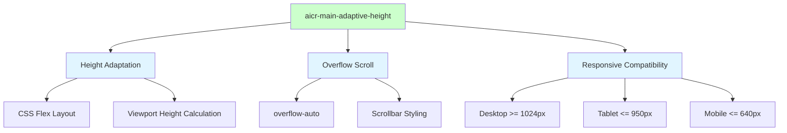
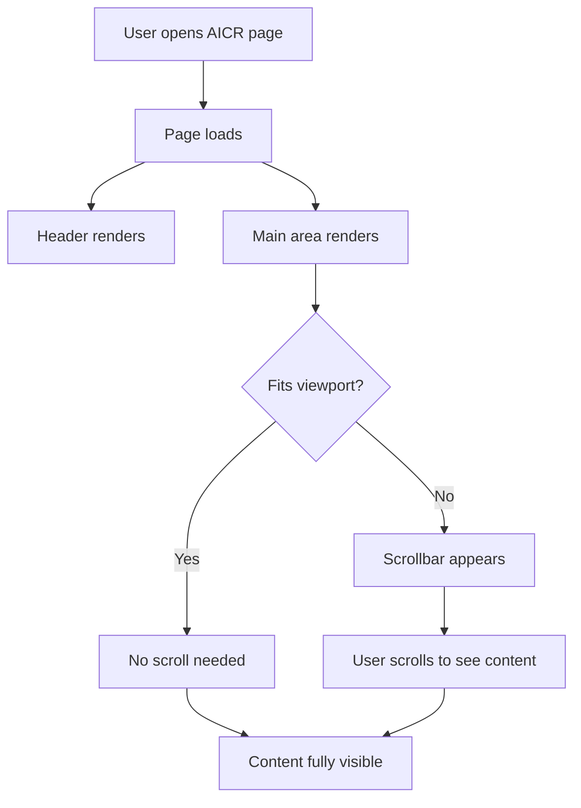
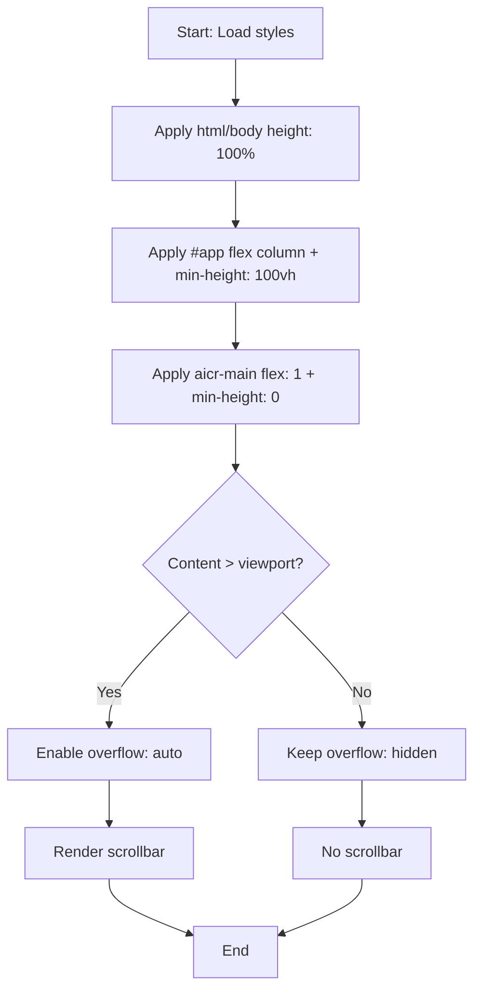

# aicr-main-adaptive-height

> **Document Version**: v1.0 | **Last Updated**: 2026-05-02 | **Maintainer**: Claude | **Tool**: Claude Code
>
> **Related Documents**: [Requirement Document](./01_requirement-document.md) | [Design Document](./03_design-document.md) | [Usage Document](./04_usage-document.md) | [CLAUDE.md](../../CLAUDE.md)
>

[Feature Overview](#feature-overview) | [Feature Analysis](#feature-analysis) | [Feature Details](#feature-details) | [Acceptance Criteria](#acceptance-criteria) | [Usage Scenario Examples](#usage-scenario-examples)

---

## Feature Overview

AICR 页面主区域 `aicr-main` 目前存在两个布局问题：一是无法可靠占满整个视口剩余高度，导致底部可能出现空白；二是 `overflow: hidden` 设置使得超出内容被截断，用户无法滚动查看。

本功能通过调整 CSS 布局策略，使 `aicr-main` 精确自适应屏幕高度，并在内容溢出时提供滚动条。变更范围极小，仅涉及样式文件，不影响任何业务逻辑或组件接口。

核心目标：🎯 消除底部空白、⚡ 防止内容截断、📖 保持现有交互不变

## Feature Analysis

### Feature Decomposition Diagram



**说明**：本功能分解为三个核心子功能：高度自适应、溢出滚动、响应式兼容。高度自适应依赖 CSS Flex 布局和视口高度计算；溢出滚动通过调整 `overflow` 属性实现；响应式兼容需验证现有媒体查询不受影响。

### User Flow Diagram



**说明**：用户打开页面后，主区域自动计算高度。若内容超出可视区域，滚动条自然出现，用户可滚动查看全部内容。

### Feature Flow Diagram



**说明**：样式加载后，布局链从 html/body 传递到 #app 再到 aicr-main。根据内容是否溢出，动态决定是否显示滚动条。

### Sequence Diagram

```mermaid
sequenceDiagram
    participant U as User
    participant B as Browser
    participant S as Style System
    participant P as aicr-page
    participant M as aicr-main

    U->>B: Navigate to /src/views/aicr/index.html
    B->>S: Load index.css
    S->>P: Apply #app { min-height: 100vh; flex-direction: column }
    S->>M: Apply .aicr-main { flex: 1; overflow: auto }
    P->>M: Render header + main
    M->>B: Calculate height based on flex layout
    alt Content overflows
        B->>U: Show scrollbar
    else Content fits
        B->>U: No scrollbar
    end
```

**说明**：浏览器加载样式后，根据 flex 布局计算 aicr-main 高度。当内容超出时，浏览器自动渲染滚动条供用户使用。

## User Story Table

| User Story | Acceptance Criteria | Process-Generated Documents | Output Smart Documents |
|------------|---------------------|----------------------------|------------------------|
| 🔴 As a user, I want the aicr-main area to fill the entire remaining viewport height, so that the layout looks consistent and no empty space appears at the bottom.<br/><br/>**Main Operation Scenarios**:<br/>- 用户在桌面浏览器打开 AICR 页面，主区域应占满视口<br/>- 用户在平板或手机打开页面，主区域应自适应屏幕高度<br/>- 当文件树或代码内容超出可视区域时，应出现滚动条 | 1. `aicr-main` 高度等于 `100vh - header-height`<br/>2. 内容超出时出现滚动条而非截断<br/>3. 响应式断点（950px、640px）下行为保持一致 | [Requirement Tasks](./02_requirement-tasks.md)<br/>[Design Document](./03_design-document.md)<br/>[Project Report](./07_project-report.md) | [Generate Document Skill](../../.claude/skills/generate-document/SKILL.md)<br/>[Requirement Document Specification](../../.claude/skills/generate-document/rules/requirement-document.md)<br/>[Requirement Document Template](../../.claude/skills/generate-document/templates/requirement-document.md)<br/>[Requirement Document Checklist](../../.claude/skills/generate-document/checklists/requirement-document.md) |

## Main Operation Scenario Definitions

### Scenario 1: 桌面端视口占满

- **Scenario name**: 桌面端视口占满
- **Scenario description**: 用户在桌面浏览器打开 AICR 页面，主区域应占满 header 下方的全部视口空间
- **Pre-conditions**: 浏览器窗口宽度 >= 1024px，页面正常加载
- **Operation steps**:
  1. 打开 `http://localhost:8000/src/views/aicr/index.html`
  2. 等待页面加载完成
  3. 观察 `aicr-main` 区域底部是否与视口底部对齐
- **Expected result**: `aicr-main` 底部与视口底部对齐，无空白间隙
- **Verification focus points**: 使用浏览器开发者工具检查 `.aicr-main` 的计算高度是否等于 `viewport height - header height`
- **Related design document chapters**: [Changes](#changes) / Height Adaptation

### Scenario 2: 内容溢出滚动

- **Scenario name**: 内容溢出滚动
- **Scenario description**: 当文件树或代码区域内容超出可视高度时，用户可通过滚动条查看全部内容
- **Pre-conditions**: 页面已加载，文件树包含大量节点或代码文件很长
- **Operation steps**:
  1. 打开一个包含大量文件的会话
  2. 展开多个文件夹节点
  3. 尝试滚动主区域
- **Expected result**: 纵向滚动条出现，滚动可查看全部内容，无截断
- **Verification focus points**: 检查 `overflow` 属性值是否为 `auto` 或 `scroll`
- **Related design document chapters**: [Changes](#changes) / Overflow Scroll

### Scenario 3: 移动端响应式适配

- **Scenario name**: 移动端响应式适配
- **Scenario description**: 在手机或小屏幕设备上，主区域垂直堆叠并自适应屏幕高度
- **Pre-conditions**: 浏览器窗口宽度 <= 640px 或使用移动设备
- **Operation steps**:
  1. 将浏览器窗口缩放到 375px 宽度
  2. 刷新页面
  3. 观察布局是否垂直堆叠
  4. 尝试滚动页面
- **Expected result**: 侧边栏和代码区域垂直堆叠，整体可滚动，无内容截断
- **Verification focus points**: 检查 `@media (max-width: 640px)` 下 `.aicr-main` 的 `flex-direction` 和 `overflow` 属性
- **Related design document chapters**: [Changes](#changes) / Responsive Compatibility

## Impact Analysis

### 1. Search Terms and Change Point List

| Change Point | Type | Search Term | Source | Notes |
|--------------|------|-------------|--------|-------|
| `.aicr-main` height/overflow | CSS class | `aicr-main` | `src/views/aicr/styles/index.css:29`, `src/views/aicr/components/aicrPage/index.css:7` | 两处定义需保持一致 |
| `#app` flex layout | CSS id | `#app` | `src/views/aicr/styles/index.css:17` | 确保 flex column 正确传递 |
| `html, body` height | CSS element | `html, body` | `src/views/aicr/styles/index.css:13` | 高度基础链 |
| Responsive breakpoints | CSS media query | `@media` | `src/views/aicr/styles/layout.css:23`, `33`, `66` | 验证断点下行为一致 |
| `aicr-sidebar` scroll | CSS class | `aicr-sidebar` | `src/views/aicr/styles/index.css:40` | 已有独立滚动容器 |
| `aicr-code` scroll | CSS class | `aicr-code` | `src/views/aicr/styles/index.css:68` | 已有独立滚动容器 |

### 2. Change Point Impact Chain

| Change Point | Search Term | Hit File | Reference Method | Impact Level | Dependency Direction | Disposition Method | Closure Status | Explanation |
|--------------|-------------|----------|------------------|--------------|----------------------|--------------------|----------------|-------------|
| `.aicr-main` | `aicr-main` | `src/views/aicr/styles/index.css:29` | CSS selector | Low | Self | sync modify | Closed | 修改 overflow 和 flex 属性 |
| `.aicr-main` | `aicr-main` | `src/views/aicr/components/aicrPage/index.css:7` | CSS selector | Low | Self | sync modify | Closed | 同步修改保持一致 |
| `.aicr-main` | `aicr-main` | `src/views/aicr/styles/layout.css:34` | CSS selector | Low | Self | verify only | Closed | 媒体查询中已有定义，需验证 |
| `.aicr-main` | `aicr-main` | `src/views/aicr/styles/layout.css:67` | CSS selector | Low | Self | verify only | Closed | 媒体查询中已有定义，需验证 |
| `#app` | `#app` | `src/views/aicr/styles/index.css:17` | CSS selector | Low | Upstream | keep compatible | Closed | 现有 flex column 布局兼容 |
| `html, body` | `html, body` | `src/views/aicr/styles/index.css:13` | CSS selector | Low | Upstream | keep compatible | Closed | 现有 height: 100% 兼容 |
| `aicr-sidebar` | `aicr-sidebar` | `src/views/aicr/styles/index.css:40` | CSS selector | None | Reverse | no action needed | Closed | 独立滚动容器不受影响 |
| `aicr-code` | `aicr-code` | `src/views/aicr/styles/index.css:68` | CSS selector | None | Reverse | no action needed | Closed | 独立滚动容器不受影响 |

### 3. Dependency Closure Summary

| Change Point | Upstream Verified | Reverse Verified | Transitive Closed | Tests/Docs/Config Covered | Conclusion |
|--------------|-------------------|------------------|-------------------|---------------------------|------------|
| `.aicr-main` CSS | Yes (#app, html/body) | Yes (sidebar, code) | Yes | No tests affected; docs: this set; config: none | Closed |

### 4. Uncovered Risks

| Risk Source | Reason | Impact | Mitigation |
|-------------|--------|--------|------------|
| 无明确风险 | 本变更仅为 CSS 样式调整，不触及业务逻辑或接口 | - | - |

**Change Scope Summary**: directly modify 2 / verify compatibility 4 / trace transitive 0 / need manual review 0

## Feature Details

### 高度自适应

- **Feature description**: 确保 `aicr-main` 通过 flex 布局链占满视口剩余高度
- **Value**: 消除底部空白，提升视觉一致性
- **Pain point**: 当前 `#app` 使用 `min-height: 100vh`，当内容较少时底部可能出现空白
- **Benefit**: 任何视口高度下布局均完整填充

### 溢出滚动

- **Feature description**: 将 `.aicr-main` 的 `overflow: hidden` 调整为支持滚动
- **Value**: 防止内容截断，提升可访问性
- **Pain point**: 当前 `overflow: hidden` 导致超出内容不可见
- **Benefit**: 用户可通过滚动查看全部内容

## Acceptance Criteria

**P0**:
- `aicr-main` 在任何视口高度下均占满可用空间（`100vh - header`）
- 当 `aicr-main` 内部内容总高度超过其自身高度时，显示纵向滚动条
- 现有子区域滚动（sidebar、code-area）不受影响

**P1**:
- 响应式布局（max-width: 950px / 640px）下行为保持一致
- 无视觉回归（背景色、边框、阴影保持原样）

**P2**:
- 滚动条样式与现有设计系统一致

## Usage Scenario Examples

📋 **Scenario 1: 桌面端正常浏览**
- **Background**: 用户在 1920x1080 桌面浏览器打开 AICR 页面。
- **Operation**: 页面加载后观察主区域高度。
- **Result**: `aicr-main` 占满 header 下方全部空间，无底部空白。

🎨 **Scenario 2: 小屏幕内容溢出**
- **Background**: 用户在 768px 高度笔记本打开页面，文件树展开大量节点。
- **Operation**: 尝试滚动查看底部文件。
- **Result**: `aicr-main` 出现滚动条，用户可滚动查看全部内容。

📋 **Scenario 3: 移动端适配**
- **Background**: 用户在手机屏幕（375x812）打开页面。
- **Operation**: 页面加载后观察布局。
- **Result**: `aicr-main` 按响应式规则垂直堆叠，高度自适应屏幕，可滚动。

## Postscript: Future Planning & Improvements

- 引入 `dvh` 单位以适配移动端动态工具栏
- 若后续添加底部状态栏，需重新计算可用高度
