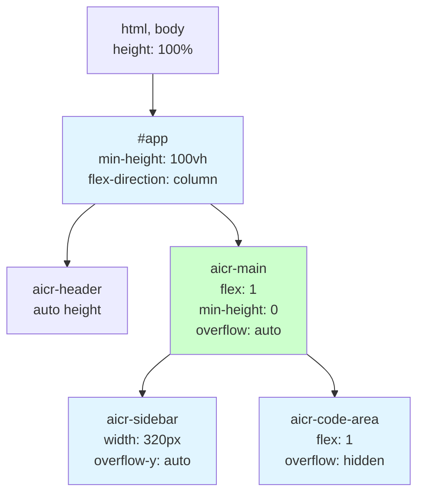
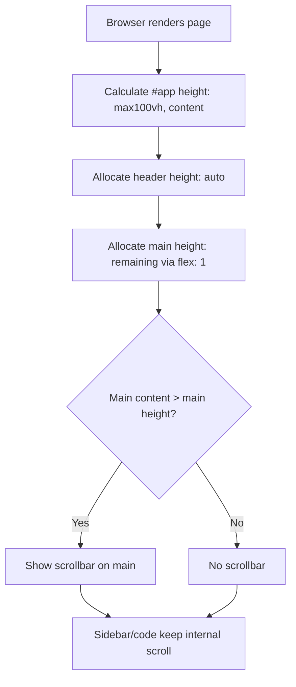
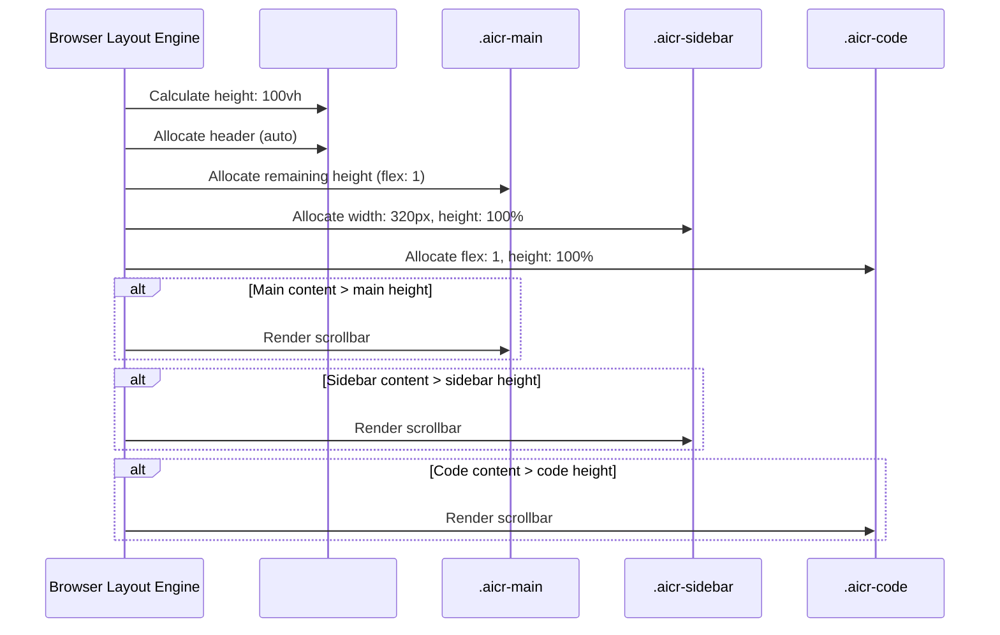

# aicr-main-adaptive-height

> **Document Version**: v1.0 | **Last Updated**: 2026-05-02 | **Maintainer**: Claude | **Tool**: Claude Code
>
> **Related Documents**: [Requirement Document](./01_requirement-document.md) | [Requirement Tasks](./02_requirement-tasks.md) | [Usage Document](./04_usage-document.md) | [CLAUDE.md](../../CLAUDE.md)

[Design Overview](#design-overview) | [Architecture Design](#architecture-design) | [Changes](#changes) | [Implementation Details](#implementation-details) | [Impact Analysis](#impact-analysis)

---

## Design Overview

本设计解决 AICR 页面主区域 `aicr-main` 无法可靠占满视口高度及内容溢出被截断的问题。通过微调 CSS 属性（`overflow`、`min-height`、`flex`），在保持现有布局架构不变的前提下，实现高度自适应和滚动支持。

设计原则：🎯 最小变更（仅改样式不改结构）、⚡ 兼容现有（子区域滚动不受影响）、🔧 可验证（浏览器 DevTools 可直接观测）

## Architecture Design

### Overall Architecture



**说明**：布局链从 `html/body` → `#app` → `aicr-header` + `aicr-main`。`aicr-main` 通过 `flex: 1` 占满 `#app` 的剩余空间。`overflow: auto` 使其在内容溢出时显示滚动条。`aicr-sidebar` 和 `aicr-code-area` 保留各自的滚动容器。

### Module Division

| Name | Responsibility | Location |
|------|----------------|----------|
| `aicr-main` CSS | 主容器高度自适应和溢出滚动 | `src/views/aicr/styles/index.css` |
| `aicr-main` component CSS | 组件级主容器样式同步 | `src/views/aicr/components/aicrPage/index.css` |
| Responsive CSS | 断点下的布局行为保持 | `src/views/aicr/styles/layout.css` |

### Core Flow



**说明**：浏览器渲染时，`#app` 至少占满视口高度。`aicr-header` 占用其内容所需高度，`aicr-main` 通过 flex 占满剩余空间。当主区域总内容高度超过分配高度时，滚动条出现。

## Changes

### Problem Analysis

当前问题有两个层面：

1. **高度传递链不完整**：`#app` 使用 `min-height: 100vh` 而非 `height: 100vh`，当页面内容较少时，`#app` 高度可能小于视口高度，导致 `aicr-main`（`flex: 1`）也无法占满剩余空间。
2. **溢出截断**：`.aicr-main` 设置 `overflow: hidden`，任何超出其边界的内容都会被浏览器截断，用户无法通过滚动查看。

### Solution

**方案**：将 `#app` 的 `min-height: 100vh` 改为 `height: 100vh`（或确保高度链完整），并将 `.aicr-main` 的 `overflow: hidden` 改为 `overflow: auto`。

**修改文件列表**：
- `src/views/aicr/styles/index.css` — 修改 `#app` 和 `.aicr-main`
- `src/views/aicr/components/aicrPage/index.css` — 同步修改 `.aicr-main`

**选择理由**：
- 最小侵入：仅修改 2 个 CSS 属性
- 零副作用：不改变任何组件接口或业务逻辑
- 可回滚：随时恢复原始值

### Before/After Comparison

| Property | Before | After |
|----------|--------|-------|
| `#app` height | `min-height: 100vh` | `height: 100vh` |
| `.aicr-main` overflow | `overflow: hidden` | `overflow: auto` |
| `.aicr-main` (component) overflow | `overflow: hidden` | `overflow: auto` |

## Impact Analysis

### 1. Search Terms and Change Point List

| Change Point | Type | Search Term | Source | Notes |
|--------------|------|-------------|--------|-------|
| `#app` height | CSS id | `#app` | `src/views/aicr/styles/index.css:17` | min-height → height |
| `.aicr-main` overflow | CSS class | `.aicr-main` | `src/views/aicr/styles/index.css:29`, `src/views/aicr/components/aicrPage/index.css:7` | hidden → auto |

### 2. Change Point Impact Chain

| Change Point | Search Term | Hit File | Reference Method | Impact Level | Dependency Direction | Disposition Method | Closure Status | Explanation |
|--------------|-------------|----------|------------------|--------------|----------------------|--------------------|----------------|-------------|
| `#app` height | `#app` | `src/views/aicr/styles/index.css:17` | CSS selector | Low | Self | sync modify | Closed | min-height → height |
| `#app` height | `#app` | `src/views/aicr/index.html:21` | DOM id | None | Upstream | no action needed | Closed | HTML 结构不变 |
| `.aicr-main` overflow | `.aicr-main` | `src/views/aicr/styles/index.css:29` | CSS selector | Low | Self | sync modify | Closed | overflow: hidden → auto |
| `.aicr-main` overflow | `.aicr-main` | `src/views/aicr/components/aicrPage/index.css:7` | CSS selector | Low | Self | sync modify | Closed | 组件样式同步 |
| `.aicr-main` overflow | `.aicr-main` | `src/views/aicr/styles/layout.css:34` | CSS selector | None | Self | verify only | Closed | 媒体查询中无 overflow 覆盖 |
| `.aicr-main` overflow | `.aicr-main` | `src/views/aicr/styles/layout.css:67` | CSS selector | None | Self | verify only | Closed | 媒体查询中无 overflow 覆盖 |

### 3. Dependency Closure Summary

| Change Point | Upstream Verified | Reverse Verified | Transitive Closed | Tests/Docs/Config Covered | Conclusion |
|--------------|-------------------|------------------|-------------------|---------------------------|------------|
| `#app` height | Yes (html, body) | Yes (aicr-page) | Yes | None | Closed |
| `.aicr-main` overflow | Yes (#app) | Yes (sidebar, code) | Yes | None | Closed |

### 4. Uncovered Risks

| Risk Source | Reason | Impact | Mitigation |
|-------------|--------|--------|------------|
| 无 | 纯 CSS 属性调整，无副作用 | - | - |

**Change Scope Summary**: directly modify 2 / verify compatibility 4 / trace transitive 0 / need manual review 0

## Implementation Details

### Technical Points

**What**: 修改 `#app` 和 `.aicr-main` 的 CSS 属性。
**How**: 将 `#app` 的 `min-height: 100vh` 改为 `height: 100vh`；将两处 `.aicr-main` 的 `overflow: hidden` 改为 `overflow: auto`。
**Why**: `min-height` 允许容器在内容不足时收缩，导致底部空白；`overflow: hidden` 截断超出内容。

### Key Code

```css
/* src/views/aicr/styles/index.css */
#app {
    /* Before: min-height: 100vh; */
    height: 100vh;
    display: flex;
    flex-direction: column;
}

.aicr-main {
    display: flex;
    flex: 1;
    min-height: 0;
    background: var(--bg-primary);
    min-width: 320px;
    position: relative;
    /* Before: overflow: hidden; */
    overflow: auto;
}
```

```css
/* src/views/aicr/components/aicrPage/index.css */
.aicr-main {
    display: flex;
    flex-direction: row;
    flex: 1;
    min-height: 0;
    /* Before: overflow: hidden; */
    overflow: auto;
}
```

### Dependencies

- 无新增依赖
- 依赖现有 CSS 变量系统（`var(--bg-primary)`）

### Testing Considerations

- 在桌面端（1920x1080）、平板端（768x1024）、移动端（375x812）分别验证
- 验证子区域（sidebar、code-area）滚动不受影响
- 验证响应式断点行为一致

## Main Operation Scenario Implementation

### Scenario 1: 桌面端视口占满

- **Linked requirement task**: [桌面端视口占满](./02_requirement-tasks.md#scenario-1-桌面端视口占满)
- **Implementation overview**: `#app` 设置为 `height: 100vh`，`.aicr-main` 通过 `flex: 1` 占满剩余空间
- **Modules and responsibilities**: `aicr-main` CSS 负责高度分配
- **Key code paths**: `#app { height: 100vh; }` → `.aicr-main { flex: 1; }`
- **Verification points**: DevTools 中 `.aicr-main` 计算高度 = viewport height - header height

### Scenario 2: 内容溢出滚动

- **Linked requirement task**: [内容溢出滚动](./02_requirement-tasks.md#scenario-2-内容溢出滚动)
- **Implementation overview**: `.aicr-main` 设置 `overflow: auto`，浏览器自动渲染滚动条
- **Modules and responsibilities**: `aicr-main` CSS 负责溢出行为
- **Key code paths**: `.aicr-main { overflow: auto; }`
- **Verification points**: 内容超出时滚动条可见，可滚动至底部

### Scenario 3: 移动端响应式适配

- **Linked requirement task**: [移动端响应式适配](./02_requirement-tasks.md#scenario-3-移动端响应式适配)
- **Implementation overview**: 响应式媒体查询中 `.aicr-main` 的 `flex-direction: column` 保持不变，`overflow: auto` 确保整体可滚动
- **Modules and responsibilities**: `layout.css` 媒体查询负责断点行为
- **Key code paths**: `@media (max-width: 640px) { .aicr-main { flex-direction: column; } }`
- **Verification points**: 小屏幕下垂直堆叠，滚动条正常

## Data Structure Design

本功能不涉及数据结构设计，仅涉及 CSS 布局属性变更。



**说明**：浏览器布局引擎根据 CSS 属性分配空间。`#app` 固定为视口高度，`aicr-main` 占满剩余空间。各子区域根据内容独立决定是否显示滚动条。

## Postscript: Future Planning & Improvements

- 使用 `dvh`（dynamic viewport height）单位替代 `vh`，以适配移动端浏览器地址栏显隐导致的高度变化
- 若后续引入底部固定面板，可将 `height: 100vh` 改为 `height: calc(100vh - bottom-panel-height)`
