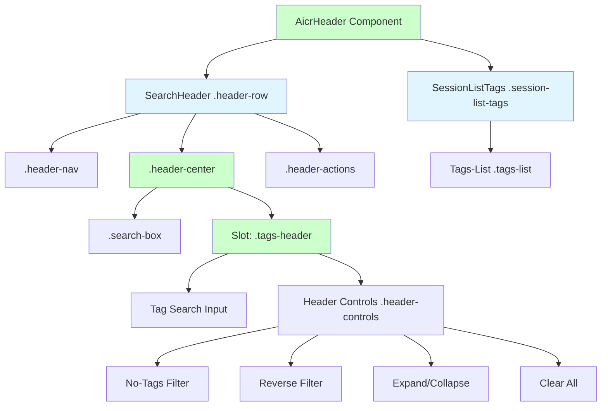
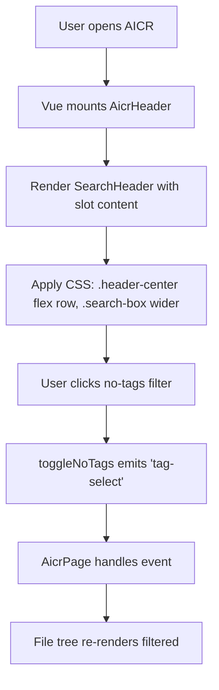
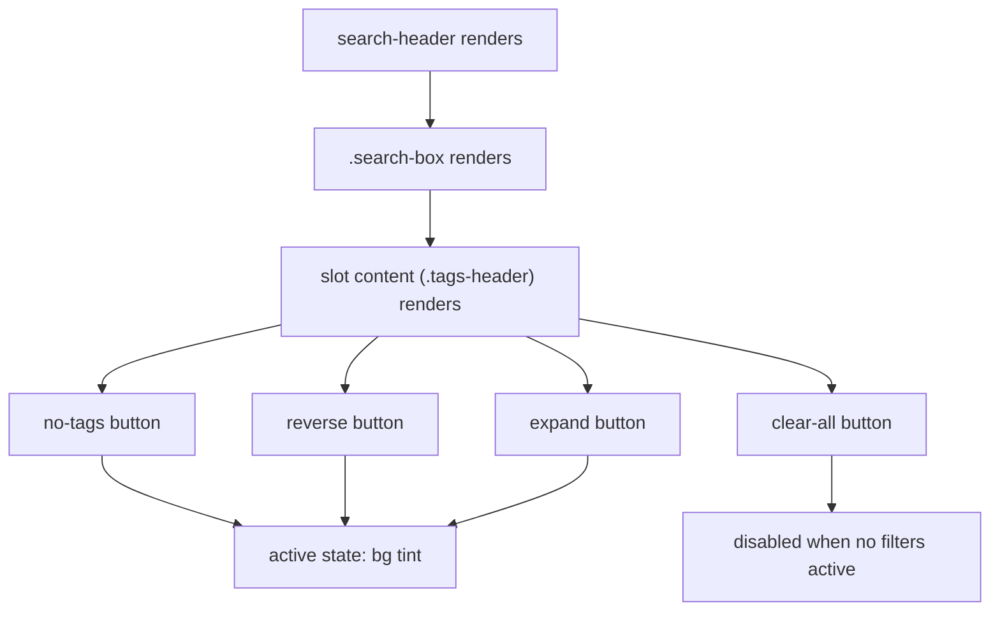
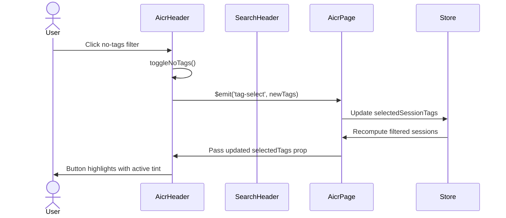

# Header Top Row Redesign — Requirement Tasks

> **Document Version**: v2.0 | **Last Updated**: 2026-05-02 | **Maintainer**: Claude Sonnet 4.6 | **Tool**: Claude Code
>
> **Related Documents**: [Requirement Document](./01_requirement-document.md) | [Design Document](./03_design-document.md) | [Usage Document](./04_usage-document.md) | [CLAUDE.md](../../CLAUDE.md)
>
> **Git Branch**: main
>
> **Doc Start Time**: 17:52:00 | **Doc Last Update Time**: 17:52:00
>

[Feature Overview](#feature-overview) | [Feature Analysis](#feature-analysis) | [User Story Table](#user-story-table) | [Main Operation Scenarios](#main-operation-scenario-definitions) | [Impact Analysis](#impact-analysis) | [Feature Details](#feature-details) | [Acceptance Criteria](#acceptance-criteria) | [Usage Scenario Examples](#usage-scenario-examples)

---

## Feature Overview

The `header-top-row` redesign is a structural UI refactor of the AICR page header. The current layout places `search-header` and `.tags-header` as siblings inside `.header-top-row`. The redesign removes `.header-top-row`, moves `.tags-header` into `SearchHeader`'s `.header-center` via a Vue slot, and widens the search box. All changes are presentational: no props, events, or data contracts are modified.

🎯 **Unified surface**: Search and filters occupy the same `.header-center` zone.  
⚡ **Minimum touch**: Only DOM nesting and CSS widths change.  
📖 **Convention alignment**: Uses Vue 3 native slot; aligns with existing component registration pattern.

---

## Feature Analysis

### Feature Decomposition Diagram

`AicrHeader` now renders `SearchHeader` as its first child. Inside `SearchHeader`'s `.header-center`, `.search-box` is followed by the default slot content (`.tags-header`). `SessionListTags` remains a separate child of `AicrHeader`.

### User Flow Diagram

The user flow is unchanged; only the visual nesting of the controls changes.

### Feature Flow Diagram

Active filter buttons receive a unified active-state tint. The clear-all button disables itself when no filters are active.

### Sequence Diagram

No data contracts change; the sequence is identical to the current implementation.

---

## User Story Table

**Priority**: 🔴 P0 | 🟡 P1 | 🟢 P2

| User Story | Acceptance Criteria | Process-Generated Documents | Output Smart Documents |
|------------|---------------------|----------------------------|------------------------|
| 🔴 As an AICR user, I want the tag toolbar to sit inside the header center next to the search box, so that I can search and filter in one visual zone.  **Main Operation Scenarios**: - Desktop user views the optimized header-top-row layout - User interacts with consolidated tag filter controls - Tablet user views the responsive header-top-row layout | 1. `.tags-header` is rendered inside `SearchHeader`'s `.header-center` via slot. 2. `.search-box` width is increased. 3. `SearchHeader` remains backward compatible. 4. The layout adapts gracefully at breakpoints. | [Requirement Tasks](./02_requirement-tasks.md) [Design Document](./03_design-document.md) [Project Report](./07_project-report.md) | [Generate Document Skill](../../.claude/skills/generate-document/SKILL.md) [Requirement Document Specification](../../.claude/skills/generate-document/rules/requirement-document.md) [Requirement Document Template](../../.claude/skills/generate-document/templates/requirement-document.md) [Requirement Document Checklist](../../.claude/skills/generate-document/checklists/requirement-document.md) |

---

## Main Operation Scenario Definitions

### Scenario 1 — Desktop user views optimized header-top-row layout

- **Scenario description**: On a desktop viewport (`≥1025 px`), the user sees the search box and tag toolbar sharing the same `.header-center` row. The search box is wider than before.
- **Pre-conditions**: AICR page is loaded; viewport width is at least `1025 px`.
- **Operation steps**:
  1. Open `http://localhost:8080/src/views/aicr/index.html` on a desktop browser.
  2. Observe the header area.
- **Expected result**: `SearchHeader`'s `.header-center` contains `.search-box` followed by `.tags-header`. Search box is at least `520 px` wide. No `.header-top-row` wrapper exists.
- **Verification focus points**: `.tags-header` is inside `.header-center`; search box width increased; gap between search box and tags is `12 px`.
- **Related design document chapters**: [Changes — Solution](./03_design-document.md#fixeschanges), [Implementation Details — CSS Rules](./03_design-document.md#implementation-details)

### Scenario 2 — User interacts with consolidated tag filter controls

- **Scenario description**: The user clicks individual filter buttons in the tag toolbar and observes visual feedback.
- **Pre-conditions**: AICR page is loaded; at least one tag exists or `noTagsCount > 0`.
- **Operation steps**:
  1. Click the "no tags" filter button.
  2. Click the "reverse" filter button.
  3. Click the "expand" filter button.
  4. Click the "clear all" button.
- **Expected result**: Each clicked button toggles its state, shows the active tint when enabled, and emits the correct event. The clear-all button disables itself when no filters are active.
- **Verification focus points**: Events match existing behavior; active tint visible; focus ring visible on keyboard navigation.
- **Related design document chapters**: [Implementation Details — Key Code](./03_design-document.md#implementation-details)

### Scenario 3 — Tablet user views responsive header-top-row layout

- **Scenario description**: On a tablet viewport (`≤1024 px`), the header adapts to the narrower width. `.header-center` may wrap its contents.
- **Pre-conditions**: AICR page is loaded; viewport width is at most `1024 px`.
- **Operation steps**:
  1. Open the AICR page on a tablet or resize browser to `1024 px`.
  2. Observe the header area.
- **Expected result**: `.search-box` and `.tags-header` stack or wrap as needed; no horizontal overflow; touch targets `≥44 px`.
- **Verification focus points**: No horizontal overflow; touch targets meet accessibility minimum; responsive rules from `sessionListTags/index.css` still apply.
- **Related design document chapters**: [Changes — Responsive Breakpoints](./03_design-document.md#fixeschanges)

---

## Impact Analysis

### Search Terms and Change Point List

| # | Search Term | Found In | Change Point |
|---|-------------|----------|--------------|
| 1 | `.header-top-row` | `aicrHeader/index.html`, `aicrHeader/index.css` | Remove wrapper; delete related CSS |
| 2 | `<search-header` | `aicrHeader/index.html` | Add slot content (`.tags-header`) |
| 3 | `<slot>` | `SearchHeader/template.html` | Add default slot after `.search-box` |
| 4 | `.header-center` | `SearchHeader/index.css`, `aicrHeader/index.css` | Adjust flex and max-width |
| 5 | `.search-box` | `SearchHeader/index.css`, `aicrHeader/index.css` | Increase max-width in AICR context |
| 6 | `.tags-header` | `sessionListTags/index.css`, `aicrHeader/index.css` | Verify styles when nested in `.header-center` |
| 7 | `@media (min-width: 1025px)` | `aicrHeader/index.css` | Remove `.header-top-row` references |
| 8 | `@media (max-width: 1024px)` | `aicrHeader/index.css` | Remove `.header-top-row` references |

### Change Point Impact Chain

| Change Point | Direct Impact | Transitive Impact | Closure |
|--------------|---------------|-------------------|---------|
| `.header-top-row` removal | `aicrHeader/index.html`, `aicrHeader/index.css` | `.session-list-tags` margin/position may need adjustment | Closed: CSS rewritten |
| SearchHeader slot addition | `SearchHeader/template.html`, `SearchHeader/index.css` | Other consumers of SearchHeader must be verified | Closed: backward compatible |
| `.tags-header` moved to slot | `aicrHeader/index.html` | `sessionListTags/index.css` selectors still valid | Closed: class names unchanged |
| Search box width increase | `aicrHeader/index.css` | No JavaScript changes | Closed: pure CSS |
| Responsive breakpoints | `aicrHeader/index.css` | No other components affected | Closed: scoped to AicrHeader |

### Dependency Closure Summary

| Dependency | Status | Verification |
|------------|--------|--------------|
| `SearchHeader` (CDN) | ✅ Compatible | Slot is optional; no props/events changed |
| `YiIconButton` (CDN) | ✅ Compatible | Used inside tag search clear; untouched |
| `AicrPage` | ✅ Compatible | No event renames or payload changes |
| CSS custom properties | ✅ Compatible | Existing variables remain valid |
| `localStorage` tag order | ✅ Compatible | No persistence logic touched |

### Uncovered Risks

| Risk | Likelihood | Disposal |
|------|------------|----------|
| `.header-center` may not fit both `.search-box` and `.tags-header` on narrow desktop (`1025 px–1200 px`) | Medium | Allow `flex-wrap: wrap` on `.header-center`; test at `1025 px` |
| SearchHeader slot may affect other consumers if they inadvertently pass child content | Low | Verify no other `<search-header>` usage has child content |
| `.tags-header` styles from `sessionListTags/index.css` may conflict with `.header-center` flex context | Low | Inspect computed styles after move |

### Change Scope Summary

- **Directly modify**: 3 files (`SearchHeader/template.html`, `SearchHeader/index.css`, `aicrHeader/index.html`, `aicrHeader/index.css`)
- **Verify compatibility**: 1 file (`SearchHeader/index.js` — no logic changes)
- **Trace transitive**: 1 file (`sessionListTags/index.css` — verify styles still apply)
- **Need manual review**: 2 files (`SearchHeader/index.css`, `aicrHeader/index.css` — visual regression at breakpoints)

---

## Feature Details

### Slot-Based Composition

- **Feature description**: `SearchHeader` gains a default Vue slot inside `.header-center`, after `.search-box`. `AicrHeader` uses this slot to inject `.tags-header`.
- **Value**: Creates a unified search/filter surface without an external wrapper.
- **Pain point solved**: The previous `.header-top-row` wrapper added an extra flex layer that complicated alignment.

### Search Box Width Increase

- **Feature description**: In the AICR context, `.search-box` `max-width` is increased from `420 px` to `520 px` (desktop) and `600 px` (ultra-wide).
- **Value**: More room for search queries.
- **Pain point solved**: Previous `420 px` limit truncated longer queries.

### DOM Simplification

- **Feature description**: `.header-top-row` is removed from `AicrHeader`. `SearchHeader` becomes a direct child of `.aicr-header`.
- **Value**: Fewer wrapper layers, simpler CSS.
- **Pain point solved**: `.header-top-row` was only needed to align search and tags side by side; slot composition makes it redundant.

---

## Acceptance Criteria

### P0 — Core

1. `SearchHeader` template exposes a default `<slot>` inside `.header-center`, positioned after `.search-box`.
2. `AicrHeader` passes `.tags-header` content into `SearchHeader` via the default slot.
3. `.search-box` width is increased in the AICR context.
4. All breakpoints produce a usable layout without clipping.
5. `SearchHeader` renders identically to before when no slot content is provided.

### P1 — Important

6. `.header-center` accommodates both `.search-box` and slot content on a single line where possible.
7. Responsive rules in `AicrHeader` CSS are updated to reflect the removal of `.header-top-row`.

### P2 — Nice-to-have

8. Subtle `0.2 s` transition on layout changes.
9. Slot content is centered vertically within `.header-center`.

---

## Usage Scenario Examples

### 📋 Scenario 1 — Desktop user scans the header

- **Background**: User opens AICR on a 1440 px monitor.
- **Operation**: User glances at the header.
- **Result**: Search box and tag toolbar share the same `.header-center` row, search box is wider.

### 🎨 Scenario 2 — User toggles a filter

- **Background**: User wants to view files without tags.
- **Operation**: User clicks the no-tags button.
- **Result**: Button background shifts to active tint; file tree updates.

---

## Postscript: Future Planning & Improvements

- Evaluate using a named slot (e.g., `after-search`) for clearer API semantics.
- Consider a `compact` prop on `SearchHeader` that reduces padding when slot content is present.
