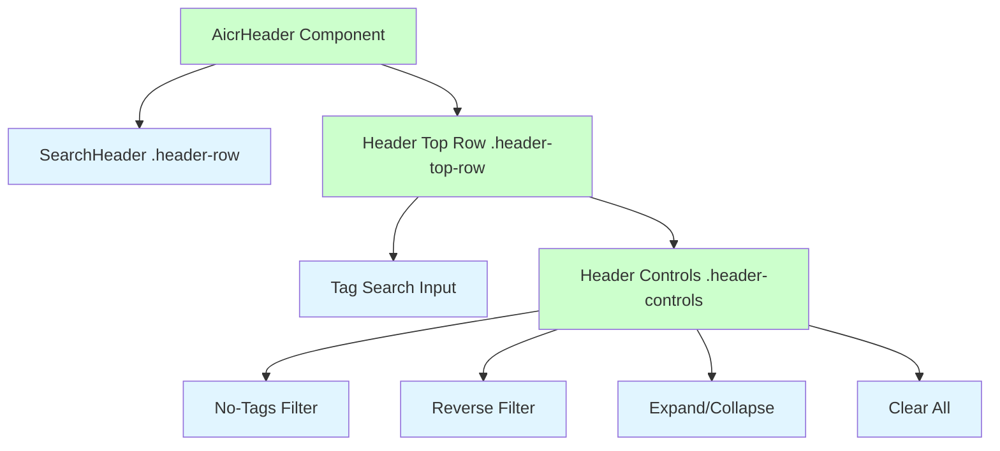
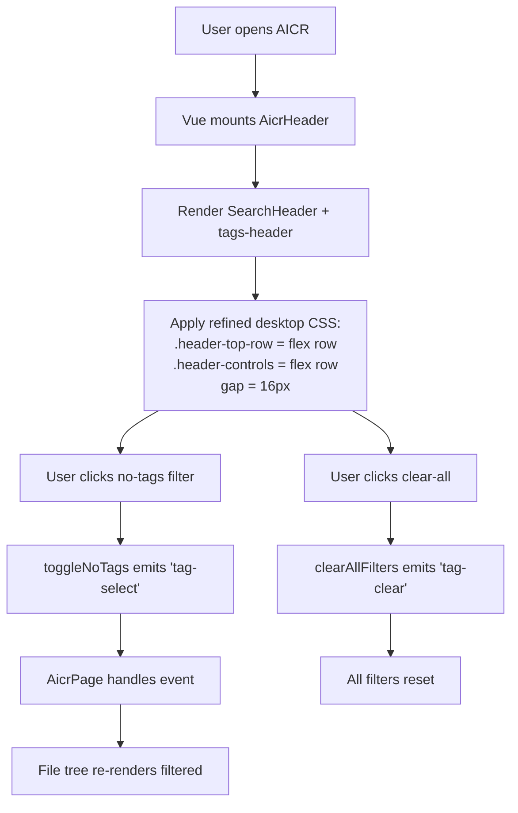
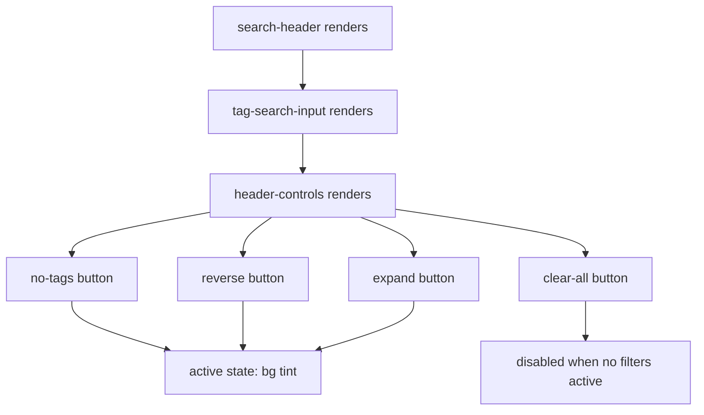
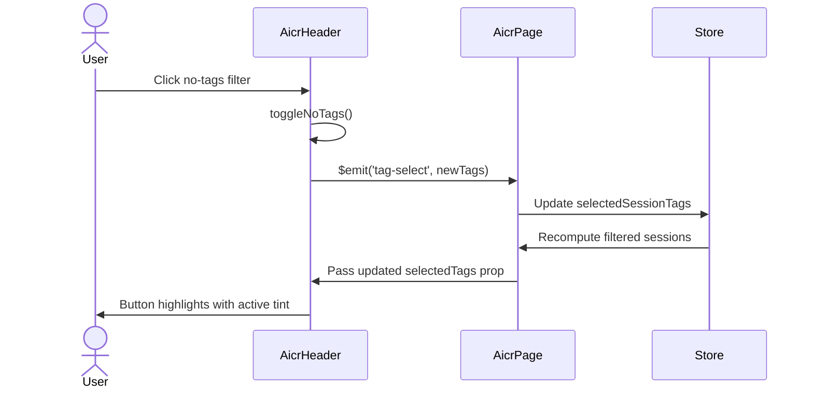

# Header Top Row Redesign — Requirement Tasks

> **Document Version**: v1.0 | **Last Updated**: 2026-05-02 | **Maintainer**: Claude Sonnet 4.6 | **Tool**: Claude Code
>
> **Related Documents**: [Requirement Document](./01_requirement-document.md) | [Design Document](./03_design-document.md) | [Usage Document](./04_usage-document.md) | [CLAUDE.md](../../CLAUDE.md)
>
> **Git Branch**: main
>
> **Doc Start Time**: 08:52:00 | **Doc Last Update Time**: 08:52:00
>

[Feature Overview](#feature-overview) | [Feature Analysis](#feature-analysis) | [User Story Table](#user-story-table) | [Main Operation Scenarios](#main-operation-scenario-definitions) | [Impact Analysis](#impact-analysis) | [Feature Details](#feature-details) | [Acceptance Criteria](#acceptance-criteria) | [Usage Scenario Examples](#usage-scenario-examples)

---

## Feature Overview

The `header-top-row` redesign is a focused UI polish of the AICR page header. The current row places the global `search-header` component and the `.tags-header` control cluster side by side without a unifying visual frame, which makes the boundary between "search" and "filter" ambiguous. The redesign introduces a dedicated `.header-controls` wrapper around the tag buttons, reorders controls by usage frequency, tightens spacing, and adds active-state tinting and focus rings. All changes are presentational: no props, events, or data contracts are modified.

🎯 **Separation of concerns**: Search zone vs. filter zone.  
⚡ **Minimum touch**: Only `.header-top-row` and `.tags-header` styles change.  
📖 **Convention alignment**: Uses existing CSS custom properties and breakpoint strategy.

---

## Feature Analysis

### Feature Decomposition Diagram

The header top row now explicitly splits into a search zone (`search-header`) and a filter zone (`.tags-header`). Inside the filter zone, a new `.header-controls` wrapper groups the four filter buttons so they behave as a single visual unit.

### User Flow Diagram

The user flow is unchanged; only the visual presentation of the control surface is refined.

### Feature Flow Diagram

Active filter buttons receive a unified active-state tint. The clear-all button disables itself when no filters are active.

### Sequence Diagram

No data contracts change; the sequence is identical to the current implementation.

---

## User Story Table

**Priority**: 🔴 P0 | 🟡 P1 | 🟢 P2

| User Story | Acceptance Criteria | Process-Generated Documents | Output Smart Documents |
|------------|---------------------|----------------------------|------------------------|
| 🔴 As an AICR user, I want the top header row to have a cleaner layout, so that I can quickly locate search and filter controls.  **Main Operation Scenarios**: - Desktop user views the optimized header-top-row layout - User interacts with consolidated tag filter controls - Tablet user views the responsive header-top-row layout | 1. `.header-top-row` uses a refined flex layout with clear separation between search and tag controls. 2. Tag filter buttons are grouped in a compact toolbar with consistent spacing. 3. All interactive elements have visible hover and focus states. 4. The layout adapts gracefully at 1025 px, 1024 px, and 768 px breakpoints. | [Requirement Tasks](./02_requirement-tasks.md) [Design Document](./03_design-document.md) [Project Report](./07_project-report.md) | [Generate Document Skill](../../.claude/skills/generate-document/SKILL.md) [Requirement Document Specification](../../.claude/skills/generate-document/rules/requirement-document.md) [Requirement Document Template](../../.claude/skills/generate-document/templates/requirement-document.md) [Requirement Document Checklist](../../.claude/skills/generate-document/checklists/requirement-document.md) |

---

## Main Operation Scenario Definitions

### Scenario 1 — Desktop user views optimized header-top-row layout

- **Scenario description**: On a desktop viewport (`≥1025 px`), the user sees the search box on the left and the tag toolbar on the right, separated by a `16 px` gap.
- **Pre-conditions**: AICR page is loaded; viewport width is at least `1025 px`.
- **Operation steps**:
  1. Open `http://localhost:8000/src/views/aicr/index.html` on a desktop browser.
  2. Observe the `.header-top-row` area.
- **Expected result**: `search-header` and `.tags-header` are horizontally aligned, vertically centered, and do not wrap.
- **Verification focus points**: Gap is `16 px`; buttons share the same height; active filters show tinted background.
- **Related design document chapters**: [Changes — Solution](./03_design-document.md#fixeschanges), [Implementation Details — CSS Rules](./03_design-document.md#implementation-details)

### Scenario 2 — User interacts with consolidated tag filter controls

- **Scenario description**: The user clicks individual filter buttons in the tag toolbar and observes visual feedback.
- **Pre-conditions**: AICR page is loaded; at least one tag exists or `noTagsCount > 0`.
- **Operation steps**:
  1. Click the "no tags" filter button.
  2. Click the "reverse" filter button.
  3. Click the "expand" filter button.
  4. Click the "clear all" button.
- **Expected result**: Each clicked button toggles its state, shows the active tint when enabled, and emits the correct event. The clear-all button disables itself when no filters are active.
- **Verification focus points**: Active tint uses `--accent-primary` at `15 %` opacity; focus ring is visible on keyboard navigation; events match existing behavior.
- **Related design document chapters**: [Implementation Details — Key Code](./03_design-document.md#implementation-details)

### Scenario 3 — Tablet user views responsive header-top-row layout

- **Scenario description**: On a tablet viewport (`≤1024 px`), the header top row stacks vertically and remains usable.
- **Pre-conditions**: AICR page is loaded; viewport width is at most `1024 px`.
- **Operation steps**:
  1. Open the AICR page on a tablet or resize browser to `1024 px`.
  2. Observe the `.header-top-row` area.
- **Expected result**: `search-header` and `.tags-header` stack vertically with `12 px` gap; tag toolbar buttons remain tappable (`≥44 px` touch target).
- **Verification focus points**: No horizontal overflow; touch targets meet accessibility minimum; stacked layout is visually balanced.
- **Related design document chapters**: [Changes — Responsive Breakpoints](./03_design-document.md#fixeschanges)

---

## Impact Analysis

### Search Terms and Change Point List

| # | Search Term | Found In | Change Point |
|---|-------------|----------|--------------|
| 1 | `.header-top-row` | `aicrHeader/index.html`, `aicrHeader/index.css` | Restructure flex layout; add `.header-controls` wrapper |
| 2 | `.tags-header` | `aicrHeader/index.html`, `aicrHeader/index.css` | Reorder buttons; wrap buttons in `.header-controls` |
| 3 | `.header-controls` | `aicrHeader/index.css` | New CSS rule for button grouping |
| 4 | `tag-filter-btn` | `aicrHeader/index.css` | Add active-tint and focus-ring styles |
| 5 | `@media (min-width: 1025px)` | `aicrHeader/index.css` | Update `.header-top-row` gap and alignment |
| 6 | `@media (max-width: 1024px)` | `aicrHeader/index.css` | Preserve vertical stack; verify gap consistency |
| 7 | `--accent-primary` | `theme.css`, `aicrHeader/index.css` | Use for active tint and focus ring |

### Change Point Impact Chain

| Change Point | Direct Impact | Transitive Impact | Closure |
|--------------|---------------|-------------------|---------|
| `.header-top-row` restructure | `aicrHeader/index.html` | `.header-top-row .header-row` CSS selectors need adjustment | Closed: CSS selectors updated within component |
| `.header-controls` wrapper | `aicrHeader/index.css` | `.tags-header-actions` may become redundant or repurposed | Closed: CSS rewritten to target `.header-controls` |
| Active-tint styles | `aicrHeader/index.css` | No JavaScript changes; classes `.active` already exist | Closed: `.tag-filter-btn.active` rule added |
| Focus-ring styles | `aicrHeader/index.css` | No component logic changes | Closed: Pure CSS enhancement |
| Responsive breakpoints | `aicrHeader/index.css` | No other components reference these breakpoints | Closed: Scoped to AicrHeader |

### Dependency Closure Summary

| Dependency | Status | Verification |
|------------|--------|------------|
| `SearchHeader` (CDN) | ✅ Compatible | No props/events changed; only CSS positioning affected |
| `YiIconButton` (CDN) | ✅ Compatible | Used inside tag search clear; untouched |
| `AicrPage` | ✅ Compatible | No event renames or payload changes |
| CSS custom properties | ✅ Compatible | `--accent-primary`, `--spacing-md`, etc. remain valid |
| `localStorage` tag order | ✅ Compatible | No persistence logic touched |

### Uncovered Risks

| Risk | Likelihood | Disposal |
|------|------------|----------|
| `.header-controls` may wrap awkwardly on narrow desktop (`1025 px–1150 px`) | Medium | Allow `flex-wrap: wrap` with `gap` preserved; test at `1025 px` |
| Active tint color may clash with existing `.active` border color | Low | Verify contrast ratio against `--bg-secondary`; adjust opacity if needed |
| Users may not immediately recognize the reordered controls | Low | Usage document explains new order; no modal onboarding needed |

### Change Scope Summary

- **Directly modify**: 2 files (`aicrHeader/index.html`, `aicrHeader/index.css`)
- **Verify compatibility**: 1 file (`aicrHeader/index.js` — no logic changes)
- **Trace transitive**: 0 files (no external dependencies affected)
- **Need manual review**: 1 file (`aicrHeader/index.css` — visual regression at breakpoints)

---

## Feature Details

### Control Grouping

- **Feature description**: Introduce `.header-controls` as a flex wrapper around the four filter buttons inside `.tags-header`.
- **Value**: Creates a unified visual toolbar that users can scan as a single unit.
- **Pain point solved**: Currently buttons float with uneven gaps, making it hard to distinguish where the search box ends and the filter cluster begins.

### Active-State Tint

- **Feature description**: Apply a semi-transparent background tint (`rgba` from `--accent-primary` at `15 %`) to `.tag-filter-btn.active`.
- **Value**: Makes active filters instantly recognizable without relying solely on border color.
- **Pain point solved**: The current `.active` state only changes border color, which is subtle on some monitors.

### Focus Rings

- **Feature description**: Add `outline: 2px solid var(--accent-primary)` on `:focus-visible` for all `.tag-filter-btn` and `.tags-clear-btn` elements.
- **Value**: Satisfies WCAG 2.1 focus-visible requirements.
- **Pain point solved**: Keyboard users currently have no visible focus indicator on filter buttons.

### Responsive Wrap

- **Feature description**: On narrow desktop (`1025 px–1150 px`), allow `.header-top-row` to wrap so the tag toolbar can drop below the search box instead of being truncated.
- **Value**: Prevents controls from being inaccessible on small laptops.
- **Pain point solved**: Current `nowrap` rule forces controls into a single line that can overflow.

---

## Acceptance Criteria

### P0 — Core

1. `.header-top-row` flex layout is restructured with a dedicated `.header-controls` wrapper for tag buttons.
2. Tag filter buttons render as a unified toolbar with equal heights and shared border radius.
3. Search box and tag toolbar are vertically centered and separated by `16 px` gap.
4. All breakpoints produce a usable layout without clipping.

### P1 — Important

5. Active filter states use a distinct background tint.
6. Focus rings are visible for keyboard navigation.
7. Clear-all button is rightmost in the toolbar.

### P2 — Nice-to-have

8. Subtle `0.2 s` transition on state changes.
9. Tooltips are concise and localized.

---

## Usage Scenario Examples

### 📋 Scenario 1 — Desktop user scans the header

- **Background**: User opens AICR on a 1440 px monitor.
- **Operation**: User glances at the header.
- **Result**: Search and tag toolbar are clearly separated, active filters are tinted.

### 🎨 Scenario 2 — User toggles a filter

- **Background**: User wants to view files without tags.
- **Operation**: User clicks the no-tags button.
- **Result**: Button background shifts to active tint; file tree updates.

---

## Postscript: Future Planning & Improvements

- Consider a dropdown menu for the tag toolbar on widths between `1025 px` and `1100 px` to prevent wrapping.
- Add keyboard-shortcut documentation in a follow-up accessibility pass.
