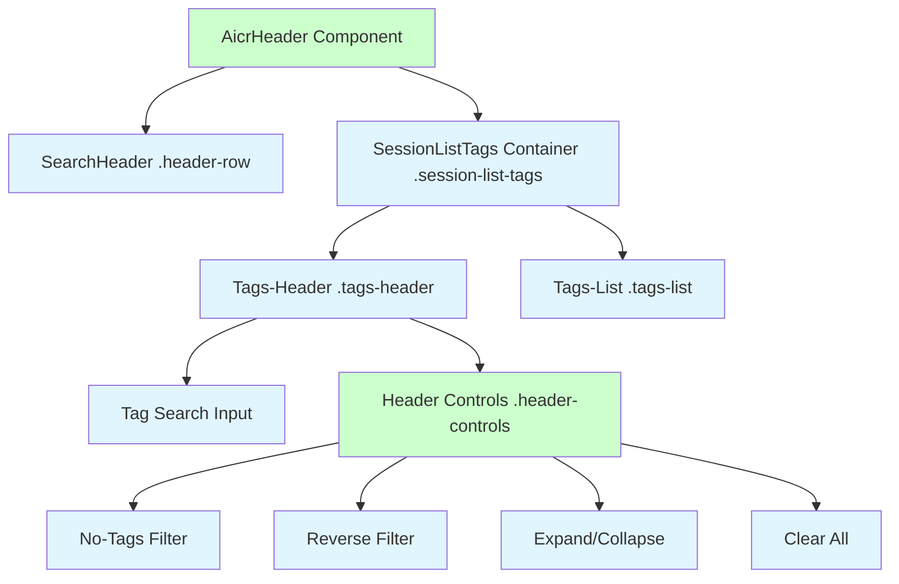
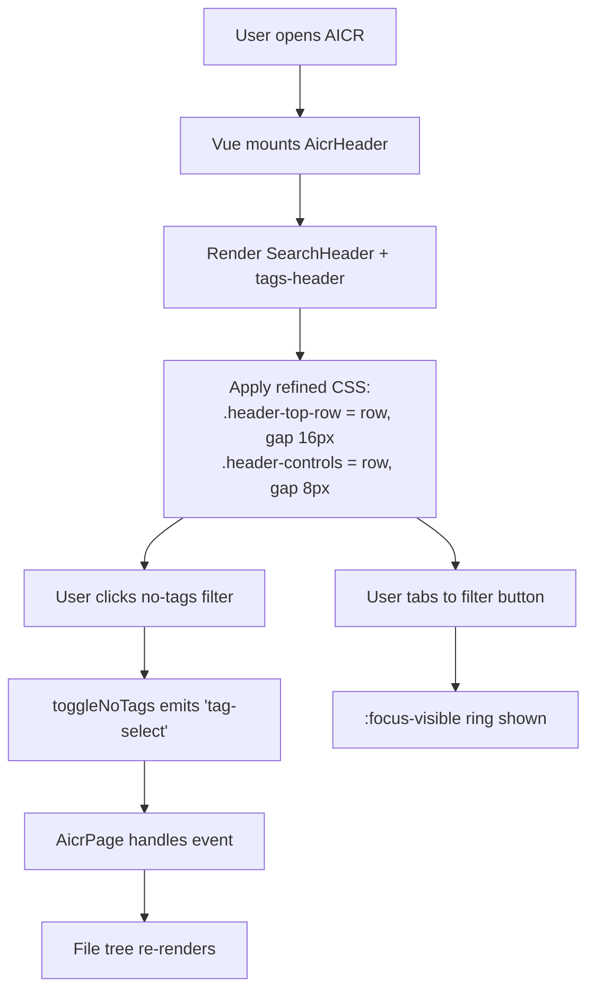
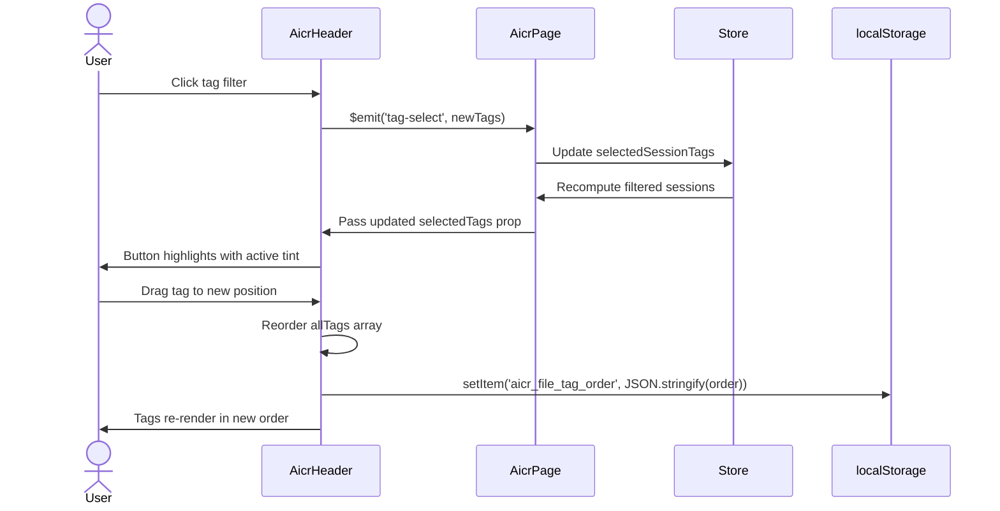

# Header Top Row Redesign — Design Document

> **Document Version**: v1.0 | **Last Updated**: 2026-05-02 | **Maintainer**: Claude Sonnet 4.6 | **Tool**: Claude Code
>
> **Related Documents**: [Requirement Document](./01_requirement-document.md) | [Requirement Tasks](./02_requirement-tasks.md) | [Usage Document](./04_usage-document.md) | [CLAUDE.md](../../CLAUDE.md)
>
> **Git Branch**: main
>
> **Doc Start Time**: 08:55:00 | **Doc Last Update Time**: 08:55:00
>

[Design Overview](#design-overview) | [Architecture Design](#architecture-design) | [Changes](#changes) | [Implementation Details](#implementation-details) | [Impact Analysis](#impact-analysis) | [Main Operation Scenario Implementation](#main-operation-scenario-implementation) | [Data Structure Design](#data-structure-design)

---

## Design Overview

This design restructures the `.header-top-row` flex container inside `AicrHeader` to improve visual clarity and ease of use. The current row places `search-header` and `.tags-header` side by side without an explicit grouping frame for the filter buttons, which makes the control surface feel scattered. The redesign introduces a `.header-controls` wrapper around the four filter buttons, reorders them by frequency of use, adds an active-state tint, and ensures visible focus rings. All changes are strictly presentational: no Vue props, events, computed properties, or drag-and-drop logic are modified.

The design favors a single-wrapper approach: by adding `.header-controls` inside `.tags-header` and moving the four buttons into it, we create a unified toolbar that users can scan as one unit. CSS changes are limited to `aicrHeader/index.css`; HTML changes are limited to `aicrHeader/index.html`.

🎯 **Separation of concerns**: Search zone vs. filter zone.  
⚡ **Minimum touch**: Only `.header-top-row` and `.tags-header` markup and styles change.  
🔧 **Fix the root cause**: Uneven spacing and lack of visual grouping stem from buttons being direct children of `.tags-header` with inconsistent margins.

---

## Architecture Design

### Overall Architecture



`AicrHeader` owns the entire header area. It renders `SearchHeader` as its first child and `.session-list-tags` as its second child. Inside `.session-list-tags`, `.tags-header` now contains both the tag search input and the new `.header-controls` wrapper. The `.header-controls` wrapper groups the four filter buttons into a single flex row.

### Module Division

| Module | Responsibility | Location |
|--------|---------------|----------|
| `AicrHeader` | Orchestrates header children; emits tag and search events upward | `src/views/aicr/components/aicrHeader/index.js` |
| `SearchHeader` | Global search input, home/news buttons, composition handling | `cdn/components/SearchHeader/` (external; unchanged) |
| `.header-top-row` (inline) | Hosts search-header and tags-header; provides flex layout | Inline in `aicrHeader/index.html`; styles in `aicrHeader/index.css` |
| `.header-controls` (new wrapper) | Groups filter buttons into a unified toolbar | Inline in `aicrHeader/index.html`; styles in `aicrHeader/index.css` |
| `AicrPage` | Parent view; passes tag state and listens to header events | `src/views/aicr/components/aicrPage/index.js` |

### Core Flow



The core flow is identical to the current implementation; only the visual presentation changes.

---

## Changes

### Problem Analysis

The current desktop layout has two presentational issues in `.header-top-row`:

1. **No visual grouping**: The four filter buttons (`no-tags`, `reverse`, `expand`, `clear`) are direct children of `.tags-header-actions` with uneven gaps and no shared background or border, making them read as separate, unrelated widgets.
2. **Subtle active states**: The current `.active` class only changes border color, which is hard to notice on monitors with low contrast or when viewed at an angle.
3. **Missing focus indicators**: Filter buttons have no visible focus ring, making keyboard navigation impossible to follow.

### Solution

#### Idea

Introduce `.header-controls` as a flex wrapper around the filter buttons. Apply a shared height, border radius, and subtle background to the wrapper so the buttons read as a single toolbar. Add an active-state tint (`--accent-primary` at `15 %` opacity) and a `2 px` focus ring. Allow `.header-top-row` to wrap on narrow desktop to prevent truncation.

#### File List and Selection Rationale

| # | File | Change Type | Rationale |
|---|------|-------------|-----------|
| 1 | `src/views/aicr/components/aicrHeader/index.html` | Restructure | Wrap filter buttons in `.header-controls`; reorder buttons |
| 2 | `src/views/aicr/components/aicrHeader/index.css` | Rewrite styles | Add `.header-controls` rules; add active tint and focus ring; adjust responsive breakpoints |

#### Before/After Comparison

**Before (desktop ≥1025px)**:
```
.header-top-row [flex row]
├── .header-row [auto width]
└── .tags-header [auto width]
    ├── .tag-search-container
    └── .tags-header-actions [no wrapper]
        ├── no-tags button
        ├── reverse button
        ├── expand button
        └── clear-all button
```

**After (desktop ≥1025px)**:
```
.header-top-row [flex row]
├── .header-row [auto width]
└── .tags-header [auto width]
    ├── .tag-search-container
    └── .header-controls [new flex row wrapper]
        ├── no-tags button
        ├── reverse button
        ├── expand button
        └── clear-all button
```

---

## Impact Analysis

### Search Terms and Change Point List

| # | Search Term | Found In | Change Point |
|---|-------------|----------|--------------|
| 1 | `.header-top-row` | `aicrHeader/index.html`, `aicrHeader/index.css` | Restructure flex layout |
| 2 | `.tags-header` | `aicrHeader/index.html`, `aicrHeader/index.css` | Reorder buttons; add `.header-controls` wrapper |
| 3 | `.header-controls` | `aicrHeader/index.css` | New CSS rule for button grouping |
| 4 | `tag-filter-btn` | `aicrHeader/index.css` | Add active-tint and focus-ring styles |
| 5 | `@media (min-width: 1025px)` | `aicrHeader/index.css` | Update gap and alignment |
| 6 | `@media (max-width: 1024px)` | `aicrHeader/index.css` | Preserve vertical stack |
| 7 | `--accent-primary` | `theme.css`, `aicrHeader/index.css` | Use for active tint and focus ring |

### Change Point Impact Chain

| Change Point | Direct Impact | Transitive Impact | Closure |
|--------------|---------------|-------------------|---------|
| `.header-top-row` restructure | `aicrHeader/index.html` | CSS selectors updated within component | Closed: scoped to AicrHeader |
| `.header-controls` wrapper | `aicrHeader/index.css` | `.tags-header-actions` repurposed | Closed: CSS rewritten |
| Active-tint styles | `aicrHeader/index.css` | No JavaScript changes | Closed: `.tag-filter-btn.active` rule added |
| Focus-ring styles | `aicrHeader/index.css` | No component logic changes | Closed: pure CSS |
| Responsive breakpoints | `aicrHeader/index.css` | No other components affected | Closed: scoped to AicrHeader |

### Dependency Closure Summary

| Dependency | Status | Verification |
|------------|--------|------------|
| `SearchHeader` (CDN) | ✅ Compatible | No props/events changed |
| `YiIconButton` (CDN) | ✅ Compatible | Used inside tag search clear; untouched |
| `AicrPage` | ✅ Compatible | No event renames or payload changes |
| CSS custom properties | ✅ Compatible | Existing variables remain valid |
| `localStorage` tag order | ✅ Compatible | No persistence logic touched |

### Uncovered Risks

| Risk | Likelihood | Disposal |
|------|------------|----------|
| `.header-controls` may wrap awkwardly on narrow desktop (`1025 px–1150 px`) | Medium | Allow `flex-wrap: wrap` with `gap` preserved |
| Active tint may clash with existing `.active` border color | Low | Verify contrast; adjust opacity if needed |
| Users may not recognize reordered controls immediately | Low | Document in usage doc |

### Change Scope Summary

- **Directly modify**: 2 files (`aicrHeader/index.html`, `aicrHeader/index.css`)
- **Verify compatibility**: 1 file (`aicrHeader/index.js`)
- **Trace transitive**: 0 files
- **Need manual review**: 1 file (`aicrHeader/index.css` — visual regression at breakpoints)

---

## Implementation Details

### Technical Points

1. **HTML Nesting**: Introduce `.header-controls` as a child of `.tags-header`. Move the four filter buttons from `.tags-header-actions` into `.header-controls`.
   - *What*: Add wrapper; move buttons.
   - *How*: Edit `aicrHeader/index.html`.
   - *Why*: Flex containers can only align their direct children. A shared wrapper enables unified styling.

2. **CSS Grouping Styles**:
   - `.header-controls`: `display: flex`, `flex-direction: row`, `align-items: center`, `gap: 8px`, `padding: 4px`, `background: var(--bg-tertiary)`, `border-radius: 8px`.
   - `.header-controls .tag-filter-btn`: remove individual margins; rely on parent `gap`.

3. **Active-State Tint**:
   - `.tag-filter-btn.active`: `background-color: color-mix(in srgb, var(--accent-primary) 15%, transparent)`.
   - Fallback for browsers without `color-mix`: `background-color: rgba(59, 130, 246, 0.15)` (if `--accent-primary` is blue).

4. **Focus Rings**:
   - `.tag-filter-btn:focus-visible`, `.tags-clear-btn:focus-visible`: `outline: 2px solid var(--accent-primary)`, `outline-offset: 2px`.

5. **Responsive Wrap**:
   - `@media (min-width: 1025px)`: `.header-top-row` keeps `flex-wrap: nowrap` by default, but if viewport is `1025 px–1150 px`, allow `flex-wrap: wrap` with `gap` preserved.

### Key Code

**`aicrHeader/index.html` — updated button grouping**:
```html
<div class="tags-header">
    <!-- 标签搜索框 -->
    <div class="tag-search-container">...</div>

    <!-- 过滤控制工具栏 -->
    <div class="header-controls">
        <button type="button" class="tag-filter-btn tag-filter-no-tags-btn" ...>...</button>
        <button type="button" class="tag-filter-btn tag-filter-reverse" ...>...</button>
        <button type="button" class="tag-filter-btn" ...>...</button>
        <button type="button" class="tags-clear-btn" ...>...</button>
    </div>
</div>
```

**`aicrHeader/index.css` — new grouping and state styles**:
```css
/* 过滤控制工具栏 */
.header-controls {
    display: flex;
    flex-direction: row;
    align-items: center;
    gap: 8px;
    padding: 4px 8px;
    background: var(--bg-tertiary);
    border-radius: 8px;
}

/* 按钮统一高度和圆角 */
.header-controls .tag-filter-btn,
.header-controls .tags-clear-btn {
    height: 36px;
    width: 36px;
    display: inline-flex;
    align-items: center;
    justify-content: center;
    border-radius: 6px;
    border: 1px solid var(--border-secondary);
    background: transparent;
    cursor: pointer;
    transition: background-color 0.2s ease, transform 0.2s ease;
}

/* 悬停状态 */
.header-controls .tag-filter-btn:hover,
.header-controls .tags-clear-btn:hover {
    background-color: var(--bg-hover);
}

/* 激活状态 tinted background */
.header-controls .tag-filter-btn.active {
    background-color: color-mix(in srgb, var(--accent-primary) 15%, transparent);
    border-color: var(--accent-primary);
}

/* 焦点环 */
.header-controls .tag-filter-btn:focus-visible,
.header-controls .tags-clear-btn:focus-visible {
    outline: 2px solid var(--accent-primary);
    outline-offset: 2px;
}

/* 清除按钮在最右侧 */
.header-controls .tags-clear-btn {
    margin-left: 4px;
}
```

### Dependencies

- `SearchHeader` (CDN component): no version change.
- `YiIconButton` (CDN component): no version change.
- Existing CSS custom properties: `--accent-primary`, `--bg-tertiary`, `--border-secondary`, `--bg-hover`.

### Testing Considerations

1. Visual regression at `1025 px`, `1200 px`, `1440 px`, `1920 px`.
2. Keyboard tab order through search box → tag search → no-tags → reverse → expand → clear.
3. Focus ring visibility on all buttons.
4. Active tint applies correctly when each filter is toggled.
5. Clear-all button disables when no filters are active.
6. Touch targets remain `≥44 px` on tablet.

---

## Main Operation Scenario Implementation

### Scenario 1 — Desktop user views optimized header-top-row layout

- **Linked requirement task**: [02 Requirement Tasks — Scenario 1](./02_requirement-tasks.md#scenario-1--desktop-user-views-optimized-header-top-row-layout)
- **Implementation overview**: Restructure `AicrHeader` HTML and CSS so that `.header-row` and `.tags-header` appear on the same line, with `.header-controls` grouping the filter buttons.
- **Modules and responsibilities**:
  - `AicrHeader` template: introduce `.header-controls` wrapper.
  - `AicrHeader` styles: style `.header-controls` as a flex row toolbar.
- **Key code paths**:
  - `aicrHeader/index.html` — wrapper insertion.
  - `aicrHeader/index.css` — `.header-controls` and responsive rules.
- **Verification points**:
  - `.header-row` and `.tags-header` share the same visual baseline.
  - `.header-controls` buttons are equal height and evenly spaced.

### Scenario 2 — User interacts with consolidated tag filter controls

- **Linked requirement task**: [02 Requirement Tasks — Scenario 2](./02_requirement-tasks.md#scenario-2--user-interacts-with-consolidated-tag-filter-controls)
- **Implementation overview**: No JavaScript changes required; all event bindings and emitters remain in their current locations.
- **Modules and responsibilities**:
  - `AicrHeader` computed/methods: unchanged.
- **Key code paths**:
  - `toggleNoTags` → `$emit('tag-select')`
  - `toggleReverse` → `$emit('tag-select')`
  - `toggleExpand` → `$emit('tag-filter-expand')`
  - `clearAllFilters` → `$emit('tag-clear')`
- **Verification points**:
  - Each button click produces the correct emitted event.
  - Active/highlight CSS classes still apply.
  - Focus ring is visible after keyboard navigation.

### Scenario 3 — Tablet user views responsive header-top-row layout

- **Linked requirement task**: [02 Requirement Tasks — Scenario 3](./02_requirement-tasks.md#scenario-3--tablet-user-views-responsive-header-top-row-layout)
- **Implementation overview**: Reuse existing tablet/mobile breakpoints; ensure `.header-top-row` stacks vertically and `.header-controls` remains horizontal.
- **Modules and responsibilities**:
  - `AicrHeader` styles: `@media (max-width: 1024px)` and `@media (max-width: 768px)` blocks.
- **Key code paths**:
  - `aicrHeader/index.css` — responsive media queries.
- **Verification points**:
  - No horizontal overflow at `768 px`.
  - Touch targets `≥44 px`.
  - `.header-controls` does not wrap on tablet.

---

## Data Structure Design

No new data structures are introduced. The existing data flow is:



The layout refactor does not alter this sequence. Props and events remain identical.

---

## Postscript: Future Planning & Improvements

- Evaluate collapsing `.header-controls` into an icon-only dropdown on widths between `1025 px` and `1100 px`.
- If the two-row header grows too tall, consider hiding the tag search input behind a search icon on narrow desktops.
- Add a visual "filter count" badge to the clear-all button when multiple filters are active.
