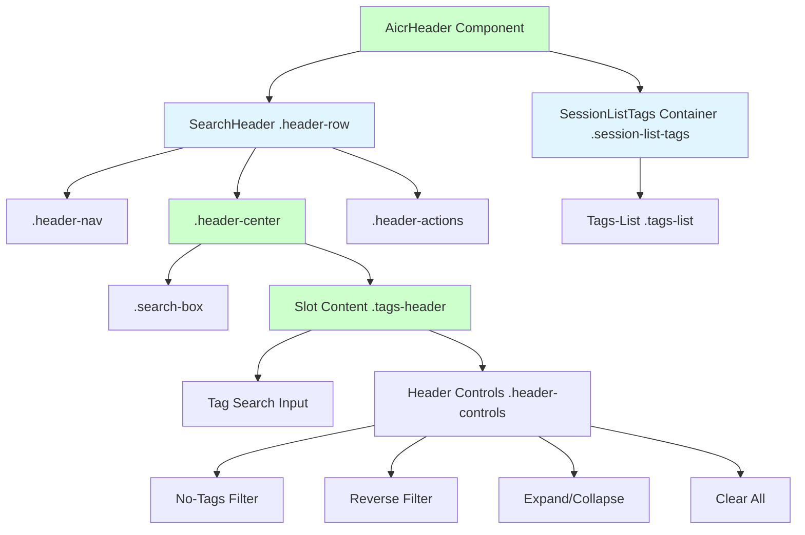
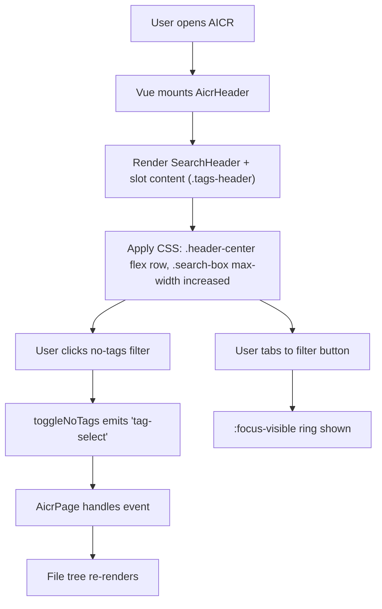
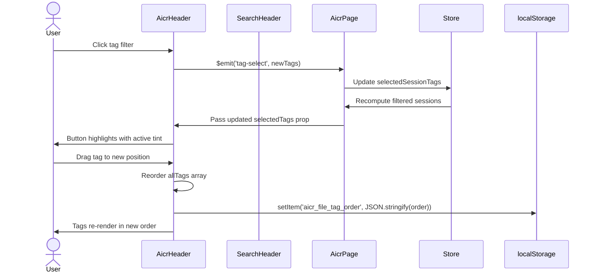

# Header Top Row Redesign — Design Document

> **Document Version**: v2.0 | **Last Updated**: 2026-05-02 | **Maintainer**: Claude Sonnet 4.6 | **Tool**: Claude Code
>
> **Related Documents**: [Requirement Document](./01_requirement-document.md) | [Requirement Tasks](./02_requirement-tasks.md) | [Usage Document](./04_usage-document.md) | [CLAUDE.md](../../CLAUDE.md)
>
> **Git Branch**: main
>
> **Doc Start Time**: 17:55:00 | **Doc Last Update Time**: 17:55:00
>

[Design Overview](#design-overview) | [Architecture Design](#architecture-design) | [Changes](#changes) | [Implementation Details](#implementation-details) | [Impact Analysis](#impact-analysis) | [Main Operation Scenario Implementation](#main-operation-scenario-implementation) | [Data Structure Design](#data-structure-design)

---

## Design Overview

This design restructures the AICR header by moving `.tags-header` from an external sibling of `SearchHeader` into `SearchHeader`'s own `.header-center` via a Vue default slot. The search box is widened to take advantage of the reclaimed horizontal space. All changes are strictly presentational: no Vue props, events, computed properties, or tag logic are modified.

The design favors slot composition over external wrappers: by placing `.tags-header` inside `SearchHeader`'s `.header-center`, the search and filter controls become a single visual unit that aligns naturally. The obsolete `.header-top-row` wrapper is removed, simplifying the DOM.

🎯 **Separation of concerns**: Search box and tag controls share `.header-center`; tag list remains below.  
⚡ **Minimum touch**: Only DOM nesting and CSS widths change.  
🔧 **Fix the root cause**: `.header-top-row` was an extra flex layer created solely to align search and tags side by side; slot composition makes it unnecessary.

---

## Architecture Design

### Overall Architecture



`AicrHeader` owns the entire header area. It renders `SearchHeader` as its first child and passes `.tags-header` into `SearchHeader`'s default slot. `SessionListTags` remains a separate child below. Inside `SearchHeader`, `.header-center` now contains both `.search-box` and the slot content.

### Module Division

| Module | Responsibility | Location |
|--------|---------------|----------|
| `SearchHeader` | Renders global search input, home/news buttons, composition handling; accepts default slot inside `.header-center` | `cdn/components/business/SearchHeader/` |
| `.header-center` (inline) | Hosts `.search-box` and slot content; provides flex layout | Inline in `SearchHeader/template.html`; styles in `SearchHeader/index.css` |
| `AicrHeader` | Orchestrates header children; passes `.tags-header` into SearchHeader slot; emits tag and search events upward | `src/views/aicr/components/aicrHeader/index.js` |
| `SessionListTags` | Renders tag list strip below the header | `src/views/aicr/components/sessionListTags/` |
| `AicrPage` | Parent view; passes tag state and listens to header events | `src/views/aicr/components/aicrPage/index.js` |

### Core Flow



The core flow is identical to the current implementation; only the visual nesting changes.

---

## Changes

### Problem Analysis

The current desktop layout has two presentational issues:

1. **Extra wrapper layer**: `.header-top-row` exists solely to place `search-header` and `.tags-header` side by side. It adds an unnecessary DOM level and complicates responsive CSS.
2. **Search box too narrow**: `.header-top-row .header-row` is capped at `420 px`, truncating longer search queries.

### Solution

#### Idea

Introduce a default slot in `SearchHeader`'s `.header-center`, positioned after `.search-box`. Move `.tags-header` from `AicrHeader`'s `.header-top-row` into this slot. Remove `.header-top-row` entirely. Increase `.search-box` `max-width` in the AICR context.

#### File List and Selection Rationale

| # | File | Change Type | Rationale |
|---|------|-------------|-----------|
| 1 | `cdn/components/business/SearchHeader/template.html` | Modify | Add default `<slot>` inside `.header-center` after `.search-box` |
| 2 | `cdn/components/business/SearchHeader/index.css` | Modify | Add `flex-wrap: wrap` to `.header-center` so slot content can wrap on narrow viewports |
| 3 | `src/views/aicr/components/aicrHeader/index.html` | Restructure | Remove `.header-top-row`; pass `.tags-header` into `<search-header>` slot |
| 4 | `src/views/aicr/components/aicrHeader/index.css` | Rewrite styles | Remove `.header-top-row` rules; increase `.search-box` width; adjust `.header-row` constraints |

#### Before/After Comparison

**Before (desktop ≥1025px)**:
```
.aicr-header
└── .header-top-row [flex row]
    ├── .header-row [auto width, max-width 420px]
    │   ├── .header-nav
    │   ├── .header-center (.search-box)
    │   └── .header-actions
    └── .tags-header
        ├── .tag-search-container
        └── .header-controls
└── .session-list-tags
```

**After (desktop ≥1025px)**:
```
.aicr-header
├── .header-row
│   ├── .header-nav
│   ├── .header-center [flex row]
│   │   ├── .search-box [wider]
│   │   └── .tags-header [slot content]
│   │       ├── .tag-search-container
│   │       └── .header-controls
│   └── .header-actions
└── .session-list-tags
```

---

## Impact Analysis

### Search Terms and Change Point List

| # | Search Term | Found In | Change Point |
|---|-------------|----------|--------------|
| 1 | `.header-top-row` | `aicrHeader/index.html`, `aicrHeader/index.css` | Remove wrapper and related CSS |
| 2 | `<slot>` | `SearchHeader/template.html` | New slot after `.search-box` |
| 3 | `.header-center` | `SearchHeader/index.css`, `aicrHeader/index.css` | Adjust flex and max-width |
| 4 | `.search-box` | `SearchHeader/index.css`, `aicrHeader/index.css` | Increase max-width in AICR context |
| 5 | `.tags-header` | `sessionListTags/index.css` | Verify styles when nested in `.header-center` |
| 6 | `@media (min-width: 1025px)` | `aicrHeader/index.css` | Remove `.header-top-row` references |
| 7 | `@media (max-width: 1024px)` | `aicrHeader/index.css` | Remove `.header-top-row` references |

### Change Point Impact Chain

| Change Point | Direct Impact | Transitive Impact | Closure |
|--------------|---------------|-------------------|---------|
| `.header-top-row` removal | `aicrHeader/index.html`, `aicrHeader/index.css` | `.session-list-tags` margin may need adjustment | Closed: CSS rewritten |
| SearchHeader slot addition | `SearchHeader/template.html`, `SearchHeader/index.css` | Other consumers must be verified | Closed: backward compatible |
| `.tags-header` moved to slot | `aicrHeader/index.html` | `sessionListTags/index.css` selectors still valid | Closed: class names unchanged |
| Search box width increase | `aicrHeader/index.css` | No JavaScript changes | Closed: pure CSS |
| Responsive breakpoints | `aicrHeader/index.css` | No other components affected | Closed: scoped to AicrHeader |

### Dependency Closure Summary

| Dependency | Status | Verification |
|------------|--------|--------------|
| `SearchHeader` (CDN) | ✅ Compatible | Slot is optional; no props/events changed |
| `YiIconButton` (CDN) | ✅ Compatible | Used inside tag search clear; untouched |
| `AicrPage` | ✅ Compatible | No event renames or payload changes |
| CSS custom properties | ✅ Compatible | Existing variables remain valid |
| `localStorage` tag order | ✅ Compatible | No persistence logic touched |

### Uncovered Risks

| Risk | Likelihood | Disposal |
|------|------------|----------|
| `.header-center` may not fit both `.search-box` and `.tags-header` on narrow desktop (`1025 px–1200 px`) | Medium | Allow `flex-wrap: wrap` on `.header-center`; test at `1025 px` |
| SearchHeader slot may affect other consumers if they inadvertently pass child content | Low | Verify no other `<search-header>` usage has child content |
| `.tags-header` styles from `sessionListTags/index.css` may conflict with `.header-center` flex context | Low | Inspect computed styles after move |

### Change Scope Summary

- **Directly modify**: 4 files (`SearchHeader/template.html`, `SearchHeader/index.css`, `aicrHeader/index.html`, `aicrHeader/index.css`)
- **Verify compatibility**: 1 file (`SearchHeader/index.js` — no logic changes)
- **Trace transitive**: 1 file (`sessionListTags/index.css` — verify styles still apply)
- **Need manual review**: 2 files (`SearchHeader/index.css`, `aicrHeader/index.css` — visual regression at breakpoints)

---

## Implementation Details

### Technical Points

1. **SearchHeader Template**: Introduce `<slot></slot>` as the last child of `.header-center`, after `.search-box`.
   - *What*: Add default slot.
   - *How*: Edit `SearchHeader/template.html`.
   - *Why*: Vue 3 slots let consumers inject content without prop drilling or wrapper divs.

2. **SearchHeader CSS**: Add `flex-wrap: wrap` to `.header-center` so that `.search-box` and slot content can wrap on narrow viewports.
   - *What*: One new rule.
   - *How*: Edit `SearchHeader/index.css`.
   - *Why*: `.header-center` previously only held `.search-box`; now it may hold additional content.

3. **AicrHeader Template**: Remove `.header-top-row`. Place `.tags-header` inside `<search-header>` as slot content.
   - *What*: Remove wrapper; move content.
   - *How*: Edit `aicrHeader/index.html`.
   - *Why*: Slot composition replaces the need for an external flex wrapper.

4. **AicrHeader CSS**: Remove all `.header-top-row` rules. Increase `.search-box` max-width. Adjust `.header-row` constraints.
   - *What*: Rewrite aicrHeader CSS.
   - *How*: Edit `aicrHeader/index.css`.
   - *Why*: `.header-top-row` no longer exists; search box should be wider.

### Key Code

**`SearchHeader/template.html` — added slot**:
```html
<div class="header-center">
    <div class="search-box">...</div>
    <slot></slot>
</div>
```

**`SearchHeader/index.css` — flex-wrap support**:
```css
.header-center {
    /* existing rules preserved */
    flex-wrap: wrap;
}
```

**`aicrHeader/index.html` — slot usage**:
```html
<div class="aicr-header">
    <search-header
        v-model:search-query="searchQuery"
        placeholder="搜索网站、标签或描述..."
        ...
    >
        <div
            v-if="allTags && (allTags.length > 0 || (tagCounts && tagCounts.noTagsCount > 0))"
            class="tags-header">
            <div class="tag-search-container">...</div>
            <div class="header-controls">...</div>
        </div>
    </search-header>

    <div
        v-if="allTags && (allTags.length > 0 || (tagCounts && tagCounts.noTagsCount > 0))"
        class="session-list-tags">
        <div class="tags-list">...</div>
    </div>
</div>
```

**`aicrHeader/index.css` — wider search box, no header-top-row**:
```css
.aicr-header {
    padding: 10px var(--spacing-md);
    display: flex;
    flex-direction: column;
    align-items: stretch;
    gap: 12px;
    background: var(--bg-secondary);
    border-bottom: 1px solid var(--border-primary);
}

/* SearchHeader integration: wider search box */
.aicr-header .header-row {
    flex: 0 1 auto;
    display: flex;
    width: 100%;
    height: auto;
    padding: 0;
    background: transparent;
    backdrop-filter: none;
    -webkit-backdrop-filter: none;
    border-bottom: none;
    box-shadow: none;
    gap: 12px;
}

.aicr-header .header-row .header-center {
    max-width: 800px;
    flex-wrap: nowrap;
    gap: 12px;
}

.aicr-header .header-row .search-box {
    max-width: 520px;
    flex: 1 1 auto;
}

/* Desktop */
@media (min-width: 1025px) {
    .aicr-header .session-list-tags {
        flex: 1;
        min-width: 0;
    }

    .tags-list {
        justify-content: center;
    }
}

/* Ultra-wide */
@media (min-width: 1440px) {
    .aicr-header .header-row .header-center {
        max-width: 900px;
    }

    .aicr-header .header-row .search-box {
        max-width: 600px;
    }
}

/* Tablet */
@media (max-width: 1024px) {
    .aicr-header {
        padding: 12px var(--spacing-md);
    }

    .aicr-header .header-row .header-center {
        flex-wrap: wrap;
    }

    .aicr-header .session-list-tags {
        width: 100%;
    }
}

/* Mobile */
@media (max-width: 768px) {
    .aicr-header {
        padding: 12px var(--spacing-md);
        gap: 10px;
    }
}
```

### Dependencies

- `SearchHeader` (CDN component): no version change; slot is backward compatible.
- `YiIconButton` (CDN component): no version change.
- Existing CSS custom properties: `--accent-primary`, `--bg-secondary`, `--border-primary`, `--spacing-md`.

### Testing Considerations

1. Visual regression at `1025 px`, `1200 px`, `1440 px`, `1920 px`.
2. Verify `SearchHeader` without slot content still renders correctly on other pages.
3. Keyboard tab order through search box → tag search → no-tags → reverse → expand → clear.
4. Active tint applies correctly when each filter is toggled.
5. Clear-all button disables when no filters are active.
6. Touch targets remain `≥44 px` on tablet.

---

## Main Operation Scenario Implementation

### Scenario 1 — Desktop user views optimized header-top-row layout

- **Linked requirement task**: [02 Requirement Tasks — Scenario 1](./02_requirement-tasks.md#scenario-1--desktop-user-views-optimized-header-top-row-layout)
- **Implementation overview**: Restructure `AicrHeader` to use `SearchHeader` slot. `.tags-header` is now inside `.header-center`, after `.search-box`. Search box is wider.
- **Modules and responsibilities**:
  - `SearchHeader` template: add default slot.
  - `AicrHeader` template: remove `.header-top-row`; pass `.tags-header` into slot.
  - `AicrHeader` styles: remove `.header-top-row` rules; increase search box width.
- **Key code paths**:
  - `SearchHeader/template.html` — slot insertion.
  - `aicrHeader/index.html` — slot usage.
  - `aicrHeader/index.css` — width and responsive rules.
- **Verification points**:
  - `.tags-header` is inside `.header-center`.
  - `.search-box` is at least `520 px` wide on desktop.
  - No `.header-top-row` wrapper exists.

### Scenario 2 — User interacts with consolidated tag filter controls

- **Linked requirement task**: [02 Requirement Tasks — Scenario 2](./02_requirement-tasks.md#scenario-2--user-interacts-with-consolidated-tag-filter-controls)
- **Implementation overview**: No JavaScript changes required; all event bindings and emitters remain in their current locations.
- **Modules and responsibilities**:
  - `AicrHeader` computed/methods: unchanged.
- **Key code paths**:
  - `toggleNoTags` → `$emit('tag-select')`
  - `toggleReverse` → `$emit('tag-select')`
  - `toggleExpand` → `$emit('tag-filter-expand')`
  - `clearAllFilters` → `$emit('tag-clear')`
- **Verification points**:
  - Each button click produces the correct emitted event.
  - Active/highlight CSS classes still apply.
  - Focus ring is visible after keyboard navigation.

### Scenario 3 — Tablet user views responsive header-top-row layout

- **Linked requirement task**: [02 Requirement Tasks — Scenario 3](./02_requirement-tasks.md#scenario-3--tablet-user-views-responsive-header-top-row-layout)
- **Implementation overview**: Reuse existing tablet/mobile breakpoints; ensure `.header-center` wraps its contents on narrow viewports.
- **Modules and responsibilities**:
  - `SearchHeader` styles: `flex-wrap: wrap` on `.header-center`.
  - `AicrHeader` styles: `@media (max-width: 1024px)` and `@media (max-width: 768px)` blocks.
- **Key code paths**:
  - `SearchHeader/index.css` — `.header-center` responsive behavior.
  - `aicrHeader/index.css` — responsive media queries.
- **Verification points**:
  - No horizontal overflow at `768 px`.
  - Touch targets `≥44 px`.
  - `.header-center` wraps content gracefully.

---

## Data Structure Design

No new data structures are introduced. The existing data flow is:



The layout refactor does not alter this sequence. Props and events remain identical.

---

## Postscript: Future Planning & Improvements

- Evaluate collapsing `.tags-header` into an icon-only dropdown on widths between `1025 px` and `1200 px`.
- If the header grows too tall, consider hiding the tag search input behind a search icon on narrow desktops.
- Add a visual "filter count" badge to the clear-all button when multiple filters are active.
