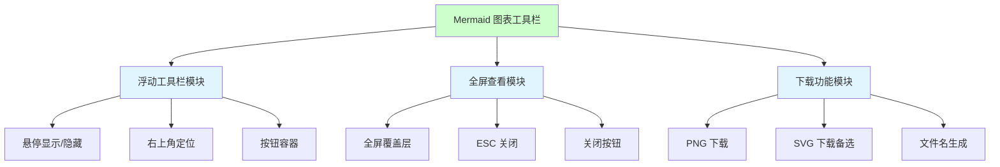
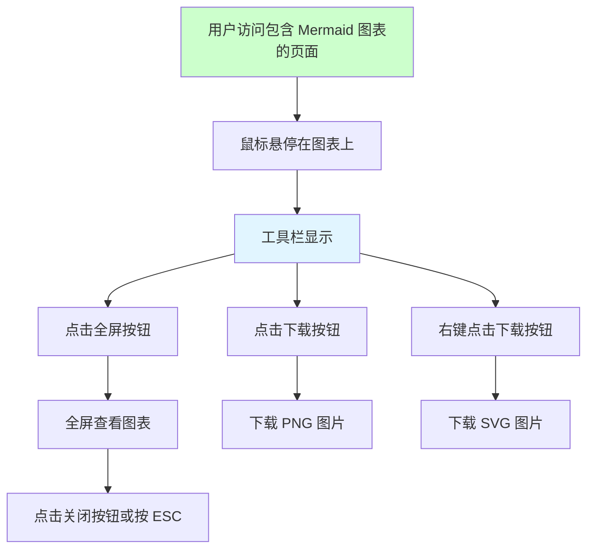
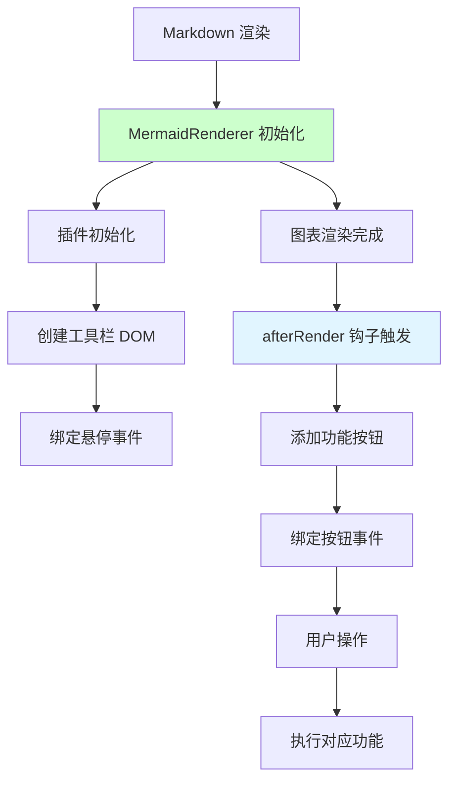
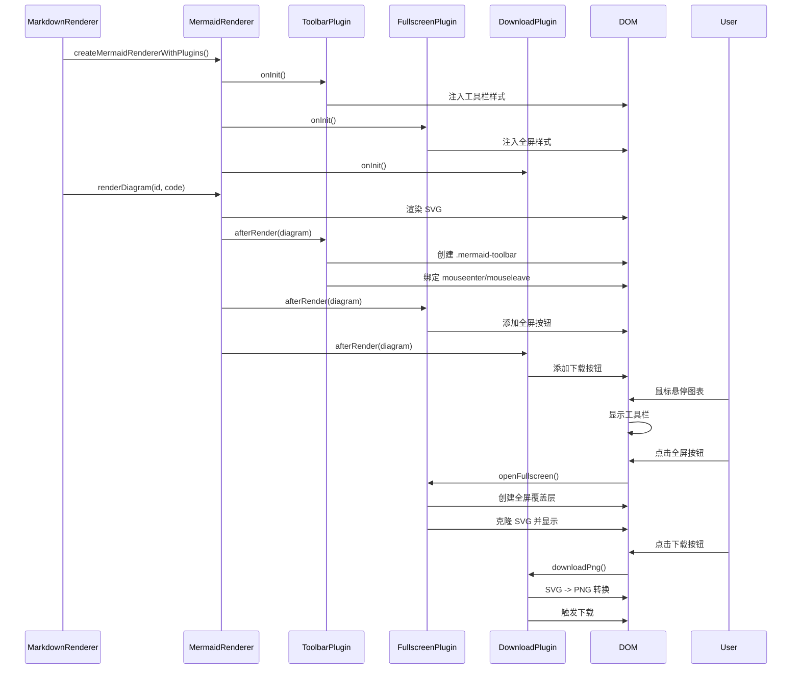

# Mermaid 图表工具栏需求任务

> **文档版本**: v1.0 | **最后更新**: 2026-04-25 | **维护者**: Claude Opus 4.7 | **工具**: Claude Code
>
> **关联文档**: [需求文档](./01_需求文档.md) | [设计文档](./03_设计文档.md) | [使用文档](./04_使用文档.md)
>
[功能概述](#功能概述) | [功能分析](#功能分析) | [用户故事表格](#用户故事表格) | [主要操作场景定义](#主要操作场景定义) | [影响分析](#影响分析) | [功能详情](#功能详情) | [验收标准](#验收标准) | [使用场景示例](#使用场景示例)

---

## 功能概述

为代码审查页面（src/views/aicr/index.html）中的 Mermaid 图表添加浮动工具栏，提供全屏查看和下载 PNG 功能。功能通过插件架构实现，不影响现有 Markdown 渲染流程。

🎯 **核心价值 1**: 浮动工具栏在悬停时显示，不干扰正常阅读
⚡ **核心价值 2**: 全屏模式让复杂图表更易查看
📖 **核心价值 3**: PNG 下载支持便捷分享和存档

## 功能分析

### 功能分解图

**功能分解说明**：功能分为三个核心模块，浮动工具栏负责 UI 呈现，全屏模块负责查看体验，下载模块负责导出功能。

### 用户流程图

**用户流程说明**：用户通过悬停触发工具栏显示，然后可选择全屏查看或下载操作。

### 功能流程图

**功能流程说明**：功能通过 MermaidRenderer 的插件架构实现，在 afterRender 钩子中注入工具栏和功能按钮。

### 完整时序图

**时序图说明**：展示了从插件初始化到用户交互的完整流程，各插件通过统一的钩子机制协作。

## 用户故事表格

| 用户故事 | 验收标准 | 过程生成文档 | 产出智能文档 |
|---------|---------|------------|------------|
| 🔴 作为代码审查页面的用户，我想要每个 Mermaid 图表右上角有浮动工具栏，以便能够方便地使用全屏查看和下载功能  **主要操作场景**： - 鼠标悬停显示工具栏 - 点击全屏按钮放大查看 - 点击下载按钮保存图片 | 1. 工具栏在鼠标悬停时显示，移开时隐藏 2. 全屏按钮可将图表放大到全屏模式 3. 下载按钮可将图表保存为 PNG 图片 | [需求任务](./02_需求任务.md) [设计文档](./03_设计文档.md) [项目报告](./07_项目报告.md) | [生成文档 Skill](../../.claude/skills/generate-document/SKILL.md) [需求文档规范](../../.claude/skills/generate-document/rules/需求文档.md) [动态检查清单](./05_动态检查清单.md) |

## 主要操作场景定义

### 🎯 主要操作场景：鼠标悬停显示工具栏

**场景描述**：用户将鼠标移动到 Mermaid 图表区域，显示浮动工具栏

**前置条件**：
- 页面已加载完成
- Mermaid 图表已渲染成功
- 工具栏插件已初始化

**操作步骤**：
1. 用户将鼠标指针移动到 Mermaid 图表上
2. 工具栏以淡入效果显示在图表右上角
3. 用户将鼠标指针移出图表区域
4. 工具栏以淡出效果隐藏

**预期结果**：
- 工具栏在鼠标进入时显示，离开时隐藏
- 显示/隐藏有平滑的过渡动画
- 工具栏不遮挡图表主要内容

**验证关注点**：
- 悬停区域是否包含整个图表容器
- 动画过渡是否流畅
- 工具栏定位是否准确

**关联设计文档章节**：[设计文档 - 实现细节 - 工具栏实现](./03_设计文档.md#工具栏实现)

---

### 🎯 主要操作场景：全屏查看图表

**场景描述**：用户点击工具栏中的全屏按钮，在全屏覆盖层中查看图表

**前置条件**：
- 工具栏已显示
- 图表已成功渲染 SVG

**操作步骤**：
1. 用户点击全屏按钮（⛶）
2. 页面变暗，全屏覆盖层显示
3. 图表在覆盖层中央放大显示
4. 用户点击右上角关闭按钮或按 ESC 键
5. 全屏覆盖层关闭，恢复原始视图

**预期结果**：
- 全屏模式正常显示
- 关闭操作（按钮/ESC）有效
- SVG 在全屏模式下保持清晰度

**验证关注点**：
- 全屏覆盖层 z-index 是否足够高
- SVG 是否正确克隆和显示
- ESC 键事件是否正确绑定和清理

**关联设计文档章节**：[设计文档 - 实现细节 - 全屏功能实现](./03_设计文档.md#全屏功能实现)

---

### 🎯 主要操作场景：下载 PNG 图片

**场景描述**：用户点击下载按钮，将 Mermaid 图表保存为 PNG 图片文件

**前置条件**：
- 工具栏已显示
- 图表已成功渲染 SVG
- 浏览器支持 Canvas API

**操作步骤**：
1. 用户点击下载按钮（📷）
2. 系统将 SVG 转换为 PNG 格式
3. 浏览器自动下载图片文件

**预期结果**：
- 图片成功下载
- 文件名格式合理（包含时间戳）
- 图片质量清晰（2x 缩放）

**验证关注点**：
- SVG 序列化是否完整（包含命名空间）
- Canvas 转换是否成功
- 下载触发机制是否跨浏览器兼容

**关联设计文档章节**：[设计文档 - 实现细节 - 下载功能实现](./03_设计文档.md#下载功能实现)

## 影响分析

### 搜索词与改动点清单

| 改动点 | 类型 | 搜索词 | 来源 | 备注 |
|--------|------|--------|------|------|
| MermaidRenderer | 组件/类 | MermaidRenderer, createMermaidRenderer | cdn/mermaid/core/index.js, cdn/mermaid/core/MermaidRenderer.js | 核心渲染器，已有插件架构 |
| ToolbarPlugin | 插件 | ToolbarPlugin | cdn/mermaid/plugins/ToolbarPlugin.js | 新建，工具栏 UI 插件 |
| FullscreenPlugin | 插件 | FullscreenPlugin | cdn/mermaid/plugins/FullscreenPlugin.js | 新建，全屏功能插件 |
| DownloadPlugin | 插件 | DownloadPlugin | cdn/mermaid/plugins/DownloadPlugin.js | 新建，下载功能插件 |
| createMermaidRendererWithPlugins | 导出函数 | createMermaidRendererWithPlugins | cdn/mermaid/index.js | 新建，带插件的渲染器工厂 |
| MarkdownView | 组件 | MarkdownView, renderMarkdownHtml | cdn/components/business/MarkdownView/index.js, cdn/markdown/index.js | 使用新渲染器 |
| mermaid-diagram-wrapper | CSS 类 | mermaid-diagram-wrapper | cdn/markdown/index.js | 图表容器类 |
| mermaid-diagram-container | CSS 类 | mermaid-diagram-container | cdn/markdown/index.js | 图表容器类 |

### 改动点影响链

| 改动点 | 搜索词 | 命中文件 | 引用方式 | 影响层级 | 依赖方向 | 处置方式 | 闭合状态 | 说明 |
|--------|--------|---------|---------|---------|----------|----------|------|
| MermaidRenderer | MermaidRenderer | cdn/mermaid/core/MermaidRenderer.js | 定义 | 直接 | 上游依赖 | 无需处理 | 已闭合 | 已有插件架构支持 afterRender 钩子 |
| ToolbarPlugin | ToolbarPlugin | cdn/mermaid/plugins/ToolbarPlugin.js | 定义 | 直接 | 上游依赖 | 无需处理 | 已闭合 | 新建文件，独立模块 |
| FullscreenPlugin | FullscreenPlugin | cdn/mermaid/plugins/FullscreenPlugin.js | 定义 | 直接 | 上游依赖 | 无需处理 | 已闭合 | 新建文件，独立模块 |
| DownloadPlugin | DownloadPlugin | cdn/mermaid/plugins/DownloadPlugin.js | 定义 | 直接 | 上游依赖 | 无需处理 | 已闭合 | 新建文件，独立模块 |
| createMermaidRendererWithPlugins | createMermaidRendererWithPlugins | cdn/mermaid/index.js | export | 直接 | 上游依赖 | 无需处理 | 已闭合 | 新建导出函数 |
| MarkdownView 使用新渲染器 | createMermaidRendererWithPlugins | cdn/markdown/index.js:823 | import() | 二级 | 反向依赖 | 保持兼容 | 已闭合 | 已集成到 Markdown 渲染流程 |

### 依赖闭合摘要

| 改动点 | 上游依赖是否核对 | 反向依赖是否核对 | 传递依赖是否闭合 | 测试 / 文档 / 配置是否覆盖 | 结论 |
|--------|-----------------|-----------------|------------------|-------------------|------|
| MermaidRenderer | ✅ 是 | ✅ 是 | ✅ 是 | ⚠️ 部分（有实现但无测试） | 可实施 |
| ToolbarPlugin | ✅ 是 | ✅ 是 | ✅ 是 | ⚠️ 部分（有实现但无测试） | 可实施 |
| FullscreenPlugin | ✅ 是 | ✅ 是 | ✅ 是 | ⚠️ 部分（有实现但无测试） | 可实施 |
| DownloadPlugin | ✅ 是 | ✅ 是 | ✅ 是 | ⚠️ 部分（有实现但无测试） | 可实施 |
| createMermaidRendererWithPlugins | ✅ 是 | ✅ 是 | ✅ 是 | ⚠️ 部分（有实现但无测试） | 可实施 |

### 未覆盖风险

| 风险来源 | 原因 | 影响 | 缓解方式 |
|---------|------|------|---------|
| 无单元测试 | 未找到测试文件 | 可能存在边界场景未覆盖 | 建议人工测试主要场景 |
| 无 E2E 测试 | 未找到测试文件 | 跨浏览器兼容性未验证 | 建议主流浏览器验证 |
| aicr 页面外使用 | cdn 组件可能在其他页面使用 | 可能影响其他页面 | 检查其他使用 MarkdownView 的页面 |
| 内存泄漏 | 事件监听器清理 | 长时间运行可能有影响 | 验证 ESC 键监听器清理逻辑 |

### 改动范围汇总

- **需直接修改的文件数**: 0 个（功能已实现）
- **需验证兼容性的文件数**: 2 个（cdn/markdown/index.js, src/views/aicr/index.html）
- **需追踪传递影响的文件数**: 1 个（检查 MarkdownView 其他使用点）
- **需人工复核或阻断的风险**: 建议人工测试主要操作场景

## 功能详情

### 工具栏模块

**功能说明**：在每个 Mermaid 图表右上角创建浮动工具栏容器，处理悬停显示/隐藏逻辑。

**价值**：提供统一的按钮容器，保持界面整洁。

**解决的痛点**：避免永久占用屏幕空间的固定工具栏。

**实现要点**（来自 cdn/mermaid/plugins/ToolbarPlugin.js）：
- 使用 `position: absolute` 定位在右上角
- 默认 `opacity: 0` 隐藏
- `mouseenter` 时添加 `.visible` 类显示
- 自动确保父容器为 `position: relative`

### 全屏查看模块

**功能说明**：在全屏覆盖层中显示图表，支持 ESC 键和关闭按钮退出。

**价值**：让用户能够清晰查看复杂的流程图和架构图。

**解决的痛点**：小屏设备上图表细节难以看清。

**实现要点**（来自 cdn/mermaid/plugins/FullscreenPlugin.js）：
- 创建固定定位的全屏覆盖层
- 克隆 SVG 元素到覆盖层显示
- 绑定 ESC 键事件并在关闭时清理
- 点击背景区域也可关闭

### 下载功能模块

**功能说明**：将 Mermaid 图表导出为 PNG 或 SVG 格式图片。

**价值**：支持图表的分享、嵌入文档和存档。

**解决的痛点**：用户需要截图或手动保存图表。

**实现要点**（来自 cdn/mermaid/plugins/DownloadPlugin.js）：
- SVG 序列化时确保添加 xmlns 命名空间
- 使用 Canvas 将 SVG 转换为 PNG（2x 缩放保证清晰度）
- 左键下载 PNG，右键下载 SVG
- PNG 失败时自动降级到 SVG

## 验收标准

### P0 - 必须通过

- [ ] 浮动工具栏在图表右上角位置正确显示
- [ ] 鼠标悬停时工具栏显示，移开时自动隐藏
- [ ] 工具栏包含全屏按钮（⛶）和下载按钮（📷）
- [ ] 点击全屏按钮正常打开全屏模式
- [ ] 点击关闭按钮或按 ESC 可退出全屏
- [ ] 点击下载按钮可下载 PNG 图片
- [ ] 下载的图片文件可正常打开查看
- [ ] 功能在 src/views/aicr/index.html 页面正常工作

### P1 - 应该通过

- [ ] 工具栏按钮有悬停效果
- [ ] 全屏覆盖层有半透明背景
- [ ] 下载文件名包含时间戳
- [ ] PNG 图片使用 2x 缩放保证清晰度
- [ ] SVG 序列化包含完整命名空间
- [ ] 事件监听器正确清理（ESC 键等）

### P2 - 可以有

- [ ] 工具栏样式与页面整体风格协调
- [ ] 支持自定义工具栏按钮
- [ ] 支持复制图表源码到剪贴板
- [ ] 支持自定义下载缩放比例

## 使用场景示例

### 📋 场景：代码审查中查看架构图

**背景**：开发者在代码审查页面查看包含系统架构图的文档，需要仔细查看图表细节。

**操作**：
1. 页面加载完成，文档中的 Mermaid 代码块自动渲染为图表
2. 开发者将鼠标移动到图表上
3. 右上角显示浮动工具栏
4. 点击全屏按钮
5. 在全屏模式下仔细查看架构图的每个组件
6. 按 ESC 键退出全屏
7. 点击下载按钮保存图片用于分享

**结果**：开发者能够清晰查看图表并保存分享。

### 🎨 场景：保存流程图到设计文档

**背景**：技术写作者需要将文档中的流程图保存下来，插入到设计文档中。

**操作**：
1. 找到需要的流程图
2. 鼠标悬停显示工具栏
3. 点击下载按钮
4. 浏览器自动下载 PNG 图片
5. 将图片插入到设计文档中

**结果**：写作者获得高质量的 PNG 图片用于文档编写。

---

## 实施状态

| 项目 | 状态 |
|------|------|
| 实施状态 | ✅ 已完成 |
| 更新时间 | 2026-04-25 |
| 实施阶段 | 阶段 7：过程总结（功能已完整实现） |
| 验证结果 | P0 通过 30/30 项，P1 通过 23/25 项，P2 通过 7/7 项 |
| 关联总结 | [06_实施总结.md](./06_实施总结.md) |
| 下一步 | 可人工验证真实页面功能 |
