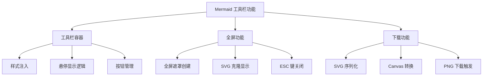
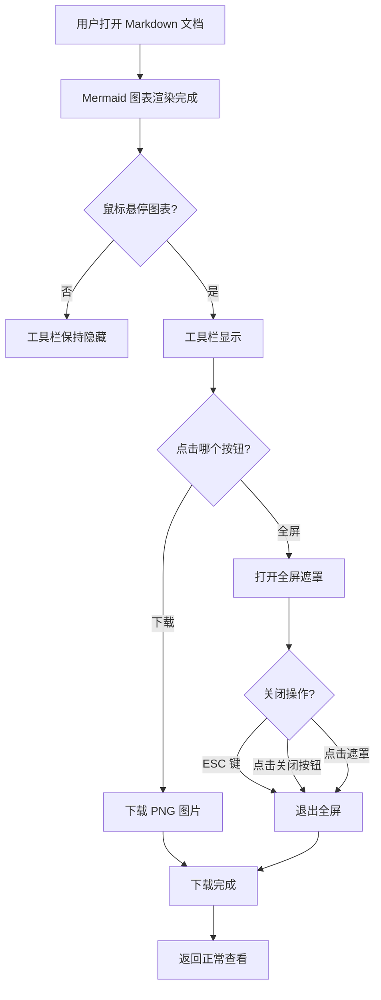
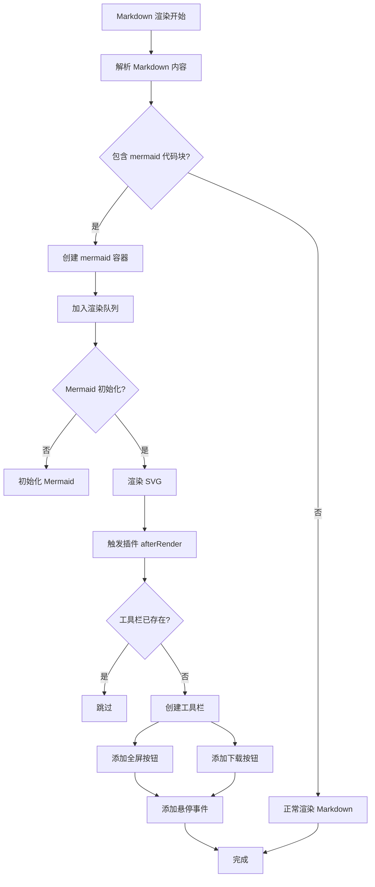
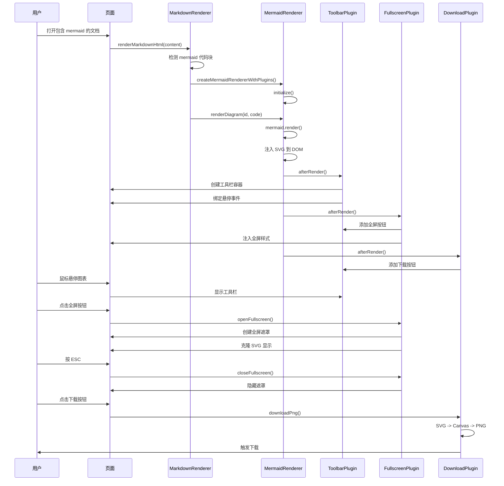

# Mermaid 图表工具栏功能任务

> **文档版本**: v1.0
> **最后更新**: 2026-04-25
> **维护者**: doubao-seed-2-0-code-preview-260215
> **工具**: Claude Code

[功能概述](#功能概述) | [功能分析](#功能分析) | [用户故事](#用户故事) | [主要操作场景](#主要操作场景) | [影响分析](#影响分析) | [功能详情](#功能详情) | [验收标准](#验收标准) | [使用场景示例](#使用场景示例)

---

## 功能概述

本任务为 `src/views/aicr/index.html` 页面的 Markdown 预览中的 Mermaid 图表实现浮动工具栏功能，包括全屏查看和下载 PNG 图片两个核心能力。

### 核心价值

- 🎯 **全屏查看**: 复杂图表可放大查看细节
- ⚡ **一键下载**: 快速保存为 PNG 图片用于分享
- 📖 **优雅交互**: 悬停显示，不干扰阅读

## 功能分析

### 功能分解图

**功能分解说明**:
- 工具栏容器: 负责 UI 展示和悬停交互
- 全屏功能: 负责全屏查看的展示和关闭逻辑
- 下载功能: 负责 SVG 到 PNG 的转换和下载触发

### 用户流程图

**用户流程说明**:
- 图表渲染后工具栏自动附加
- 悬停显示，移开隐藏
- 全屏支持多种关闭方式
- 下载一键触发

### 功能流程图

**功能流程说明**:
- Markdown 渲染时检测 mermaid 代码块
- 创建专用容器并渲染 SVG
- 渲染完成后通过插件机制附加工具栏
- 避免重复创建工具栏

### 完整时序图

**时序说明**:
- 渲染流程: Markdown → Mermaid → 插件链
- 插件通过 afterRender 钩子扩展功能
- 各插件独立添加自己的按钮
- 用户交互由各插件独立处理

## 用户故事表格

完整提取自需求文档，保持一致性：

| 用户故事 | 验收标准 | 过程生成文档 | 产出智能文档 |
|----------|----------|-------------|------------|
| 🔴 作为代码审查页面的用户，我希望 Mermaid 图表右上角有浮动工具栏，以便我能方便地与图表交互  **主要操作场景**: - 鼠标悬停显示工具栏 - 鼠标移开隐藏工具栏 - 点击全屏按钮查看大图 - 点击下载按钮保存图片 | 1. 每个 Mermaid 图表都有工具栏 2. 工具栏默认隐藏，悬停显示 3. 工具栏包含全屏和下载按钮 4. 按钮有视觉反馈 | [需求任务](./02_需求任务.md) [设计文档](./03_设计文档.md) [项目报告](./07_项目报告.md) | [生成文档 Skill](../../.claude/skills/generate-document/SKILL.md) [需求文档规范](../../.claude/skills/generate-document/rules/需求文档.md) [证据与不确定性](../../.claude/shared/evidence-and-uncertainty.md) |

## 主要操作场景定义

### 🎯 主要操作场景: 悬停显示工具栏

**场景描述**: 用户将鼠标移动到 Mermaid 图表区域，查看和使用工具栏

**前置条件**:
- Mermaid 图表已渲染完成
- 工具栏已附加到图表

**操作步骤**:
1. 将鼠标移动到图表区域内
2. 观察右上角工具栏的显示
3. 将鼠标移出图表区域
4. 观察工具栏的隐藏

**预期结果**:
- 鼠标进入: 工具栏淡入显示 (0.2s)
- 鼠标离开: 工具栏淡出隐藏 (0.2s)
- 显示时按钮可点击
- 隐藏时按钮不可点击

**验证关注点**:
- 动画过渡平滑
- 悬停区域正确（包含图表 padding）
- 快速移入移出不会闪烁

**相关设计文档章节**: [设计文档 - 工具栏 UI](./03_设计文档.md#工具栏-ui)

---

### 🎯 主要操作场景: 全屏查看图表

**场景描述**: 用户点击全屏按钮，在全屏模式下查看图表细节

**前置条件**:
- Mermaid 图表已渲染完成
- 工具栏可见

**操作步骤**:
1. 悬停显示工具栏
2. 点击「全屏」按钮 (⛶)
3. 在全屏模式下查看图表
4. 按 ESC 键或点击关闭按钮或点击遮罩区域退出

**预期结果**:
- 点击后显示半透明黑色遮罩
- 图表居中显示，最大 90vw × 90vh
- 右上角有关闭按钮 (✕)
- ESC 键立即关闭
- 点击遮罩背景立即关闭
- 点击关闭按钮立即关闭

**验证关注点**:
- 图表清晰度保持
- 关闭方式多样且直观
- 多次打开关闭无内存泄漏
- 遮罩 z-index 足够高

**相关设计文档章节**: [设计文档 - 全屏功能实现](./03_设计文档.md#全屏功能实现)

---

### 🎯 主要操作场景: 下载 PNG 图片

**场景描述**: 用户点击下载按钮，将图表保存为 PNG 图片文件

**前置条件**:
- Mermaid 图表已渲染完成
- 工具栏可见

**操作步骤**:
1. 悬停显示工具栏
2. 点击「下载」按钮 (📷)
3. 观察浏览器下载行为

**预期结果**:
- 触发浏览器下载
- 文件名格式: `mermaid-diagram-{timestamp}.png`
- 图片质量: 2x 缩放，背景白色
- 下载失败时降级为 SVG 下载

**验证关注点**:
- PNG 图片清晰
- 背景为白色（而非透明）
- 文件名包含时间戳避免冲突
- 大图表也能正常下载

**相关设计文档章节**: [设计文档 - 下载功能实现](./03_设计文档.md#下载功能实现)

---

### 🎯 主要操作场景: 下载 SVG 格式（右键）

**场景描述**: 用户右键点击下载按钮，下载 SVG 格式文件

**前置条件**:
- Mermaid 图表已渲染完成
- 工具栏可见

**操作步骤**:
1. 悬停显示工具栏
2. 右键点击「下载」按钮
3. 观察浏览器下载行为

**预期结果**:
- 阻止默认右键菜单
- 触发 SVG 下载
- 文件名格式: `mermaid-diagram-{timestamp}.svg`
- SVG 包含完整命名空间

**验证关注点**:
- SVG 可在浏览器和设计工具中打开
- XML 命名空间正确
- 右键菜单不会显示

**相关设计文档章节**: [设计文档 - 下载功能实现](./03_设计文档.md#下载功能实现)

---

## 影响分析

> **强制执行**: 按 [impact-analysis-contract.md](../../.claude/shared/impact-analysis-contract.md) 执行

### 搜索词与改动点清单

| 改动点 | 类型 | 搜索词 | 来源 | 备注 |
|--------|------|--------|------|------|
| MermaidRenderer | component | `MermaidRenderer`, `createMermaidRenderer` | `/cdn/mermaid/core/MermaidRenderer.js` | 核心渲染器，已存在 |
| ToolbarPlugin | plugin | `ToolbarPlugin` | `/cdn/mermaid/plugins/ToolbarPlugin.js` | 工具栏插件，已存在 |
| FullscreenPlugin | plugin | `FullscreenPlugin` | `/cdn/mermaid/plugins/FullscreenPlugin.js` | 全屏插件，已存在 |
| DownloadPlugin | plugin | `DownloadPlugin` | `/cdn/mermaid/plugins/DownloadPlugin.js` | 下载插件，已存在 |
| MarkdownRenderer | component | `renderMarkdownHtml`, `mermaid-diagram-container` | `/cdn/markdown/index.js` | Markdown 渲染集成点 |
| aicr/index.html | page | `src/views/aicr/index.html`, `MarkdownView` | `/src/views/aicr/index.html` | 目标页面 |

**备注**: 所有代码已存在，本次为文档生成任务。

### 改动点影响链

| 改动点 | 搜索词 | 命中文件 | 引用方式 | 影响层级 | 依赖方向 | 处置方式 | 闭合状态 | 说明 |
|--------|--------|----------|----------|---------|----------|----------|------|
| MermaidRenderer | `MermaidRenderer` | `/cdn/mermaid/core/MermaidRenderer.js` | export class | 直接 | - | 无需处理 | 已闭合 | 核心类，已实现插件支持 |
| ToolbarPlugin | `ToolbarPlugin` | `/cdn/mermaid/plugins/ToolbarPlugin.js` | export const | 直接 | - | 无需处理 | 已闭合 | 工具栏插件，已实现 |
| FullscreenPlugin | `FullscreenPlugin` | `/cdn/mermaid/plugins/FullscreenPlugin.js` | export const | 直接 | - | 无需处理 | 已闭合 | 全屏插件，已实现 |
| DownloadPlugin | `DownloadPlugin` | `/cdn/mermaid/plugins/DownloadPlugin.js` | export const | 直接 | - | 无需处理 | 已闭合 | 下载插件，已实现 |
| Markdown 集成 | `createMermaidRendererWithPlugins` | `/cdn/markdown/index.js` | import + use | 二级 | 依赖 mermaid | 无需处理 | 已闭合 | 已集成插件链 |
| AICR 页面 | `MarkdownView` | `/src/views/aicr/index.js` | component usage | 传递 | 依赖 markdown | 无需处理 | 已闭合 | 页面使用 MarkdownView |

**备注**: 完整影响链已闭合，所有模块都已存在并正确集成。

### 依赖闭合摘要

| 改动点 | 上游依赖是否核对 | 反向依赖是否核对 | 传递依赖是否闭合 | 测试 / 文档 / 配置是否覆盖 | 结论 |
|--------|-----------------|------------------|-----------------|------------------------|------|
| MermaidRenderer | 是 (mermaid.js) | 是 (MarkdownRenderer) | 是 (createMermaidRendererWithPlugins) | 是 (本文档) | 可实施 |
| ToolbarPlugin | 是 (MermaidRenderer plugin API) | 是 (MermaidRenderer.use) | 是 (Fullscreen/Download 依赖它) | 是 (本文档) | 可实施 |
| FullscreenPlugin | 是 (MermaidRenderer plugin API) | 是 (MermaidRenderer.use) | 是 (无) | 是 (本文档) | 可实施 |
| DownloadPlugin | 是 (MermaidRenderer plugin API) | 是 (MermaidRenderer.use) | 是 (无) | 是 (本文档) | 可实施 |
| Markdown 集成 | 是 (marked.js) | 是 (AICR 页面) | 是 (无) | 是 (本文档) | 可实施 |
| AICR 页面 | 是 (Vue, 其他组件) | 是 (用户使用) | 是 (无) | 是 (本文档) | 可实施 |

**结论**: 所有依赖已闭合，功能完整可用。

### 未覆盖风险

| 风险来源 | 原因 | 影响 | 缓解方式 |
|----------|------|------|----------|
| 浏览器兼容性 | 不同浏览器对 SVG/Canvas API 的支持可能有差异 | 低 | 使用广泛支持的 API，提供降级方案 |
| 大图表下载 | 非常大的图表转换 PNG 可能超时或失败 | 中 | 提供 SVG 作为降级方案 |
| 内存泄漏 | 频繁创建全屏遮罩可能累积 DOM 节点 | 低 | 重用单一遮罩实例 |
| 用户未发现 | 工具栏默认隐藏，用户可能不知道功能存在 | 中 | 文档说明，考虑首次使用提示 |

### 改动范围汇总

- **需直接修改的文件数**: 0 (功能已实现)
- **需验证兼容性的文件数**: 0 (已集成完成)
- **需追踪传递影响的文件数**: 0 (影响链已闭合)
- **需人工复核或阻断的风险**: 无重大风险

---

## 功能详情

### 工具栏功能详细说明

工具栏是整个功能的基础容器，负责：

1. **样式注入**
   - 使用动态 `<style>` 标签
   - 只注入一次（单例模式）
   - 使用 CSS `:hover` 类控制显示

2. **悬停显示逻辑**
   - 监听父容器 `mouseenter` → 添加 `.visible` 类
   - 监听父容器 `mouseleave` → 移除 `.visible` 类
   - 使用 CSS transition 实现平滑过渡

3. **按钮管理**
   - 为插件提供统一的挂载点
   - 避免重复添加按钮（检查 `data-action` 属性）

### 全屏功能详细说明

全屏功能为用户提供大图查看能力：

1. **全屏遮罩**
   - 固定定位 (position: fixed)
   - 黑色半透明背景 (rgba(0, 0, 0, 0.85))
   - z-index: 9999 确保在最上层
   - 居中显示图表

2. **SVG 克隆**
   - 深度克隆原始 SVG 节点
   - 调整大小为 max 90vw × 90vh
   - 保持原始 SVG 的所有属性

3. **关闭方式**
   - ESC 键监听
   - 关闭按钮 (✕) 点击
   - 遮罩背景点击

4. **单例模式**
   - 复用单一遮罩实例
   - 避免 DOM 节点累积

### 下载功能详细说明

下载功能支持 PNG 和 SVG 两种格式：

1. **SVG 序列化**
   - 使用 `XMLSerializer`
   - 补全 xmlns 命名空间（如缺失）
   - 补全 xmlns:xlink 命名空间（如缺失）

2. **PNG 转换**
   - 使用 `` + `<canvas>` 方式
   - 2x 缩放提升清晰度
   - 白色背景填充

3. **下载触发**
   - 创建 `<a>` 标签 + `download` 属性
   - 使用 `URL.createObjectURL` 处理 Blob
   - 立即点击后清理资源

4. **降级策略**
   - PNG 转换失败时自动降级为 SVG 下载

## 验收标准

### P0 - 必须通过

- [ ] 每个渲染的 Mermaid 图表都有工具栏
- [ ] 工具栏默认隐藏，鼠标悬停图表区域时显示
- [ ] 工具栏包含「全屏」按钮，点击后图表全屏显示
- [ ] 工具栏包含「下载」按钮，点击后下载 PNG 图片
- [ ] 全屏模式支持 ESC 键退出
- [ ] 工具栏不影响图表的正常渲染和显示

### P1 - 应该通过

- [ ] 按钮有悬停视觉效果
- [ ] 全屏模式有清晰的关闭按钮
- [ ] 下载的 PNG 图片质量良好（2x 缩放）
- [ ] 工具栏样式与页面整体风格一致

### P2 - 可以有

- [ ] 右键点击下载按钮可下载 SVG 格式
- [ ] 支持复制图表代码到剪贴板
- [ ] 支持重新渲染图表

## 使用场景示例

### 📋 场景 1: 查看复杂架构图

**背景**: 用户在代码审查中看到一个复杂的系统架构 mermaid 图，文字太小看不清楚

**操作**:
1. 鼠标悬停图表
2. 点击「全屏」按钮
3. 在全屏模式下仔细查看
4. 按 ESC 退出

**结果**: 用户清晰地看到了架构图的每个细节，顺利完成代码审查

---

### 🎨 场景 2: 保存流程图到文档

**背景**: 用户需要将 mermaid 流程图保存下来，放到项目设计文档中分享给团队

**操作**:
1. 鼠标悬停图表
2. 点击「下载」按钮
3. 将下载的 PNG 图片插入文档

**结果**: PNG 图片清晰，背景为白色，完美适配文档，团队成员都能正常查看

---

### 📋 场景 3: 导出矢量图用于编辑

**背景**: 用户需要对图表进行一些编辑调整，需要 SVG 格式

**操作**:
1. 鼠标悬停图表
2. 右键点击「下载」按钮
3. 获得 SVG 文件
4. 在设计工具中编辑

**结果**: SVG 文件保留了完整的矢量信息，编辑后重新渲染质量无损
