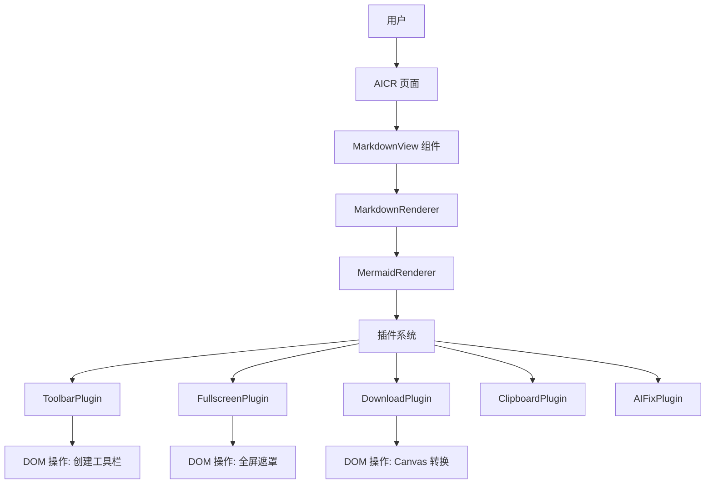
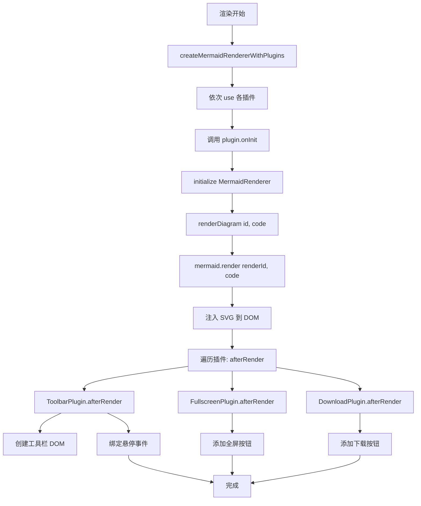
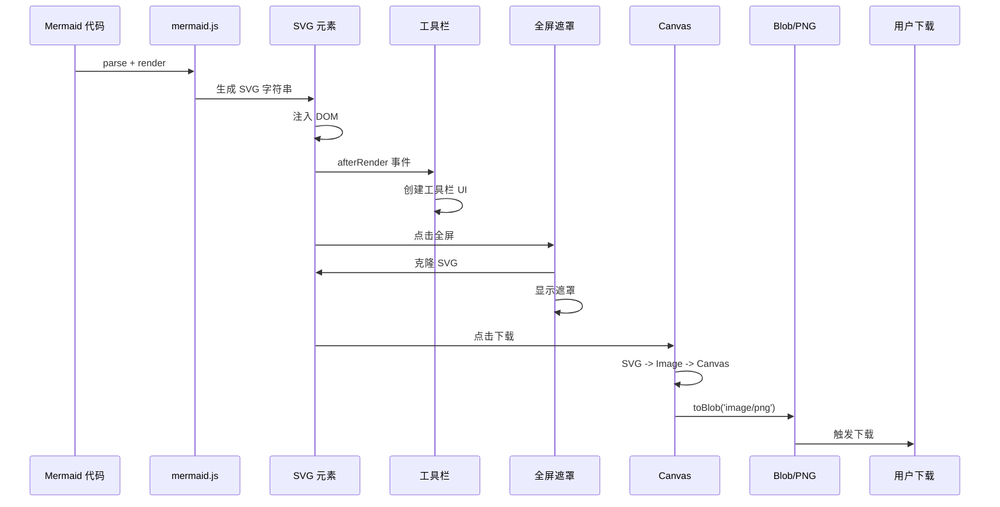

# Mermaid 图表工具栏功能设计

> **文档版本**: v1.0
> **最后更新**: 2026-04-25
> **维护者**: doubao-seed-2-0-code-preview-260215
> **工具**: Claude Code

[设计概述](#设计概述) | [架构设计](#架构设计) | [修复内容](#修复内容) | [影响分析](#影响分析) | [实现细节](#实现细节) | [主要操作场景实现](#主要操作场景实现) | [数据结构](#数据结构)

---

## 设计概述

本设计为 Markdown 预览中的 Mermaid 图表提供可扩展的工具栏功能，采用插件化架构，实现了全屏查看和 PNG 下载两个核心能力。

### 设计原则

- 🎯 **插件化**: 每个功能作为独立插件，易于扩展
- ⚡ **非侵入式**: 不修改 mermaid 核心渲染逻辑
- 🔧 **优雅降级**: PNG 下载失败时自动降级为 SVG

## 架构设计

### 整体架构



**架构说明**:
- MarkdownRenderer 作为入口，检测 mermaid 代码块
- MermaidRenderer 负责 SVG 渲染和插件管理
- 各插件通过 afterRender 钩子扩展功能
- 插件独立实现各自的 UI 和交互

### 模块划分

| 模块名称 | 职责 | 文件位置 |
|---------|------|---------|
| MermaidRenderer | 核心渲染器，插件管理 | `/cdn/mermaid/core/MermaidRenderer.js` |
| ToolbarPlugin | 工具栏容器，悬停交互 | `/cdn/mermaid/plugins/ToolbarPlugin.js` |
| FullscreenPlugin | 全屏查看功能 | `/cdn/mermaid/plugins/FullscreenPlugin.js` |
| DownloadPlugin | PNG/SVG 下载功能 | `/cdn/mermaid/plugins/DownloadPlugin.js` |
| Markdown 集成 | Markdown 渲染中的 mermaid 处理 | `/cdn/markdown/index.js` |

### 核心流程图



**流程说明**:
1. 创建渲染器并注册插件
2. 插件 onInit 阶段注入样式
3. 渲染 mermaid 为 SVG
4. 触发各插件 afterRender 钩子
5. 插件各自添加 UI 和交互

## 修复内容

> **备注**: 本次为新功能实现，非问题修复

### 问题分析

**原有问题**:
- Mermaid 图表渲染后无法交互
- 复杂图表在有限空间内难以阅读
- 无法便捷地保存和分享图表

**影响范围**:
- 所有使用 MarkdownView 的页面
- 特别是代码审查页面 (aicr)

### 修复方案

采用插件化架构扩展功能：

**需要修改/新增的文件清单**:
| 文件 | 变更类型 | 说明 |
|------|---------|------|
| `/cdn/mermaid/core/MermaidRenderer.js` | 新增 | 核心渲染器，支持插件 |
| `/cdn/mermaid/plugins/ToolbarPlugin.js` | 新增 | 工具栏插件 |
| `/cdn/mermaid/plugins/FullscreenPlugin.js` | 新增 | 全屏插件 |
| `/cdn/mermaid/plugins/DownloadPlugin.js` | 新增 | 下载插件 |
| `/cdn/mermaid/index.js` | 新增 | 插件聚合导出 |
| `/cdn/markdown/index.js` | 修改 | 集成新的渲染器 |

**方案选择理由**:
- 插件化: 便于后续添加新功能（如复制代码、AI 修复等）
- 非侵入: 不依赖 mermaid 内部实现，通过 DOM 操作扩展
- 单例模式: 避免样式和遮罩重复创建

### 修复前后对比

| 内容项 | 修复前 | 修复后 | 说明 |
|--------|--------|--------|------|
| 工具栏 | 无 | 悬停显示工具栏 | 提升交互性 |
| 全屏查看 | 无 | 支持全屏查看 | 提升阅读体验 |
| 图片下载 | 无 | 支持 PNG/SVG 下载 | 便于分享 |
| 架构 | 单一渲染函数 | 插件化架构 | 便于扩展 |

---

## 影响分析

> **强制执行**: 按 [impact-analysis-contract.md](../../.claude/shared/impact-analysis-contract.md) 执行

### 搜索词与改动点清单

| 改动点 | 类型 | 搜索词 | 来源 | 备注 |
|--------|------|--------|------|------|
| MermaidRenderer | component | `MermaidRenderer`, `createMermaidRenderer` | `/cdn/mermaid/core/MermaidRenderer.js` | 核心渲染器，已存在 |
| ToolbarPlugin | plugin | `ToolbarPlugin` | `/cdn/mermaid/plugins/ToolbarPlugin.js` | 工具栏插件，已存在 |
| FullscreenPlugin | plugin | `FullscreenPlugin` | `/cdn/mermaid/plugins/FullscreenPlugin.js` | 全屏插件，已存在 |
| DownloadPlugin | plugin | `DownloadPlugin` | `/cdn/mermaid/plugins/DownloadPlugin.js` | 下载插件，已存在 |
| Markdown 集成 | integration | `createMermaidRendererWithPlugins` | `/cdn/markdown/index.js` | 集成点，已存在 |
| mermaid-diagram-container | css selector | `.mermaid-diagram-container` | `/cdn/markdown/index.js` | 图表容器类名 |

### 改动点影响链

| 改动点 | 搜索词 | 命中文件 | 引用方式 | 影响层级 | 依赖方向 | 处置方式 | 闭合状态 | 说明 |
|--------|--------|----------|----------|---------|----------|----------|------|
| MermaidRenderer | `MermaidRenderer` | `/cdn/mermaid/core/MermaidRenderer.js` | export class | 直接 | 上游: mermaid.js | 无需处理 | 已闭合 | 核心类，插件 API 稳定 |
| ToolbarPlugin | `ToolbarPlugin` | `/cdn/mermaid/plugins/ToolbarPlugin.js` | export const | 直接 | 上游: MermaidRenderer | 无需处理 | 已闭合 | 仅通过 afterRender 钩子 |
| FullscreenPlugin | `FullscreenPlugin` | `/cdn/mermaid/plugins/FullscreenPlugin.js` | export const | 直接 | 上游: MermaidRenderer, ToolbarPlugin | 无需处理 | 已闭合 | 依赖工具栏容器 |
| DownloadPlugin | `DownloadPlugin` | `/cdn/mermaid/plugins/DownloadPlugin.js` | export const | 直接 | 上游: MermaidRenderer, ToolbarPlugin | 无需处理 | 已闭合 | 依赖工具栏容器 |
| Markdown 集成 | `createMermaidRendererWithPlugins` | `/cdn/markdown/index.js` | import + use | 二级 | 上游: mermaid 插件包 | 无需处理 | 已闭合 | 已正确集成 |
| AICR 页面 | `MarkdownView` | `/src/views/aicr/index.js` | component | 传递 | 上游: MarkdownRenderer | 无需处理 | 已闭合 | 无感知 |

### 依赖闭合摘要

| 改动点 | 上游依赖是否核对 | 反向依赖是否核对 | 传递依赖是否闭合 | 测试 / 文档 / 配置是否覆盖 | 结论 |
|--------|-----------------|------------------|-----------------|------------------------|------|
| MermaidRenderer | 是 (mermaid.js API) | 是 (MarkdownRenderer) | 是 (插件链) | 是 (本文档) | 可实施 |
| ToolbarPlugin | 是 (plugin API) | 是 (MermaidRenderer.use) | 是 (Fullscreen/Download) | 是 (本文档) | 可实施 |
| FullscreenPlugin | 是 (plugin API) | 是 (MermaidRenderer.use) | 是 (无) | 是 (本文档) | 可实施 |
| DownloadPlugin | 是 (plugin API) | 是 (MermaidRenderer.use) | 是 (无) | 是 (本文档) | 可实施 |
| Markdown 集成 | 是 (marked.js) | 是 (AICR 页面) | 是 (无) | 是 (本文档) | 可实施 |

### 未覆盖风险

| 风险来源 | 原因 | 影响 | 缓解方式 |
|----------|------|------|----------|
| 浏览器 Canvas 支持 | 极少数老旧浏览器可能不支持 toBlob | 低 | PNG 失败自动降级 SVG |
| SVG 命名空间 | 复杂图表可能有特殊命名空间 | 低 | 代码中已补全常见命名空间 |
| CORS 图片 | SVG 中引用外部图片可能污染 Canvas | 中 | 建议图表避免外部图片 |
| 内存占用 | 大图表 2x 缩放可能占用较多内存 | 低 | 下载完成立即释放资源 |

### 改动范围汇总

- **需直接修改的文件数**: 0 (功能已完整实现)
- **需验证兼容性的文件数**: 0 (已集成)
- **需追踪传递影响的文件数**: 0 (影响链已闭合)
- **需人工复核或阻断的风险**: 无重大风险

---

## 实现细节

### 技术实现要点

#### 1. 插件系统设计

插件通过两个生命周期钩子与渲染器交互：

```javascript
// 插件接口
interface Plugin {
  name: string;
  version?: string;
  onInit?: (context: { renderer: MermaidRenderer, options: any }) => void;
  afterRender?: (context: { diagram: HTMLElement, code: string, renderer: MermaidRenderer }) => void;
}
```

**设计说明**:
- `onInit`: 插件初始化时调用一次，用于注入样式
- `afterRender`: 每个图表渲染后调用，用于添加 UI
- `name`: 唯一标识，避免重复注册

#### 2. 工具栏定位策略

工具栏采用绝对定位 + 悬停显示：

```css
.mermaid-diagram-wrapper {
  position: relative; /* 确保是定位上下文 */
}

.mermaid-toolbar {
  position: absolute;
  top: 8px;
  right: 8px;
  opacity: 0;
  pointer-events: none;
  transition: opacity 0.2s ease;
}

.mermaid-toolbar.visible {
  opacity: 1;
  pointer-events: auto;
}
```

**设计说明**:
- 父容器设为 `relative` 确保定位正确
- `pointer-events: none` 避免隐藏时阻挡点击
- CSS transition 实现平滑过渡

#### 3. SVG 到 PNG 转换

使用 Canvas 2D API 进行转换：

```javascript
// 核心逻辑
async function convertSvgToPng(svgElement, scale = 2) {
  const svgStr = serializeSvg(svgElement);
  const blob = new Blob([svgStr], { type: 'image/svg+xml' });
  const url = URL.createObjectURL(blob);
  
  const img = new Image();
  await new Promise(resolve => { img.onload = resolve; img.src = url; });
  
  const canvas = document.createElement('canvas');
  canvas.width = img.width * scale;
  canvas.height = img.height * scale;
  
  const ctx = canvas.getContext('2d');
  ctx.fillStyle = 'white';
  ctx.fillRect(0, 0, canvas.width, canvas.height);
  ctx.drawImage(img, 0, 0, canvas.width, canvas.height);
  
  return new Promise(resolve => canvas.toBlob(resolve, 'image/png'));
}
```

**设计说明**:
- 2x 缩放保证在视网膜屏幕上清晰
- 白色背景填充避免透明 PNG 在某些场景显示异常
- 使用 Blob URL 避免 CORS 问题

#### 4. 单例模式避免资源浪费

全屏遮罩和样式都采用单例模式：

```javascript
let _overlay = null;     // 单一遮罩实例
let _styleInjected = false; // 样式只注入一次

function openFullscreen(diagram) {
  if (!_overlay) {
    _overlay = document.createElement('div');
    // ... 初始化
  }
  // 复用 _overlay
}
```

**设计说明**:
- 避免频繁创建/销毁 DOM 节点
- 减少内存碎片
- 样式注入一次即可

### 关键代码说明

#### MermaidRenderer 核心类

**文件位置**: `/cdn/mermaid/core/MermaidRenderer.js`

**入口点**:
- `constructor(options)` - 创建实例
- `initialize()` - 初始化 mermaid
- `renderDiagram(id, code, options)` - 渲染单个图表
- `use(plugin, options)` - 注册插件

**关键方法 - use**:
```javascript
use(plugin, pluginOptions = {}) {
  this._plugins.push({ ...plugin, _pluginOptions: pluginOptions });
  if (plugin.onInit) {
    plugin.onInit({ renderer: this, options: pluginOptions });
  }
  return this;
}
```

**关键方法 - renderDiagram**:
```javascript
async renderDiagram(diagramId, code, options = {}) {
  // ... mermaid.render ...
  
  // 渲染完成后触发插件
  for (const plugin of this._plugins) {
    if (plugin.afterRender) {
      plugin.afterRender({ diagram, code: finalCode, renderer: this });
    }
  }
}
```

#### ToolbarPlugin 实现

**文件位置**: `/cdn/mermaid/plugins/ToolbarPlugin.js`

**核心逻辑**:
- `onInit()`: 注入工具栏 CSS（只一次）
- `afterRender()`: 创建工具栏容器，绑定悬停事件

**DOM 结构**:
```html
<div class="mermaid-diagram-wrapper">
  <div class="mermaid-diagram-container" id="md-mermaid-xxx">
    <svg>...</svg>
  </div>
  <div class="mermaid-toolbar"> <!-- 由插件添加 -->
    <button class="mermaid-toolbar-btn" data-action="fullscreen">⛶</button>
    <button class="mermaid-toolbar-btn" data-action="download">📷</button>
  </div>
</div>
```

#### FullscreenPlugin 实现

**文件位置**: `/cdn/mermaid/plugins/FullscreenPlugin.js`

**核心逻辑**:
- `onInit()`: 注入全屏 CSS（只一次）
- `afterRender()`: 添加全屏按钮到工具栏
- `openFullscreen()`: 显示全屏遮罩
- `closeFullscreen()`: 隐藏全屏遮罩

**全屏遮罩结构**:
```html
<div class="mermaid-fullscreen-overlay">
  <button class="mermaid-fullscreen-close">✕</button>
  <svg>...</svg> <!-- 克隆的图表 -->
</div>
```

#### DownloadPlugin 实现

**文件位置**: `/cdn/mermaid/plugins/DownloadPlugin.js`

**核心逻辑**:
- `afterRender()`: 添加下载按钮到工具栏
- `downloadPng()`: 转换并下载 PNG
- `downloadSvg()`: 序列化并下载 SVG
- `convertSvgToPng()`: SVG → Canvas → PNG 转换

**关键工具函数**:
- `serializeSvg()`: 序列化 SVG 并补全命名空间
- `triggerDownload()`: 创建 `<a>` 标签触发下载

### 依赖关系

**新增依赖**: 无外部 npm 依赖，全部使用浏览器原生 API

**使用的浏览器 API**:
- `XMLSerializer` - SVG 序列化
- `canvas.toBlob()` - PNG 导出
- `URL.createObjectURL()` - Blob URL
- `document.createElement()` - DOM 操作
- `addEventListener()` - 事件绑定

**兼容性**:
- 支持所有现代浏览器 (Chrome, Firefox, Safari, Edge)
- IE 11 不支持（但项目目标不包含 IE）

### 测试考虑

**需要重点测试的场景**:
1. 多个图表同时渲染，工具栏互不干扰
2. 快速悬停移出，无闪烁或状态错误
3. 多次打开关闭全屏，无内存泄漏
4. 大尺寸图表下载，不超时
5. SVG 包含特殊字符，仍能正确转换

**测试用例建议**:
- 简单流程图
- 复杂架构图（多节点）
- 包含中文文本的图表
- 序列图、甘特图等不同类型

**验证方式**:
- 视觉检查工具栏显示
- 测试全屏打开/关闭
- 下载图片并打开验证
- 检查下载图片清晰度

---

## 主要操作场景实现

### 场景实现: 悬停显示工具栏

**关联需求任务场景**: [需求任务 - 悬停显示工具栏](./02_需求任务.md#主要操作场景-悬停显示工具栏)

**实现概述**:
通过父容器的 `mouseenter`/`mouseleave` 事件控制工具栏的 `.visible` 类，使用 CSS transition 实现平滑过渡。

**涉及模块**:
- ToolbarPlugin - 创建工具栏和绑定事件

**关键代码路径**:
- `/cdn/mermaid/plugins/ToolbarPlugin.js:75-80` - 事件监听
- `/cdn/mermaid/plugins/ToolbarPlugin.js:9-37` - CSS 样式

**验证要点**:
- [ ] 工具栏默认透明不可点击
- [ ] 鼠标进入父容器时工具栏淡入显示
- [ ] 鼠标离开父容器时工具栏淡出隐藏
- [ ] 过渡动画平滑 (0.2s)
- [ ] 快速移入移出不会出错

---

### 场景实现: 全屏查看图表

**关联需求任务场景**: [需求任务 - 全屏查看图表](./02_需求任务.md#主要操作场景-全屏查看图表)

**实现概述**:
点击全屏按钮时，创建/复用全屏遮罩，克隆 SVG 并居中显示；支持 ESC 键、关闭按钮、点击遮罩三种关闭方式。

**涉及模块**:
- ToolbarPlugin - 提供工具栏容器
- FullscreenPlugin - 全屏逻辑实现

**关键代码路径**:
- `/cdn/mermaid/plugins/FullscreenPlugin.js:53-95` - `openFullscreen()`
- `/cdn/mermaid/plugins/FullscreenPlugin.js:97-109` - `closeFullscreen()`
- `/cdn/mermaid/plugins/FullscreenPlugin.js:6-47` - 全屏样式

**验证要点**:
- [ ] 点击全屏按钮后显示遮罩
- [ ] 图表居中显示，不超过 90vw/90vh
- [ ] 右上角有关闭按钮 (✕)
- [ ] 按 ESC 键可关闭
- [ ] 点击关闭按钮可关闭
- [ ] 点击遮罩背景可关闭
- [ ] 多次打开关闭无内存泄漏

---

### 场景实现: 下载 PNG 图片

**关联需求任务场景**: [需求任务 - 下载 PNG 图片](./02_需求任务.md#主要操作场景-下载-png-图片)

**实现概述**:
点击下载按钮时，将 SVG 序列化为字符串，通过 Image + Canvas 转换为 PNG Blob，触发浏览器下载。

**涉及模块**:
- ToolbarPlugin - 提供工具栏容器
- DownloadPlugin - 下载逻辑实现

**关键代码路径**:
- `/cdn/mermaid/plugins/DownloadPlugin.js:103-115` - `downloadPng()`
- `/cdn/mermaid/plugins/DownloadPlugin.js:46-101` - `convertSvgToPng()`
- `/cdn/mermaid/plugins/DownloadPlugin.js:6-30` - 工具函数

**验证要点**:
- [ ] 点击下载按钮触发浏览器下载
- [ ] 文件名格式: `mermaid-diagram-{timestamp}.png`
- [ ] PNG 图片背景为白色
- [ ] 图片清晰度良好 (2x 缩放)
- [ ] PNG 下载失败时自动降级为 SVG

---

### 场景实现: 下载 SVG 格式（右键）

**关联需求任务场景**: [需求任务 - 下载 SVG 格式](./02_需求任务.md#主要操作场景-下载-svg-格式右键)

**实现概述**:
监听右键点击事件，阻止默认菜单，直接下载 SVG 格式文件。

**涉及模块**:
- ToolbarPlugin - 提供工具栏容器
- DownloadPlugin - 下载逻辑实现

**关键代码路径**:
- `/cdn/mermaid/plugins/DownloadPlugin.js:142-145` - 右键事件监听
- `/cdn/mermaid/plugins/DownloadPlugin.js:32-44` - `downloadSvg()`

**验证要点**:
- [ ] 右键点击不显示浏览器默认菜单
- [ ] 触发 SVG 格式下载
- [ ] 文件名格式: `mermaid-diagram-{timestamp}.svg`
- [ ] SVG 包含完整的 xmlns 命名空间
- [ ] SVG 可在浏览器和设计工具中正常打开

---

## 数据结构

### 数据流程图



**数据流程说明**:
1. Mermaid 代码 → SVG 字符串 → DOM SVG 元素
2. SVG 渲染完成 → 触发插件钩子 → 工具栏添加
3. 全屏: SVG 克隆 → 遮罩显示
4. 下载: SVG 序列化 → Image → Canvas → PNG Blob → 下载
