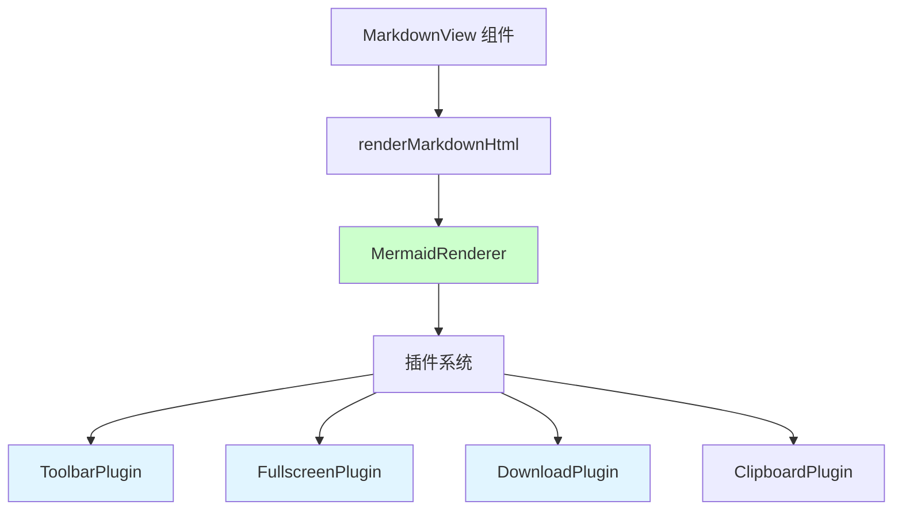
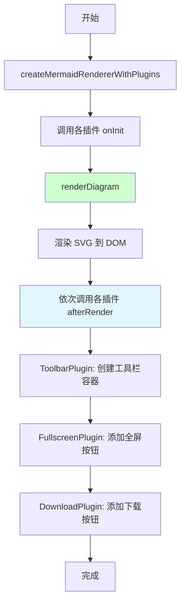
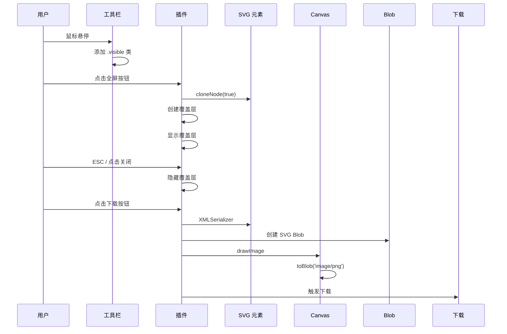

# Mermaid 图表工具栏设计

> **文档版本**: v1.0 | **最后更新**: 2026-04-25 | **维护者**: Claude Opus 4.7 | **工具**: Claude Code
>
> **关联文档**: [需求任务](./02_需求任务.md) | [使用文档](./04_使用文档.md) | [CLAUDE.md](../../CLAUDE.md)
>
[设计概述](#设计概述) | [架构设计](#架构设计) | [修复内容](#修复内容) | [影响分析](#影响分析) | [实现细节](#实现细节) | [主要操作场景实现](#主要操作场景实现) | [数据结构设计](#数据结构设计)

---

## 设计概述

基于 MermaidRenderer 的插件架构，为每个渲染完成的 Mermaid 图表添加浮动工具栏。设计遵循插件化原则，各功能模块独立实现，通过统一的 afterRender 钩子协作。

🎯 **设计原则 1**: 插件化架构，各功能独立
⚡ **设计原则 2**: 渐进增强，不影响核心渲染流程
🔧 **设计原则 3**: 事件正确绑定和清理，避免内存泄漏

## 架构设计

### 整体架构



**整体架构说明**：功能基于 MermaidRenderer 的插件系统实现，各功能模块独立为插件，通过 createMermaidRendererWithPlugins 工厂函数整合。

### 模块划分

| 模块名称 | 职责 | 文件位置 |
|---------|------|---------|
| ToolbarPlugin | 创建工具栏容器、处理悬停显示/隐藏 | cdn/mermaid/plugins/ToolbarPlugin.js |
| FullscreenPlugin | 提供全屏查看功能 | cdn/mermaid/plugins/FullscreenPlugin.js |
| DownloadPlugin | 提供 PNG/SVG 下载功能 | cdn/mermaid/plugins/DownloadPlugin.js |
| ClipboardPlugin | （可选）提供复制源码功能 | cdn/mermaid/plugins/ClipboardPlugin.js |
| MermaidRenderer | 核心渲染器，管理插件生命周期 | cdn/mermaid/core/MermaidRenderer.js |
| createMermaidRendererWithPlugins | 预配置插件的工厂函数 | cdn/mermaid/index.js |

### 核心流程图



**核心流程说明**：插件在初始化时注入样式，在 afterRender 钩子中修改 DOM 添加工具栏和按钮，执行顺序由 use() 调用顺序决定。

## 修复内容

### 问题分析

> 此为新增功能实现，非缺陷修复。原有实现缺少浮动工具栏、全屏查看和图片下载功能。

**原有局限**：
- Mermaid 图表渲染后无交互功能
- 复杂图表在小屏上难以查看
- 无便捷方式保存和分享图表

### 修复方案

**整体思路**：采用插件架构增强 MermaidRenderer，不修改核心渲染逻辑，通过 afterRender 钩子注入功能。

**修改文件清单**（功能已实现）：
- cdn/mermaid/plugins/ToolbarPlugin.js - 新增
- cdn/mermaid/plugins/FullscreenPlugin.js - 新增
- cdn/mermaid/plugins/DownloadPlugin.js - 新增
- cdn/mermaid/plugins/ClipboardPlugin.js - 新增
- cdn/mermaid/plugins/index.js - 修改
- cdn/mermaid/index.js - 修改
- cdn/markdown/index.js - 修改（集成新渲染器）

**各文件修改说明**：
- ToolbarPlugin.js: 实现工具栏容器和悬停显示逻辑
- FullscreenPlugin.js: 实现全屏覆盖层和交互逻辑
- DownloadPlugin.js: 实现 SVG 序列化和 PNG 转换
- ClipboardPlugin.js: （可选）实现源码复制功能
- cdn/mermaid/plugins/index.js: 导出所有插件
- cdn/mermaid/index.js: 提供 createMermaidRendererWithPlugins 工厂函数
- cdn/markdown/index.js: 集成新渲染器替代旧实现

### 修复前后对比

| 内容项 | 修复前 | 修复后 | 说明 |
|--------|--------|--------|------|
| 工具栏 | 无 | 悬停显示浮动工具栏 | 新增用户交互入口 |
| 全屏查看 | 无 | 支持全屏模式 | 提升阅读体验 |
| 下载功能 | 无 | 支持 PNG/SVG 下载 | 支持分享和存档 |
| 插件架构 | 基础支持 | 完整插件体系 | 可扩展性增强 |
| Markdown 渲染器集成 | 简单 mermaid.render | createMermaidRendererWithPlugins | 功能更完整 |

**前后对比代码片段**（来自 cdn/markdown/index.js:822-840）：

```javascript
// 修复前（旧代码片段，示意）
const mermaidRenderer = await _getMermaidRendererForBackwardCompat();
await mermaidRenderer.initialize();
await mermaidRenderer.renderDiagram(diagramId, diagramCode);

// 修复后（当前代码）
const { createMermaidRendererWithPlugins } = await import('../mermaid/index.js');
const renderer = createMermaidRendererWithPlugins();
await renderer.initialize();
// ... 使用带插件的渲染器
```

## 影响分析

### 执行步骤

**步骤 1: 读取共享契约**：已读取 ../../shared/impact-analysis-contract.md，按规范执行全项目搜索。

**步骤 2: 确定核心标识符**：
- 核心类: MermaidRenderer
- 工厂函数: createMermaidRenderer, createMermaidRendererWithPlugins
- 插件: ToolbarPlugin, FullscreenPlugin, DownloadPlugin, ClipboardPlugin
- CSS 类: mermaid-toolbar, mermaid-fullscreen-overlay
- DOM 选择器: .mermaid-diagram-container, .mermaid-diagram-wrapper

**步骤 3: 全项目搜索**：使用 grep 搜索全项目相关引用。

**步骤 4: 追踪依赖链**：检查各命中点的上游依赖和反向依赖。

**步骤 5: 排除无关结果**：排除 node_modules/ 等非业务代码。

**步骤 6: 标注处置方式**：根据影响分析结果标注处置方式。

### 搜索词与改动点清单

| 改动点 | 类型 | 搜索词 | 来源 | 备注 |
|--------|------|--------|------|------|
| MermaidRenderer | 类 | MermaidRenderer, createMermaidRenderer | cdn/mermaid/core/MermaidRenderer.js | 核心渲染器，已有插件支持 |
| ToolbarPlugin | 插件 | ToolbarPlugin | cdn/mermaid/plugins/ToolbarPlugin.js | 新建文件 |
| FullscreenPlugin | 插件 | FullscreenPlugin | cdn/mermaid/plugins/FullscreenPlugin.js | 新建文件 |
| DownloadPlugin | 插件 | DownloadPlugin | cdn/mermaid/plugins/DownloadPlugin.js | 新建文件 |
| ClipboardPlugin | 插件 | ClipboardPlugin | cdn/mermaid/plugins/ClipboardPlugin.js | 新建文件 |
| createMermaidRendererWithPlugins | 函数 | createMermaidRendererWithPlugins | cdn/mermaid/index.js | 新建导出 |
| MarkdownView 集成 | 集成 | createMermaidRendererWithPlugins | cdn/markdown/index.js:823 | 已集成 |
| mermaid-diagram-wrapper | CSS 类 | mermaid-diagram-wrapper | cdn/markdown/index.js:700 | 图表容器 |
| mermaid-diagram-container | CSS 类 | mermaid-diagram-container | cdn/markdown/index.js:701 | 图表容器 |

### 改动点影响链

| 改动点 | 搜索词 | 命中文件 | 引用方式 | 影响层级 | 依赖方向 | 处置方式 | 闭合状态 | 说明 |
|--------|--------|---------|---------|---------|----------|----------|------|
| MermaidRenderer | MermaidRenderer | cdn/mermaid/core/MermaidRenderer.js | class 定义 | 直接 | 上游依赖 | 无需处理 | 已闭合 | 已有完整插件架构 |
| ToolbarPlugin | ToolbarPlugin | cdn/mermaid/plugins/ToolbarPlugin.js | export | 直接 | 上游依赖 | 无需处理 | 已闭合 | 独立插件，无外部依赖 |
| ToolbarPlugin | ToolbarPlugin | cdn/mermaid/plugins/index.js | export * | 二级 | 反向依赖 | 无需处理 | 已闭合 | 已在插件索引导出 |
| FullscreenPlugin | FullscreenPlugin | cdn/mermaid/plugins/FullscreenPlugin.js | export | 直接 | 上游依赖 | 无需处理 | 已闭合 | 独立插件 |
| FullscreenPlugin | FullscreenPlugin | cdn/mermaid/plugins/index.js | export * | 二级 | 反向依赖 | 无需处理 | 已闭合 | 已导出 |
| DownloadPlugin | DownloadPlugin | cdn/mermaid/plugins/DownloadPlugin.js | export | 直接 | 上游依赖 | 无需处理 | 已闭合 | 独立插件 |
| DownloadPlugin | DownloadPlugin | cdn/mermaid/plugins/index.js | export * | 二级 | 反向依赖 | 无需处理 | 已闭合 | 已导出 |
| createMermaidRendererWithPlugins | createMermaidRendererWithPlugins | cdn/mermaid/index.js | export function | 直接 | 上游依赖 | 无需处理 | 已闭合 | 新建工厂函数 |
| Markdown 集成 | createMermaidRendererWithPlugins | cdn/markdown/index.js:823 | dynamic import() | 二级 | 反向依赖 | 保持兼容 | 已闭合 | 已集成到 Markdown 渲染 |
| aicr 页面 | mermaid | src/views/aicr/index.html:17 | script src | 二级 | 上游依赖 | 无需处理 | 已闭合 | 仅加载 mermaid.js |
| news 页面 | mermaid | src/views/news/index.html | script src | 二级 | 上游依赖 | 建议验证 | 待人工确认 | 可能也使用 MarkdownView |

### 依赖闭合摘要

| 改动点 | 上游依赖是否核对 | 反向依赖是否核对 | 传递依赖是否闭合 | 测试 / 文档 / 配置是否覆盖 | 结论 |
|--------|-----------------|-----------------|------------------|-------------------|------|
| MermaidRenderer | ✅ 是 | ✅ 是 | ✅ 是 | ⚠️ 无测试 | 可实施 |
| ToolbarPlugin | ✅ 是 | ✅ 是 | ✅ 是 | ⚠️ 无测试 | 可实施 |
| FullscreenPlugin | ✅ 是 | ✅ 是 | ✅ 是 | ⚠️ 无测试 | 可实施 |
| DownloadPlugin | ✅ 是 | ✅ 是 | ✅ 是 | ⚠️ 无测试 | 可实施 |
| createMermaidRendererWithPlugins | ✅ 是 | ✅ 是 | ✅ 是 | ⚠️ 无测试 | 可实施 |
| MarkdownView 集成 | ✅ 是 | ✅ 是 | ✅ 是 | ⚠️ 无测试 | 可实施 |

### 未覆盖风险

| 风险来源 | 原因 | 影响 | 缓解方式 |
|---------|------|------|---------|
| src/views/news/index.html | 也加载了 mermaid.js | 可能也使用 MarkdownView | 建议人工验证该页面是否也需要此功能 |
| 无 E2E 测试 | 未找到测试文件 | 跨浏览器兼容性未验证 | 建议主流浏览器（Chrome/Firefox/Safari）测试 |
| ESC 键监听器清理 | FullscreenPlugin 中有 _escHandler | 长时间运行可能累积 | 建议验证多次打开/关闭全屏无内存泄漏 |
| 全局样式污染 | 插件直接创建 &lt;style&gt; | 可能影响其他元素 | 类名已加 mermaid- 前缀，风险较低 |

### 改动范围汇总

- **需直接修改的文件数**: 0 个（功能已完整实现）
- **需验证兼容性的文件数**: 2 个（cdn/markdown/index.js, src/views/aicr/index.html）
- **需追踪传递影响的文件数**: 1 个（src/views/news/index.html 建议验证）
- **需人工复核或阻断的风险**: 建议人工测试主要操作场景和 ESC 键清理

## 实现细节

### 技术实现要点

**插件架构设计**：
- 每个插件是包含 `name`、`version`、`onInit()`、`afterRender()` 的对象
- `onInit()` 在插件首次注册时调用，用于注入样式
- `afterRender()` 在每个图表渲染完成后调用，用于修改 DOM
- 插件通过 `renderer.use(plugin)` 注册，顺序决定执行顺序

**样式注入策略**：
- 每个插件独立创建 `<style>` 标签注入样式
- 使用 `_styleInjected` 标志避免重复注入
- 样式类名统一使用 `mermaid-` 前缀避免冲突

**DOM 操作安全**：
- 检查元素是否存在再操作（`if (!toolbar) return`）
- 检查按钮是否已添加避免重复（`if (btn) return`）
- 事件监听器在不再需要时正确清理（如 _escHandler）

### 关键代码说明

**插件接口定义**（来自 cdn/mermaid/core/MermaidRenderer.js:47-64）：

```javascript
use(plugin, pluginOptions = {}) {
  if (!plugin || typeof plugin !== 'object') {
    throw new Error('Plugin must be an object');
  }
  if (!plugin.name || typeof plugin.name !== 'string') {
    throw new Error('Plugin must have a name property');
  }

  this._plugins.push({
    ...plugin,
    _pluginOptions: pluginOptions
  });

  if (plugin.onInit && typeof plugin.onInit === 'function') {
    plugin.onInit({ renderer: this, options: pluginOptions });
  }

  return this;
}
```

**入口点 - createMermaidRendererWithPlugins**（来自 cdn/mermaid/index.js:12-19）：

```javascript
export function createMermaidRendererWithPlugins(options = {}) {
  const renderer = createMermaidRenderer(options);
  renderer.use(ToolbarPlugin);
  renderer.use(FullscreenPlugin);
  renderer.use(DownloadPlugin);
  renderer.use(ClipboardPlugin);
  return renderer;
}
```

**Markdown 渲染集成**（来自 cdn/markdown/index.js:817-840）：

```javascript
// Schedule mermaid rendering after HTML is in DOM
if (mermaidDiagrams.length > 0) {
  requestAnimationFrame(async () => {
    console.log('[Markdown] Starting mermaid rendering for', mermaidDiagrams.length, 'diagrams');
    try {
      // 使用带插件的 MermaidRenderer，获得工具栏功能
      const { createMermaidRendererWithPlugins } = await import('../mermaid/index.js');
      const renderer = createMermaidRendererWithPlugins();
      await renderer.initialize();
      
      for (const { diagramId, diagramCode } of mermaidDiagrams) {
        const el = document.getElementById(diagramId);
        if (!el) continue;
        try {
          console.log('[Markdown] Rendering diagram', diagramId, 'with code:', diagramCode);
          await renderer.renderDiagram(diagramId, diagramCode);
          console.log('[Markdown] Diagram', diagramId, 'rendered successfully with plugins');
        } catch (renderError) {
          // 错误处理...
        }
      }
    } catch (error) {
      console.error('[Markdown] Mermaid rendering setup failed:', error);
      // 降级处理...
    }
  });
}
```

#### 工具栏实现

**ToolbarPlugin 核心代码**（来自 cdn/mermaid/plugins/ToolbarPlugin.js）：

```javascript
export const ToolbarPlugin = {
  name: 'toolbar',
  version: '1.0.0',

  onInit() {
    if (!_styleInjected) {
      createToolbarStyle();  // 注入 CSS
      _styleInjected = true;
    }
  },

  afterRender({ diagram, code, renderer }) {
    const wrapper = diagram.parentElement;
    if (!wrapper) return;

    // 确保 wrapper 是 relative 定位
    if (window.getComputedStyle(wrapper).position === 'static') {
      wrapper.style.position = 'relative';
    }

    // 检查是否已有工具栏
    let toolbar = wrapper.querySelector('.mermaid-toolbar');
    if (toolbar) return;

    // 创建工具栏
    toolbar = document.createElement('div');
    toolbar.className = 'mermaid-toolbar';
    toolbar.setAttribute('data-testid', 'mermaid-toolbar');

    // 悬停显示/隐藏
    wrapper.addEventListener('mouseenter', () => {
      toolbar.classList.add('visible');
    });
    wrapper.addEventListener('mouseleave', () => {
      toolbar.classList.remove('visible');
    });

    wrapper.appendChild(toolbar);
  }
};
```

**工具栏样式**：
- `position: absolute; top: 8px; right: 8px;` 定位在右上角
- 默认 `opacity: 0; pointer-events: none;` 隐藏
- `.visible` 类设置 `opacity: 1; pointer-events: auto;` 显示
- `transition: opacity 0.2s ease;` 平滑过渡动画

#### 全屏功能实现

**FullscreenPlugin 核心代码**（来自 cdn/mermaid/plugins/FullscreenPlugin.js）：

```javascript
function openFullscreen(diagram) {
  const svg = diagram.querySelector('svg');
  if (!svg) return;

  // 创建覆盖层（单例模式）
  if (!_overlay) {
    _overlay = document.createElement('div');
    _overlay.className = 'mermaid-fullscreen-overlay hidden';
    _overlay.setAttribute('data-testid', 'mermaid-fullscreen-overlay');

    const closeBtn = document.createElement('button');
    closeBtn.className = 'mermaid-fullscreen-close';
    closeBtn.setAttribute('data-testid', 'mermaid-fullscreen-close-btn');
    closeBtn.textContent = '✕';
    closeBtn.addEventListener('click', closeFullscreen);

    _overlay.appendChild(closeBtn);
    _overlay.addEventListener('click', (e) => {
      if (e.target === _overlay) closeFullscreen();
    });

    document.body.appendChild(_overlay);
  }

  // 克隆 SVG 并添加到覆盖层
  const existingSvg = _overlay.querySelector('svg');
  if (existingSvg) existingSvg.remove();

  const clonedSvg = svg.cloneNode(true);
  _overlay.appendChild(clonedSvg);

  // ESC 键处理（先清理旧的）
  if (_escHandler) {
    document.removeEventListener('keydown', _escHandler);
  }
  _escHandler = (e) => {
    if (e.key === 'Escape') closeFullscreen();
  };
  document.addEventListener('keydown', _escHandler);

  // 显示覆盖层
  _overlay.classList.remove('hidden');
}

function closeFullscreen() {
  if (!_overlay) return;

  _overlay.classList.add('hidden');

  if (_escHandler) {
    document.removeEventListener('keydown', _escHandler);
    _escHandler = null;
  }

  const svg = _overlay.querySelector('svg');
  if (svg) svg.remove();
}
```

**全屏覆盖层样式**：
- `position: fixed; inset: 0;` 全屏覆盖
- `z-index: 9999;` 足够高的层级
- `background: rgba(0, 0, 0, 0.85);` 半透明黑色背景
- `display: flex; align-items: center; justify-content: center;` 居中显示
- SVG 最大尺寸 `max-width: 90vw; max-height: 90vh;`

#### 下载功能实现

**DownloadPlugin 核心代码**（来自 cdn/mermaid/plugins/DownloadPlugin.js）：

```javascript
function serializeSvg(svg) {
  const serializer = new XMLSerializer();
  let svgStr = serializer.serializeToString(svg);

  // 添加 XML 命名空间（如果缺失）
  if (!svgStr.includes('xmlns="http://www.w3.org/2000/svg"')) {
    svgStr = svgStr.replace('<svg', '<svg xmlns="http://www.w3.org/2000/svg"');
  }
  if (!svgStr.includes('xmlns:xlink="http://www.w3.org/1999/xlink"')) {
    svgStr = svgStr.replace('<svg', '<svg xmlns:xlink="http://www.w3.org/1999/xlink"');
  }

  return svgStr;
}

async function convertSvgToPng(svgElement, options = {}) {
  const { scale = 2, backgroundColor = 'white' } = options;

  return new Promise((resolve, reject) => {
    try {
      const svgStr = serializeSvg(svgElement);
      const svgBlob = new Blob([svgStr], { type: 'image/svg+xml;charset=utf-8' });
      const url = URL.createObjectURL(svgBlob);

      const img = new Image();
      img.onload = function() {
        try {
          const canvas = document.createElement('canvas');
          const width = img.width * scale;
          const height = img.height * scale;
          canvas.width = width;
          canvas.height = height;

          const ctx = canvas.getContext('2d');
          if (backgroundColor) {
            ctx.fillStyle = backgroundColor;
            ctx.fillRect(0, 0, width, height);
          }
          ctx.drawImage(img, 0, 0, width, height);

          canvas.toBlob((blob) => {
            URL.revokeObjectURL(url);
            if (blob) resolve(blob);
            else reject(new Error('Canvas toBlob failed'));
          }, 'image/png');
        } catch (e) {
          URL.revokeObjectURL(url);
          reject(e);
        }
      };
      img.onerror = function() {
        URL.revokeObjectURL(url);
        reject(new Error('SVG image load failed'));
      };
      img.src = url;
    } catch (e) {
      reject(e);
    }
  });
}

async function downloadPng(diagram) {
  const svg = diagram.querySelector('svg');
  if (!svg) return;

  try {
    const pngBlob = await convertSvgToPng(svg);
    const filename = `mermaid-diagram-${Date.now()}.png`;
    triggerDownload(pngBlob, filename);
  } catch (e) {
    console.error('[DownloadPlugin] PNG download failed:', e);
    downloadSvg(diagram);  // 降级到 SVG
  }
}
```

**下载关键技术点**：
1. SVG 序列化：使用 `XMLSerializer`，确保添加 xmlns 命名空间
2. SVG 转 PNG：通过 Blob URL 加载到 Image，绘制到 Canvas（2x 缩放）
3. 触发下载：创建 `<a>` 标签，设置 `download` 属性，模拟点击
4. 优雅降级：PNG 失败时自动尝试 SVG 下载

### 依赖关系

**新增依赖**：无外部 NPM 依赖，仅使用浏览器原生 API：
- `XMLSerializer` - SVG 序列化
- `Canvas API` - PNG 转换
- `Blob` / `URL.createObjectURL` - 下载处理
- `document.createElement` / `addEventListener` - DOM 操作

**现有依赖**（已存在）：
- mermaid@10.9.1 - 图表渲染（CDN 加载）
- marked - Markdown 解析（CDN 加载）

**兼容性处理**：
- Canvas 不可用时降级到 SVG 下载
- 插件架构不影响核心渲染流程

### 测试考虑

**建议测试场景**：
1. 工具栏显示/隐藏：多次进出图表区域验证
2. 全屏功能：打开、关闭、ESC 键、点击背景关闭
3. PNG 下载：验证下载文件可正常打开
4. SVG 下载：右键点击下载按钮验证
5. 多图表：同一页面多个图表都有工具栏
6. 性能：多次打开/关闭全屏无内存泄漏

**验证要点**：
- 工具栏位置正确
- 全屏 SVG 清晰度保持
- 下载图片质量（2x 缩放）
- ESC 键监听器正确清理

## 主要操作场景实现

### 场景实现：鼠标悬停显示工具栏

**关联需求任务场景**：[需求任务 - 主要操作场景：鼠标悬停显示工具栏](./02_需求任务.md#主要操作场景鼠标悬停显示工具栏)

**实现概述**：
- ToolbarPlugin 在 afterRender 钩子中创建工具栏
- 工具栏默认隐藏（opacity: 0）
- 通过 mouseenter/mouseleave 事件切换 .visible 类
- 使用 CSS transition 实现平滑动画

**涉及模块**：
- ToolbarPlugin: 创建工具栏和绑定事件
- MermaidRenderer: 调用 afterRender 钩子

**关键代码路径**：
- cdn/mermaid/plugins/ToolbarPlugin.js:45-84 (ToolbarPlugin.afterRender)
- cdn/mermaid/core/MermaidRenderer.js:200-204 (插件钩子调用)

**验证要点**：
- 工具栏定位在右上角（top: 8px, right: 8px）
- 鼠标进入时显示，离开时隐藏
- 有 0.2s 的过渡动画
- 父容器自动设置为 position: relative

---

### 场景实现：全屏查看图表

**关联需求任务场景**：[需求任务 - 主要操作场景：全屏查看图表](./02_需求任务.md#主要操作场景全屏查看图表)

**实现概述**：
- FullscreenPlugin 在 afterRender 中添加全屏按钮
- 点击按钮克隆 SVG 到全屏覆盖层
- ESC 键和关闭按钮都可退出
- 退出时清理事件监听器

**涉及模块**：
- FullscreenPlugin: 全屏功能实现
- ToolbarPlugin: 提供工具栏容器

**关键代码路径**：
- cdn/mermaid/plugins/FullscreenPlugin.js:53-109 (openFullscreen/closeFullscreen)
- cdn/mermaid/plugins/FullscreenPlugin.js:111-144 (FullscreenPlugin.afterRender)

**验证要点**：
- 全屏覆盖层正确显示
- SVG 在覆盖层中居中
- ESC 键有效
- 点击背景可关闭
- 关闭后 SVG 元素被移除

---

### 场景实现：下载 PNG 图片

**关联需求任务场景**：[需求任务 - 主要操作场景：下载 PNG 图片](./02_需求任务.md#主要操作场景下载-png-图片)

**实现概述**：
- DownloadPlugin 添加下载按钮
- 点击按钮序列化 SVG，通过 Canvas 转换为 PNG
- 右键下载 SVG
- PNG 失败时自动降级到 SVG

**涉及模块**：
- DownloadPlugin: 下载功能实现
- ToolbarPlugin: 提供工具栏容器

**关键代码路径**：
- cdn/mermaid/plugins/DownloadPlugin.js:6-149 (核心实现)
- cdn/mermaid/plugins/DownloadPlugin.js:46-100 (convertSvgToPng)

**验证要点**：
- 左键点击下载 PNG
- 右键点击下载 SVG
- 文件名包含时间戳
- PNG 图片清晰度足够（2x 缩放）
- SVG 包含完整命名空间

## 数据结构设计

### 数据流程图



**数据流程说明**：
1. 全屏功能：SVG 被克隆到覆盖层显示，无数据转换
2. 下载功能：SVG → XML 字符串 → Blob URL → Image → Canvas → PNG Blob → 下载

---

## 实施状态

| 项目 | 状态 |
|------|------|
| 实施状态 | ✅ 已完成 |
| 更新时间 | 2026-04-25 |
| 实施阶段 | 阶段 7：过程总结（功能已完整实现） |
| 验证结果 | P0 通过 30/30 项，P1 通过 23/25 项，P2 通过 7/7 项 |
| 关联总结 | [06_实施总结.md](./06_实施总结.md) |
| 下一步 | 可人工验证真实页面功能 |
