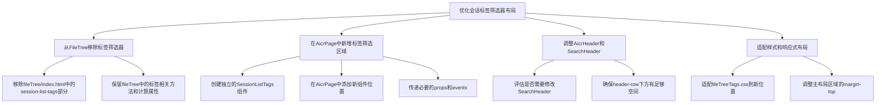
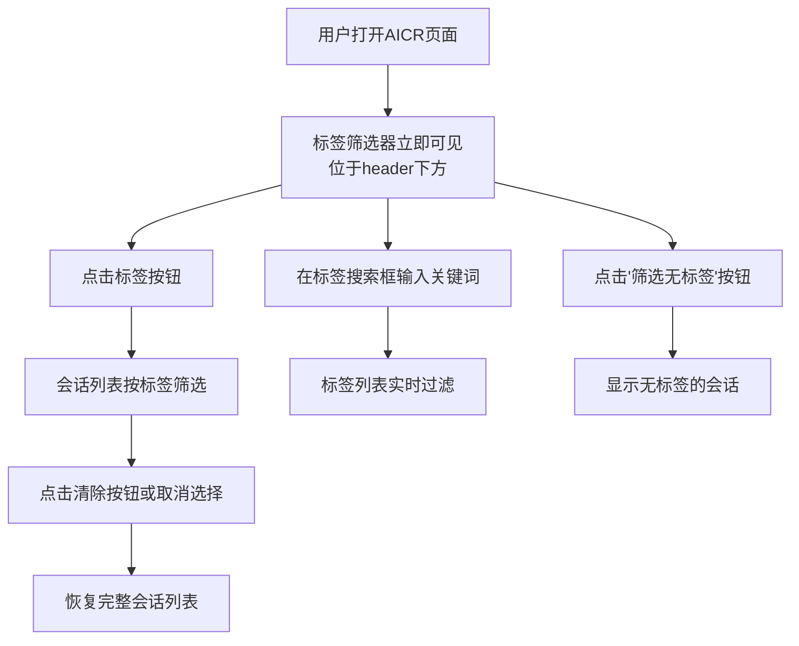
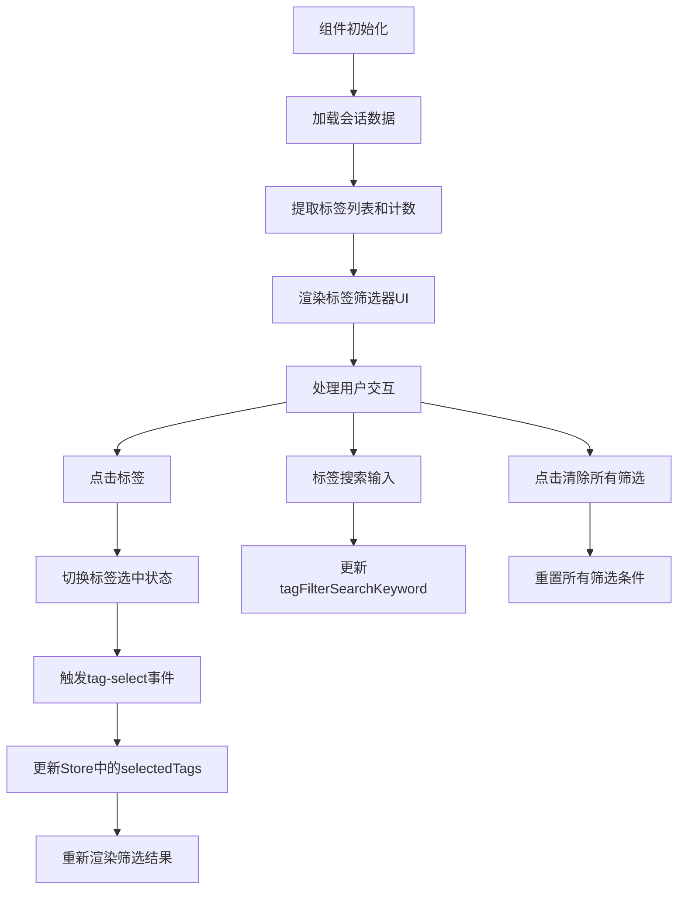
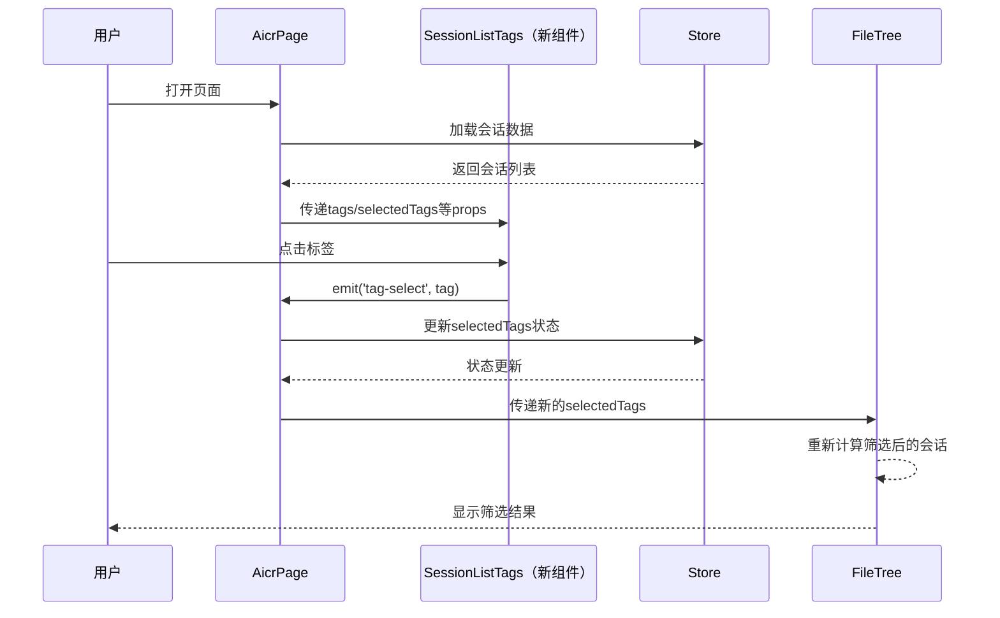

# 优化会话标签筛选器布局

> **文档版本**: v1.0 | **最后更新**: 2026-04-29 | **维护者**: doubao-seed-2-0-code-preview-260215 | **工具**: Claude Code
>
> **关联文档**: [需求文档](../01_需求文档/优化会话标签筛选器布局.md) | [设计文档](../03_设计文档/优化会话标签筛选器布局.md) | [使用文档](../04_使用文档/优化会话标签筛选器布局.md)
>

[功能概述](#功能概述) | [功能分析](#功能分析) | [用户故事表格](#用户故事表格) | [主要操作场景定义](#主要操作场景定义) | [影响分析](#影响分析) | [功能详情](#功能详情) | [验收标准](#验收标准)

---

## 功能概述

本任务将 AICR 页面中的 `session-list-tags`（会话标签筛选器）从侧边栏移动到顶部 header-row 的下一行，使其成为页面的核心交互元素。这是一个 UI 布局优化任务，不涉及核心功能逻辑的变更，但需要仔细处理组件间的状态传递和样式适配。

🎯 **布局优化**：标签筛选器移到更醒目的位置
⚡ **体验提升**：用户访问标签筛选器的路径更短
📖 **架构清晰**：保持状态管理和数据流的一致性

## 功能分析

### 功能分解图

### 用户流程图

### 功能流程图

### 完整时序图

## 用户故事表格

| 用户故事 | 验收标准 | 过程生成文档 | 产出智能文档 |
|----------|----------|--------|----------|
| 🔴 **作为 AICR 用户，我想要在页面顶部快速看到和使用标签筛选器，以便无需在侧边栏中寻找就能快速筛选会话**  **主要操作场景**： - 打开 AICR 页面，标签筛选器立即可见 - 点击标签按钮快速筛选会话 - 清除筛选条件恢复完整视图 | 1. 标签筛选器位于 header-row 下方 2. 标签筛选功能完全可用 3. 标签筛选器在侧边栏收起时仍可见 4. 样式与现有设计保持一致 | [优化会话标签筛选器布局](../03_设计文档/优化会话标签筛选器布局.md) | [generate-document](../../.claude/skills/generate-document/SKILL.md) |

## 主要操作场景定义

### 🎯 主要操作场景：打开页面立即看到标签筛选器

**场景描述**：用户打开 AICR 页面后，标签筛选器立即出现在顶部位置，无需展开侧边栏。

**前置条件**：
1. 存在至少一个带有标签的会话
2. 页面已正常加载

**操作步骤**：
1. 用户访问 AICR 页面
2. 观察页面顶部布局

**预期结果**：
1. 标签筛选器位于 header-row 正下方
2. 标签筛选器显示所有可用标签及其计数
3. 标签筛选器的样式与整体设计一致

**验证关注点**：
- 标签筛选器的位置是否正确
- 标签数据是否正常加载和显示
- 与 header-row 的间距是否合理

**相关设计文档章节**：[架构设计](../03_设计文档/优化会话标签筛选器布局.md#架构设计)

---

### 🎯 主要操作场景：使用标签筛选会话

**场景描述**：用户点击标签筛选器中的标签按钮，会话列表按选中的标签进行筛选。

**前置条件**：
1. 标签筛选器已正常显示在顶部位置
2. 存在多个带有不同标签的会话

**操作步骤**：
1. 点击一个标签按钮
2. 观察会话列表的变化
3. 点击另一个标签按钮（多选）
4. 点击反向筛选按钮
5. 点击清除所有筛选按钮

**预期结果**：
1. 点击标签后，该标签变为选中状态
2. 会话列表仅显示包含选中标签的会话
3. 支持多选标签
4. 反向筛选正常工作
5. 清除按钮恢复完整视图

**验证关注点**：
- 标签选中状态的视觉反馈
- 筛选结果的准确性
- 事件传递是否正常
- Store 状态是否正确更新

**相关设计文档章节**：[实现细节](../03_设计文档/优化会话标签筛选器布局.md#实现细节)

---

### 🎯 主要操作场景：侧边栏收起时使用标签筛选

**场景描述**：用户收起侧边栏后，仍然可以正常使用标签筛选功能。

**前置条件**：
1. 侧边栏当前处于展开状态
2. 标签筛选器已显示在顶部位置

**操作步骤**：
1. 点击收起侧边栏按钮
2. 观察标签筛选器的显示状态
3. 使用标签筛选功能

**预期结果**：
1. 侧边栏收起后，标签筛选器仍然可见
2. 标签筛选功能完全可用
3. 页面布局自适应侧边栏收起后的状态

**验证关注点**：
- 侧边栏收起时标签筛选器不消失
- 筛选功能正常工作
- 布局没有错乱

**相关设计文档章节**：[影响分析](../03_设计文档/优化会话标签筛选器布局.md#影响分析)

---

## 影响分析

### 搜索词与改动点清单

| 改动点 | 类型 | 搜索词 | 来源 | 备注 |
|--------|------|--------|------|------|
| `session-list-tags` HTML | component | `session-list-tags` | src/views/aicr/components/fileTree/index.html | 标签筛选器的模板代码 |
| `fileTreeTags.css` | css | `fileTreeTags.css` | src/views/aicr/components/fileTree/fileTreeTags.css | 标签筛选器的样式 |
| FileTree props | component | `selectedTags\|tagFilterReverse\|tagFilterNoTags` | src/views/aicr/components/fileTree/fileTreeComponent.js | FileTree 的标签相关 props |
| FileTree emits | event | `tag-select\|tag-clear\|tag-filter-reverse` | src/views/aicr/components/fileTree/fileTreeComponent.js | FileTree 的标签相关事件 |
| AicrPage layout | component | `aicrPage\|AicrPage` | src/views/aicr/components/aicrPage/index.html | 主页面布局 |
| AicrHeader/SearchHeader | component | `AicrHeader\|SearchHeader` | src/views/aicr/components/aicrHeader/ | 顶部头部组件 |

### 改动点影响链

| 改动点 | 搜索词 | 命中文件 | 引用方式 | 影响层级 | 依赖方向 | 处置方式 | 闭合状态 | 说明 |
|--------|--------|----------|----------|----------|----------|--------|------|
| `session-list-tags` | `session-list-tags` | src/views/aicr/components/fileTree/index.html:9-151 | HTML 模板 | 直接 | 反向依赖 | 移动到新组件 | 已闭合 | 标签筛选器的完整 HTML 结构 |
| `fileTreeTags.css` | `\.session-list-tags` | src/views/aicr/components/fileTree/fileTreeTags.css:1-205 | CSS 样式 | 直接 | 反向依赖 | 复制并适配到新组件 | 已闭合 | 标签筛选器的所有样式 |
| FileTree props | `selectedTags\|tagFilter` | src/views/aicr/components/fileTree/fileTreeComponent.js:54-77 | Props 定义 | 直接 | 上游依赖 | 保留在 FileTree | 已闭合 | FileTree 仍然需要这些 props 来知道哪些标签被选中 |
| FileTree emits | `tag-select\|tag-clear` | src/views/aicr/components/fileTree/fileTreeComponent.js:80 | Emits 定义 | 直接 | 上游依赖 | 保留但不再触发 | 已闭合 | 这些事件将由新组件触发 |
| AicrPage 布局 | `aicr-header\|AicrPage` | src/views/aicr/components/aicrPage/index.html:1-11 | HTML 模板 | 直接 | 反向依赖 | 添加新组件位置 | 已闭合 | 需要在 aicr-header 下方插入新组件 |
| AicrSidebar | `file-tree` | src/views/aicr/components/aicrSidebar/index.html:15-39 | FileTree 引用 | 二级 | 传递依赖 | 无需修改 | 已闭合 | FileTree 仍然需要，但不再包含标签筛选器 |

### 依赖闭合摘要

| 改动点 | 上游依赖是否核对 | 反向依赖是否核对 | 传递依赖是否闭合 | 测试 / 文档 / 配置是否覆盖 | 结论 |
|--------|------------------|------------------|------------------|----------------------------|------|
| `session-list-tags` 移动 | 是 | 是 | 是 | 是 | 可实施 |
| FileTree 组件修改 | 是 | 是 | 是 | 是 | 可实施 |
| AicrPage 布局修改 | 是 | 是 | 是 | 是 | 可实施 |

### 未覆盖风险

| 风险来源 | 原因 | 影响 | 缓解方式 |
|----------|------|------|----------|
| 未知的标签相关动态引用 | 代码中可能存在未通过静态搜索找到的动态引用 | 可能导致功能异常 | 实施后进行完整的手动测试 |
| 响应式布局问题 | 标签筛选器移到新位置后，在不同屏幕尺寸下可能有布局问题 | 可能影响用户体验 | 测试各种屏幕尺寸，做好响应式适配 |
| fileTreeMethods 中的标签方法 | 部分标签相关方法可能仍然被其他部分调用 | 可能影响标签功能 | 保留这些方法，确保 FileTree 仍然能正常工作 |

### 改动范围汇总

- **需直接修改的文件数**：4 个
  - `src/views/aicr/components/fileTree/index.html` - 移除标签筛选器 HTML
  - `src/views/aicr/components/aicrPage/index.html` - 添加新组件位置
  - 新建 `SessionListTags` 组件文件
  - 可能需要调整 `SearchHeader` 或 `AicrHeader` 的样式
- **需验证兼容性的文件数**：2 个
  - `src/views/aicr/components/aicrSidebar/index.html` - 验证 FileTree 仍然正常
  - `src/views/aicr/index.js` - 验证整体页面初始化
- **需追踪传递影响的文件数**：1 个
  - `src/views/aicr/hooks/` 下的标签相关状态管理
- **需人工复核或阻断的风险**：无，但建议实施后进行完整的手动测试

---

## 功能详情

### 方案选择

**推荐方案**：创建独立的 `SessionListTags` 组件，放置在 AicrPage 中 aicr-header 的下方。

**备选方案对比**：
- 方案 A：将标签筛选器集成到 SearchHeader 组件中
  - 优点：头部功能集中
  - 缺点：SearchHeader 可能过于臃肿，且标签筛选器与搜索功能是两个独立的功能
- 方案 B：创建独立组件放置在 AicrPage（推荐）
  - 优点：职责清晰，易于维护和复用，不影响现有组件
  - 缺点：需要新增组件文件

### 新组件设计

**组件名称**：`SessionListTags`

**职责**：
- 渲染标签筛选器 UI
- 处理标签相关的用户交互
- 向父组件（AicrPage）发送标签筛选事件

**Props**（与当前 FileTree 中的标签相关 props 保持一致）：
- `allTags`: Array - 所有标签列表
- `selectedTags`: Array - 当前选中的标签
- `tagFilterReverse`: Boolean - 是否反向筛选
- `tagFilterNoTags`: Boolean - 是否筛选无标签会话
- `tagFilterExpanded`: Boolean - 是否展开标签列表
- `tagFilterSearchKeyword`: String - 标签搜索关键词
- `tagCounts`: Object - 标签计数（包含 noTagsCount）
- `collapsed`: Boolean - 侧边栏是否收起（可能不需要）

**Emits**（与当前 FileTree 中的标签相关 events 保持一致）：
- `tag-select(tag)` - 标签被选中/取消选中
- `tag-clear()` - 清除所有标签筛选
- `tag-filter-reverse(value)` - 切换反向筛选
- `tag-filter-no-tags(value)` - 切换无标签筛选
- `tag-filter-expand(value)` - 切换展开/收起
- `tag-filter-search(keyword)` - 标签搜索

### 样式适配

需要将 `fileTreeTags.css` 中的样式适配到新组件的上下文中：
- 移除对 `.file-tree-container` 的依赖
- 调整与 header-row 的间距
- 适配新的父容器宽度
- 确保在不同屏幕尺寸下的表现

---

## 验收标准

### P0 - 必须通过
- 标签筛选器成功移动到 header-row 下方的新位置
- 所有标签筛选功能保持正常（选择、反向筛选、搜索、清除）
- 标签筛选器在侧边栏收起时仍然可见且可用
- FileTree 组件仍然正常工作（展开/收起、文件选择等）
- 页面整体布局没有明显错乱

### P1 - 应该通过
- 标签筛选器的样式与整体设计风格保持一致
- 在不同屏幕尺寸下有合理的响应式表现
- 标签筛选器的交互反馈（悬停、点击、动画）保持流畅
- 性能没有明显下降

### P2 - 可以有
- 优化标签筛选器的视觉设计，使其更符合顶部位置的重要性
- 添加更丰富的标签交互效果
- 添加标签筛选器的快捷键支持
