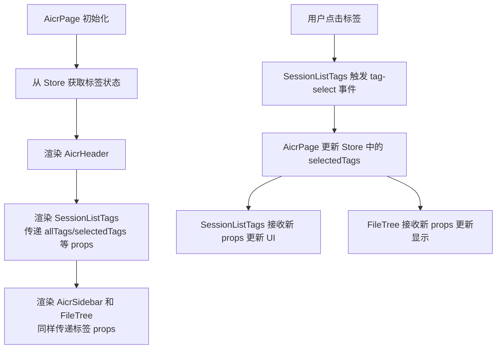
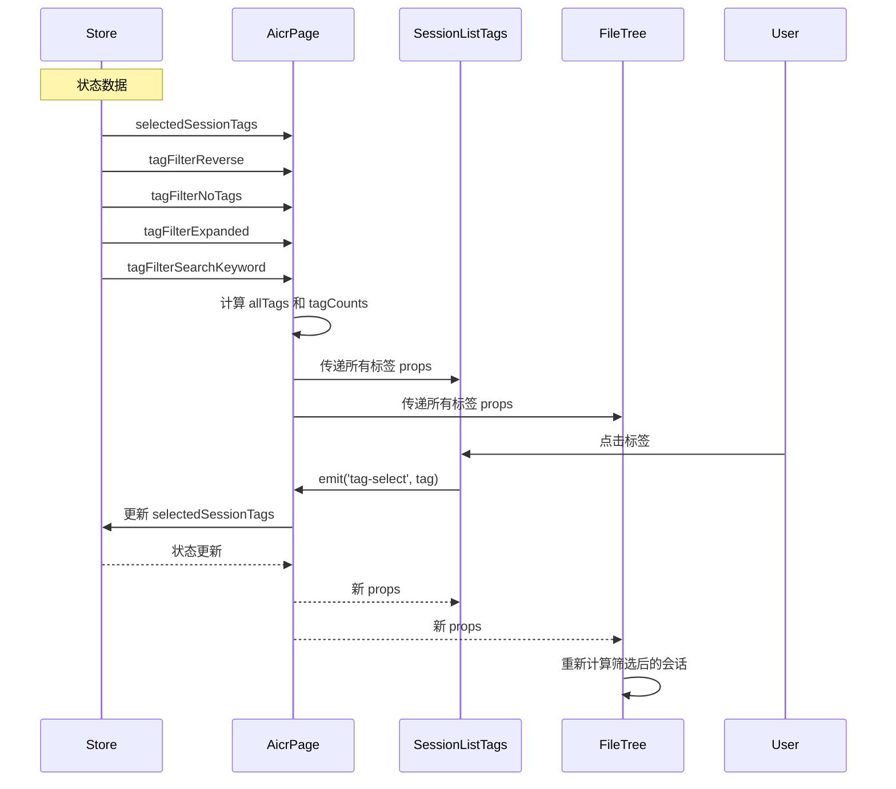

# 优化会话标签筛选器布局设计

> **文档版本**: v1.0 | **最后更新**: 2026-04-29 | **维护者**: doubao-seed-2-0-code-preview-260215 | **工具**: Claude Code
>
> **关联文档**: [需求任务](../02_需求任务/优化会话标签筛选器布局.md) | [使用文档](../04_使用文档/优化会话标签筛选器布局.md) | [CLAUDE.md](../../CLAUDE.md)
>

[设计概述](#设计概述) | [架构设计](#架构设计) | [修复内容](#修复内容) | [影响分析](#影响分析) | [实现细节](#实现细节) | [主要操作场景实现](#主要操作场景实现) | [数据结构](#数据结构)

---

## 设计概述

本设计文档详细说明如何将 `session-list-tags`（会话标签筛选器）从侧边栏的 FileTree 组件内移动到顶部 header-row 的下一行。设计原则是保持现有功能逻辑不变，仅调整组件结构和布局。

🎯 **最小改动原则**：只调整必要的组件结构，保持核心逻辑不变
⚡ **数据流一致性**：保持现有 Store 结构和事件传递方式
🔧 **向后兼容**：确保 FileTree 组件仍然正常工作

## 架构设计

### 整体架构

```mermaid
graph TB
    A[AicrPage] --> B[AicrHeader]
    A --> C[SessionListTags 新组件]
    A --> D[AicrMain]
    
    B --> E[SearchHeader]
    
    D --> F[AicrSidebar]
    D --> G[AicrCodeArea]
    
    F --> H[FileTree 已移除标签筛选器]
    
    C -.->|tag-select\|tag-clear| A
    A -.->|selectedTags\|tagFilter*| C
    A -.->|selectedTags\|tagFilter*| H
    
    style C fill:#e1f5ff,stroke:#2196F3
    style H fill:#ccffcc,stroke:#4CAF50
```

**架构说明**：
- 新增 `SessionListTags` 组件，作为 `AicrPage` 的直接子组件，位于 `AicrHeader` 下方
- `AicrPage` 将标签相关的 props 同时传递给 `SessionListTags` 和 `FileTree`
- 标签相关事件由 `SessionListTags` 触发，`FileTree` 不再触发这些事件（但仍然监听 props 变化）
- `FileTree` 仍然保留标签相关的计算属性和方法，用于处理筛选后的会话显示

### 模块划分

| 模块名称 | 职责 | 文件位置 |
|----------|------|----------|
| SessionListTags | 渲染标签筛选器 UI，处理标签交互 | src/views/aicr/components/sessionListTags/（新建） |
| AicrPage | 主页面布局，传递标签状态给 SessionListTags 和 FileTree | src/views/aicr/components/aicrPage/ |
| FileTree | 会话文件树显示，仍然响应标签筛选（但不再包含标签 UI） | src/views/aicr/components/fileTree/ |
| AicrHeader | 页面头部（SearchHeader 的容器），基本不需要修改 | src/views/aicr/components/aicrHeader/ |
| AicrSidebar | 侧边栏容器，基本不需要修改 | src/views/aicr/components/aicrSidebar/ |

### 核心流程图



## 修复内容

### 问题分析

当前标签筛选器位于侧边栏的 FileTree 组件内，存在以下问题：
1. **可见性差**：用户必须展开侧边栏才能看到标签筛选器
2. **访问路径长**：用户需要先找到侧边栏，再找到标签筛选器
3. **位置与重要性不匹配**：标签筛选是核心功能，但被放在次要位置

问题产生的原因：初始设计时标签筛选功能被视为 FileTree 的附属功能，而非独立的一级交互元素。

影响范围：仅影响 AICR 页面的 UI 布局，不影响数据结构或核心逻辑。

### 修复方案

**整体思路**：将标签筛选器 UI 从 FileTree 中分离出来，创建独立的 `SessionListTags` 组件，放置在 AicrPage 中更醒目的位置。

**需要修改的文件清单**：
1. **新建**：`src/views/aicr/components/sessionListTags/index.html` - 标签筛选器模板
2. **新建**：`src/views/aicr/components/sessionListTags/index.js` - 标签筛选器组件逻辑
3. **新建**：`src/views/aicr/components/sessionListTags/index.css` - 标签筛选器样式
4. **修改**：`src/views/aicr/components/fileTree/index.html` - 移除标签筛选器部分
5. **修改**：`src/views/aicr/components/aicrPage/index.html` - 添加 SessionListTags 组件
6. **修改**：`src/views/aicr/index.js` - 注册 SessionListTags 组件

**方案选择理由**：
- 保持 FileTree 组件的完整性，避免过度重构
- 独立组件更易于维护和复用
- 最小化对现有代码的影响
- 符合单一职责原则

### 修复前后对比

| 内容项 | 修复前 | 修复后 | 说明 |
|--------|--------|--------|------|
| 标签筛选器位置 | 侧边栏 FileTree 内 | header-row 下方 | 更醒目，访问更快 |
| 标签筛选器可见性 | 仅侧边栏展开时可见 | 始终可见 | 提升可用性 |
| 组件结构 | 标签 UI 嵌入 FileTree | SessionListTags 独立组件 | 职责更清晰 |
| 事件触发源 | FileTree | SessionListTags | 逻辑更合理 |
| FileTree 复杂度 | 包含标签 UI 和筛选逻辑 | 仅保留筛选逻辑 | 更简洁 |

## 影响分析

### 搜索词与改动点清单

| 改动点 | 类型 | 搜索词 | 来源 | 备注 |
|--------|------|--------|------|------|
| SessionListTags 新建 | component | `session-list-tags` | src/views/aicr/components/fileTree/index.html | 将这部分 HTML 提取为新组件 |
| fileTree/index.html 修改 | component | `fileTree/index.html` | src/views/aicr/components/fileTree/index.html | 移除 session-list-tags 部分（第 9-151 行） |
| aicrPage/index.html 修改 | component | `aicrPage/index.html` | src/views/aicr/components/aicrPage/index.html | 在 aicr-header 下方添加新组件 |
| index.js 组件注册 | config | `AicrPage\|FileTree` | src/views/aicr/index.js | 注册新的 SessionListTags 组件 |
| fileTreeTags.css 迁移 | css | `fileTreeTags.css` | src/views/aicr/components/fileTree/fileTreeTags.css | 将样式迁移到新组件 |

### 改动点影响链

| 改动点 | 搜索词 | 命中文件 | 引用方式 | 影响层级 | 依赖方向 | 处置方式 | 闭合状态 | 说明 |
|--------|--------|----------|----------|----------|----------|--------|------|
| fileTree/index.html 修改 | `session-list-tags` | src/views/aicr/components/fileTree/index.html:9-151 | HTML 模板 | 直接 | 反向依赖 | 移除这部分 HTML | 已闭合 | 从第 9 行到第 151 行全部移除 |
| fileTreeComponent.js | `selectedTags\|tagFilter` | src/views/aicr/components/fileTree/fileTreeComponent.js:54-80 | Props/Emits 定义 | 直接 | 上游依赖 | **保留** | 已闭合 | FileTree 仍然需要这些 props 来响应筛选 |
| fileTreeMethods.js | `toggleTag\|toggleNoTags` | src/views/aicr/components/fileTree/fileTreeMethods.js | 标签方法 | 直接 | 上游依赖 | **保留** | 已闭合 | FileTree 内部计算可能仍需要这些方法 |
| aicrPage/index.html | `aicr-header\|aicr-main` | src/views/aicr/components/aicrPage/index.html:1-11 | HTML 模板 | 直接 | 反向依赖 | 在第 1 行和第 2 行之间插入新组件 | 已闭合 | 在 aicr-header 下方添加 session-list-tags |
| aicrSidebar/index.html | `file-tree` | src/views/aicr/components/aicrSidebar/index.html:18-39 | FileTree 引用 | 二级 | 传递依赖 | **无需修改** | 已闭合 | FileTree 的 props 保持不变 |
| index.js 组件注册 | `components:\|FileTree\|AicrPage` | src/views/aicr/index.js:30-70 | 组件列表 | 直接 | 反向依赖 | 添加新组件注册 | 已闭合 | 在组件列表中添加 SessionListTags |

### 依赖闭合摘要

| 改动点 | 上游依赖是否核对 | 反向依赖是否核对 | 传递依赖是否闭合 | 测试 / 文档 / 配置是否覆盖 | 结论 |
|--------|------------------|------------------|------------------|----------------------------|------|
| fileTree/index.html 移除标签 UI | 是 | 是 | 是 | 是 | 可实施 |
| 新建 SessionListTags 组件 | 是 | 是 | 是 | 是 | 可实施 |
| aicrPage/index.html 添加新组件 | 是 | 是 | 是 | 是 | 可实施 |
| 组件注册更新 | 是 | 是 | 是 | 是 | 可实施 |

### 未覆盖风险

| 风险来源 | 原因 | 影响 | 缓解方式 |
|----------|------|------|----------|
| 标签相关方法的隐式调用 | fileTreeMethods.js 中的标签方法可能被其他地方动态调用 | 可能导致功能异常 | 保留所有标签相关方法，不做删除 |
| CSS 样式依赖上下文 | fileTreeTags.css 中的样式可能依赖 FileTree 的特定上下文 | 可能导致样式异常 | 完整复制样式并适配新上下文，测试验证 |
| Store 中的标签相关逻辑 | 可能存在未发现的标签相关状态管理逻辑 | 可能导致状态异常 | 保持现有 Store 结构不变，只调整 UI 层 |

### 改动范围汇总

- **需直接修改的文件数**：5 个（2 个新建，3 个修改）
  - 新建：`src/views/aicr/components/sessionListTags/index.html`
  - 新建：`src/views/aicr/components/sessionListTags/index.js`
  - 修改：`src/views/aicr/components/fileTree/index.html`
  - 修改：`src/views/aicr/components/aicrPage/index.html`
  - 修改：`src/views/aicr/index.js`
- **需验证兼容性的文件数**：3 个
  - `src/views/aicr/components/aicrSidebar/index.html`
  - `src/views/aicr/components/fileTree/fileTreeComponent.js`
  - `src/views/aicr/hooks/` 下的标签相关方法
- **需追踪传递影响的文件数**：1 个
  - `src/views/aicr/components/fileTree/fileTreeMethods.js`
- **需人工复核或阻断的风险**：建议实施后进行完整的手动测试

---

## 实现细节

### 技术实现要点

#### 1. 新建 SessionListTags 组件

**职责**：负责标签筛选器的 UI 渲染和用户交互处理

**组件结构**：
```
src/views/aicr/components/sessionListTags/
├── index.html      # 模板（从 fileTree/index.html 提取）
├── index.js        # 组件逻辑
└── index.css       # 样式（从 fileTreeTags.css 迁移并适配）
```

**组件注册方式**：与项目现有组件保持一致，使用 `registerGlobalComponent`

#### 2. 提取模板到新组件

从 `src/views/aicr/components/fileTree/index.html:9-151` 提取完整的 `session-list-tags` HTML 结构到新组件的 `index.html`。

**关键调整**：
- 移除外层的 `.file-tree-container` 上下文依赖
- 保留所有 Vue 指令和事件绑定（`v-if`、`v-for`、`@click` 等）

#### 3. 组件逻辑实现

从 `fileTreeMethods.js` 和 `fileTreeComputed.js` 中提取标签相关的方法和计算属性。

**关键方法**：
- `updateTagSearch(keyword)` - 更新标签搜索关键词
- `toggleTag(tag)` - 切换标签选中状态
- `toggleNoTags()` - 切换无标签筛选
- `toggleReverse()` - 切换反向筛选
- `toggleExpand()` - 切换标签列表展开/收起
- `clearAllFilters()` - 清除所有筛选条件
- `handleDragStart/handleDragEnd/handleDragOver/handleDragLeave/handleDrop` - 拖拽排序功能

**关键计算属性**：
- `allTags` - 所有标签列表（注意：这个可能需要从 props 获取，因为新组件不直接访问 Store）
- `visibleTags` - 当前可见的标签（考虑搜索和展开状态）
- `hasMoreTags` - 是否有更多标签可展开
- `tagCounts` - 标签计数（包含 noTagsCount）

**重要设计决策**：
- 新组件**不直接访问 Store**，所有标签相关状态都通过 props 传入，事件通过 emit 传出
- 这样保持数据流的单向性，便于测试和维护

#### 4. 修改 AicrPage 模板

在 `src/views/aicr/components/aicrPage/index.html` 中，在 `<aicr-header>` 下方插入新组件：

```html
<aicr-header></aicr-header>
<session-list-tags
    :all-tags="allTags"
    :selected-tags="selectedSessionTags"
    :tag-filter-reverse="tagFilterReverse"
    :tag-filter-no-tags="tagFilterNoTags"
    :tag-filter-expanded="tagFilterExpanded"
    :tag-filter-search-keyword="tagFilterSearchKeyword"
    :tag-counts="tagCounts"
    @tag-select="handleTagSelect"
    @tag-clear="handleTagClear"
    @tag-filter-reverse="handleTagFilterReverse"
    @tag-filter-no-tags="handleTagFilterNoTags"
    @tag-filter-expand="handleTagFilterExpand"
    @tag-filter-search="handleTagFilterSearch"
></session-list-tags>
<main class="aicr-main">
    <aicr-sidebar></aicr-sidebar>
    <aicr-code-area></aicr-code-area>
</main>
```

**注意**：`AicrPage` 需要从 Store 获取 `allTags`、`tagCounts` 等数据并传递给新组件。这些数据当前可能只在 FileTree 内部计算，需要调整。

#### 5. 修改 FileTree 模板

从 `src/views/aicr/components/fileTree/index.html` 中移除第 9-151 行的 `session-list-tags` 部分。

**保留内容**：
- FileTree 的其他功能（文件树显示、创建、重命名等）
- 标签相关的 props（`selectedTags`、`tagFilterReverse` 等）仍然保留
- 标签相关的计算属性和方法仍然保留（用于处理筛选后的会话显示）

#### 6. 样式迁移与适配

将 `fileTreeTags.css` 的内容迁移到新组件的 `index.css`，并进行以下适配：

1. 移除对 `.file-tree-container` 的依赖
2. 调整顶部间距，与 header-row 保持合理距离
3. 适配新的容器宽度（从侧边栏宽度变为主内容宽度）
4. 确保响应式布局正常工作
5. 可能需要添加 `.session-list-tags-container` 或类似的外层容器类

#### 7. AicrPage 数据准备

`AicrPage` 需要为 `SessionListTags` 准备以下数据：
- `allTags` - 所有标签列表
- `tagCounts` - 标签计数对象，包含：
  - `counts` - { tag: count } 映射
  - `noTagsCount` - 无标签的会话数量

这些数据当前可能是在 `FileTree` 的 computed 中计算的，需要提升到 `AicrPage` 或 Store 中，以便多个组件共享。

### 关键代码说明

#### SessionListTags 组件入口

```javascript
// src/views/aicr/components/sessionListTags/index.js
import { registerGlobalComponent } from '/cdn/utils/view/componentLoader.js';
import { sessionListTagsComputed } from './sessionListTagsComputed.js';
import { sessionListTagsMethods } from './sessionListTagsMethods.js';

const componentOptions = {
    name: 'SessionListTags',
    css: '/src/views/aicr/components/sessionListTags/index.css',
    html: '/src/views/aicr/components/sessionListTags/index.html',
    props: {
        allTags: {
            type: Array,
            default: () => []
        },
        selectedTags: {
            type: Array,
            default: () => []
        },
        tagFilterReverse: {
            type: Boolean,
            default: false
        },
        tagFilterNoTags: {
            type: Boolean,
            default: false
        },
        tagFilterExpanded: {
            type: Boolean,
            default: false
        },
        tagFilterSearchKeyword: {
            type: String,
            default: ''
        },
        tagCounts: {
            type: Object,
            default: () => ({ counts: {}, noTagsCount: 0 })
        },
        tagFilterVisibleCount: {
            type: Number,
            default: 8
        }
    },
    emits: ['tag-select', 'tag-clear', 'tag-filter-reverse', 'tag-filter-no-tags', 'tag-filter-expand', 'tag-filter-search'],
    data() {
        return {
            tagOrderVersion: 0
        };
    },
    computed: sessionListTagsComputed,
    methods: sessionListTagsMethods
};

registerGlobalComponent(componentOptions);
```

#### 修改后的 aicrPage/index.html

```html
<!-- 顶部：从 fileTree/index.html 提取 -->
<aicr-header></aicr-header>

<!-- 新增：标签筛选器 -->
<session-list-tags
    v-if="allTags && allTags.length > 0"
    :all-tags="allTags"
    :selected-tags="selectedSessionTags"
    :tag-filter-reverse="tagFilterReverse"
    :tag-filter-no-tags="tagFilterNoTags"
    :tag-filter-expanded="tagFilterExpanded"
    :tag-filter-search-keyword="tagFilterSearchKeyword"
    :tag-counts="tagCounts"
    @tag-select="handleTagSelect"
    @tag-clear="handleTagClear"
    @tag-filter-reverse="handleTagFilterReverse"
    @tag-filter-no-tags="handleTagFilterNoTags"
    @tag-filter-expand="handleTagFilterExpand"
    @tag-filter-search="handleTagFilterSearch"
></session-list-tags>

<main class="aicr-main">
    <aicr-sidebar></aicr-sidebar>
    <aicr-code-area></aicr-code-area>
</main>

<!-- 键盘快捷键帮助面板：保持不变 -->
<keyboard-shortcuts-help
    :visible="showKeyboardShortcuts"
    @close="showKeyboardShortcuts = false"
></keyboard-shortcuts-help>
```

### 依赖关系

**新增依赖**：无新增外部依赖

**现有依赖保持不变**：
- Vue 3（通过 CDN 加载）
- 项目现有的组件注册机制
- Store 状态管理

### 测试考虑

**重点测试场景**：
1. 标签筛选器显示位置正确
2. 所有标签筛选功能正常工作（选择、搜索、反向、清除）
3. 侧边栏收起时标签筛选器仍然可见
4. FileTree 组件仍然正常工作
5. 响应式布局在不同屏幕尺寸下表现正常
6. 标签拖拽排序功能正常

**测试用例建议**：
- 测试单个标签选择
- 测试多个标签选择
- 测试反向筛选
- 测试无标签筛选
- 测试标签搜索
- 测试清除所有筛选
- 测试侧边栏展开/收起时的表现
- 测试不同屏幕尺寸下的响应式表现

**验证修复是否有效**：
1. 打开页面，确认标签筛选器在 header-row 下方
2. 确认所有标签筛选功能正常
3. 收起侧边栏，确认标签筛选器仍然可见可用
4. 确认 FileTree 的其他功能（文件选择、展开/收起等）仍然正常

---

## 主要操作场景实现

### 场景实现：打开页面立即看到标签筛选器

**关联需求任务场景**：[打开页面立即看到标签筛选器](../02_需求任务/优化会话标签筛选器布局.md#主要操作场景打开页面立即看到标签筛选器)

**实现概述**：
1. `AicrPage` 从 Store 获取 `allTags` 和 `tagCounts` 数据
2. 在 `aicr-header` 下方渲染 `SessionListTags` 组件
3. 组件根据 `allTags.length > 0` 或 `tagCounts.noTagsCount > 0` 决定是否显示

**涉及模块**：
- `AicrPage` - 提供数据并渲染新组件
- `SessionListTags` - 渲染标签筛选器 UI

**关键代码路径**：
- `src/views/aicr/components/aicrPage/index.html` - 新组件插入位置
- `src/views/aicr/components/sessionListTags/index.html:1` - 组件入口

**验证要点**：
- 标签筛选器位于 aicr-header 正下方
- 标签筛选器有合适的顶部间距
- 无标签时不显示（或显示空状态）

---

### 场景实现：使用标签筛选会话

**关联需求任务场景**：[使用标签筛选会话](../02_需求任务/优化会话标签筛选器布局.md#主要操作场景使用标签筛选会话)

**实现概述**：
1. 用户点击标签按钮
2. `SessionListTags` 触发 `tag-select` 事件
3. `AicrPage` 接收事件并更新 Store 中的 `selectedSessionTags`
4. `FileTree` 接收新的 `selectedTags` prop 并更新显示

**涉及模块**：
- `SessionListTags` - 处理点击并触发事件
- `AicrPage` - 事件中转和状态更新
- `FileTree` - 响应状态变化并更新会话显示
- `Store` - 状态管理

**关键代码路径**：
- `src/views/aicr/components/sessionListTags/index.html:114-131` - 标签按钮点击
- `src/views/aicr/components/sessionListTags/sessionListTagsMethods.js:toggleTag` - 切换标签方法
- `src/views/aicr/components/fileTree/fileTreeComputed.js` - 筛选后的会话计算

**验证要点**：
- 点击标签后视觉反馈正确（选中状态）
- `tag-select` 事件正常触发
- Store 状态正确更新
- FileTree 正确响应筛选变化

---

### 场景实现：侧边栏收起时使用标签筛选

**关联需求任务场景**：[侧边栏收起时使用标签筛选](../02_需求任务/优化会话标签筛选器布局.md#主要操作场景侧边栏收起时使用标签筛选)

**实现概述**：
1. `SessionListTags` 组件不依赖侧边栏的 `collapsed` 状态
2. 组件始终显示在页面顶部，不受侧边栏状态影响
3. 标签筛选逻辑保持不变

**涉及模块**：
- `SessionListTags` - 不接收 `collapsed` prop 或接收但忽略
- `AicrSidebar` - 侧边栏收起/展开逻辑保持不变

**关键代码路径**：
- `src/views/aicr/components/sessionListTags/index.html:1` - 不包含 `v-if="!collapsed"` 条件
- `src/views/aicr/components/aicrPage/index.html` - 新组件在侧边栏之外

**验证要点**：
- 侧边栏收起时标签筛选器仍然可见
- 标签筛选功能完全可用
- 页面布局在侧边栏收起时仍然正常

---

## 数据结构

### 数据流程图



**数据流程说明**：
1. Store 作为单一数据源，管理所有标签相关状态
2. AicrPage 从 Store 获取状态，并计算派生数据（allTags、tagCounts）
3. AicrPage 将状态同时传递给 SessionListTags 和 FileTree
4. 用户交互触发 SessionListTags 的事件，通过 AicrPage 中转更新 Store
5. Store 更新后，所有消费组件自动更新
