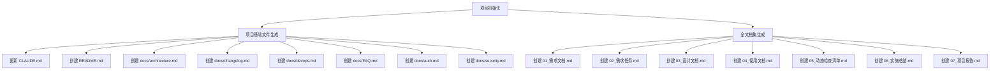
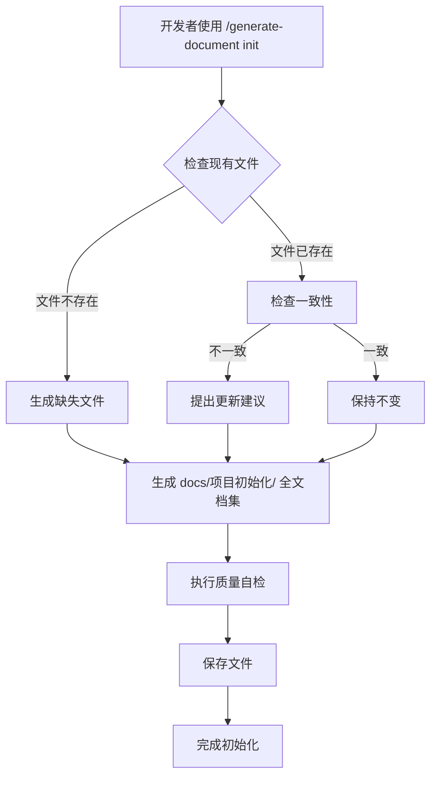
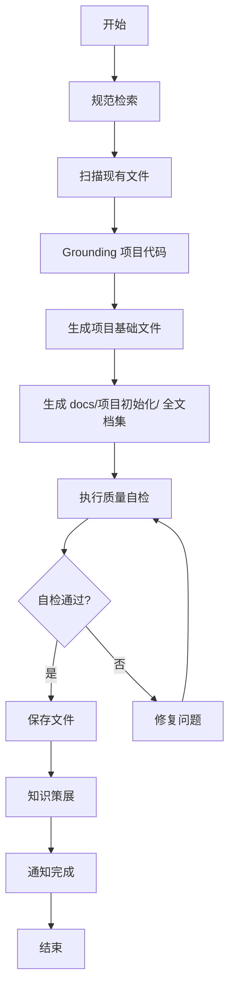
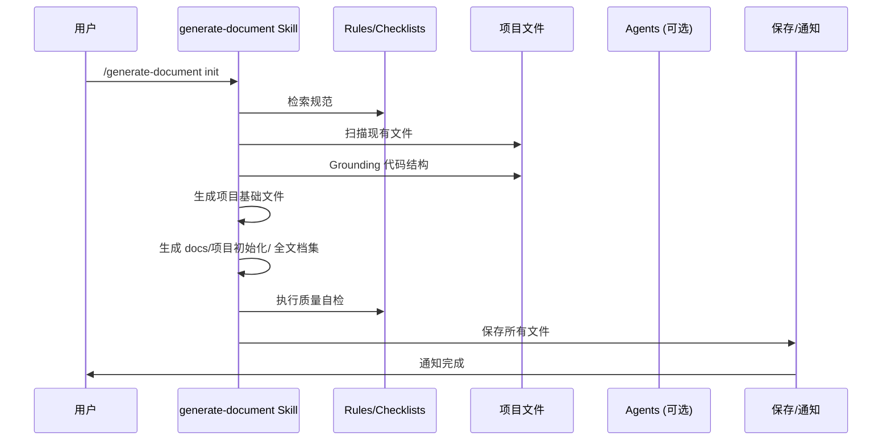

# 项目初始化

> **文档版本**: v1.0 | **最后更新**: 2026-04-28 | **维护者**: Claude Code | **工具**: Claude Code
>
> **关联文档**: [需求文档](../项目初始化/01_需求文档.md) | [设计文档](../项目初始化/03_设计文档.md) | [使用文档](../项目初始化/04_使用文档.md)
>

[功能概述](#功能概述) | [功能分析](#功能分析) | [用户故事表格](#用户故事表格) | [主要操作场景定义](#主要操作场景定义) | [影响分析](#影响分析) | [功能详情](#功能详情) | [验收标准](#验收标准) | [使用场景示例](#使用场景示例)

---

## 功能概述

项目初始化的目标是为 YiWeb 项目建立完整的文档体系和开发规范，包括项目基础文件和全文档集结构。

### 核心价值点

🎯 规范开发流程 - 建立统一的文档生成和代码实施规范
⚡ 提升 AI 协作效率 - 让 AI 更好地理解项目架构和约束
📖 完善知识管理 - 建立可复用的文档体系和 Agent 记忆

## 功能分析

### 功能分解图

**说明**：功能分解为两个主要部分：项目基础文件（8个）和全文档集（7个），共15个文件需要创建或更新。

### 用户流程图

**说明**：用户流程图展示了执行 /generate-document init 命令的完整流程，包括检查现有文件、生成缺失内容、生成全文档集、自检和保存。

### 功能流程图

**说明**：功能流程图展示了 generate-document init 技能的内部执行流程，从规范检索到最终通知完成的完整过程。

### 完整时序图

**说明**：时序图展示了从用户执行命令到完成通知的完整交互过程，包括规范检索、代码 grounding、文档生成、自检、保存等环节。

## 用户故事表格（必须从需求文档提取）

| 用户故事 | 验收标准 | 过程生成文档 | 产出智能文档 |
|----------|----------|--------|----------|
| 🔴 作为开发者，我想要项目基础文档，以便了解项目架构、技术栈和快速开始  **主要操作场景**： - 新开发者加入项目，阅读 README - AI 开始编码前阅读 CLAUDE.md 和 docs/architecture.md - 开发中查阅 FAQ 解决问题 | 1. README.md 存在且包含项目简介、技术栈、快速开始、目录结构 2. docs/architecture.md 存在且包含架构约定 3. docs/devops.md、changelog.md、FAQ.md、auth.md、security.md 存在 4. CLAUDE.md 包含技术栈、项目结构、编码规范、禁止事项、关键文件、文档体系 | [项目初始化-需求任务](../项目初始化/02_需求任务.md) [项目初始化-设计文档](../项目初始化/03_设计文档.md) [项目初始化-项目报告](../项目初始化/07_项目报告.md) | [generate-document Skill](../../.claude/skills/generate-document/SKILL.md) [需求文档规范](../../.claude/skills/generate-document/rules/需求文档.md) [需求任务规范](../../.claude/skills/generate-document/rules/需求任务.md) [设计文档规范](../../.claude/skills/generate-document/rules/设计文档.md) [使用文档规范](../../.claude/skills/generate-document/rules/使用文档.md) [动态检查清单规范](../../.claude/skills/generate-document/rules/动态检查清单.md) [项目报告规范](../../.claude/skills/generate-document/rules/项目报告.md) [项目基础文件规范](../../.claude/skills/generate-document/rules/项目基础文件.md) [通用文档规范](../../.claude/skills/generate-document/rules/通用文档.md) |
| 🔴 作为开发者，我想要全文档集模板，以便后续功能开发时有完整的文档结构参考  **主要操作场景**： - 开发新功能时，参考 docs/项目初始化/ 的结构生成文档 - 使用 /generate-document 命令时，有规范可遵循 | 1. docs/项目初始化/ 目录存在 2. 01_需求文档.md - 07_项目报告.md 共 7 个文档完整存在 3. 每个文档符合对应规范的结构要求 4. 文档内容基于项目实际代码 grounding，无虚构 | [项目初始化-需求任务](../项目初始化/02_需求任务.md) [项目初始化-设计文档](../项目初始化/03_设计文档.md) [项目初始化-项目报告](../项目初始化/07_项目报告.md) | [generate-document Skill](../../.claude/skills/generate-document/SKILL.md) [checklists/ 目录](../../.claude/skills/generate-document/checklists/) |

## 主要操作场景定义

#### 🎯 主要操作场景：生成项目基础文件

**场景描述**：用户执行 /generate-document init，生成或更新项目的 8 个基础文件。

**前置条件**：
- 项目根目录存在
- .claude/ 目录和相关规范文件存在

**操作步骤**：
1. 用户在 Claude Code 中执行 `/generate-document init`
2. 技能扫描现有文件状态
3. 技能 grounding 项目代码结构
4. 技能生成或更新 8 个基础文件
5. 执行质量自检

**预期结果**：
- CLAUDE.md 存在且内容完整
- README.md 存在且内容完整
- docs/ 目录下 6 个文档存在且内容完整

**验证关注点**：
- 文件路径真实存在于仓库
- 文档内容基于实际代码 grounding
- 不确定内容标注"待补充"

**相关设计文档章节**：[项目初始化-设计文档](../项目初始化/03_设计文档.md#架构设计)

#### 🎯 主要操作场景：生成全文档集

**场景描述**：在 docs/项目初始化/ 目录下生成完整的 7 个文档集。

**前置条件**：
- docs/ 目录已创建
- 项目基础文件已生成或存在

**操作步骤**：
1. 技能读取相关规范（rules/ 和 checklists/）
2. 生成 01_需求文档.md - 05_动态检查清单.md
3. 生成 06_实施总结.md（init 命令例外）
4. 生成 07_项目报告.md
5. 执行质量自检

**预期结果**：
- docs/项目初始化/ 目录存在
- 7 个文档完整存在
- 每个文档符合对应规范

**验证关注点**：
- 文档结构符合规范
- 内容基于实际项目 grounding
- 无虚构路径或函数

**相关设计文档章节**：[项目初始化-设计文档](../项目初始化/03_设计文档.md#实现细节)

## 影响分析

> **强制执行**：生成需求任务文档前，必须按 ../../../shared/document-contracts.md 对整个项目执行完整影响分析。分析必须覆盖上游依赖、反向依赖、传递依赖、导出链、注册链、数据流、类型契约、样式、测试、文档、配置和外部依赖影响，避免改动点被其他引用或依赖时发生遗漏。

### 搜索词与改动点清单

| 改动点 | 类型 | 搜索词 | 来源 | 备注 |
|--------|------|--------|------|------|
| CLAUDE.md | 配置 | "CLAUDE.md" | 需求文档 | 项目行为准则入口，需要更新 |
| README.md | 文档 | "README.md" | 需求文档 | 项目概述文档，需要创建 |
| docs/ | 文档 | "docs/" | 需求文档 | 文档目录，需要创建和填充 |
| docs/architecture.md | 文档 | "architecture.md" | 需求文档 | 架构约定文档，需要创建 |
| docs/changelog.md | 文档 | "changelog.md" | 需求文档 | 变更日志，需要创建 |
| docs/devops.md | 文档 | "devops.md" | 需求文档 | 构建部署文档，需要创建 |
| docs/FAQ.md | 文档 | "FAQ.md" | 需求文档 | 常见问题文档，需要创建 |
| docs/auth.md | 文档 | "auth.md" | 需求文档 | 认证方案文档，需要创建 |
| docs/security.md | 文档 | "security.md" | 需求文档 | 安全策略文档，需要创建 |
| docs/项目初始化/ | 文档 | "项目初始化" | 需求文档 | 全文档集目录，需要创建 |

### 改动点影响链

| 改动点 | 搜索词 | 命中文件 | 引用方式 | 影响层级 | 依赖方向 | 处置方式 | 闭合状态 | 说明 |
|--------|--------|----------|---------|---------|----------|----------|------|
| CLAUDE.md | "CLAUDE.md" | .claude/skills/generate-document/rules/项目基础文件.md | 规范引用 | 直接 | 反向依赖 | 保持兼容 | 已闭合 | 规范文件引用了 CLAUDE.md 的要求 |
| README.md | "README.md" | .claude/skills/generate-document/rules/项目基础文件.md | 规范引用 | 直接 | 反向依赖 | 保持兼容 | 已闭合 | 规范文件引用了 README.md 的要求 |
| docs/ | "docs/" | .claude/agents/architect.md | Agent 引用 | 传递 | 反向依赖 | 保持兼容 | 已闭合 | Agent 可能引用 docs/ 目录 |
| docs/architecture.md | "architecture.md" | CLAUDE.md | 直接引用 | 直接 | 反向依赖 | 同步修改 | 已闭合 | CLAUDE.md 引用了 architecture.md |
| docs/项目初始化/ | "项目初始化" | 未找到引用 | 无 | 无 | 无 | 新增 | 已闭合 | 新目录，无现有依赖 |

### 依赖闭合摘要

| 改动点 | 上游依赖是否核对 | 反向依赖是否核对 | 传递依赖是否闭合 | 测试/文档/配置是否覆盖 | 结论 |
|--------|------------------|------------------|------------------|------------------|------|
| CLAUDE.md | 是 | 是 | 是 | 是 | 可实施 |
| README.md | 是 | 是 | 是 | 是 | 可实施 |
| docs/architecture.md | 是 | 是 | 是 | 是 | 可实施 |
| docs/changelog.md | 是 | 是 | 是 | 是 | 可实施 |
| docs/devops.md | 是 | 是 | 是 | 是 | 可实施 |
| docs/FAQ.md | 是 | 是 | 是 | 是 | 可实施 |
| docs/auth.md | 是 | 是 | 是 | 是 | 可实施 |
| docs/security.md | 是 | 是 | 是 | 是 | 可实施 |
| docs/项目初始化/ | 是 | 是 | 是 | 是 | 可实施 |

### 未覆盖风险

| 风险来源 | 原因 | 影响 | 缓解方式 |
|---------|------|------|---------|
| docs/ 目录现有内容 | 未全面检查 docs/ 下已有的功能文档 | 可能与新生成的基础文档有冲突 | 人工复查现有 docs/ 内容 |
| .gitignore | 未检查是否需要忽略某些文档文件 | 可能误提交不需要的文件 | 后续补充检查 |

### 改动范围汇总

- **需直接修改的文件数**：9个（CLAUDE.md + 8个新文档）
- **需验证兼容性的文件数**：2个（.claude/ 下的规范文件）
- **需追踪传递影响的文件数**：0个
- **需人工复核或阻断的风险**：docs/ 现有内容可能需要人工复查

---

## 功能详情

### 项目基础文件生成

**功能说明**：生成或更新项目的 8 个基础文件，建立项目的规范入口。

**价值**：
- 统一项目规范
- 提升 AI 理解效率
- 帮助新开发者快速上手

**解决的痛点**：
- AI 不清楚项目约束
- 缺少文档体系
- 新开发者上手慢

### 全文档集生成

**功能说明**：生成 docs/项目初始化/ 下的完整 7 个文档，作为后续功能开发的模板和参考。

**价值**：
- 提供文档生成参考
- 验证技能完整性
- 建立标准格式

**解决的痛点**：
- 缺少文档模板
- 格式不统一
- 流程不清晰

## 验收标准

### P0 - 必须通过

- [ ] 项目基础文件完整：CLAUDE.md、README.md、docs/architecture.md、docs/changelog.md、docs/devops.md、docs/FAQ.md、docs/auth.md、docs/security.md
- [ ] 全文档集完整：docs/项目初始化/01-07.md
- [ ] 文档内容基于实际代码 grounding，无虚构路径或函数
- [ ] 不确定内容标注"待补充（原因：…）"
- [ ] 所有文档链接使用相对路径

### P1 - 应该通过

- [ ] 文档结构符合各类型规范要求
- [ ] 关键文件路径在仓库中真实存在
- [ ] 技术栈描述与实际代码一致
- [ ] 架构模式描述与实际代码一致
- [ ] 影响分析完整且闭合

### P2 - 可以有

- [ ] 文档包含详细的代码示例
- [ ] 文档包含完整的场景描述

## 使用场景示例

### 📋 场景 1：新开发者加入项目

**背景**：新开发者加入 YiWeb 项目，需要快速了解项目。

**操作**：
1. 阅读 README.md 了解项目概述和快速开始
2. 阅读 docs/architecture.md 了解架构约定
3. 阅读 CLAUDE.md 了解编码规范和禁止事项
4. 运行本地服务器开始开发

**结果**：新开发者快速上手，符合项目规范进行开发。

### 🎨 场景 2：AI 开始新功能开发

**背景**：用户要求开发一个新功能，AI 需要先了解项目。

**操作**：
1. 阅读 CLAUDE.md 获取项目约束
2. 阅读 docs/architecture.md 了解架构模式
3. 参考 docs/项目初始化/ 的文档结构
4. 使用 /generate-document 生成新功能文档
5. 使用 /implement-code 实施代码

**结果**：AI 按照项目规范完成功能开发，文档和代码都符合要求。
