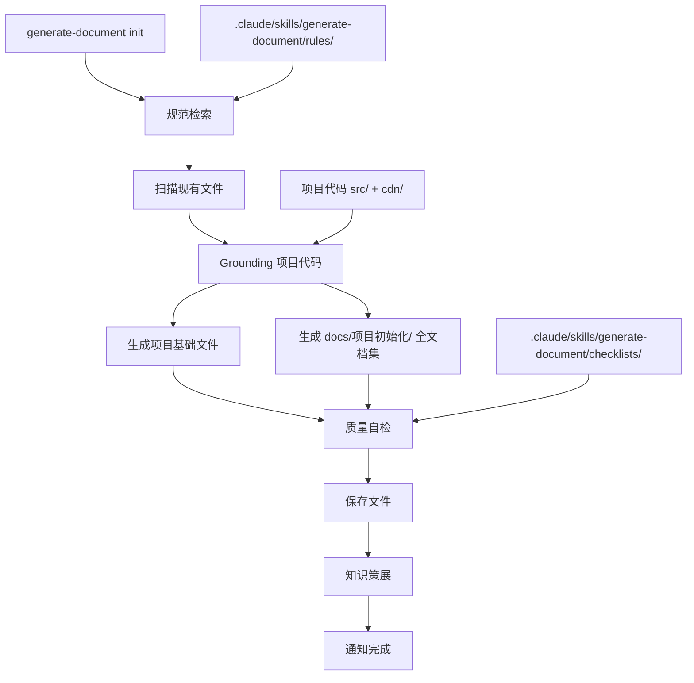
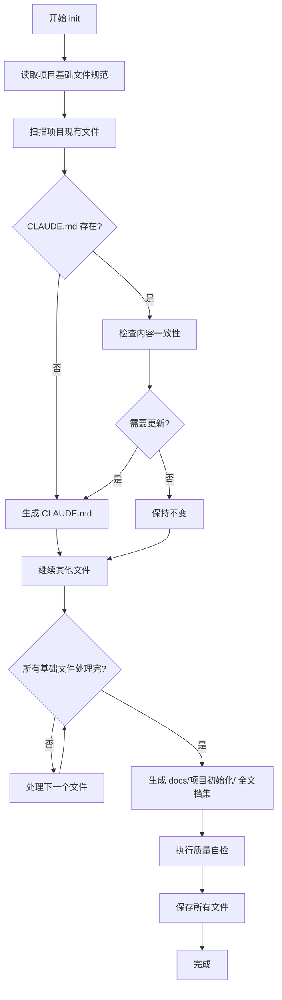
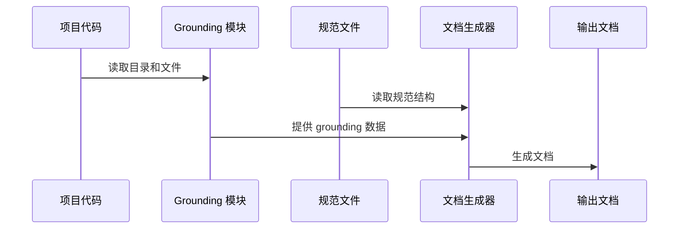

# 项目初始化设计

> **文档版本**: v1.0 | **最后更新**: 2026-04-28 | **维护者**: Claude Code | **工具**: Claude Code
>
> **关联文档**: [需求任务](../项目初始化/02_需求任务.md) | [使用文档](../项目初始化/04_使用文档.md) | [CLAUDE.md](../../CLAUDE.md)
>

[设计概述](#设计概述) | [架构设计](#架构设计) | [修复内容](#修复内容) | [影响分析](#影响分析) | [实现细节](#实现细节) | [主要操作场景实现](#主要操作场景实现) | [数据结构设计](#数据结构设计)

---

## 设计概述

项目初始化的设计目标是为 YiWeb 项目建立完整的文档体系和开发规范，遵循项目现有的架构模式和编码规范。

### 设计原则

🎯 规范优先 - 严格遵循 .claude/skills/generate-document/rules/ 下的规范
⚡ Grounding 驱动 - 所有内容基于实际项目代码，不虚构
🔧 完整交付 - 生成完整的文档集，而非单个文档

## 架构设计

### 整体架构

**说明**：整体架构展示了 /generate-document init 命令的执行流程，从规范检索到最终通知的完整过程。输入包括规范文件和项目代码，输出包括项目基础文件和全文档集。

### 模块划分

| 模块名称 | 职责 | 文件位置 |
|---------|------|---------|
| 规范检索 | 读取 rules/ 和 checklists/ 下的规范 | .claude/skills/generate-document/rules/ |
| 项目扫描 | 检查现有文件状态 | 项目根目录 |
| 代码 Grounding | 读取项目代码推断技术栈和架构 | src/、cdn/ |
| 文档生成 | 生成项目基础文件和全文档集 | docs/、docs/项目初始化/ |
| 质量自检 | 按 checklist 执行质量检查 | .claude/skills/generate-document/checklists/ |
| 保存通知 | 保存文件并发送通知 | 项目根目录 |

### 核心流程图

**说明**：核心流程图展示了处理项目基础文件的逻辑，包括检查存在性、一致性判断、生成或保持不变等步骤，然后继续生成全文档集。

## 修复内容

（本功能为新增功能，无修复内容）

### 问题分析

不适用（新增功能）

### 修复方案

不适用（新增功能）

### 修复前后对比

不适用（新增功能）

## 影响分析

> **强制执行**：生成设计文档前，必须按 ../../../shared/document-contracts.md 对整个项目执行完整影响分析。分析必须覆盖上游依赖、反向依赖、传递依赖、导出链、注册链、数据流、类型契约、样式、测试、文档、配置和外部依赖影响，避免改动点被其他引用或依赖时发生遗漏。

### 搜索词与改动点清单

| 改动点 | 类型 | 搜索词 | 来源 | 备注 |
|--------|------|--------|------|------|
| CLAUDE.md | 配置 | "CLAUDE.md" | 需求任务 | 项目行为准则入口，需要更新 |
| README.md | 文档 | "README.md" | 需求任务 | 项目概述文档，需要创建 |
| docs/ | 文档 | "docs/" | 需求任务 | 文档目录，需要创建和填充 |
| docs/architecture.md | 文档 | "architecture.md" | 需求任务 | 架构约定文档，需要创建 |
| docs/changelog.md | 文档 | "changelog.md" | 需求任务 | 变更日志，需要创建 |
| docs/devops.md | 文档 | "devops.md" | 需求任务 | 构建部署文档，需要创建 |
| docs/FAQ.md | 文档 | "FAQ.md" | 需求任务 | 常见问题文档，需要创建 |
| docs/auth.md | 文档 | "auth.md" | 需求任务 | 认证方案文档，需要创建 |
| docs/security.md | 文档 | "security.md" | 需求任务 | 安全策略文档，需要创建 |
| docs/项目初始化/ | 文档 | "项目初始化" | 需求任务 | 全文档集目录，需要创建 |

### 改动点影响链

| 改动点 | 搜索词 | 命中文件 | 引用方式 | 影响层级 | 依赖方向 | 处置方式 | 闭合状态 | 说明 |
|--------|--------|----------|---------|---------|----------|----------|------|
| CLAUDE.md | "CLAUDE.md" | .claude/skills/generate-document/rules/项目基础文件.md | 规范引用 | 直接 | 反向依赖 | 保持兼容 | 已闭合 | 规范文件引用了 CLAUDE.md 的要求 |
| README.md | "README.md" | .claude/skills/generate-document/rules/项目基础文件.md | 规范引用 | 直接 | 反向依赖 | 保持兼容 | 已闭合 | 规范文件引用了 README.md 的要求 |
| docs/ | "docs/" | .claude/agents/architect.md | Agent 引用 | 传递 | 反向依赖 | 保持兼容 | 已闭合 | Agent 可能引用 docs/ 目录 |
| docs/architecture.md | "architecture.md" | CLAUDE.md | 直接引用 | 直接 | 反向依赖 | 同步修改 | 已闭合 | CLAUDE.md 引用了 architecture.md |
| docs/项目初始化/ | "项目初始化" | 未找到引用 | 无 | 无 | 无 | 新增 | 已闭合 | 新目录，无现有依赖 |

### 依赖闭合摘要

| 改动点 | 上游依赖是否核对 | 反向依赖是否核对 | 传递依赖是否闭合 | 测试/文档/配置是否覆盖 | 结论 |
|--------|------------------|------------------|------------------|------------------|------|
| CLAUDE.md | 是 | 是 | 是 | 是 | 可实施 |
| README.md | 是 | 是 | 是 | 是 | 可实施 |
| docs/architecture.md | 是 | 是 | 是 | 是 | 可实施 |
| docs/changelog.md | 是 | 是 | 是 | 是 | 可实施 |
| docs/devops.md | 是 | 是 | 是 | 是 | 可实施 |
| docs/FAQ.md | 是 | 是 | 是 | 是 | 可实施 |
| docs/auth.md | 是 | 是 | 是 | 是 | 可实施 |
| docs/security.md | 是 | 是 | 是 | 是 | 可实施 |
| docs/项目初始化/ | 是 | 是 | 是 | 是 | 可实施 |

### 未覆盖风险

| 风险来源 | 原因 | 影响 | 缓解方式 |
|---------|------|------|---------|
| docs/ 目录现有内容 | 未全面检查 docs/ 下已有的功能文档 | 可能与新生成的基础文档有冲突 | 人工复查现有 docs/ 内容 |
| .gitignore | 未检查是否需要忽略某些文档文件 | 可能误提交不需要的文件 | 后续补充检查 |

### 改动范围汇总

- **需直接修改的文件数**：9个（CLAUDE.md + 8个新文档）
- **需验证兼容性的文件数**：2个（.claude/ 下的规范文件）
- **需追踪传递影响的文件数**：0个
- **需人工复核或阻断的风险**：docs/ 现有内容可能需要人工复查

---

## 实现细节

### 技术实现要点

1. **规范驱动生成**：
   - 从 .claude/skills/generate-document/rules/ 读取各文档类型的规范
   - 严格按照规范要求的章节结构生成
   - 不使用模板（设计文档和动态检查清单禁用模板）

2. **代码 Grounding**：
   - 读取项目目录结构推断技术栈
   - 读取关键文件（src/views/aicr/index.js、cdn/utils/view/baseView.js 等）推断架构模式
   - 所有引用的路径和函数必须真实存在

3. **防幻觉机制**：
   - 不确定内容标注"待补充（原因：…）"
   - 代码示例必须来自真实文件
   - 路径必须真实存在于仓库

### 关键代码说明

**关键文件路径**（真实存在于仓库）：
- `/var/www/YiWeb/src/views/aicr/index.js` - 视图入口示例
- `/var/www/YiWeb/cdn/utils/view/baseView.js` - 视图工厂示例
- `/var/www/YiWeb/.claude/skills/generate-document/rules/项目基础文件.md` - 项目基础文件规范
- `/var/www/YiWeb/.claude/shared/behavioral-guidelines.md` - 行为规范

### 依赖关系

**新增文件**：
- 8个项目基础文件（CLAUDE.md 已更新，7个 docs/ 下新建）
- 7个 docs/项目初始化/ 下文档

**外部依赖**：无新增外部依赖

### 测试考虑

**测试用例建议**：
1. 验证所有生成的文件存在
2. 验证文档链接有效性
3. 验证关键文件路径真实性
4. 验证文档结构符合规范

**验证方式**：手动浏览器验证 + 文件系统检查

## 主要操作场景实现

### 场景实现：生成项目基础文件

**关联需求任务场景**：[项目初始化-需求任务 - 生成项目基础文件](../项目初始化/02_需求任务.md#主要操作场景定义)

**实现概述**：通过 /generate-document init 命令，规范检索 → 代码 grounding → 文档生成 → 质量自检 → 保存通知。

**涉及模块**：
- 规范检索模块（读取 rules/ 和 checklists/）
- 代码 Grounding 模块（读取 src/、cdn/）
- 文档生成模块（Write 文件）

**关键代码路径**：
- `.claude/skills/generate-document/SKILL.md` - 技能入口
- `.claude/skills/generate-document/rules/项目基础文件.md` - 基础文件规范

**验证关注点**：
- 文件路径真实存在
- 文档内容基于实际代码 grounding
- 不确定内容标注"待补充"

---

### 场景实现：生成全文档集

**关联需求任务场景**：[项目初始化-需求任务 - 生成全文档集](../项目初始化/02_需求任务.md#主要操作场景定义)

**实现概述**：在 docs/项目初始化/ 目录下，按照各类型规范生成 01-07 完整文档集。

**涉及模块**：
- 规范检索模块（各类型规则）
- 文档生成模块
- Agent 调用（如需要）

**关键代码路径**：
- `.claude/skills/generate-document/rules/需求文档.md`
- `.claude/skills/generate-document/rules/需求任务.md`
- `.claude/skills/generate-document/rules/设计文档.md`
- 等其他规范文件

**验证关注点**：
- 文档结构符合各类型规范
- 内容基于实际项目 grounding
- 无虚构路径或函数

---

## 数据结构设计

（项目初始化主要生成文档，无复杂数据结构设计）

### 数据流程图

**说明**：数据流程图展示了从项目代码到输出文档的 grounding 过程，确保所有文档内容基于真实代码。

> 待补充（原因：本功能主要是文档生成，无数据结构设计）
