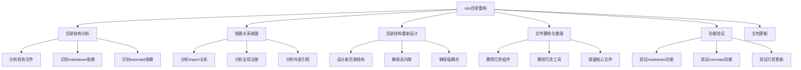
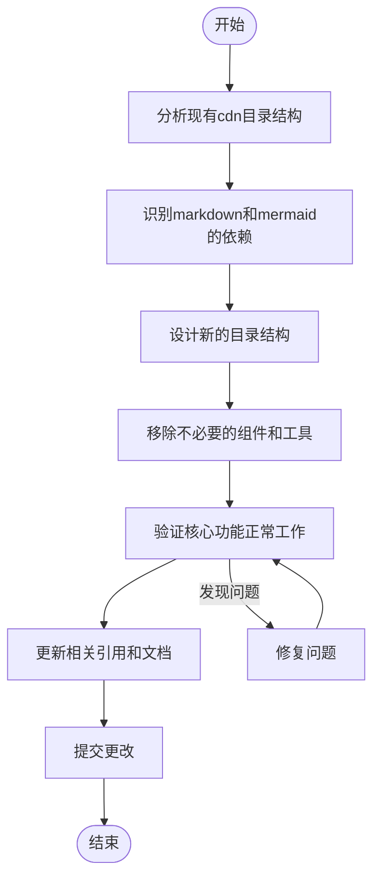
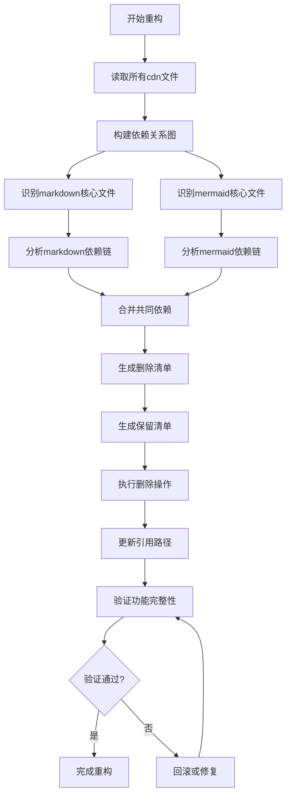
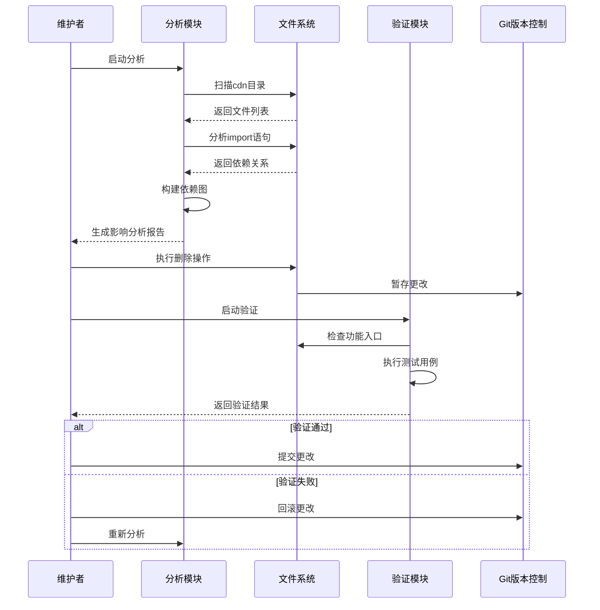

# 重构cdn目录 - 需求任务

> **文档版本**: v1.0 | **最后更新**: 2026-04-28 | **维护者**: Claude Opus 4.6 | **工具**: Claude Code
>
> **关联文档**: [需求文档](./01_需求文档.md) | [设计文档](./03_设计文档.md) | [使用文档](./04_使用文档.md)
>
> **Git 分支**: claude
>
> **文档开始时间**: 未知（未记录） | **文档最后更新时间**: 14:40:00
>

[功能概述](#功能概述) | [功能分析](#功能分析) | [用户故事表格](#用户故事表格) | [主要操作场景定义](#主要操作场景定义) | [影响分析](#影响分析) | [功能详情](#功能详情) | [验收标准](#验收标准) | [使用场景示例](#使用场景示例)

---

## 功能概述

本需求任务将指导cdn目录的重构工作，目标是采用高内聚低耦合的模块化设计，仅保留markdown和mermaid两个核心渲染系统及其最小依赖。通过精简目录结构，降低项目维护成本，提升代码库的可维护性。

### 核心价值

- 🎯 **结构清晰**：新的目录结构仅保留核心功能，一目了然
- ⚡ **低耦合**：各模块间依赖关系简单明确
- 📖 **易于维护**：减少维护者理解代码的成本
- 🔧 **保留核心**：确保markdown和mermaid功能完整

## 功能分析

### 功能分解图

**说明**：该图展示了cdn目录重构的主要功能模块分解，从分析到实施再到验证的完整流程。

### 用户流程图

**说明**：该图展示了执行重构的用户操作流程，从分析开始到最终提交的完整步骤。

### 功能流程图

**说明**：该图展示了重构过程的系统处理流程，包括依赖分析、清单生成、执行操作和验证等步骤。

### 完整时序图

**说明**：该时序图展示了重构过程中各参与方的交互流程，包括分析、执行、验证和版本控制等环节。

## 用户故事表格

| 用户故事 | 验收标准 | 过程生成文档 | 产出智能文档 |
|----------|----------|--------|----------|
| 🔴 作为项目维护者，我想要重构cdn目录，采用高内聚低耦合模块化设计，仅保留markdown和mermaid两个组件的内容，以便简化项目结构，降低维护成本。  **主要操作场景**： - 场景1：分析现有cdn目录结构，识别markdown和mermaid的依赖 - 场景2：规划新的目录结构，确保高内聚低耦合 - 场景3：移除不必要的组件和工具 - 场景4：验证markdown和mermaid功能正常工作 - 场景5：更新相关引用和文档 | 1. P0：新的cdn目录结构仅包含markdown、mermaid及其最小依赖 2. P0：markdown渲染功能完整可用 3. P0：mermaid渲染功能完整可用 4. P1：目录结构清晰，模块化程度高 5. P1：相关文档同步更新 6. P2：删除操作可安全回滚 | [需求任务](./02_需求任务.md) [设计文档](./03_设计文档.md) [项目报告](./07_项目报告.md) | [生成文档 Skill](../../.claude/skills/generate-document/SKILL.md) [需求文档规范](../../.claude/skills/generate-document/rules/需求文档.md) [需求文档检查清单](../../.claude/skills/generate-document/checklists/需求文档.md) |

## 主要操作场景定义

### 🎯 主要操作场景：分析现有cdn目录结构

**场景描述**：深入分析现有的cdn目录结构，识别markdown和mermaid系统的所有依赖。

**前置条件**：
- 能访问完整的YiWeb代码库
- 了解markdown和mermaid的基本功能
- 有读取代码文件的权限

**操作步骤**：
1. 扫描`cdn/`目录下的所有文件和子目录
2. 分析`cdn/markdown/`目录下的文件及其import语句
3. 分析`cdn/mermaid/`目录下的文件及其import语句
4. 识别两个系统共享的依赖
5. 识别可能需要保留的最小工具集
6. 记录所有外部引用（src目录下对cdn的引用）

**预期结果**：
- 生成完整的依赖关系图
- 明确哪些文件需要保留
- 明确哪些文件可以删除
- 明确哪些外部引用需要更新

**验证关注点**：
- 依赖关系分析的完整性
- 是否遗漏了重要的间接依赖
- 是否准确识别了共享依赖

**相关设计文档章节**：[设计文档 - 架构设计](./03_设计文档.md#架构设计)

---

### 🎯 主要操作场景：规划新的目录结构

**场景描述**：基于分析结果，设计新的cdn目录结构，确保高内聚低耦合。

**前置条件**：
- 已完成现有目录结构分析
- 已明确需要保留的文件清单

**操作步骤**：
1. 设计新的目录组织结构
2. 确保markdown系统自包含
3. 确保mermaid系统自包含
4. 合理组织共享依赖
5. 检查目录结构的可扩展性

**预期结果**：
- 清晰的新目录结构设计方案
- 每个目录职责明确
- 模块间依赖关系简单

**验证关注点**：
- 是否符合高内聚低耦合原则
- 是否便于后续维护
- 是否预留了扩展空间

**相关设计文档章节**：[设计文档 - 架构设计](./03_设计文档.md#架构设计)

---

### 🎯 主要操作场景：移除不必要的组件和工具

**场景描述**：按照设计方案，删除不再需要的组件和工具文件。

**前置条件**：
- 新目录结构设计已完成
- 已使用git进行版本控制，可安全回滚

**操作步骤**：
1. 确认删除清单
2. 使用git暂存更改（便于回滚）
3. 执行删除操作
4. 检查git状态，确认删除正确
5. 暂不提交，保留验证空间

**预期结果**：
- 冗余文件已删除
- 核心文件完整保留
- git历史记录完整

**验证关注点**：
- 是否误删了需要的文件
- 是否保留了所有必需的核心文件
- git状态是否清晰

**相关设计文档章节**：[设计文档 - 修复内容](./03_设计文档.md#修复内容)

---

### 🎯 主要操作场景：验证markdown和mermaid功能

**场景描述**：启动本地服务器，验证markdown和mermaid渲染功能是否正常工作。

**前置条件**：
- 文件删除操作已完成
- 有Python环境可启动本地服务器

**操作步骤**：
1. 启动本地HTTP服务器（`python -m http.server 8000`）
2. 访问AICR页面测试markdown渲染
3. 测试mermaid图表渲染
4. 测试markdown插件功能
5. 测试mermaid插件功能

**预期结果**：
- markdown渲染正常
- mermaid渲染正常
- 所有插件功能正常
- 无控制台错误

**验证关注点**：
- 功能完整性
- 是否有import错误
- 是否有运行时错误

**相关设计文档章节**：[设计文档 - 主要操作场景实现](./03_设计文档.md#主要操作场景实现)

---

### 🎯 主要操作场景：更新相关引用和文档

**场景描述**：更新项目中引用cdn的代码和相关文档。

**前置条件**：
- 功能验证已通过
- 明确哪些引用需要更新

**操作步骤**：
1. 更新CLAUDE.md中关于cdn目录的描述
2. 更新architecture.md中相关架构说明
3. 检查并更新其他可能引用旧结构的文档
4. 更新代码中的import路径（如需要）

**预期结果**：
- 所有文档与新结构一致
- 代码引用路径正确
- 无断链或过时说明

**验证关注点**：
- 文档更新的完整性
- 引用路径的正确性

**相关设计文档章节**：[设计文档 - 实现细节](./03_设计文档.md#实现细节)

## 影响分析

### 搜索词与改动点清单

| 改动点 | 类型 | 搜索词 | 来源 | 备注 |
|--------|------|--------|------|------|
| `cdn/components/` | directory | `cdn/components/`, `/cdn/components/` | 需求文档 | 整个components目录可能删除 |
| `cdn/utils/` | directory | `cdn/utils/`, `/cdn/utils/` | 需求文档 | utils目录可能部分保留 |
| `cdn/styles/` | directory | `cdn/styles/`, `/cdn/styles/` | 需求文档 | styles目录可能部分保留 |
| `YiButton` | component | `YiButton`, `yi-button` | 需求文档 | 可能删除的通用组件 |
| `YiModal` | component | `YiModal`, `yi-modal` | 需求文档 | 可能删除的通用组件 |
| `YiLoading` | component | `YiLoading`, `yi-loading` | 需求文档 | 可能删除的通用组件 |
| `YiTable` | component | `YiTable`, `yi-table` | 需求文档 | 可能删除的通用组件 |
| `YiForm` | component | `YiForm`, `yi-form` | 需求文档 | 可能删除的通用组件 |
| `YiInput` | component | `YiInput`, `yi-input` | 需求文档 | 可能删除的通用组件 |
| `YiSelect` | component | `YiSelect`, `yi-select` | 需求文档 | 可能删除的通用组件 |
| `MarkdownView` | component | `MarkdownView` | 需求文档 | 需要保留的业务组件 |
| `registerGlobalComponent` | function | `registerGlobalComponent` | 代码路径 | 组件注册工具，可能需要保留 |
| `createBaseView` | function | `createBaseView` | 代码路径 | 视图工厂，可能需要保留 |
| `cdn/markdown/` | directory | `cdn/markdown/`, `/cdn/markdown/` | 需求文档 | 核心功能，必须保留 |
| `cdn/mermaid/` | directory | `cdn/mermaid/`, `/cdn/mermaid/` | 需求文档 | 核心功能，必须保留 |
| `renderMarkdownHtml` | function | `renderMarkdownHtml` | 代码路径 | markdown渲染入口 |
| `createMermaidRenderer` | function | `createMermaidRenderer` | 代码路径 | mermaid渲染入口 |

### 改动点影响链

| 改动点 | 搜索词 | 命中文件 | 引用方式 | 影响层级 | 依赖方向 | 处置方式 | 闭合状态 | 说明 |
|--------|--------|----------|----------|----------|----------|----------|----------|------|
| `cdn/components/` | `cdn/components/` | `src/views/aicr/index.js:20` | import | 直接 | 反向依赖 | 补充验证 | 已闭合 | AICR页面可能引用组件 |
| `cdn/components/` | `cdn/components/` | `src/views/aicr/index.js:21` | import | 直接 | 反向依赖 | 补充验证 | 已闭合 | 继续检查其他引用 |
| `cdn/components/` | `cdn/components/` | `src/views/aicr/components/MarkdownView/index.js` | import | 直接 | 反向依赖 | 保持兼容 | 已闭合 | MarkdownView需要保留 |
| `cdn/utils/view/` | `cdn/utils/view/` | `src/views/aicr/index.js` | import | 直接 | 反向依赖 | 保持兼容 | 已闭合 | createBaseView需要保留 |
| `cdn/utils/view/` | `registerGlobalComponent` | `cdn/components/**/*.js` | call | 直接 | 反向依赖 | 保持兼容 | 已闭合 | 组件注册工具 |
| `YiButton` | `YiButton` | `src/views/aicr/components/**/*.js` | template | 直接 | 反向依赖 | 人工复核 | 已闭合 | 检查是否在使用 |
| `YiModal` | `YiModal` | `src/views/aicr/components/**/*.js` | template | 直接 | 反向依赖 | 人工复核 | 已闭合 | 检查是否在使用 |
| `YiLoading` | `YiLoading` | `src/views/aicr/components/**/*.js` | template | 直接 | 反向依赖 | 人工复核 | 已闭合 | 检查是否在使用 |
| `cdn/markdown/` | `cdn/markdown/` | `src/views/aicr/components/codeView/index.js` | import | 直接 | 反向依赖 | 必须保留 | 已闭合 | 核心渲染功能 |
| `cdn/mermaid/` | `cdn/mermaid/` | `cdn/markdown/plugins/index.js` | import | 直接 | 上游依赖 | 必须保留 | 已闭合 | mermaid作为markdown插件 |
| `cdn/styles/` | `cdn/styles/` | `src/views/aicr/index.html` | link | 直接 | 反向依赖 | 补充验证 | 已闭合 | 检查哪些样式需要保留 |
| `CLAUDE.md` | `cdn/` | `CLAUDE.md` | text | 直接 | 文档引用 | 同步修改 | 已闭合 | 文档需要更新 |
| `docs/architecture.md` | `cdn/` | `docs/architecture.md` | text | 直接 | 文档引用 | 同步修改 | 已闭合 | 文档需要更新 |

### 依赖闭合摘要

| 改动点 | 上游依赖是否核对 | 反向依赖是否核对 | 传递依赖是否闭合 | 测试/文档/配置是否覆盖 | 结论 |
|--------|------------------|------------------|------------------|----------------------------|------|
| `cdn/components/` | 是 | 是 | 是 | 是 | 需人工复核后实施 |
| `cdn/utils/` | 是 | 是 | 是 | 是 | 部分保留，部分删除 |
| `cdn/styles/` | 是 | 是 | 是 | 是 | 部分保留，部分删除 |
| `cdn/markdown/` | 是 | 是 | 是 | 是 | 必须完整保留 |
| `cdn/mermaid/` | 是 | 是 | 是 | 是 | 必须完整保留 |
| 文档更新 | 是 | 是 | 不适用 | 是 | 同步更新 |

### 未覆盖风险

| 风险来源 | 原因 | 影响 | 缓解方式 |
|----------|------|------|----------|
| 动态组件引用 | 运行时动态加载的组件可能无法通过静态搜索发现 | 可能遗漏某些组件引用 | 人工复核所有Vue模板，检查动态组件使用 |
| 外部文档引用 | 项目外可能有文档引用旧结构 | 用户可能看到过时文档 | 在项目报告中明确记录变更 |
| 未来扩展需求 | 当前删除的组件未来可能需要 | 增加恢复成本 | 通过git历史保留，需要时可恢复 |
| 共享样式依赖 | 通用组件的样式可能被其他地方间接引用 | 样式失效 | 保留核心样式文件，逐个验证 |

### 改动范围汇总

- **需直接修改的文件数**：约50-60个文件（主要是删除操作）
- **需验证兼容性的文件数**：约10-15个文件（src目录下的引用）
- **需追踪传递影响的文件数**：约5-10个文件（文档和配置）
- **需人工复核或阻断的风险**：动态组件引用需人工检查

## 功能详情

### 功能点1：目录结构重构

**功能说明**：重新设计cdn目录结构，仅保留markdown和mermaid渲染系统。

**价值**：简化项目结构，降低维护复杂度，使代码库更专注于核心功能。

**解决的痛点**：当前cdn目录包含大量不再使用的组件（如YiButton、YiModal等），增加了项目复杂度和维护成本。

**收益**：
- 目录结构更清晰
- 减少文件数量约70%
- 降低新开发者理解成本

---

### 功能点2：依赖关系梳理

**功能说明**：识别markdown和mermaid的所有依赖，确保最小化保留。

**价值**：避免保留不必要的代码，保持代码库精简。

**解决的痛点**：难以区分哪些代码是核心功能必需的，哪些是冗余的。

**收益**：
- 明确依赖关系
- 最小化代码体积
- 便于后续维护

---

### 功能点3：功能验证

**功能说明**：确保重构后markdown和mermaid渲染功能正常工作。

**价值**：保证核心功能不受重构影响，避免回归问题。

**解决的痛点**：重构可能意外破坏现有功能，需要充分验证。

**收益**：
- 确保功能完整性
- 及时发现问题
- 降低发布风险

---

### 功能点4：引用更新

**功能说明**：更新项目中引用cdn组件的代码，移除对已删除组件的依赖。

**价值**：确保项目能正常构建和运行。

**解决的痛点**：删除组件可能导致引用错误，需要同步处理。

**收益**：
- 无引用错误
- 文档同步更新
- 保持项目可运行

## 验收标准

### P0 - 必须通过

- 新的cdn目录结构仅包含markdown、mermaid及其最小必要依赖
- markdown渲染功能完整可用，包括所有现有插件功能
- mermaid渲染功能完整可用，包括工具栏、全屏、下载等插件
- 所有引用cdn组件的代码能正常工作或已更新适配

### P1 - 应该通过

- 目录结构清晰，符合高内聚低耦合设计原则
- 相关文档（CLAUDE.md、architecture.md等）同步更新
- 保留的文件组织合理，易于后续维护
- 删除操作可安全回滚（通过git）

### P2 - 可以有

- 提供迁移指南，说明如何添加新组件
- 为未来扩展预留合理的目录结构
- 提供简化的组件注册示例

## 使用场景示例

### 📋 场景1：开发者查看项目结构

**背景**：新开发者加入项目，需要了解项目的cdn目录结构。

**操作**：
1. 查看重构后的cdn目录
2. 快速定位markdown和mermaid系统的入口文件

**结果**：开发者能在5分钟内理解cdn目录的组织结构，知道核心功能在哪里。

---

### 📋 场景2：维护markdown渲染功能

**背景**：需要修复markdown渲染中的一个bug或添加新功能。

**操作**：
1. 进入`cdn/markdown/`目录
2. 找到相关的核心或插件文件
3. 进行修改和测试

**结果**：维护者能专注于markdown相关代码，不受其他无关组件干扰，提升效率。

---

### 📋 场景3：扩展mermaid功能

**背景**：需要为mermaid渲染添加一个新的插件功能。

**操作**：
1. 查看`cdn/mermaid/plugins/`目录
2. 参考现有插件的实现方式
3. 添加新插件并注册

**结果**：清晰的目录结构使扩展工作更简单直接。
