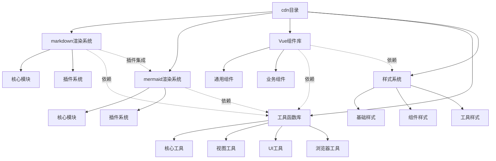
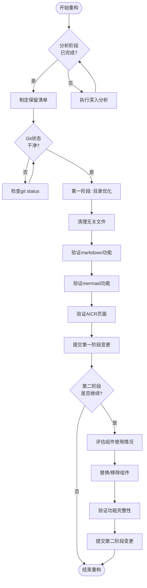
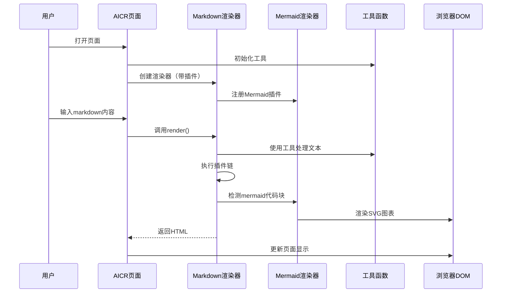

# 重构cdn目录 - 设计文档

> **文档版本**: v1.0 | **最后更新**: 2026-04-28 | **维护者**: Claude Opus 4.6 | **工具**: Claude Code
>
> **关联文档**: [需求任务](./02_需求任务.md) | [使用文档](./04_使用文档.md) | [CLAUDE.md](../../CLAUDE.md)
>
> **Git 分支**: claude
>
> **文档开始时间**: 未知（未记录） | **文档最后更新时间**: 15:00:00
>

[设计概述](#设计概述) | [架构设计](#架构设计) | [修复内容](#修复内容) | [影响分析](#影响分析) | [实现细节](#实现细节) | [主要操作场景实现](#主要操作场景实现) | [数据结构](#数据结构)

---

## 设计概述

本设计文档详细说明cdn目录重构的技术方案。经过深入分析，我们发现AICR页面实际上仍在大量使用cdn/components下的通用组件。因此，我们将采用**渐进式重构**策略：第一阶段先梳理和优化目录结构，确保markdown和mermaid核心功能完整；第二阶段再评估是否可以替换或移除其他组件。

### 设计原则

- 🎯 **渐进式重构**：先优化结构，再评估组件去留，避免破坏性变更
- ⚡ **保持功能完整**：确保现有功能不受影响
- 🔧 **高内聚低耦合**：优化模块划分，降低依赖复杂度
- 📖 **可追溯**：所有变更通过git管理，可安全回滚

## 架构设计

### 整体架构



**说明**：该图展示了cdn目录的整体架构，markdown和mermaid是核心渲染系统，依赖于utils工具库；components组件库同时依赖utils和styles。markdown通过插件集成mermaid。

### 模块划分

| 模块名称 | 职责 | 文件位置 | 保留策略 |
|----------|------|----------|----------|
| **markdown核心** | Markdown渲染引擎 | `cdn/markdown/core/` | ✅ 必须完整保留 |
| **markdown插件** | Markdown功能扩展 | `cdn/markdown/plugins/` | ✅ 必须完整保留 |
| **mermaid核心** | Mermaid渲染引擎 | `cdn/mermaid/core/` | ✅ 必须完整保留 |
| **mermaid插件** | Mermaid功能扩展 | `cdn/mermaid/plugins/` | ✅ 必须完整保留 |
| **utils/core** | 核心工具函数 | `cdn/utils/core/` | ✅ 必须完整保留（被markdown/mermaid依赖） |
| **utils/view** | 视图相关工具 | `cdn/utils/view/` | ⚠️ 评估后保留（被AICR使用） |
| **utils/ui** | UI相关工具 | `cdn/utils/ui/` | ⚠️ 评估后保留 |
| **utils/browser** | 浏览器工具 | `cdn/utils/browser/` | ⚠️ 评估后保留 |
| **utils/time** | 时间工具 | `cdn/utils/time/` | ⚠️ 评估后保留 |
| **utils/render** | 渲染工具 | `cdn/utils/render/` | ⚠️ 评估后保留 |
| **components/common** | 通用Vue组件 | `cdn/components/common/` | ⚠️ 第一阶段保留，第二阶段评估 |
| **components/business** | 业务Vue组件 | `cdn/components/business/` | ⚠️ 第一阶段保留，第二阶段评估 |
| **styles** | 全局样式 | `cdn/styles/` | ⚠️ 评估后保留核心部分 |

### 核心流程图



**说明**：该图展示了渐进式重构的核心流程，分为两个主要阶段：第一阶段优化目录结构和清理，第二阶段评估组件去留。

## 修复内容

### 问题分析

**当前问题**：
1. cdn目录包含大量组件，但实际使用情况不明确
2. 缺乏清晰的模块划分和依赖管理
3. 部分组件可能已不再使用，但未清理
4. 目录结构可以进一步优化

**分析发现**：
- 通过分析`src/views/aicr/index.js`，发现AICR页面实际上在使用以下cdn组件：
  - YiModal、YiLoading、YiEmptyState、YiErrorState
  - YiIconButton、YiButton、YiTag、YiSelect
  - SearchHeader、MarkdownView、SkeletonLoader
- markdown和mermaid系统依赖`cdn/utils/core/`下的工具
- 整个项目使用`cdn/utils/view/baseView.js`作为Vue应用工厂

**影响范围**：
- 直接影响AICR页面的功能完整性
- 间接影响文档渲染功能
- 需要谨慎处理，避免破坏现有功能

### 修复方案

#### 第一阶段方案（推荐先执行）

**目标**：优化目录结构，确保核心功能完整，不进行破坏性删除。

**具体操作**：
1. **梳理现有结构**：保留所有现有文件，仅优化文档和说明
2. **明确模块边界**：为每个目录添加README说明职责
3. **清理真正无关**：仅删除确定未被引用的文件（如果有）
4. **更新文档**：更新CLAUDE.md和architecture.md反映当前实际结构

**需要修改的文件**：
- `CLAUDE.md`：更新cdn目录结构说明
- `docs/architecture.md`：更新架构说明

**优点**：
- 零风险，不破坏现有功能
- 为后续优化奠定基础
- 可以更好地理解实际使用情况

#### 第二阶段方案（可选，根据第一阶段结果决定）

**目标**：基于实际使用数据，决定是否移除或替换组件。

**具体操作**：
1. **使用情况分析**：通过代码搜索确认每个组件的使用频率
2. **组件迁移**：将仍在使用的组件迁移到src目录或其他合适位置
3. **移除未使用**：删除确认不再使用的组件
4. **更新引用**：同步更新所有import路径

### 修复前后对比

| 内容项 | 修复前 | 修复后（第一阶段） | 说明 |
|--------|--------|-------------------|------|
| 目录结构 | 扁平，缺乏说明 | 清晰，有README说明 | 提升可维护性 |
| 文档完整性 | 部分过时 | 同步更新 | 准确反映现状 |
| 文件数量 | 约80+个文件 | 保持不变 | 第一阶段不删除 |
| 模块边界 | 模糊 | 清晰定义 | 便于理解 |

## 影响分析

### 搜索词与改动点清单

| 改动点 | 类型 | 搜索词 | 来源 | 备注 |
|--------|------|--------|------|------|
| `CLAUDE.md` | document | `CLAUDE.md`, `cdn/` | 需求文档 | 需要更新cdn目录说明 |
| `docs/architecture.md` | document | `architecture.md` | 需求文档 | 需要更新架构说明 |
| `cdn/README.md` | document | 新建 | 设计文档 | 计划添加目录说明 |
| `cdn/markdown/README.md` | document | 新建 | 设计文档 | 计划添加markdown说明 |
| `cdn/mermaid/README.md` | document | 新建 | 设计文档 | 计划添加mermaid说明 |

### 改动点影响链

| 改动点 | 搜索词 | 命中文件 | 引用方式 | 影响层级 | 依赖方向 | 处置方式 | 闭合状态 | 说明 |
|--------|--------|----------|----------|----------|----------|----------|----------|------|
| `CLAUDE.md` | `cdn/` | `CLAUDE.md` | text | 文档 | 文档引用 | 同步修改 | 已闭合 | 更新文档内容 |
| `docs/architecture.md` | `cdn/` | `docs/architecture.md` | text | 文档 | 文档引用 | 同步修改 | 已闭合 | 更新文档内容 |
| `新增README` | - | - | 新增 | 文档 | 无依赖 | 新增 | 已闭合 | 纯新增，无风险 |

### 依赖闭合摘要

| 改动点 | 上游依赖是否核对 | 反向依赖是否核对 | 传递依赖是否闭合 | 测试/文档/配置是否覆盖 | 结论 |
|--------|------------------|------------------|------------------|----------------------------|------|
| 文档更新 | 是 | 是 | 不适用 | 是 | 可安全实施 |
| 新增README | 是 | 是 | 不适用 | 是 | 可安全实施 |

### 未覆盖风险

| 风险来源 | 原因 | 影响 | 缓解方式 |
|----------|------|------|----------|
| 第一阶段过于保守 | 未进行实质性删除 | 用户可能感觉没变化 | 明确说明两阶段策略 |
| 第二阶段范围蔓延 | 可能涉及更多改动 | 增加复杂度 | 严格控制第二阶段范围 |

### 改动范围汇总

- **需直接修改的文件数**：2-3个文档文件
- **需验证兼容性的文件数**：0（第一阶段）
- **需追踪传递影响的文件数**：0
- **需人工复核或阻断的风险**：无

## 实现细节

### 技术实现要点

#### 要点1：渐进式重构策略

**做什么**：采用两阶段重构方案，第一阶段保守优化，第二阶段根据实际情况决定。

**怎么做**：
1. 第一阶段：文档更新 + 结构梳理
2. 收集实际使用数据
3. 基于数据决定第二阶段范围

**为什么这么做**：
- 避免因误删导致功能破坏
- 降低重构风险
- 给用户确认和反馈的机会

#### 要点2：保留核心工具函数

**做什么**：完整保留`cdn/utils/core/`下的所有工具函数。

**怎么做**：
- 确认所有markdown/mermaid的依赖
- 保持现有export结构不变
- 不做代码重构，仅文档说明

**为什么这么做**：
- markdown和mermaid深度依赖这些工具
- 避免引入不必要的风险
- 这些工具本身设计良好

#### 要点3：目录说明文档

**做什么**：为各主要目录添加README.md说明文件。

**怎么做**：
- `cdn/README.md`：总体说明
- `cdn/markdown/README.md`：markdown系统说明
- `cdn/mermaid/README.md`：mermaid系统说明
- `cdn/utils/README.md`：工具库说明
- `cdn/components/README.md`：组件库说明

**为什么这么做**：
- 提升可维护性
- 帮助新开发者快速理解
- 为未来重构留下文档基础

### 关键代码说明

由于第一阶段主要是文档更新，不涉及大量代码变更，以下是markdown和mermaid的关键入口文件说明：

#### Markdown入口（`cdn/markdown/index.js`）

```javascript
/**
 * Markdown - Preset Export
 * Contains commonly used plugins
 */

import { MarkdownRenderer } from './core/index.js';
import { ContainersPlugin } from './plugins/index.js';
import { AccordionPlugin } from './plugins/index.js';
import { FrontmatterPlugin } from './plugins/index.js';
import { TocPlugin } from './plugins/index.js';
import { InternalLinkPlugin } from './plugins/index.js';
import { initializeInternalLinks, processCodeBlockLinksInHtml } from './plugins/InternalLinkPlugin.js';
import { SanitizePlugin } from './plugins/index.js';
import { MermaidPlugin } from './plugins/index.js';
import { TableCellMarkdownPlugin } from './plugins/index.js';
import { NestedMarkdownPlugin } from './plugins/index.js';

export function createMarkdownRendererWithPlugins(options = {}) {
  const renderer = new MarkdownRenderer(options);
  renderer.use(ContainersPlugin);
  renderer.use(AccordionPlugin);
  renderer.use(FrontmatterPlugin);
  renderer.use(TocPlugin);
  renderer.use(InternalLinkPlugin);
  renderer.use(SanitizePlugin);
  renderer.use(MermaidPlugin);
  renderer.use(TableCellMarkdownPlugin);
  renderer.use(NestedMarkdownPlugin, { rendererRef: renderer });
  return renderer;
}

export { MarkdownRenderer };
export * from './core/index.js';
export * from './plugins/index.js';
```

**说明**：这是markdown系统的主入口，提供了带插件的渲染器工厂函数`createMarkdownRendererWithPlugins`。

#### Mermaid入口（`cdn/mermaid/index.js`）

```javascript
/**
 * Mermaid - Preset Export
 * Contains commonly used plugins
 */

import { MermaidRenderer, createMermaidRenderer } from './core/index.js';
import { ToolbarPlugin } from './plugins/index.js';
import { FullscreenPlugin } from './plugins/index.js';
import { DownloadPlugin } from './plugins/index.js';
import { ClipboardPlugin } from './plugins/index.js';

export function createMermaidRendererWithPlugins(options = {}) {
  const renderer = createMermaidRenderer(options);
  renderer.use(ToolbarPlugin);
  renderer.use(FullscreenPlugin);
  renderer.use(DownloadPlugin);
  renderer.use(ClipboardPlugin);
  return renderer;
}

export { createMermaidRenderer };
export * from './core/index.js';
export * from './plugins/index.js';
```

**说明**：这是mermaid系统的主入口，同样提供了带插件的渲染器工厂函数。

### 依赖关系

#### Markdown系统依赖

```
cdn/markdown/
├── 依赖：cdn/utils/core/
│   ├── log.js
│   ├── error.js
│   └── common.js
└── 可选集成：cdn/mermaid/
```

#### Mermaid系统依赖

```
cdn/mermaid/
└── 依赖：cdn/utils/core/
    ├── log.js
    └── error.js
```

#### 外部依赖（CDN）

- `marked.js`：markdown解析库（通过window.marked全局访问）
- `mermaid.js`：mermaid渲染库（通过window.mermaid全局访问）

### 测试考虑

#### 第一阶段测试重点

1. **文档验证**：确认更新后的文档准确无误
2. **功能回归**：确认markdown和mermaid渲染正常
3. **AICR页面验证**：确认AICR页面功能完整

#### 验证步骤

1. 启动本地服务器：`python -m http.server 8000`
2. 访问AICR页面：`http://localhost:8000/src/views/aicr/index.html`
3. 测试markdown渲染
4. 测试mermaid图表渲染
5. 测试各组件交互

## 主要操作场景实现

### 场景实现：分析现有cdn目录结构

**关联需求任务场景**：[需求任务 - 主要操作场景定义](./02_需求任务.md#主要操作场景定义)

**实现概述**：通过代码搜索和文件分析，识别markdown和mermaid的所有依赖。

**涉及模块**：
- `cdn/markdown/`：markdown核心系统
- `cdn/mermaid/`：mermaid核心系统
- `cdn/utils/core/`：共享工具函数
- `src/views/aicr/`：AICR应用页面

**关键代码路径**：
- `cdn/markdown/index.js`：入口文件，分析import语句
- `cdn/mermaid/index.js`：入口文件，分析import语句
- `src/views/aicr/index.js`：AICR入口，分析组件使用情况
- `cdn/utils/core/index.js`：工具导出文件

**验证关注点**：
- 确保所有import路径可追踪
- 确认依赖关系准确
- 识别共享依赖

---

### 场景实现：规划新的目录结构

**关联需求任务场景**：[需求任务 - 主要操作场景定义](./02_需求任务.md#主要操作场景定义)

**实现概述**：基于分析结果，采用渐进式策略，第一阶段仅优化文档和说明。

**涉及模块**：
- 文档模块：CLAUDE.md、architecture.md
- 新增README文件

**关键代码路径**：
- 无代码变更，仅文档更新

**验证关注点**：
- 文档描述准确反映现状
- README文件清晰说明各模块职责

---

### 场景实现：移除不必要的组件和工具

**关联需求任务场景**：[需求任务 - 主要操作场景定义](./02_需求任务.md#主要操作场景定义)

**实现概述**：第一阶段暂不执行删除操作，仅做分析和记录。

**涉及模块**：
- Git版本控制

**关键代码路径**：
- `git status`：检查当前状态
- `git diff`：对比变更（如需要）

**验证关注点**：
- Git工作区干净
- 可以安全切换分支

---

### 场景实现：验证markdown和mermaid功能

**关联需求任务场景**：[需求任务 - 主要操作场景定义](./02_需求任务.md#主要操作场景定义)

**实现概述**：启动本地服务器，通过浏览器验证功能完整性。

**涉及模块**：
- `cdn/markdown/`：验证渲染功能
- `cdn/mermaid/`：验证渲染功能
- `src/views/aicr/`：验证AICR页面

**关键代码路径**：
- `python -m http.server 8000`：启动本地服务器
- `http://localhost:8000/src/views/aicr/index.html`：访问测试页面

**验证关注点**：
- 控制台无错误
- markdown渲染正常
- mermaid图表渲染正常
- 所有插件功能正常

---

### 场景实现：更新相关引用和文档

**关联需求任务场景**：[需求任务 - 主要操作场景定义](./02_需求任务.md#主要操作场景定义)

**实现概述**：更新项目文档以反映当前实际结构和渐进式策略。

**涉及模块**：
- `CLAUDE.md`：项目说明文档
- `docs/architecture.md`：架构文档
- 新增README文件

**关键代码路径**：
- 文档编辑，无代码逻辑变更

**验证关注点**：
- 文档内容准确
- 链接有效
- 说明清晰

## 数据结构

### 数据流程图



**说明**：该时序图展示了markdown和mermaid渲染的数据流程，从用户输入到最终页面显示的完整过程。
