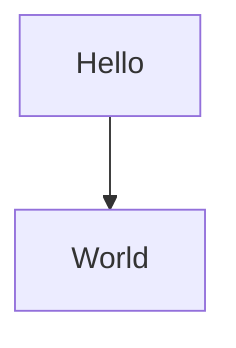

# 重构cdn目录 - 使用文档

> **文档版本**: v1.0 | **最后更新**: 2026-04-28 | **维护者**: Claude Opus 4.6 | **工具**: Claude Code
>
> **关联文档**: [需求文档](./01_需求文档.md) | [需求任务](./02_需求任务.md) | [设计文档](./03_设计文档.md)
>
> **Git 分支**: claude
>
> **文档开始时间**: 未知（未记录） | **文档最后更新时间**: 15:10:00
>

[功能介绍](#功能介绍) | [快速开始](#快速开始) | [操作场景](#操作场景) | [常见问题](#常见问题) | [技巧与提示](#技巧与提示)

---

## 功能介绍

本文档说明cdn目录重构的使用方法。本次重构采用**渐进式策略**，第一阶段先优化文档和目录说明，确保markdown和mermaid核心渲染功能完整可用，不进行破坏性删除操作。

### 核心特性

- 🎯 **零风险**：第一阶段不删除任何文件，确保现有功能完整
- ⚡ **渐进式**：分阶段执行，降低重构风险
- 🔧 **文档完善**：添加目录说明，提升可维护性
- 📖 **可回滚**：所有变更通过git管理，可安全回滚

### 适用人群

- **项目维护者**：需要了解重构计划和当前状态
- **功能开发者**：使用markdown/mermaid渲染功能的开发者
- **新贡献者**：需要快速理解cdn目录结构的开发者

## 快速开始

### 前置条件

- ✅ 能访问YiWeb代码库
- ✅ 有git操作权限
- ✅ Python环境（用于启动本地服务器）
- ✅ 现代浏览器（用于功能验证）

### 30秒上手

1. **了解重构计划**
   ```
   阅读 docs/重构cdn目录/ 下的文档
   重点关注设计文档中的两阶段策略
   ```

2. **验证当前功能**
   ```bash
   # 启动本地服务器
   python -m http.server 8000
   
   # 在浏览器中访问
   # http://localhost:8000/src/views/aicr/index.html
   ```

3. **参与决策**
   ```
   确认是否需要进行第二阶段重构
   反馈组件使用情况
   ```

🎉 完成！你已经了解了本次重构的基本情况。

## 操作场景

### 📋 场景1：理解当前cdn目录结构

**适用情况**：新加入项目，需要快速理解cdn目录的组织方式。

**操作步骤**：
1. 阅读`CLAUDE.md`中的项目结构说明
2. 查看各子目录的README.md（第一阶段后会添加）
3. 从`cdn/markdown/index.js`和`cdn/mermaid/index.js`开始了解核心功能

**预期结果**：
- 理解markdown和mermaid系统的入口
- 了解组件库和工具库的组织方式
- 知道各模块的职责边界

**注意事项**：
- ✅ 先从入口文件开始，再深入细节
- ❌ 不要被大量文件吓到，重点关注核心模块

---

### 📋 场景2：使用markdown渲染功能

**适用情况**：需要在代码中使用markdown渲染功能。

**操作步骤**：
1. 导入markdown渲染器
   ```javascript
   import { createMarkdownRendererWithPlugins } from '/cdn/markdown/index.js';
   ```

2. 创建渲染器实例
   ```javascript
   const renderer = createMarkdownRendererWithPlugins({
     breaks: true,
     gfm: true
   });
   ```

3. 渲染markdown内容
   ```javascript
   const html = await renderer.render('# Hello\n\n- List item 1\n- List item 2');
   ```

4. 将HTML插入DOM
   ```javascript
   document.getElementById('content').innerHTML = html;
   ```

**预期结果**：
- Markdown内容正确渲染为HTML
- 包含的mermaid图表也能正常渲染
- 插件功能（容器、折叠面板等）正常工作

**注意事项**：
- ✅ 确保marked.js已通过CDN加载
- ✅ 确保mermaid.js已通过CDN加载（如需要）
- ❌ 不要在服务端直接使用（依赖window对象）

---

### 📋 场景3：使用mermaid渲染功能

**适用情况**：需要独立使用mermaid图表渲染功能。

**操作步骤**：
1. 导入mermaid渲染器
   ```javascript
   import { createMermaidRendererWithPlugins } from '/cdn/mermaid/index.js';
   ```

2. 创建并初始化渲染器
   ```javascript
   const renderer = createMermaidRendererWithPlugins();
   await renderer.initialize();
   ```

3. 渲染图表
   ```javascript
   const diagramCode = `
     graph TD
       A[开始] --> B[处理]
       B --> C[结束]
   `;
   
   await renderer.renderDiagram('my-diagram', diagramCode);
   ```

**预期结果**：
- 图表渲染为SVG
- 工具栏正常显示
- 全屏、下载等功能可用

**注意事项**：
- ✅ 确保mermaid.js已通过CDN加载
- ✅ 先调用initialize()再渲染
- ✅ 为每个图表提供唯一ID

---

### 📋 场景4：参与第二阶段重构决策

**适用情况**：需要决定是否继续第二阶段重构。

**操作步骤**：
1. 收集组件使用数据
   - 使用代码搜索确认各组件的使用情况
   - 分析AICR页面的实际依赖
   - 记录使用频率和重要性

2. 评估替代方案
   - 考虑是否可以用更轻量的方案替代
   - 考虑将组件迁移到src目录
   - 权衡维护成本和收益

3. 做出决策
   - 决定哪些组件保留
   - 决定哪些组件移除或替换
   - 制定详细的第二阶段计划

**预期结果**：
- 明确的第二阶段范围
- 可执行的操作计划
- 风险评估和应对措施

**注意事项**：
- ✅ 基于数据决策，不要凭感觉
- ✅ 充分评估用户影响
- ❌ 不要为了重构而重构

---

### 📋 场景5：回滚变更（如需要）

**适用情况**：发现问题需要回滚已提交的变更。

**操作步骤**：
1. 查看git历史
   ```bash
   git log --oneline
   ```

2. 确定要回滚到的commit
   ```bash
   # 查看变更详情
   git show <commit-hash>
   ```

3. 执行回滚
   ```bash
   # 方式1：创建新的回滚commit（推荐）
   git revert <commit-hash>
   
   # 方式2：重置到之前的状态（谨慎使用）
   git reset --hard <commit-hash>
   ```

**预期结果**：
- 代码恢复到之前的状态
- 功能恢复正常
- git历史记录完整

**注意事项**：
- ✅ 优先使用git revert保留历史
- ✅ 回滚前确保工作区干净
- ❌ 不要在公共分支上强制push

## 常见问题

### 💡 基础问题

**Q: 第一阶段重构会删除文件吗？**
A: 不会。第一阶段只进行文档更新和结构梳理，不删除任何文件，确保零风险。

**Q: 为什么采用两阶段策略？**
A: 为了降低重构风险。通过分析发现AICR页面仍在使用大量cdn组件，先确认实际使用情况再决定后续操作更安全。

**Q: markdown和mermaid功能会受影响吗？**
A: 不会。这两个核心功能会完整保留，重构的目标之一就是确保它们不受影响。

**Q: 我现在需要做什么？**
A: 阅读文档，理解重构计划，验证当前功能正常，然后反馈你对第二阶段的意见。

---

### ⚙️ 高级问题

**Q: 如何判断某个组件是否在使用？**
A: 可以通过以下方式：
1. 全局搜索组件名（如`YiButton`）
2. 检查模板中的使用
3. 分析import语句
4. 使用浏览器开发者工具确认运行时加载

**Q: 可以自定义markdown插件吗？**
A: 可以。参考现有插件的实现方式，创建你的插件并通过`renderer.use()`注册。

**Q: mermaid图表支持哪些类型？**
A: 支持 flowchart、sequenceDiagram、classDiagram、stateDiagram、gantt、pie 等标准mermaid类型，具体取决于mermaid.js的版本。

**Q: 如何为markdown/mermaid添加新功能？**
A: 推荐通过插件系统扩展，而不是修改核心代码。核心和插件分离的设计便于维护。

---

### 🔧 故障排查

**Q: markdown渲染不工作怎么办？**
A: 检查以下几点：
1. 确认marked.js已正确加载
2. 检查浏览器控制台是否有错误
3. 确认import路径正确（以`/`开头）
4. 检查是否正确调用了`render()`方法

**Q: mermaid图表显示空白怎么办？**
A: 检查以下几点：
1. 确认mermaid.js已正确加载
2. 检查图表语法是否正确
3. 确认调用了`initialize()`方法
4. 查看控制台错误信息

**Q: 控制台提示"module not found"怎么办？**
A: 这通常是路径问题：
1. 确认import路径以`/`开头（绝对路径）
2. 确认文件确实存在于指定位置
3. 检查文件名大小写（Linux区分大小写）

**Q: 组件加载超时怎么办？**
A: 可能的原因和解决方案：
1. 本地服务器未启动：启动`python -m http.server 8000`
2. 组件路径错误：检查路径配置
3. 网络问题：检查浏览器网络面板

## 技巧与提示

### 💡 实用技巧

**1. 使用createMarkdownRendererWithPlugins快速初始化**

```javascript
// 推荐：一键创建带所有常用插件的渲染器
import { createMarkdownRendererWithPlugins } from '/cdn/markdown/index.js';
const renderer = createMarkdownRendererWithPlugins();

// 而不是手动逐个注册插件
```

**2. 利用markdown中的mermaid语法**

直接在markdown中使用mermaid代码块，会自动渲染：

```markdown

```

**3. 调试时查看原始渲染结果**

```javascript
const html = await renderer.render(markdown);
console.log('Rendered HTML:', html); // 查看输出
document.getElementById('debug').innerHTML = html;
```

**4. 使用git查看变更历史**

```bash
# 查看某文件的历史
git log --follow -p -- cdn/markdown/index.js

# 比较两个版本的差异
git diff <commit1> <commit2> -- cdn/
```

---

### 📚 最佳实践

**1. 保持核心模块纯净**
- markdown和mermaid核心尽量简单
- 扩展功能通过插件实现
- 避免核心模块频繁变动

**2. 文档同步更新**
- 代码变更时同步更新文档
- 记录设计决策的原因
- 保持README及时更新

**3. 渐进式变更**
- 每次只改一个小部分
- 确保每个阶段都可回滚
- 充分测试后再继续

**4. 数据驱动决策**
- 收集实际使用数据
- 基于分析结果决策
- 避免主观臆断
