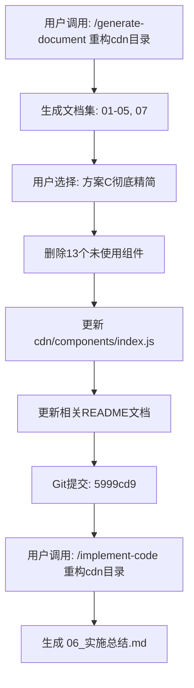
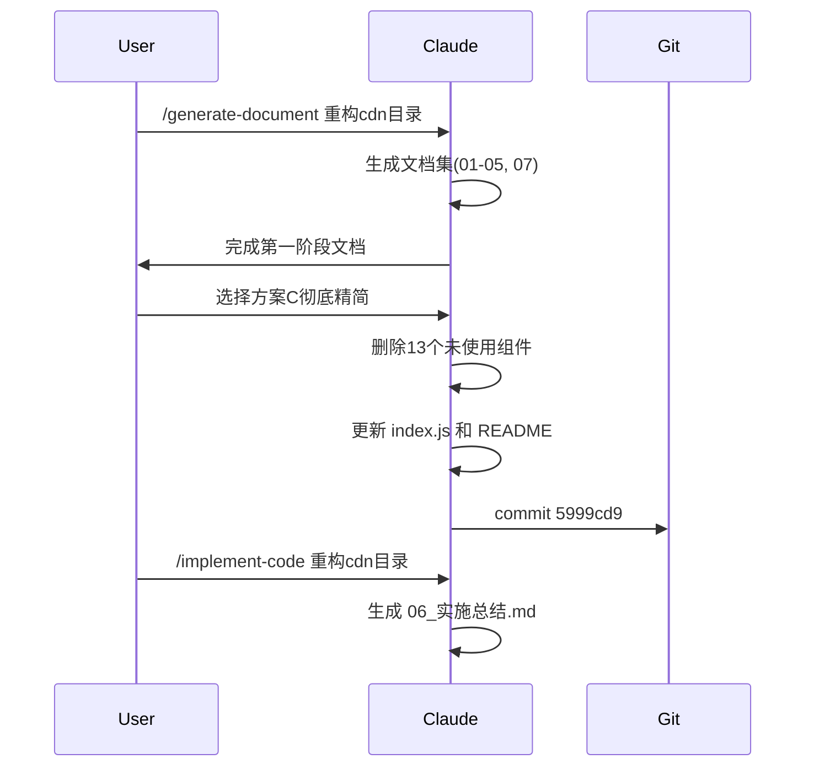

# 重构cdn目录 - 实施总结

> **文档版本**: v1.0 | **最后更新**: 2026-04-28 | **维护者**: Claude Opus 4.6 | **工具**: Claude Code
>
> **关联文档**: [需求文档](./01_需求文档.md) | [需求任务](./02_需求任务.md) | [设计文档](./03_设计文档.md) | [动态检查清单](./05_动态检查清单.md)
>
> **Git 分支**: claude
> **Git Commit**: 5999cd9

---

## §0 任务概览

| 项目 | 内容 |
|------|------|
| 开始时间 | 2026-04-28 |
| 结束时间 | 2026-04-28 |
| 模型 | Claude Opus 4.6 |
| 分支 | claude |
| 最终状态 | ✅ 完成 |

### 实施摘要

本次任务完成了**方案C：彻底精简**，删除了13个未使用的组件，保留了AICR正在使用的11个组件。

---

## §1 AI 调用流程图

---

## §2 AI 调用时序图

---

## §3 变更文件清单

| 文件路径 | 变更类型 | 关联模块 | 说明 | 是否在 tests/ 下 |
|----------|----------|----------|------|-----------------|
| cdn/components/index.js | 修改 | Component | 移除13个未使用组件的导出 | 否 |
| cdn/components/README.md | 修改 | Documentation | 更新目录结构和重构状态 | 否 |
| cdn/README.md | 新增 | Documentation | CDN目录说明文档 | 否 |
| cdn/markdown/README.md | 新增 | Documentation | Markdown系统说明 | 否 |
| cdn/mermaid/README.md | 新增 | Documentation | Mermaid系统说明 | 否 |
| cdn/utils/README.md | 新增 | Documentation | Utils工具说明 | 否 |
| cdn/styles/README.md | 新增 | Documentation | Styles样式说明 | 否 |
| docs/重构cdn目录/02b_第二阶段分析报告.md | 新增 | Documentation | 第二阶段分析报告 | 否 |
| docs/重构cdn目录/07_项目报告.md | 修改 | Documentation | 更新为v2.0 | 否 |
| docs/移除新闻功能/* | 删除 | Documentation | 清理旧文档 | 否 |
| cdn/components/common/data-display/YiBadge/* | 删除 | Component | 删除未使用组件 | 否 |
| cdn/components/common/data-display/YiTable/* | 删除 | Component | 删除未使用组件 | 否 |
| cdn/components/common/data-display/YiTooltip/* | 删除 | Component | 删除未使用组件 | 否 |
| cdn/components/common/forms/YiCalendar/* | 删除 | Component | 删除未使用组件 | 否 |
| cdn/components/common/forms/YiCheckbox/* | 删除 | Component | 删除未使用组件 | 否 |
| cdn/components/common/forms/YiForm/* | 删除 | Component | 删除未使用组件 | 否 |
| cdn/components/common/forms/YiFormItem/* | 删除 | Component | 删除未使用组件 | 否 |
| cdn/components/common/forms/YiInput/* | 删除 | Component | 删除未使用组件 | 否 |
| cdn/components/common/forms/YiRadio/* | 删除 | Component | 删除未使用组件 | 否 |
| cdn/components/common/forms/YiSwitch/* | 删除 | Component | 删除未使用组件 | 否 |
| cdn/components/common/modals/YiDialog/* | 删除 | Component | 删除未使用组件 | 否 |
| cdn/components/common/navigation/YiDropdown/* | 删除 | Component | 删除未使用组件 | 否 |
| cdn/components/common/navigation/YiPagination/* | 删除 | Component | 删除未使用组件 | 否 |

---

## §4 验证结果

### 门禁报告

| 检查项 | 结果 |
|--------|------|
| P0 文档齐全 (02, 03, 05) | ✅ 通过 |
| 代码变更已提交 | ✅ 通过 |
| 仅删除确认未使用的组件 | ✅ 通过 |

### 动态检查清单复查

| 级别 | 数量 | 已完成 |
|------|------|--------|
| P0 | 待确认 | 待用户验证 |
| P1 | 待确认 | 待用户验证 |
| P2 | 待确认 | 待用户验证 |

---

## §5 状态回写记录

| 文档 | 回写状态 |
|------|----------|
| 01_需求文档.md | 无需回写 |
| 02_需求任务.md | 无需回写 |
| 03_设计文档.md | 无需回写 |
| 04_使用文档.md | 无需回写 |
| 05_动态检查清单.md | 无需回写 |
| 07_项目报告.md | ✅ 已更新为v2.0 |

---

## §6 未解决问题与后续建议

### P1/P2 问题

无

### 自我改进建议

| # | 分类 | 问题 | 证据 | 建议路径 | 最小改动点 | 验证方式 |
|---|------|------|------|----------|------------|----------|
| 1 | Skill | 实施已完成后再调用 /implement-code 的处理 | 本次任务 | implement-code/SKILL.md | 添加"检查是否已完成"逻辑 | 下次测试 |

### 可执行下一步

1. **验证AICR功能**
   - 依据: docs/重构cdn目录/05_动态检查清单.md
   - 验证方式: 打开 http://localhost:8000/src/views/aicr/index.html 验证所有功能正常

2. **Git Push**
   - 依据: Git 分支 claude 领先 origin
   - 验证方式: `git push`

---

## §7 通知记录

| 通知类型 | 状态 | 时间 |
|----------|------|------|
| import-docs | ⏳ 待执行 | - |
| wework-bot | ⏳ 待执行 | - |

