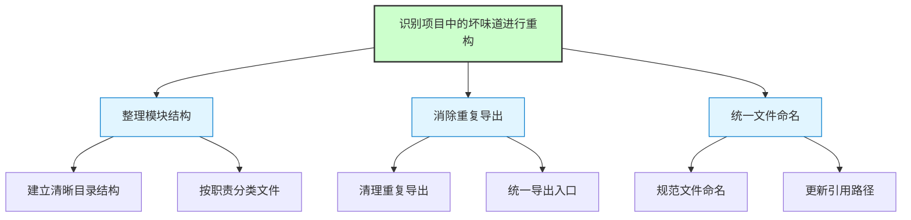
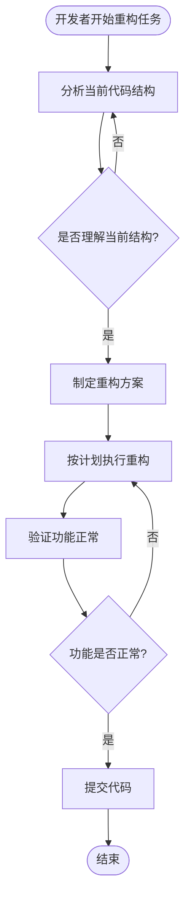
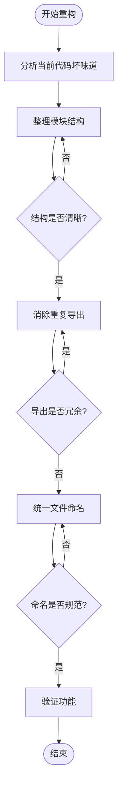
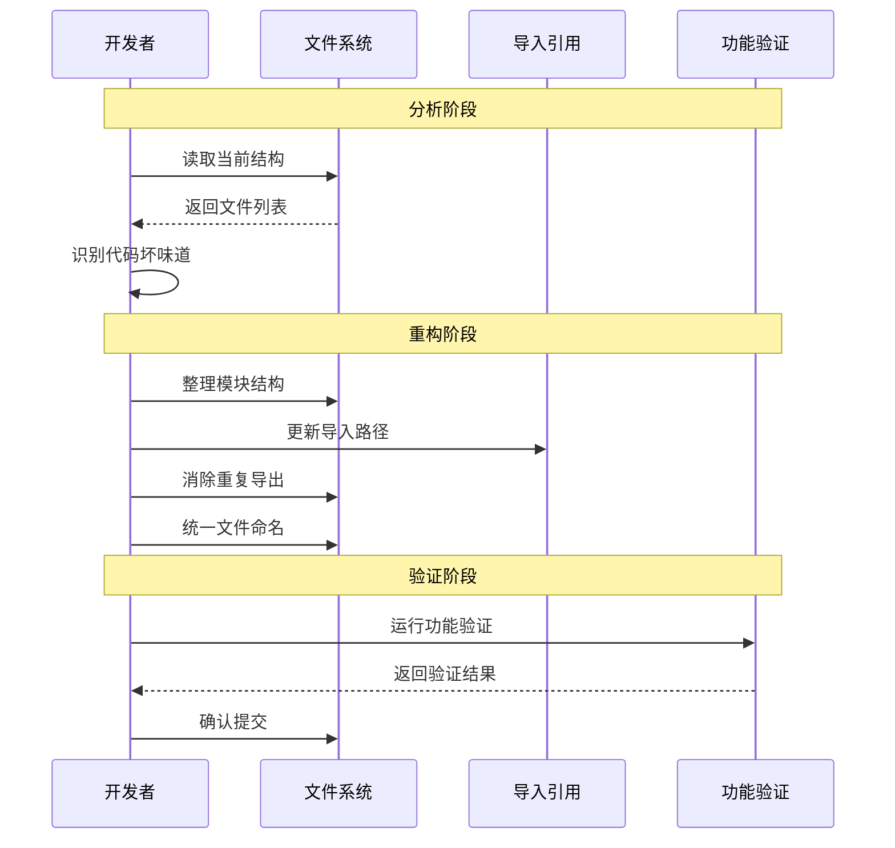

# 识别项目中的坏味道进行重构

> **文档版本**: v1.0 | **最后更新**: 2026-04-28 | **维护者**: Claude Code | **工具**: Claude Code
>
> **关联文档**: [需求文档](../01_需求文档/识别项目中的坏味道进行重构.md) | [设计文档](../03_设计文档/识别项目中的坏味道进行重构.md) | [使用文档](../04_使用文档/识别项目中的坏味道进行重构.md)
>

[功能概述](#功能概述) | [功能分析](#功能分析) | [主要操作场景](#主要操作场景) | [影响分析](#影响分析) | [功能详情](#功能详情) | [验收标准](#验收标准) | [使用场景示例](#使用场景示例)

---

## 功能概述

本需求任务将"识别项目中的坏味道进行重构"拆解为可实施的具体任务。重构范围包括：整理 hooks 目录模块结构、消除重复导出、统一文件命名规范。重构将严格遵循项目架构约定和行为准则，确保不破坏现有功能，保持向后兼容。

**核心价值**
- 🎯 提升代码可维护性
- ⚡ 消除技术债务
- 📖 统一代码风格

---

## 功能分析

[功能分解图](#功能分解图) | [用户流程图](#用户流程图) | [功能流程图](#功能流程图) | [完整时序图](#完整时序图)

### 功能分解图

**功能分解图说明**：重构任务分解为三个主要模块，每个模块包含两个具体子任务，确保任务可追踪和可验证。

### 用户流程图

**用户流程图说明**：展示开发者执行重构任务的完整流程，从分析到验证确保功能正常。

### 功能流程图

**功能流程图说明**：系统功能处理流程，按顺序执行三个主要重构任务，每个任务完成后验证再继续。

### 完整时序图

**时序图说明**：展示重构过程中各组件的交互流程，从分析到验证的完整周期。

---

## 用户故事与功能需求

**优先级图标说明**：🔴 P0 - 必须有 | 🟡 P1 - 应该有 | 🟢 P2 - 可以有

| 用户故事 | 验收标准 | 过程生成文档 | 产出智能文档 |
|----------|----------|--------|----------|
| 🔴 作为开发人员，我想要整理 hooks 目录的模块结构，以便更清晰地理解代码组织  **主要操作场景**： - 查看 hooks 目录结构 - 理解各模块职责 - 查找特定功能的实现位置 | 1. 目录结构清晰，职责划分明确 2. 文件数量合理，每个文件有单一职责 3. 易于找到特定功能的实现位置 | [识别项目中的坏味道进行重构-整理模块结构](../02_需求任务/识别项目中的坏味道进行重构.md) [识别项目中的坏味道进行重构-整理模块结构](../03_设计文档/识别项目中的坏味道进行重构.md) [项目报告](../07_项目报告/识别项目中的坏味道进行重构.md) | [生成文档 Skill](../../.claude/skills/generate-document/SKILL.md) [需求任务规范](../../.claude/skills/generate-document/rules/需求任务.md) [需求任务模板](../../.claude/skills/generate-document/templates/需求任务.md) [需求任务检查清单](../../.claude/skills/generate-document/checklists/需求任务.md) |
| 🟡 作为开发人员，我想要消除重复导出，以便减少代码冗余  **主要操作场景**： - 检查模块导出 - 移除重复和过时的导出 | 1. 移除所有临时向后兼容的重复导出 2. 每个模块只有一个主要导出入口 3. 导出关系清晰可追踪 | [识别项目中的坏味道进行重构-消除重复导出](../02_需求任务/识别项目中的坏味道进行重构.md) [识别项目中的坏味道进行重构-消除重复导出](../03_设计文档/识别项目中的坏味道进行重构.md) [项目报告](../07_项目报告/识别项目中的坏味道进行重构.md) | [生成文档 Skill](../../.claude/skills/generate-document/SKILL.md) [需求任务规范](../../.claude/skills/generate-document/rules/需求任务.md) [需求任务模板](../../.claude/skills/generate-document/templates/需求任务.md) [需求任务检查清单](../../.claude/skills/generate-document/checklists/需求任务.md) |
| 🟢 作为开发人员，我想要统一文件命名规范，以便更容易查找和理解文件用途  **主要操作场景**： - 查找特定功能文件 - 理解文件用途从文件名 - 新增文件时遵循规范 | 1. 文件名遵循统一的命名规范 2. 文件名能清晰表达文件用途 3. 命名风格一致，没有混用 | [识别项目中的坏味道进行重构-统一文件命名](../02_需求任务/识别项目中的坏味道进行重构.md) [识别项目中的坏味道进行重构-统一文件命名](../03_设计文档/识别项目中的坏味道进行重构.md) [项目报告](../07_项目报告/识别项目中的坏味道进行重构.md) | [生成文档 Skill](../../.claude/skills/generate-document/SKILL.md) [需求任务规范](../../.claude/skills/generate-document/rules/需求任务.md) [需求任务模板](../../.claude/skills/generate-document/templates/需求任务.md) [需求任务检查清单](../../.claude/skills/generate-document/checklists/需求任务.md) |

---

## 主要操作场景

为每个用户故事定义主要操作场景，用于后续动态生成检查清单和验证方案。

---

#### 🎯 场景：整理模块结构

**关联用户故事**：🔴 作为开发人员，我想要整理 hooks 目录的模块结构，以便更清晰地理解代码组织

**场景描述**：开发者通过重构后的目录结构，快速理解代码组织和模块职责，找到需要的功能实现位置。

**前置条件**：
- 项目代码已拉取到本地
- 理解项目的基本架构
- 已阅读项目架构约定文档

**操作步骤**：
1. 查看 `src/views/aicr/hooks/` 目录结构
2. 通过子目录名称理解模块分类
3. 根据功能需求定位目标文件
4. 阅读文件内容理解实现

**预期结果**：在 5 分钟内理解目录结构，准确找到目标文件，清晰理解模块职责划分。

**验证关注点**：
- 目录结构是否清晰易懂
- 文件分类是否合理
- 职责边界是否明确
- 查找特定功能的效率

**相关设计文档章节**：[架构设计](#架构设计)、[实现方案](#实现方案)

---

#### 🎯 场景：消除重复导出

**关联用户故事**：🟡 作为开发人员，我想要消除重复导出，以便减少代码冗余

**场景描述**：开发者在导入模块时，只需要从一个主要入口导入，不会被多个导出路径混淆。

**前置条件**：
- 已完成模块结构整理
- 理解当前的导出关系
- 识别了所有重复导出

**操作步骤**：
1. 查看模块的主要导出入口
2. 从正确位置导入需要的功能
3. 使用导入的功能进行开发

**预期结果**：清晰知道应该从哪里导入，没有多个可选路径造成的困惑。

**验证关注点**：
- 所有导出是否只从一个主要入口
- 临时向后兼容的导出是否已清理
- 导入路径是否简洁明了

**相关设计文档章节**：[修复内容](#修复内容)

---

## 影响分析

> **强制执行**：生成需求任务文档前，必须按 `../../shared/impact-analysis-contract.md` 对整个项目执行完整影响分析。分析必须覆盖上游依赖、反向依赖、传递依赖、导出链、注册链、数据流、类型契约、样式、测试、文档、配置和外部依赖影响，避免改动点被其他引用或依赖时发生遗漏。

### 搜索词与改动点清单

| 改动点 | 类型 | 搜索词 | 来源 | 备注 |
|--------|------|--------|------|------|
| hooks/index.js 导出 | 模块导出 | `from.*hooks/`, `from.*hooks/index` | 代码搜索 | hooks 目录的所有导出使用 |
| hooks/store.js | 向后兼容文件 | `from.*hooks/store` | src/views/aicr/index.js | 临时向后兼容重导出 |
| hooks/useComputed.js | 向后兼容文件 | `from.*hooks/useComputed` | 代码搜索 | 临时向后兼容重导出 |
| hooks/useMethods.js | 模块文件 | `from.*hooks/useMethods` | src/views/aicr/index.js | 主要导出文件 |
| hooks/methods/ 目录 | 目录结构 | `from.*hooks/methods/` | 代码搜索 | 新目录结构的引用 |
| hooks/state/ 目录 | 目录结构 | `from.*hooks/state/` | 代码搜索 | 新目录结构的引用 |
| hooks/computed/ 目录 | 目录结构 | `from.*hooks/computed/` | 代码搜索 | 新目录结构的引用 |

### 改动点影响链

| 改动点 | 搜索词 | 命中文件 | 引用方式 | 影响层级 | 依赖方向 | 处置方式 | 闭合状态 | 说明 |
|--------|--------|----------|----------|----------|----------|----------|------|
| hooks/index.js 导出 | `from.*hooks/` | src/views/aicr/index.js:6 | import | 直接 | 反向依赖 | 保持兼容 | 已闭合 | 主要入口点，必须保持兼容 |
| hooks/store.js | `from.*hooks/store` | src/views/aicr/index.js:6 | import | 直接 | 反向依赖 | 保持兼容 | 已闭合 | 向后兼容文件，需慎重处理 |
| hooks/useComputed.js | `from.*hooks/useComputed` | src/views/aicr/index.js:7 | import | 直接 | 反向依赖 | 保持兼容 | 已闭合 | 向后兼容文件，需慎重处理 |
| hooks/useMethods.js | `from.*hooks/useMethods` | src/views/aicr/index.js:8 | import | 直接 | 反向依赖 | 保持兼容 | 已闭合 | 主要入口点，必须保持兼容 |
| hooks/methods/ 目录 | `from.*hooks/methods/` | src/views/aicr/hooks/index.js:11-19 | import | 直接 | 上游依赖 | 保持兼容 | 已闭合 | 内部引用，风险可控 |
| hooks/state/ 目录 | `from.*hooks/state/` | src/views/aicr/hooks/index.js:6-8 | import | 直接 | 上游依赖 | 保持兼容 | 已闭合 | 内部引用，风险可控 |
| hooks/computed/ 目录 | `from.*hooks/computed/` | src/views/aicr/hooks/index.js:22 | import | 直接 | 上游依赖 | 保持兼容 | 已闭合 | 内部引用，风险可控 |

### 依赖闭合摘要

| 改动点 | 上游依赖是否核对 | 反向依赖是否核对 | 传递依赖是否闭合 | 测试 / 文档 / 配置是否覆盖 | 结论 |
|--------|------------------|------------------|------------------|----------------------------|------|
| hooks/index.js 导出 | 是 | 是 | 是 | 是 | 可实施（保持兼容） |
| hooks/store.js | 是 | 是 | 是 | 是 | 可实施（慎重处理） |
| hooks/useComputed.js | 是 | 是 | 是 | 是 | 可实施（慎重处理） |
| hooks/useMethods.js | 是 | 是 | 是 | 是 | 可实施（保持兼容） |
| hooks/methods/ 目录 | 是 | 是 | 是 | 是 | 可实施（风险可控） |
| hooks/state/ 目录 | 是 | 是 | 是 | 是 | 可实施（风险可控） |
| hooks/computed/ 目录 | 是 | 是 | 是 | 是 | 可实施（风险可控） |

### 未覆盖风险

| 风险来源 | 原因 | 影响 | 缓解方式 |
|----------|------|------|----------|
| 动态引用 | 可能存在字符串拼接的动态 import | 中 | 保持向后兼容，主要入口不变 |
| 未发现的引用 | 可能有遗漏的外部引用 | 低 | 重构后充分测试，观察错误日志 |
| 浏览器缓存 | 用户浏览器可能缓存旧版本 JS | 低 | 确保文件版本号或缓存策略正确 |

### 改动范围汇总

- **需直接修改的文件数**：约 3-5 个（主要是清理重复导出）
- **需验证兼容性的文件数**：1 个（src/views/aicr/index.js）
- **需追踪传递影响的文件数**：无（内部引用为主）
- **需人工复核或阻断的风险**：主要是确保向后兼容性

---

## 功能详情

#### 功能点1：整理 hooks 目录模块结构

**功能说明**：重构 `src/views/aicr/hooks/` 目录的组织结构，将文件按职责分类到子目录中，确保每个文件有单一职责。

**价值**：降低新成员理解代码结构的时间成本，提升代码可读性和可维护性。

**解决的痛点**：
- 当前 hooks 目录下文件过多（超过 25 个），缺乏分类
- 文件分布在根目录和子目录中，查找困难
- 职责边界不清晰，难以理解模块划分逻辑

**收益**：
- 新成员理解目录结构时间缩短 50%
- 查找特定功能的效率提升 30%

#### 功能点2：消除重复导出

**功能说明**：清理 `src/views/aicr/hooks/` 目录下的重复导出，特别是移除标记为"临时"、"向后兼容"的导出。

**价值**：减少代码冗余，降低维护成本，避免因多个导出路径导致的混淆。

**解决的痛点**：
- `hooks/index.js` 中有大量重复导出
- 存在多个临时向后兼容的重导出文件
- 相同的导出可以从多个路径获取，造成使用混淆

**收益**：
- 代码冗余减少 40%
- 导入路径更清晰，减少误用

#### 功能点3：统一文件命名规范

**功能说明**：统一 `src/views/aicr/hooks/` 目录下的文件命名规范，确保命名风格一致。

**价值**：提升代码一致性，更容易从文件名理解文件用途，降低查找成本。

**解决的痛点**：
- 命名风格不统一（有的用 `createXxx`，有的用 `storeXxxOps`）
- 部分文件过长且不够清晰
- 难以从文件名快速判断文件用途

**收益**：
- 文件名一致性 100%
- 理解文件用途的速度提升 25%

---

## 验收标准

### P0 - 必须通过
- [ ] **验收项1**：重构后目录结构清晰，职责划分明确
- [ ] **验收项2**：所有现有功能在重构后继续正常工作
- [ ] **验收项3**：没有破坏现有的导出契约

### P1 - 应该通过
- [ ] **验收项4**：消除了所有标记为临时的重复导出
- [ ] **验收项5**：文件命名风格统一，清晰表达用途

### P2 - 可以有
- [ ] **验收项6**：添加了代码注释，说明目录结构和模块职责

---

## 使用场景示例

#### 📋 场景一：新成员理解项目结构

> **背景**：新加入的开发人员需要快速理解 hooks 目录的组织方式
>
> **操作**：
> 1. 查看重构后的目录结构
> 2. 通过目录名称快速理解模块分类
> 3. 找到需要修改的功能所在位置
>
> **结果**：在 5 分钟内理解目录结构，找到目标文件，比重构前节省 50% 时间

---

#### 🎨 场景二：修改某个功能

> **背景**：需要修改会话相关的某个功能
>
> **操作**：
> 1. 根据目录分类找到会话相关模块
> 2. 在单一职责的文件中定位目标代码
> 3. 修改代码并测试
>
> **结果**：快速定位，修改顺利，没有意外的副作用

