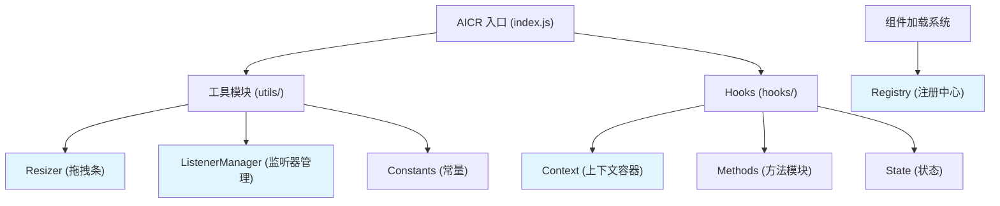

# 识别项目中的坏味道进行重构 - 设计文档

> **文档版本**: v1.0 | **最后更新**: 2026-04-28 | **维护者**: Claude Code | **工具**: Claude Code
>
> **关联文档**: [需求任务](./02_需求任务.md) | [使用文档](./04_使用文档.md) | [CLAUDE.md](../../CLAUDE.md)
>

[设计概述](#设计概述) | [坏味道清单](#坏味道清单) | [架构设计](#架构设计) | [修复内容](#修复内容) | [影响分析](#影响分析) | [实现细节](#实现细节)

---

## 设计概述

本设计文档详细说明代码坏味道重构的技术方案。通过对 YiWeb 项目的深入分析，我们识别出多个关键代码坏味道，包括全局状态污染、巨型文件、长参数列表、重复代码等。重构将采用渐进式策略，确保功能不受影响。

### 设计原则

- 🎯 **渐进式重构**：小步提交，每次只改一小部分，确保可回滚
- ⚡ **保持功能完整**：确保现有功能不受影响
- 🔧 **高内聚低耦合**：优化模块划分，降低依赖复杂度
- 📖 **向后兼容**：保持现有 API 不变，减少使用方改动

---

## 坏味道清单

### 坏味道 1：全局状态污染（Global State Pollution）

**严重级别**：🔴 高

**位置**：
- `cdn/utils/view/baseView.js:526-536` - `exposeToWindow` 函数
- `cdn/utils/view/componentLoader.js:128` - `window[name]` 组件注册
- `cdn/utils/view/componentLoader.js:190` - `window[exposeName]` 重复赋值
- `cdn/utils/view/componentLoader.js:197` - 事件触发到 window
- `src/views/aicr/index.js:145` - `window.openAuth` 随意挂载
- `src/views/aicr/index.js:331` - `window.__aicrMountedListeners` 污染

**问题描述**：
项目大量使用 window 对象作为全局注册表，导致：
1. 命名冲突风险
2. 难以追踪数据流
3. 测试困难（需要 mock window）
4. 隐式依赖不清晰

**代码示例**：
```javascript
// 现有代码 - window 污染
function exposeToWindow() {
    if (typeof window === 'undefined') return;
    window.ViewConfig = ViewConfig;
    window.createBaseView = createBaseView;
    // ... 更多
}

// 组件注册
window[name] = component;
```

**重构方案**：
创建统一的注册中心，替代直接挂载 window

```javascript
// 新方案 - 注册中心
const Registry = {
    _components: new Map(),
    _modules: new Map(),

    registerComponent(name, component) {
        this._components.set(name, component);
        // 保持向后兼容
        if (typeof window !== 'undefined') {
            window[name] = component;
        }
    },

    getComponent(name) {
        return this._components.get(name) || window[name];
    },

    // 事件系统
    _events: new Map(),
    dispatchEvent(name, detail) {
        const event = new CustomEvent(name, { detail });
        if (typeof window !== 'undefined') {
            window.dispatchEvent(event);
        }
        // 内部事件监听
        const listeners = this._events.get(name) || [];
        listeners.forEach(fn => fn(detail));
    }
};

export default Registry;
```

---

### 坏味道 2：巨型文件（God Object）

**严重级别**：🟡 中

**位置**：
- `src/views/aicr/index.js` - 657 行
- `cdn/utils/view/baseView.js` - 555 行

**问题描述**：
单个文件行数过长，职责过多，违反单一职责原则。

**代码示例**：
```javascript
// src/views/aicr/index.js 包含：
// 1. 应用入口初始化
// 2. 侧边栏拖拽条创建 (200+ 行)
// 3. 事件监听器管理
// 4. URL 参数处理
// 5. 等等...
```

**重构方案**：
提取独立模块

```javascript
// 新建：src/views/aicr/utils/resizer.js
export function createSidebarResizers(store) {
    // 完整的拖拽逻辑
}

export function createResizer(element, store, type, options) {
    // 单个拖拽条逻辑
}

// index.js 简化为：
import { createSidebarResizers } from './utils/resizer.js';

// 调用提取的函数
setTimeout(() => {
    createSidebarResizers(store);
}, 500);
```

---

### 坏味道 3：长参数列表 & 数据泥团（Long Parameter List）

**严重级别**：🟡 中

**位置**：
- `src/views/aicr/hooks/useMethods.js:78-86` - sessionChatContextMethods
- `src/views/aicr/hooks/useMethods.js:124-134` - folderTransferMethods
- 多处函数参数超过 5 个以上

**问题描述**：
参数传递冗长，难以维护，重构困难。

**代码示例**：
```javascript
// 现有 - 长参数列表
const sessionChatContextMethods = createSessionChatContextMethods({
    store,
    safeExecute,
    postData,
    SERVICE_MODULE,
    renderMarkdownHtml,
    renderStreamingHtml,
    getPromptUrl
});
```

**重构方案**：
依赖注入容器 + 上下文对象

```javascript
// 新建：src/views/aicr/hooks/context.js
export function createAppContext(store) {
    return {
        store,
        // 工具函数
        safeExecute,
        safeExecuteAsync,
        // 服务
        postData,
        getData,
        // 配置
        SERVICE_MODULE,
        getApiBaseUrl,
        getPromptUrl,
        // 渲染器
        renderMarkdownHtml,
        renderStreamingHtml
    };
}

// 使用时
const ctx = createAppContext(store);
const sessionChatContextMethods = createSessionChatContextMethods(ctx);
```

---

### 坏味道 4：重复代码（Duplicate Code）

**严重级别**：🟢 低

**位置**：
- `src/views/aicr/index.js:134-160` vs `235-261` - 事件监听器模式重复
- 多处相似的 try-catch 包装模式

**问题描述**：
相似代码重复出现，修改一处需要改多处。

**重构方案**：
提取公共模式

```javascript
// 新建：src/views/aicr/utils/listenerManager.js
export function createListenerManager() {
    const listeners = new Map();

    return {
        add(name, handler) {
            const list = listeners.get(name) || [];
            list.push(handler);
            listeners.set(name, list);
            window.addEventListener(name, handler);
        },

        remove(name, handler) {
            window.removeEventListener(name, handler);
        },

        cleanup() {
            listeners.forEach((handlers, name) => {
                handlers.forEach(h => window.removeEventListener(name, h));
            });
            listeners.clear();
        }
    };
}
```

---

### 坏味道 5：魔法数字（Magic Numbers）

**严重级别**：🟢 低

**位置**：
- `baseView.js:364` - `timeout = 60000`
- `baseView.js:459-462` - 50ms, 100ms, 2000ms, 5000ms
- `aicr/index.js` - 多处 timeout

**重构方案**：
提取常量模块

```javascript
// 新建：cdn/utils/core/constants.js
export const TIMEOUTS = {
    COMPONENT_LOAD: 60000,
    POLL_FAST: 50,
    POLL_NORMAL: 100,
    LOG_INTERVAL_SHORT: 2000,
    LOG_INTERVAL_LONG: 5000
};

export const DEBOUNCE = {
    SIDEBAR_RESIZE: 50,
    SEARCH_INPUT: 300
};

// 使用
import { TIMEOUTS } from '/cdn/utils/core/constants.js';
await waitForComponents(componentNames, TIMEOUTS.COMPONENT_LOAD);
```

---

### 坏味道 6：临时向后兼容文件

**严重级别**：🟡 中

**位置**：
- `src/views/aicr/hooks/store.js` - 仅一行重导出
- `src/views/aicr/hooks/useComputed.js` - 仅一行重导出
- `src/views/aicr/hooks/useMethods.js` - 实际文件但存在重复

**问题描述**：
存在多个仅作重导出的临时文件，增加理解成本。

**重构方案**：
保留但添加清晰注释，长期考虑逐步迁移。

---

## 架构设计

### 重构后架构



### 新增文件清单

| 文件路径 | 职责 |
|---------|------|
| `src/views/aicr/utils/resizer.js` | 侧边栏拖拽条逻辑 |
| `src/views/aicr/utils/listenerManager.js` | 事件监听器管理 |
| `src/views/aicr/hooks/context.js` | 应用上下文容器 |
| `cdn/utils/core/constants.js` | 常量定义 |
| `cdn/utils/view/registry.js` | 组件注册中心 |

---

## 修复内容

### 阶段 1：基础架构搭建

**目标**：建立新的基础设施

| 任务 | 说明 | 风险 |
|------|------|------|
| 创建 constants.js | 提取所有魔法数字 | 低 |
| 创建 registry.js | 统一注册中心 | 中（需保持兼容） |
| 创建 listenerManager.js | 监听器管理工具 | 低 |

### 阶段 2：巨型文件拆分

**目标**：拆分 aicr/index.js

| 任务 | 说明 | 风险 |
|------|------|------|
| 提取 resizer.js | 拖拽条逻辑拆分 | 中 |
| 简化 index.js | 使用提取后的模块 | 中 |

### 阶段 3：依赖注入优化

**目标**：简化 useMethods 参数传递

| 任务 | 说明 | 风险 |
|------|------|------|
| 创建 context.js | 上下文容器 | 中 |
| 重构方法创建函数 | 接受上下文对象 | 高（需充分测试） |

### 阶段 4：清理与优化

**目标**：清理重复代码

| 任务 | 说明 | 风险 |
|------|------|------|
| 使用 listenerManager | 替换重复的监听器代码 | 低 |
| 清理临时注释 | 代码清理 | 低 |

---

## 影响分析

### 改动点清单

| 改动点 | 类型 | 搜索词 | 来源 | 备注 |
|--------|------|--------|------|------|
| `window[name]` 组件注册 | 全局状态 | `window\[.*\] =` | 代码搜索 | 保持向后兼容 |
| `aicr/index.js` 拖拽逻辑 | 代码拆分 | `createSidebarResizers` | index.js | 提取为独立模块 |
| `useMethods.js` 参数 | 重构签名 | `createSessionChatContextMethods(` | useMethods.js | 改为接受上下文 |
| 魔法数字 | 常量提取 | `5000\|2000\|100\|50` | 全局搜索 | 常量定义 |

### 兼容性策略

所有改动采用**双轨制**：
1. 新代码使用新架构
2. 旧 API 保持工作（内部转发到新实现）
3. 添加 deprecation 警告（控制台日志）

---

## 实现细节

### Registry 实现

```javascript
// cdn/utils/view/registry.js
class ComponentRegistry {
    constructor() {
        this._components = new Map();
        this._events = new Map();
    }

    register(name, component, options = {}) {
        this._components.set(name, component);

        // 向后兼容
        if (typeof window !== 'undefined') {
            window[name] = component;
        }

        // 触发事件
        const eventName = options.eventName || `${name}Loaded`;
        this.dispatch(eventName, component);
    }

    get(name) {
        return this._components.get(name) ||
               (typeof window !== 'undefined' ? window[name] : undefined);
    }

    dispatch(name, detail) {
        if (typeof window !== 'undefined') {
            window.dispatchEvent(new CustomEvent(name, { detail }));
        }
        const listeners = this._events.get(name) || [];
        listeners.forEach(fn => fn(detail));
    }
}

export const registry = new ComponentRegistry();
```

### Resizer 实现

```javascript
// src/views/aicr/utils/resizer.js
export function createSidebarResizers(store) {
    // 提取原 index.js 458-656 行的完整逻辑
    if (!store) return;

    const sidebar = document.querySelector('.aicr-sidebar');
    if (sidebar) {
        createResizer(sidebar, store, 'sidebar', {
            minWidth: 240,
            maxWidth: 400,
            defaultWidth: 320,
            storageKey: 'aicrSidebarWidth',
            saveWidth: store.saveSidebarWidth
        });
    }

    // ... 更多逻辑
}

export function createResizer(element, store, type, options = {}) {
    // 完整的拖拽实现
}
```

### Context 实现

```javascript
// src/views/aicr/hooks/context.js
import { safeExecute, safeExecuteAsync } from '/cdn/utils/core/error.js';
import { getData, postData } from '/src/core/services/index.js';
import { SERVICE_MODULE, buildServiceUrl } from '/src/core/services/helper/requestHelper.js';
import { renderMarkdownHtml, renderStreamingHtml } from '/cdn/markdown/index.js';

export function createAppContext(store) {
    const getApiBaseUrl = () => {
        return String(window.API_URL || '').trim().replace(/\/$/, '');
    };

    const getPromptUrl = () => `${getApiBaseUrl()}/`;

    return {
        // Store 访问
        store,

        // 工具函数
        safeExecute,
        safeExecuteAsync,

        // 数据服务
        getData,
        postData,

        // 配置
        SERVICE_MODULE,
        buildServiceUrl,
        getApiBaseUrl,
        getPromptUrl,

        // 渲染
        renderMarkdownHtml,
        renderStreamingHtml
    };
}
```

### Constants 实现

```javascript
// cdn/utils/core/constants.js
export const TIMEOUTS = {
    // 组件加载超时
    COMPONENT_LOAD: 60000,

    // 轮询间隔
    POLL_FAST: 50,
    POLL_NORMAL: 100,

    // 日志输出间隔
    LOG_INTERVAL_SHORT: 2000,
    LOG_INTERVAL_LONG: 5000
};

export const DEBOUNCE = {
    SIDEBAR_RESIZE: 50,
    SEARCH_INPUT: 300
};

export const CACHE = {
    TEMPLATE_MAX_AGE: 7 * 24 * 60 * 60 * 1000 // 7 days
};
```

---

## 实施顺序建议

1. **优先级 1**：constants.js → 低风险，立即可用
2. **优先级 2**：registry.js → 中等风险，需保持兼容
3. **优先级 3**：resizer.js + listenerManager.js → 中等风险，纯拆分
4. **优先级 4**：context.js + 重构 useMethods → 高风险，需充分测试
