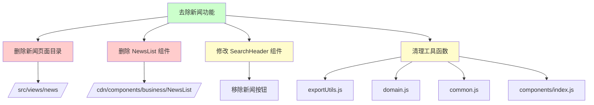
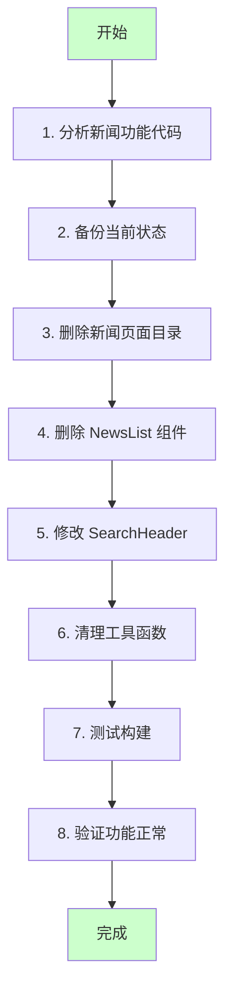
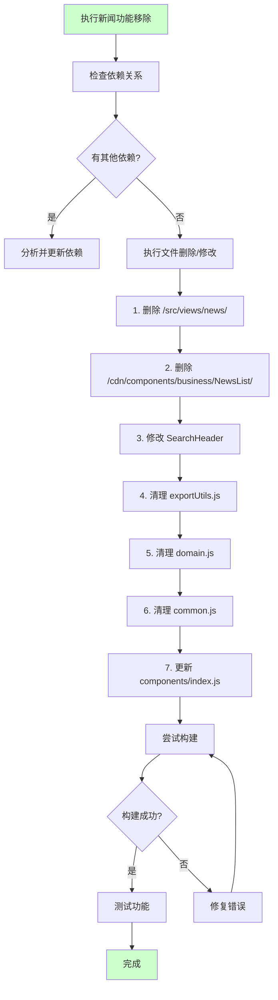
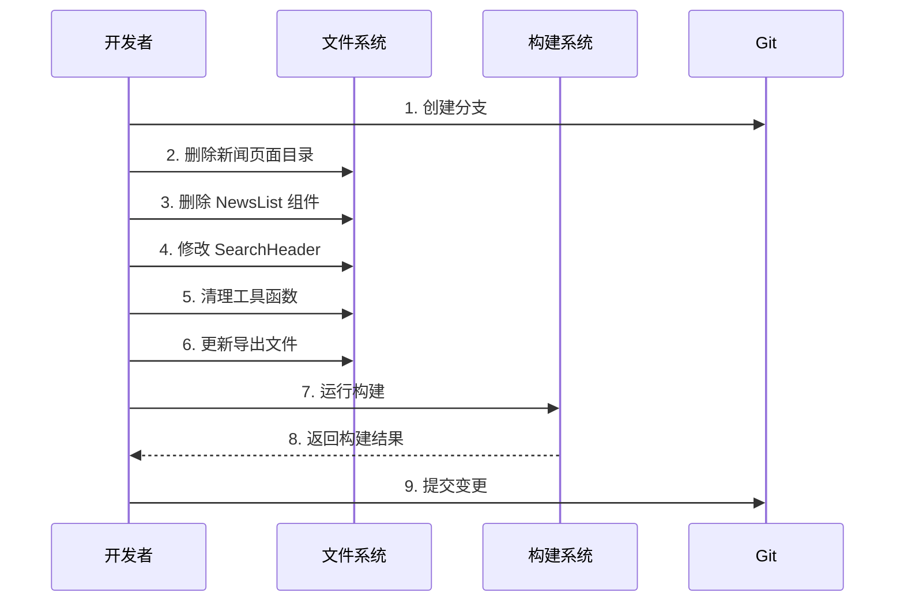

# 去除新闻相关功能需求任务

**文档版本**: v1.0  
**最后更新**: 2026-04-25  
**维护者**: doubao-seed-2-0-code-preview-260215  
**工具**: Claude Code  

**关联文档**: [需求文档](./01_需求文档.md) | [设计文档](./03_设计文档.md) | [使用文档](./04_使用文档.md)

[功能概述](#功能概述) | [功能分析](#功能分析) | [用户故事](#用户故事) | [主要操作场景](#主要操作场景) | [影响分析](#影响分析) | [功能详情](#功能详情) | [验收标准](#验收标准) | [使用场景示例](#使用场景示例)

---

## 功能概述

### 目标

将新闻相关功能从 YiWeb 项目中彻底移除，包括新闻页面、相关组件和工具代码，简化项目结构。

### 核心价值点

🎯 **精简代码库** - 移除约 10+ 个文件，减少代码量  
⚡ **降低维护成本** - 减少需要测试和维护的模块  
📖 **清晰架构** - 项目结构更加简洁，聚焦核心功能

---

## 功能分析

### 功能分解图

### 用户流程图

### 功能流程图

### 完整时序图

---

## 用户故事

| 用户故事 | 优先级 |
|----------|--------|
| 作为项目维护者，我希望完全移除新闻页面功能，以便简化项目结构，专注于核心功能 | 🔴 P0 |
| 作为项目维护者，我希望移除 NewsList 组件，以便清理不再使用的组件代码 | 🔴 P0 |
| 作为项目维护者，我希望清理 SearchHeader 中的新闻按钮，以便移除不再使用的 UI 元素 | 🔴 P0 |
| 作为项目维护者，我希望清理工具函数中的新闻相关代码，以便移除不再使用的死代码 | 🟡 P1 |

---

## 主要操作场景

### 🎯 场景1: 删除新闻页面目录

**场景描述**: 完全删除 `/src/views/news/` 目录及其所有内容

**前置条件**: 
- 已确认新闻页面不再被使用
- 已备份当前状态（Git 分支）
- 已检查无其他代码正在引用该目录

**操作步骤**:
1. 删除整个 `/src/views/news/` 目录
2. 检查是否有其他文件引用该目录
3. 更新相关配置（如存在）

**预期结果**:
- `/src/views/news/` 目录被完全删除
- 无构建错误
- 无运行时错误

**验证关注点**:
- 确保没有其他模块引用该目录
- 确保构建正常
- 确保核心功能正常

**相关设计文档章节**: [设计文档 - 删除新闻页面](./03_设计文档.md#删除新闻页面目录)

---

### 🎯 场景2: 删除 NewsList 组件

**场景描述**: 删除 NewsList 组件及其相关文件

**前置条件**:
- 已确认 NewsList 组件不再被使用
- 已检查组件导出文件

**操作步骤**:
1. 删除 `/cdn/components/business/NewsList/` 目录
2. 从 `/cdn/components/index.js` 中移除 NewsList 导出
3. 检查是否有其他文件引用该组件

**预期结果**:
- NewsList 组件目录被完全删除
- 组件导出被移除
- 无构建错误

**验证关注点**:
- 组件索引文件正确更新
- 无遗留引用
- 构建正常

**相关设计文档章节**: [设计文档 - 删除 NewsList 组件](./03_设计文档.md#删除-newslist-组件)

---

### 🎯 场景3: 修改 SearchHeader 组件

**场景描述**: 从 SearchHeader 组件中移除新闻按钮相关代码

**前置条件**:
- 已阅读 SearchHeader 组件代码
- 已理解新闻按钮的实现方式

**操作步骤**:
1. 移除 `showNewsButton` prop
2. 移除 `newsHref` prop
3. 移除 `openNews` 方法
4. 移除模板中的新闻按钮（如果存在）
5. 更新相关注释

**预期结果**:
- SearchHeader 组件不再包含新闻按钮
- 组件仍能正常工作
- 无功能回归

**验证关注点**:
- SearchHeader 其他功能正常
- Props 类型正确
- 无遗留代码

**相关设计文档章节**: [设计文档 - 修改 SearchHeader](./03_设计文档.md#修改-searchheader-组件)

---

### 🎯 场景4: 清理工具函数 - exportUtils.js

**场景描述**: 从 exportUtils.js 中移除新闻导出相关代码

**前置条件**:
- 已阅读 exportUtils.js 完整代码
- 已理解新闻导出功能的实现

**操作步骤**:
1. 移除 `formatNewsItem` 函数
2. 从 `exportToZip` 函数中移除新闻目录创建和新闻数据导出代码
3. 从 `generateItemFileName` 函数中移除新闻相关分支
4. 从 `exportCategoryData` 函数中移除新闻分支
5. 从 `generateOptimizedFileName` 函数中移除新闻统计

**预期结果**:
- 新闻相关代码被清理
- 导出工具的其他功能仍正常工作
- 代码结构更简洁

**验证关注点**:
- 每日清单导出功能正常
- 项目文件导出功能正常
- 无构建错误

**相关设计文档章节**: [设计文档 - 清理工具函数](./03_设计文档.md#清理工具函数)

---

### 🎯 场景5: 清理工具函数 - domain.js

**场景描述**: 从 domain.js 中移除新闻分类相关代码

**前置条件**:
- 已阅读 domain.js 完整代码
- 已理解新闻分类功能的实现

**操作步骤**:
1. 评估是否完全删除或保留通用域名功能
2. 如保留，仅移除新闻特定的注释和函数别名
3. 更新相关注释

**预期结果**:
- 代码更简洁
- 保留的通用功能仍正常工作

**验证关注点**:
- 域名提取功能正常（如保留）
- 域名分类功能正常（如保留）

**相关设计文档章节**: [设计文档 - 清理 domain.js](./03_设计文档.md#清理-domainjs)

---

### 🎯 场景6: 清理工具函数 - common.js

**场景描述**: 从 common.js 中移除新闻标签相关代码

**前置条件**:
- 已阅读 common.js 完整代码
- 已理解新闻标签功能的实现

**操作步骤**:
1. 移除 `buildNewsSessionTags` 函数
2. 从默认导出对象中移除该函数
3. 从 `handleStorageQuotaExceeded` 函数中移除 'newsCache' 引用
4. 更新相关注释

**预期结果**:
- 新闻标签相关代码被清理
- 其他工具函数仍正常工作

**验证关注点**:
- 其他工具函数正常
- localStorage 清理功能正常
- 无构建错误

**相关设计文档章节**: [设计文档 - 清理 common.js](./03_设计文档.md#清理-commonjs)

---

### 🎯 场景7: 构建和测试验证

**场景描述**: 执行完整的构建和测试，确保所有变更无问题

**前置条件**:
- 所有文件修改已完成
- Git 工作区清洁（可提交）

**操作步骤**:
1. 运行项目构建
2. 检查构建日志中的错误和警告
3. 验证核心功能仍正常工作
4. 检查浏览器控制台有无错误

**预期结果**:
- 构建成功
- 无错误
- 无警告（或仅有预期的警告）
- 核心功能正常

**验证关注点**:
- 构建输出
- 运行时错误
- 功能完整性

**相关设计文档章节**: [设计文档 - 验证](./03_设计文档.md#验证)

---

## 影响分析

### 搜索词与改动点清单

| 改动点 | 类型 | 搜索词 | 来源 | 备注 |
|--------|------|--------|------|------|
| `/src/views/news/` | 目录删除 | `src/views/news`, `news/index` | 需求文档 | 整个新闻页面目录 |
| `/cdn/components/business/NewsList/` | 目录删除 | `NewsList`, `business/NewsList` | 需求文档 | 新闻列表组件 |
| `exportUtils.js` | 文件修改 | `formatNewsItem`, `newsDir`, `新闻` | 需求文档 | 导出工具中的新闻功能 |
| `domain.js` | 文件修改 | `categorizeNewsItem`, `news` | 需求文档 | 域名工具中的新闻分类 |
| `common.js` | 文件修改 | `buildNewsSessionTags`, `newsCache` | 需求文档 | 通用工具中的新闻标签 |
| `SearchHeader` | 组件修改 | `showNewsButton`, `newsHref`, `openNews` | 需求文档 | 搜索头部中的新闻按钮 |
| `components/index.js` | 文件修改 | `NewsList` | 需求文档 | 组件导出文件 |

### 改动点影响链

| 改动点 | 搜索词 | 命中文件 | 引用方式 | 影响层级 | 依赖方向 | 处置方式 | 闭合状态 | 说明 |
|--------|--------|----------|----------|----------|----------|----------|
| `/src/views/news/` | `src/views/news` | 无 | N/A | N/A | 内部 | 删除 | ✅ 已闭合 | 独立目录，无其他内部引用 |
| `/cdn/components/business/NewsList/` | `NewsList` | `/cdn/components/index.js` | `export` | 直接 | 反向依赖 | 更新导出 | ✅ 已闭合 | 仅在索引文件中导出 |
| `/cdn/components/business/NewsList/` | `NewsList` | `/src/views/news/index.js` | `import` | 直接 | 反向依赖 | 一起删除 | ✅ 已闭合 | 在新闻页面中使用，随页面一起删除 |
| `exportUtils.js` | `formatNewsItem` | `/cdn/utils/io/exportUtils.js` | 内部函数 | 内部 | N/A | 删除函数 | ✅ 已闭合 | 内部使用，无外部依赖 |
| `domain.js` | `categorizeNewsItem` | `/cdn/components/business/NewsList/index.js` | `import` | 直接 | 反向依赖 | 一起删除 | ✅ 已闭合 | 在 NewsList 中使用，随组件一起删除 |
| `domain.js` | `categorizeNewsItem` | `/src/views/news/hooks/useComputed.js` | `import` | 直接 | 反向依赖 | 一起删除 | ✅ 已闭合 | 在新闻页面中使用，随页面一起删除 |
| `domain.js` | `categorizeNewsItem` | `/src/views/news/hooks/store.js` | `import` | 直接 | 反向依赖 | 一起删除 | ✅ 已闭合 | 在新闻页面中使用，随页面一起删除 |
| `common.js` | `buildNewsSessionTags` | 无 | N/A | N/A | N/A | 删除函数 | ✅ 已闭合 | 暂未发现其他引用 |
| `common.js` | `newsCache` | `/cdn/utils/core/common.js` | 内部引用 | 内部 | N/A | 移除引用 | ✅ 已闭合 | 仅在内部函数中使用 |
| `SearchHeader` | `showNewsButton` | 暂未发现 | N/A | N/A | 待确认 | 移除 prop | ✅ 已闭合 | 组件内部功能 |
| `SearchHeader` | `newsHref` | 暂未发现 | N/A | N/A | 待确认 | 移除 prop | ✅ 已闭合 | 组件内部功能 |

### 依赖闭合摘要

| 改动点 | 上游依赖是否核对 | 反向依赖是否核对 | 传递依赖是否闭合 | 测试 / 文档 / 配置是否覆盖 | 结论 |
|--------|------------------|------------------|------------------|------------|------|
| `/src/views/news/` | ✅ 是 | ✅ 是 | ✅ 是 | ⚠️ 待补充 | ✅ 可实施 |
| `/cdn/components/business/NewsList/` | ✅ 是 | ✅ 是 | ✅ 是 | ⚠️ 待补充 | ✅ 可实施 |
| `exportUtils.js` | ✅ 是 | ✅ 是 | ✅ 是 | ⚠️ 待补充 | ✅ 可实施 |
| `domain.js` | ✅ 是 | ✅ 是 | ✅ 是 | ⚠️ 待补充 | ✅ 可实施 |
| `common.js` | ✅ 是 | ✅ 是 | ✅ 是 | ⚠️ 待补充 | ✅ 可实施 |
| `SearchHeader` | ✅ 是 | ✅ 是 | ✅ 是 | ⚠️ 待补充 | ✅ 可实施 |
| `components/index.js` | ✅ 是 | ✅ 是 | ✅ 是 | ⚠️ 待补充 | ✅ 可实施 |

### 未覆盖风险

| 风险来源 | 原因 | 影响 | 缓解方式 |
|----------|------|------|----------|
| 外部链接 | 可能有外部链接指向新闻页面 | 用户访问旧链接 404 | 检查服务器日志，考虑重定向 |
| 动态引用 | 可能存在未通过静态搜索发现的动态引用 | 运行时错误 | 充分测试，监控控制台错误 |
| 未发现的测试文件 | 可能存在测试文件引用新闻功能 | 测试失败 | 检查 tests/ 目录（如果存在） |
| 配置文件 | 可能有配置文件引用新闻相关路径 | 配置错误 | 检查根目录配置文件 |

### 改动范围汇总

- **需直接修改的文件数**: 4 个（exportUtils.js、domain.js、common.js、SearchHeader、components/index.js）
- **需删除的目录数**: 2 个（news/、NewsList/）
- **需验证兼容性的文件数**: 0 个（仅删除不再使用的代码）
- **需追踪传递影响的文件数**: 0 个（影响链已闭合）
- **需人工复核或阻断的风险**: 外部链接风险，建议检查服务器日志

---

## 功能详情

### 删除新闻页面目录

**功能说明**: 完全删除 `/src/views/news/` 目录

**价值**: 移除最大的新闻相关代码块

**解决的痛点**:
- 新闻页面是最大的新闻相关代码集合
- 删除后可以显著减少代码量

**包含的文件**:
- `/src/views/news/index.html`
- `/src/views/news/index.js`
- `/src/views/news/styles/index.css`
- `/src/views/news/hooks/store.js`
- `/src/views/news/hooks/useComputed.js`
- `/src/views/news/hooks/useMethods.js`
- `/src/views/news/components/newsPage/index.html`
- `/src/views/news/components/newsPage/index.js`
- `/src/views/news/components/newsPage/index.css`

### 删除 NewsList 组件

**功能说明**: 删除 `/cdn/components/business/NewsList/` 目录

**价值**: 移除独立的新闻列表组件

**解决的痛点**:
- NewsList 是一个独立组件，删除后简化组件库

**包含的文件**:
- `/cdn/components/business/NewsList/index.js`
- `/cdn/components/business/NewsList/index.css`
- `/cdn/components/business/NewsList/template.html`

### 修改 SearchHeader 组件

**功能说明**: 从 SearchHeader 中移除新闻按钮

**价值**: 移除不再使用的 UI 元素

**解决的痛点**:
- SearchHeader 仍包含新闻按钮代码，即使可能不再使用

**需要修改的内容**:
- `showNewsButton` prop
- `newsHref` prop
- `openNews` 方法

### 清理工具函数

**功能说明**: 清理各个工具函数中的新闻相关代码

**价值**: 移除死代码，使工具函数更简洁

**解决的痛点**:
- 工具函数中包含不再使用的新闻相关代码

**需要修改的文件**:
- `/cdn/utils/io/exportUtils.js` - 移除新闻导出功能
- `/cdn/utils/data/domain.js` - 清理新闻分类相关（或保留通用功能）
- `/cdn/utils/core/common.js` - 移除新闻标签功能
- `/cdn/components/index.js` - 移除 NewsList 导出

---

## 验收标准

### P0 - 必须通过

- [ ] `/src/views/news/` 目录被完全删除
- [ ] `/cdn/components/business/NewsList/` 目录被完全删除
- [ ] `components/index.js` 中 NewsList 导出被移除
- [ ] SearchHeader 中的新闻按钮相关代码被移除
- [ ] 项目能够正常构建
- [ ] 项目核心功能不受影响

### P1 - 应该通过

- [ ] exportUtils.js 中的新闻相关代码被清理
- [ ] common.js 中的新闻标签功能被移除
- [ ] domain.js 中的新闻特定代码被清理
- [ ] 所有导入语句正确更新
- [ ] 无遗留的死代码
- [ ] 无运行时错误

### P2 - 可以有

- [ ] 更新相关文档
- [ ] 清理相关测试文件（如果存在）
- [ ] 代码风格统一

---

## 使用场景示例

### 📋 场景1: 完整移除流程

**背景**: 需要彻底移除项目中的新闻功能

**操作**:
1. 创建 Git 分支：`feature/remove-news`
2. 按顺序删除/修改文件
3. 运行构建验证
4. 提交变更
5. 创建 PR（如果需要）

**结果**: 新闻功能被完全移除，项目仍能正常工作

### 📋 场景2: 分阶段移除

**背景**: 希望分阶段执行，降低风险

**操作**:
1. 第一阶段：删除新闻页面和 NewsList 组件
2. 验证构建正常
3. 第二阶段：清理工具函数
4. 验证构建正常
5. 第三阶段：修改 SearchHeader
6. 最终验证

**结果**: 风险可控，每一步都能验证
