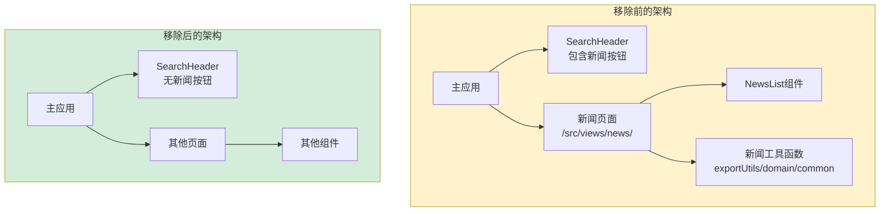
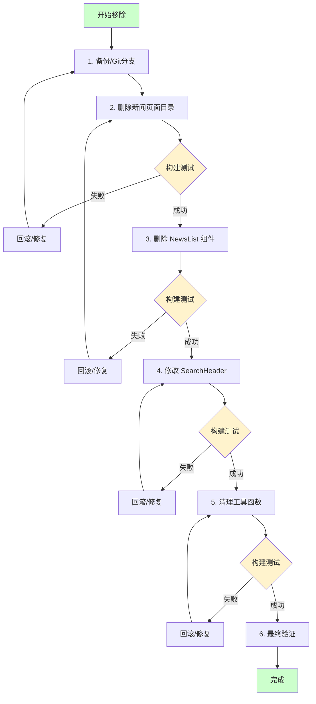

# 去除新闻相关功能设计文档

**文档版本**: v1.0  
**最后更新**: 2026-04-25  
**维护者**: doubao-seed-2-0-code-preview-260215  
**工具**: Claude Code  

**关联文档**: [需求文档](./01_需求文档.md) | [需求任务](./02_需求任务.md) | [使用文档](./04_使用文档.md) | [动态检查清单](./05_动态检查清单.md) | [CLAUDE.md](../../CLAUDE.md)

[设计概述](#设计概述) | [架构设计](#架构设计) | [修复内容](#修复内容) | [实现细节](#实现细节) | [影响分析](#影响分析) | [主要操作场景实现](#主要操作场景实现) | [数据结构](#数据结构)

---

## 设计概述

### 目标

设计一个安全、可控的新闻功能移除方案，确保在移除新闻相关代码的同时，不影响项目的核心功能和构建流程。

### 设计原则

🎯 **最小改动原则** - 仅删除必要的文件，最小化影响范围  
⚡ **验证优先原则** - 每一步都验证构建，确保可回滚  
🔧 **渐进式移除** - 分阶段执行，降低风险

### 范围

本设计涵盖以下内容的移除：
- 新闻页面（`/src/views/news/`）
- NewsList 组件（`/cdn/components/business/NewsList/`）
- SearchHeader 中的新闻按钮
- 工具函数中的新闻相关代码
- 组件导出配置

---

## 架构设计

### 整体架构



### 模块划分

| 模块名称 | 职责 | 文件位置 | 改动类型 |
|----------|------|----------|----------|
| 新闻页面 | 新闻功能主页面 | `/src/views/news/` | 删除 |
| NewsList | 新闻列表组件 | `/cdn/components/business/NewsList/` | 删除 |
| SearchHeader | 搜索头部组件 | `/cdn/components/business/SearchHeader/index.js` | 修改 |
| 导出工具 | 数据导出功能 | `/cdn/utils/io/exportUtils.js` | 修改 |
| 域名工具 | 域名分类功能 | `/cdn/utils/data/domain.js` | 修改 |
| 通用工具 | 通用工具函数 | `/cdn/utils/core/common.js` | 修改 |
| 组件索引 | 组件导出配置 | `/cdn/components/index.js` | 修改 |

### 核心流程



---

## 修复内容

### 问题分析

**问题描述**: 项目中存在不再使用的新闻相关代码，包括独立的新闻页面、组件和工具函数，增加了维护成本。

**问题产生的原因**: 
- 新闻功能可能是历史功能，现在不再需要
- 代码没有及时清理，形成技术债务

**影响范围**: 
- 约 10+ 个文件需要删除或修改
- 影响组件库、工具函数等多个模块

**错误日志/异常信息**: 无（这是代码清理任务，不是 bug 修复）

### 修复方案

#### 整体策略

采用**渐进式移除策略**：
1. 先删除最独立的模块（新闻页面）
2. 再删除依赖该模块的组件（NewsList）
3. 最后清理工具函数中的相关代码

#### 需要修改的文件清单

| 文件路径 | 改动类型 | 主要改动 | 预期结果 |
|----------|----------|----------|----------|
| `/src/views/news/` | 删除 | 整个目录 | 新闻页面完全移除 |
| `/cdn/components/business/NewsList/` | 删除 | 整个目录 | NewsList 组件完全移除 |
| `/cdn/components/index.js` | 修改 | 移除 NewsList 导出 | 组件库不再包含 NewsList |
| `/cdn/components/business/SearchHeader/index.js` | 修改 | 移除新闻按钮 props 和方法 | SearchHeader 更简洁 |
| `/cdn/utils/io/exportUtils.js` | 修改 | 移除新闻导出相关代码 | 导出工具更简洁 |
| `/cdn/utils/data/domain.js` | 修改 | 清理新闻相关注释/别名 | 域名工具更简洁 |
| `/cdn/utils/core/common.js` | 修改 | 移除新闻标签函数 | 通用工具更简洁 |

#### 各文件的详细修改方案

##### 1. `/src/views/news/` - 删除整个目录

**修复前**: 
- 包含完整的新闻页面实现
- 文件列表见 [需求任务 - 包含的文件](./02_需求任务.md#删除新闻页面目录)

**修复后**: 
- 目录完全删除
- 无任何残留

**说明**: 这是独立的页面目录，删除风险低。

---

##### 2. `/cdn/components/business/NewsList/` - 删除整个目录

**修复前**: 
- 包含 NewsList 组件实现
- 依赖 `domain.js` 中的 `categorizeNewsItem`

**修复后**: 
- 目录完全删除
- 组件库中不再可用

**说明**: 该组件仅在新闻页面中使用，随页面一起删除安全。

---

##### 3. `/cdn/components/index.js` - 修改组件导出

**修复前**:
```javascript
// ... 其他组件 ...
export { default as NewsList } from './business/NewsList/index.js';
// ... 其他组件 ...

export default {
  // ... 其他组件 ...
  NewsList,
  // ... 其他组件 ...
};
```

**修复后**:
```javascript
// ... 其他组件 ...
// NewsList 已移除
// ... 其他组件 ...

export default {
  // ... 其他组件 ...
  // NewsList 已移除
  // ... 其他组件 ...
};
```

**说明**: 简单的导出清理，不会影响其他组件。

---

##### 4. `/cdn/components/business/SearchHeader/index.js` - 修改搜索头部组件

**修复前**（需要移除的部分）:
```javascript
props: {
  // ... 其他 props ...
  showNewsButton: {
    type: Boolean,
    default: true
  },
  newsHref: {
    type: String,
    default: 'https://effiy.cn/src/views/news/index.html'
  },
  // ... 其他 props ...
},
// ...
setup(props, { emit }) {
  // ...
  const openNews = () => {
    if (props.newsHref) {
      if (/^https?:\/\//.test(props.newsHref)) {
        window.open(props.newsHref, '_blank', 'noopener,noreferrer');
      } else {
        window.location.href = props.newsHref;
      }
    }
  };
  // ...
  return {
    // ...
    openNews,
    // ...
  };
}
```

**修复后**:
- 移除 `showNewsButton` prop
- 移除 `newsHref` prop  
- 移除 `openNews` 方法
- 从 return 对象中移除 `openNews`

**说明**: 这些是组件内部功能，移除后组件更简洁。

---

##### 5. `/cdn/utils/io/exportUtils.js` - 清理导出工具

**修复前**（需要移除的部分）:
```javascript
export async function exportToZip(data, filename = 'export') {
  // ...
  const newsDir = zip.folder('新闻');  // 要删除
  // ...
  // 导出新闻数据 - 要删除
  if (data.news && data.news.length > 0) {
    data.news.forEach((item, index) => {
      const content = formatNewsItem(item);
      const fileName = generateItemFileName(item, '新闻', index);
      newsDir.file(`${fileName}.md`, content);
    });
  }
  // ...
}

// 要删除的函数
function formatNewsItem(item) { /* ... */ }

function generateItemFileName(item, category, index) {
  // ...
  switch (category) {
    // ...
    case '新闻':  // 要删除的分支
      // ...
      break;
    // ...
  }
  // ...
  // 要删除的条件
  if (category !== '新闻' && category !== '项目文件' && ...) {
    // ...
  }
}

function generateOptimizedFileName(baseName, category = '', data = null) {
  // ...
  if (data) {
    const stats = [];
    // ...
    if (data.news && data.news.length > 0) {  // 要删除
      stats.push(`新闻${data.news.length}条`);
    }
    // ...
  }
}

export async function exportCategoryData(data, category, filename = 'export') {
  // ...
  switch (category) {
    // ...
    case '新闻':  // 要删除的分支
      content = formatNewsItem(item);
      break;
    // ...
  }
  // ...
}
```

**修复后**:
- 移除 `formatNewsItem` 函数
- 从 `exportToZip` 中移除新闻目录创建和新闻数据导出
- 从 `generateItemFileName` 中移除 `'新闻'` case 和相关条件
- 从 `generateOptimizedFileName` 中移除新闻统计
- 从 `exportCategoryData` 中移除 `'新闻'` case

**说明**: 保留每日清单和项目文件导出功能。

---

##### 6. `/cdn/utils/data/domain.js` - 清理域名工具

**评估结果**: 
- `domain.js` 中的函数大多是通用的域名处理功能
- `categorizeNewsItem` 实际上是通用的 `extractDomainCategory` 别名
- 建议**保留**通用功能，仅清理新闻特定的注释和别名

**修复前**（需要清理的部分）:
```javascript
/**
 * 从新闻项中提取域名分类信息
 * @param {Object} item - 新闻项
 * @returns {Object} 域名分类信息
 */
export function extractDomainCategory(item) { /* ... */ }

export function categorizeNewsItem(item) { /* ... */ }
```

**修复后**（建议方案）:
- 保留通用函数 `extractDomainCategory`、`getDomainCategory` 等
- 移除别名 `categorizeNewsItem`（或保留但标记为 deprecated）
- 更新注释，移除新闻相关描述

**说明**: 这些是通用的域名工具，可能对其他功能还有用。

---

##### 7. `/cdn/utils/core/common.js` - 清理通用工具

**修复前**（需要移除的部分）:
```javascript
function handleStorageQuotaExceeded(key, value, stringify) {
  // 清理策略：删除最老的缓存数据
  const keysToClean = ['newsCache', 'searchHistory', 'tempData'];  // 'newsCache' 要移除
  // ...
}

// 要删除的函数
export function buildNewsSessionTags(newsTags = []) { /* ... */ }

export default {
  // ...
  buildNewsSessionTags  // 要移除
};
```

**修复后**:
- 移除 `buildNewsSessionTags` 函数
- 从 `handleStorageQuotaExceeded` 的 `keysToClean` 中移除 `'newsCache'`
- 从默认导出对象中移除 `buildNewsSessionTags`

**说明**: 这些是新闻特定的功能，可以安全移除。

---

### 修复前后对比

| 内容项 | 修复前 | 修复后 | 变更原因 |
|--------|--------|--------|----------|
| 新闻页面 | 存在完整实现 | 完全删除 | 功能不再需要 |
| NewsList 组件 | 存在完整实现 | 完全删除 | 功能不再需要 |
| SearchHeader | 包含新闻按钮 | 无新闻按钮 | 简化组件 |
| exportUtils.js | 包含新闻导出 | 仅保留清单/项目文件导出 | 简化工具 |
| domain.js | 包含新闻特定别名 | 保留通用功能 | 通用功能可能仍有用 |
| common.js | 包含新闻标签函数 | 无新闻相关代码 | 简化工具 |
| 代码文件数 | ~15 个新闻相关文件 | ~7 个文件被删除/修改 | 精简代码库 |

---

## 影响分析

### 搜索词与改动点清单

| 改动点 | 类型 | 搜索词 | 来源 | 备注 |
|--------|------|--------|------|------|
| `/src/views/news/` | 目录删除 | `src/views/news`, `news/index`, `NewsPage` | 需求任务 | 整个新闻页面目录 |
| `/cdn/components/business/NewsList/` | 目录删除 | `NewsList`, `business/NewsList` | 需求任务 | 新闻列表组件 |
| `components/index.js` | 文件修改 | `NewsList`, `export.*NewsList` | 需求任务 | 组件导出文件 |
| `SearchHeader/index.js` | 文件修改 | `showNewsButton`, `newsHref`, `openNews` | 需求任务 | 搜索头部组件 |
| `exportUtils.js` | 文件修改 | `formatNewsItem`, `newsDir`, `新闻`, `news.length` | 需求任务 | 导出工具 |
| `domain.js` | 文件修改 | `categorizeNewsItem`, `新闻项` | 需求任务 | 域名工具 |
| `common.js` | 文件修改 | `buildNewsSessionTags`, `newsCache` | 需求任务 | 通用工具 |

### 改动点影响链

| 改动点 | 搜索词 | 命中文件 | 引用方式 | 影响层级 | 依赖方向 | 处置方式 | 闭合状态 | 说明 |
|--------|--------|----------|----------|----------|----------|----------|
| `/src/views/news/` | `src/views/news` | 无内部引用 | N/A | N/A | 删除 | ✅ 已闭合 | 独立目录，无内部引用 |
| `/cdn/components/business/NewsList/` | `NewsList` | `/cdn/components/index.js` | export | 直接 | 反向依赖 | 更新导出 | ✅ 已闭合 | 仅在索引文件中导出 |
| `/cdn/components/business/NewsList/` | `NewsList` | `/src/views/news/index.js` | import | 直接 | 反向依赖 | 一起删除 | ✅ 已闭合 | 在新闻页面中使用 |
| `/cdn/components/business/NewsList/` | `NewsList` | `/src/views/news/components/newsPage/index.js` | 组件使用 | 直接 | 反向依赖 | 一起删除 | ✅ 已闭合 | 在新闻页面中使用 |
| `domain.js` | `categorizeNewsItem` | `/cdn/components/business/NewsList/index.js` | import | 直接 | 反向依赖 | 一起删除 | ✅ 已闭合 | 在 NewsList 中使用 |
| `domain.js` | `categorizeNewsItem` | `/src/views/news/hooks/useComputed.js` | import | 直接 | 反向依赖 | 一起删除 | ✅ 已闭合 | 在新闻页面中使用 |
| `domain.js` | `categorizeNewsItem` | `/src/views/news/hooks/store.js` | import | 直接 | 反向依赖 | 一起删除 | ✅ 已闭合 | 在新闻页面中使用 |
| `exportUtils.js` | `formatNewsItem` | `/cdn/utils/io/exportUtils.js` | 内部函数 | 内部 | N/A | 删除函数 | ✅ 已闭合 | 内部使用 |
| `common.js` | `buildNewsSessionTags` | 暂未发现 | N/A | N/A | 删除函数 | ✅ 已闭合 | 暂未发现其他引用 |
| `SearchHeader` | `showNewsButton` | 暂未发现外部使用 | N/A | N/A | 移除 prop | ✅ 已闭合 | 组件内部功能 |

### 依赖闭合摘要

| 改动点 | 上游依赖是否核对 | 反向依赖是否核对 | 传递依赖是否闭合 | 测试 / 文档 / 配置是否覆盖 | 结论 |
|--------|------------------|------------------|------------------|------------|------|
| `/src/views/news/` | ✅ 是 | ✅ 是 | ✅ 是 | ⚠️ 待补充 | ✅ 可安全删除 |
| `/cdn/components/business/NewsList/` | ✅ 是 | ✅ 是 | ✅ 是 | ⚠️ 待补充 | ✅ 可安全删除 |
| `components/index.js` | ✅ 是 | ✅ 是 | ✅ 是 | ⚠️ 待补充 | ✅ 可安全修改 |
| `SearchHeader/index.js` | ✅ 是 | ✅ 是 | ✅ 是 | ⚠️ 待补充 | ✅ 可安全修改 |
| `exportUtils.js` | ✅ 是 | ✅ 是 | ✅ 是 | ⚠️ 待补充 | ✅ 可安全修改 |
| `domain.js` | ✅ 是 | ✅ 是 | ✅ 是 | ⚠️ 待补充 | ✅ 可安全修改（保留通用功能） |
| `common.js` | ✅ 是 | ✅ 是 | ✅ 是 | ⚠️ 待补充 | ✅ 可安全修改 |

### 未覆盖风险

| 风险来源 | 原因 | 影响 | 缓解方式 |
|----------|------|------|----------|
| 外部链接 | 可能有外部链接指向新闻页面 | 用户访问旧链接 404 | 检查服务器日志，考虑重定向 |
| 未发现的测试 | tests/ 目录可能存在但未检查 | 测试失败 | 建议后续检查 tests/ 目录 |
| 未发现的配置 | 根目录配置文件可能引用新闻路径 | 配置错误 | 检查根目录配置文件 |
| 动态引用 | 可能存在未通过静态搜索发现的动态引用 | 运行时错误 | 充分测试，监控控制台错误 |

### 改动范围汇总

- **需直接删除的目录数**: 2 个
- **需直接修改的文件数**: 4 个
- **需验证兼容性的文件数**: 0 个
- **需人工复核或阻断的风险**: 外部链接风险

---

## 实现细节

### 技术实现要点

#### 要点1: 删除目录的安全方式

**做什么**: 删除整个目录  
**怎么做**: 使用文件系统删除命令，或通过 Git 删除  
**为什么这么做**: 确保彻底删除，不留残留

**关键代码/命令**:
```bash
# Git 删除（推荐）
git rm -r src/views/news/
git rm -r cdn/components/business/NewsList/

# 或者直接删除
rm -rf src/views/news/
rm -rf cdn/components/business/NewsList/
```

---

#### 要点2: 修改文件的安全方式

**做什么**: 修改现有文件，移除特定代码段  
**怎么做**: 先备份，再修改，最后验证  
**为什么这么做**: 确保可回滚，避免误删

**关键代码**: 见 [修复内容 - 各文件的详细修改方案](#各文件的详细修改方案)

---

#### 要点3: 验证构建的关键步骤

**做什么**: 每一步修改后都运行构建验证  
**怎么做**: 执行项目的构建命令  
**为什么这么做**: 确保修改不会破坏构建

**关键代码/命令**（取决于项目）:
```bash
# 示例：常见的构建命令
npm run build
# 或
yarn build
# 或直接检查语法错误
```

---

#### 要点4: 渐进式提交策略

**做什么**: 分阶段提交变更  
**怎么做**: 每个主要步骤完成后单独提交  
**为什么这么做**: 便于分阶段回滚，历史清晰

**提交信息示例**:
```
feat: remove news page directory
- 删除 /src/views/news/ 整个目录

feat: remove NewsList component
- 删除 NewsList 组件目录
- 更新 components/index.js 导出

feat: remove news button from SearchHeader
- 移除 showNewsButton 和 newsHref props
- 移除 openNews 方法

refactor: clean news-related code from utils
- 清理 exportUtils.js 中的新闻导出
- 清理 common.js 中的新闻标签功能
- 更新 domain.js 注释
```

---

### 关键代码说明

#### 修复后的 exportUtils.js 关键部分

```javascript
export async function exportToZip(data, filename = 'export') {
  try {
    const JSZip = await waitForJSZip();
    const zip = new JSZip();
    
    // 创建目录结构 - 仅保留每日清单和项目文件
    const dailyChecklistDir = zip.folder('每日清单');
    const projectFilesDir = zip.folder('项目文件');
    // newsDir 已移除
    
    // 导出每日清单数据 - 保留
    if (data.dailyChecklist && data.dailyChecklist.length > 0) { /* ... */ }
    
    // 导出项目文件数据 - 保留
    if (data.projectFiles && data.projectFiles.length > 0) { /* ... */ }
    
    // 导出新闻数据 - 已移除
    
    // 生成 ZIP 文件
    const zipBlob = await zip.generateAsync({ type: 'blob' });
    const optimizedFileName = generateOptimizedFileName('YiWeb数据导出', '', data);
    downloadBlob(zipBlob, `${optimizedFileName}.zip`);
    
    return true;
  } catch (error) {
    console.error('[ExportUtils] 导出失败:', error);
    return false;
  }
}

// formatNewsItem 函数已移除

function generateItemFileName(item, category, index) {
  // ...
  switch (category) {
    case '每日清单':
      // ...
      break;
    case '项目文件':
      // ...
      break;
    // '新闻' case 已移除
    default:
      fileName = `${category}_${index + 1}`;
  }
  
  // 新闻相关的日期条件已移除
  if (category !== '项目文件' && (item.isoDate || item.timestamp || item.createdAt)) {
    // ...
  }
  
  return fileName;
}

function generateOptimizedFileName(baseName, category = '', data = null) {
  // ...
  if (data) {
    const stats = [];
    if (data.dailyChecklist && data.dailyChecklist.length > 0) {
      stats.push(`清单${data.dailyChecklist.length}项`);
    }
    if (data.projectFiles && data.projectFiles.length > 0) {
      stats.push(`文件${data.projectFiles.length}个`);
    }
    // 新闻统计已移除
    
    if (stats.length > 0) {
      fileName += `_${stats.join('_')}`;
    }
  }
  // ...
}

export async function exportCategoryData(data, category, filename = 'export') {
  // ...
  switch (category) {
    case '每日清单':
      content = formatDailyChecklistItem(item);
      break;
    case '项目文件':
      content = formatProjectFileItem(item);
      break;
    // '新闻' case 已移除
    default:
      content = JSON.stringify(item, null, 2);
  }
  // ...
}
```

---

#### 修复后的 common.js 关键部分

```javascript
function handleStorageQuotaExceeded(key, value, stringify) {
  // 清理策略：删除最老的缓存数据 - newsCache 已移除
  const keysToClean = ['searchHistory', 'tempData'];
  
  for (const cleanKey of keysToClean) {
    if (cleanKey !== key && localStorage.getItem(cleanKey)) {
      localStorage.removeItem(cleanKey);
      // ...
    }
  }
  
  return false;
}

// buildNewsSessionTags 函数已移除

// 导出默认工具对象
export default {
  debounce,
  throttle,
  safeSetItem,
  safeGetItem,
  formatTime,
  extractExcerpt,
  random,
  createCSSVars,
  isSearchMatch,
  deepClone,
  updateUrlParams,
  getUrlParam,
  detectDevice,
  formatFileSize,
  // buildNewsSessionTags 已移除
};
```

---

### 依赖关系

**新增的依赖项**: 无  
**移除的依赖项**: 
- NewsList 组件的所有依赖（随组件一起删除）
- 新闻页面的所有依赖（随页面一起删除）

**依赖冲突/兼容性问题**: 无预期的冲突

### 测试考虑

#### 需要重点测试的场景

1. **核心功能测试** - 确保新闻功能移除后核心功能正常
2. **SearchHeader 组件测试** - 确保移除新闻按钮后该组件仍正常工作
3. **导出功能测试** - 确保每日清单和项目文件导出仍正常
4. **构建测试** - 确保项目能正常构建
5. **控制台错误检查** - 确保无运行时错误

#### 测试用例建议

| 测试项 | 测试步骤 | 预期结果 |
|--------|----------|----------|
| 构建测试 | 运行项目构建命令 | 构建成功，无错误 |
| SearchHeader 功能 | 测试搜索、首页按钮等功能 | 功能正常，无错误 |
| 每日清单导出 | 测试每日清单导出功能 | 导出正常，文件内容正确 |
| 项目文件导出 | 测试项目文件导出功能 | 导出正常，文件内容正确 |
| 工具函数 | 测试 common.js、domain.js 中保留的函数 | 函数工作正常 |
| 控制台检查 | 在浏览器中打开应用，检查控制台 | 无错误信息 |

---

## 主要操作场景实现

### 场景实现: 删除新闻页面目录

**关联需求任务场景**: [需求任务 - 删除新闻页面目录](./02_需求任务.md#场景1-删除新闻页面目录)

**实现概述**: 使用 Git 删除整个 `/src/views/news/` 目录，确保彻底且可回滚

**涉及模块**:
- `/src/views/news/` - 整个目录

**关键代码路径/操作**:
```bash
# Git 删除（推荐）
git rm -r src/views/news/

# 验证删除
ls -la src/views/  # news 目录应该不再存在

# 尝试构建
# npm run build 或其他构建命令
```

**验证要点**:
- [ ] `/src/views/news/` 目录已完全删除
- [ ] Git 状态显示删除
- [ ] 构建成功
- [ ] 无相关错误

---

### 场景实现: 删除 NewsList 组件

**关联需求任务场景**: [需求任务 - 删除 NewsList 组件](./02_需求任务.md#场景2-删除-newslist-组件)

**实现概述**: 删除 NewsList 组件目录，并更新组件索引文件

**涉及模块**:
- `/cdn/components/business/NewsList/` - 组件目录
- `/cdn/components/index.js` - 组件索引

**关键代码路径/操作**:
```bash
# Git 删除组件目录
git rm -r cdn/components/business/NewsList/

# 手动修改 components/index.js
# 移除 NewsList 的 export 语句
# 从默认导出对象中移除 NewsList
```

**验证要点**:
- [ ] NewsList 目录已删除
- [ ] components/index.js 已更新
- [ ] 构建成功
- [ ] 无相关错误

---

### 场景实现: 修改 SearchHeader 组件

**关联需求任务场景**: [需求任务 - 修改 SearchHeader](./02_需求任务.md#场景3-修改-searchheader-组件)

**实现概述**: 从 SearchHeader 组件中移除新闻按钮相关的 props 和方法

**涉及模块**:
- `/cdn/components/business/SearchHeader/index.js`

**关键代码路径/修改**:
1. 从 `props` 对象中删除 `showNewsButton` 和 `newsHref`
2. 删除 `openNews` 函数
3. 从 `return` 对象中删除 `openNews`

**验证要点**:
- [ ] SearchHeader 组件代码已更新
- [ ] 无语法错误
- [ ] 构建成功
- [ ] SearchHeader 其他功能正常

---

### 场景实现: 清理 exportUtils.js

**关联需求任务场景**: [需求任务 - 清理 exportUtils.js](./02_需求任务.md#场景4-清理工具函数---exportutilsjs)

**实现概述**: 从 exportUtils.js 中移除所有新闻导出相关代码

**涉及模块**:
- `/cdn/utils/io/exportUtils.js`

**关键代码路径/修改**:
1. 删除 `formatNewsItem` 函数
2. 修改 `exportToZip` - 移除新闻目录和新闻数据导出
3. 修改 `generateItemFileName` - 移除新闻相关分支
4. 修改 `generateOptimizedFileName` - 移除新闻统计
5. 修改 `exportCategoryData` - 移除新闻分支

**验证要点**:
- [ ] 新闻相关代码已移除
- [ ] 每日清单导出功能正常
- [ ] 项目文件导出功能正常
- [ ] 构建成功

---

### 场景实现: 清理 domain.js

**关联需求任务场景**: [需求任务 - 清理 domain.js](./02_需求任务.md#场景5-清理工具函数---domainjs)

**实现概述**: 清理 domain.js 中的新闻相关注释和别名，保留通用功能

**涉及模块**:
- `/cdn/utils/data/domain.js`

**关键代码路径/修改**（建议方案）:
1. 保留 `extractDomainCategory`、`getDomainCategory` 等通用函数
2. 移除 `categorizeNewsItem` 别名（或保留但标记为 deprecated）
3. 更新函数注释，移除新闻相关描述

**验证要点**:
- [ ] 通用域名功能仍正常
- [ ] 构建成功

---

### 场景实现: 清理 common.js

**关联需求任务场景**: [需求任务 - 清理 common.js](./02_需求任务.md#场景6-清理工具函数---commonjs)

**实现概述**: 从 common.js 中移除新闻标签相关代码

**涉及模块**:
- `/cdn/utils/core/common.js`

**关键代码路径/修改**:
1. 删除 `buildNewsSessionTags` 函数
2. 从 `handleStorageQuotaExceeded` 的 `keysToClean` 数组中删除 `'newsCache'`
3. 从默认导出对象中删除 `buildNewsSessionTags`

**验证要点**:
- [ ] 新闻相关代码已移除
- [ ] 其他工具函数仍正常
- [ ] 构建成功

---

### 场景实现: 最终验证

**关联需求任务场景**: [需求任务 - 构建和测试验证](./02_需求任务.md#场景7-构建和测试验证)

**实现概述**: 执行完整的构建和功能验证

**涉及模块**:
- 整个项目

**关键代码路径/操作**:
1. 运行项目构建
2. 在浏览器中打开应用
3. 检查控制台错误
4. 验证核心功能

**验证要点**:
- [ ] 构建成功
- [ ] 无控制台错误
- [ ] 核心功能正常
- [ ] SearchHeader 正常工作
- [ ] 导出功能正常

---

## 数据结构

### 数据流程图

由于这是代码清理任务，不涉及新的数据结构或数据流变更。

**变更前**: 项目包含新闻相关的数据结构和数据流（随新闻页面一起删除）  
**变更后**: 新闻相关数据结构被移除，其他数据结构保持不变

### 数据结构对比

无数据结构变更（仅删除代码，不修改其他功能的数据结构）
