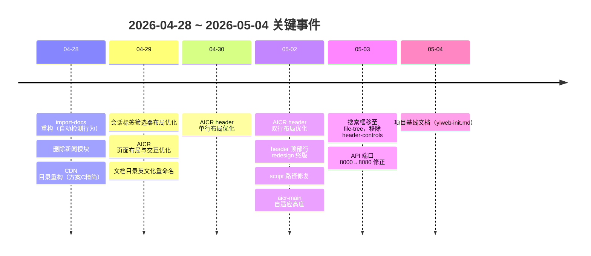
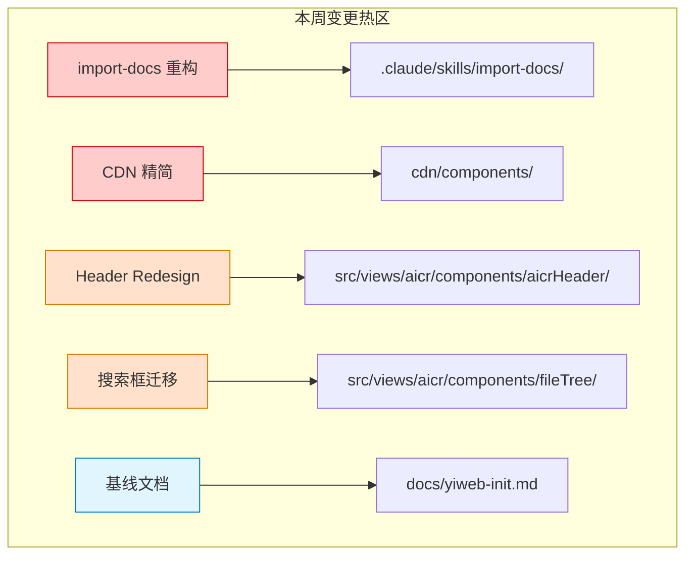
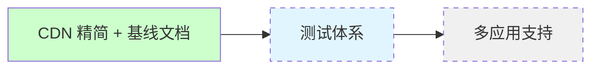

# 📊 YiWeb 周报

> | v1.0 | 2026-04-28~2026-05-04 | deepseek-v4-pro | Claude Code | 🌿 main | 📎 [CLAUDE.md](../../../CLAUDE.md) |

---

## 📈 KPI 量化汇总

| 维度 | 指标 | 本周 | 说明 |
|------|------|------|------|
| 产出 | 提交数 | 39 | 含 merge commits |
| 产出 | 变更文件 | 255 | 新增+修改+删除 |
| 产出 | 代码行 | +14,897 / −21,054 | 净删 6,157 行（精简为主） |
| 质量 | 回滚次数 | 0 | — |
| 质量 | P0 阻断 | 0 | 无未解决 P0 |
| 流程 | 功能文档 | 1 (yiweb-init) | 项目基线初始化 |
| 流程 | 执行记忆 | 3 条 | 全量健康 |

---

## 🔄 本周回顾

### 已完成

### 关键交付

| # | 交付物 | 类型 | 影响范围 |
|---|--------|------|---------|
| 1 | import-docs 重构 | feat | `.claude/skills/import-docs/` 全部重写，支持自动检测 |
| 2 | 新闻模块移除 | feat | 删除 news 相关功能，精简代码库 |
| 3 | CDN 组件库精简（方案C） | refactor | `cdn/components/` 彻底精简 |
| 4 | AICR header 双行布局 | feat | `aicrHeader/` 组件重设计 |
| 5 | 搜索框嵌入 file-tree | feat | `SearchHeader` 移除，功能合并到 `FileTree` |
| 6 | API 端口修正 | fix | `src/core/config.js` 端口 8000→8080 |
| 7 | 项目基线文档 | docs | `docs/yiweb-init.md` 5 stories, 12 ACs |

### 执行记忆分析

| 记录 | 模式 | 指纹 | 级别 | 质量 |
|------|------|------|------|------|
| yry-overview | init | project-init, documentation | T2 | P0=0 |
| weekly-report | weekly | KPI, retrospective | T2 | P0=0 |
| from-weekly-decomposition | from-weekly | decomposition | T2 | P0=0 |

---

## 🏗️ 全景图

| 模块 | 本周变更 | 稳定性 |
|------|---------|--------|
| `cdn/components/` | 方案C精简（大幅删减） | 🔴 变更剧烈 |
| `.claude/skills/import-docs/` | 全量重写 | 🟡 重构完成 |
| `src/views/aicr/components/aicrHeader/` | 双行布局 redesign | 🟢 已稳定 |
| `src/views/aicr/components/fileTree/` | 新增搜索框功能 | 🟢 已稳定 |
| `src/core/config.js` | 端口修正 | 🟢 稳定 |
| `docs/` | 新建 + 基线文档 | 🟢 稳定 |

---

## 📋 后续规划与改进

### 待办事项

| # | 事项 | 优先级 | 来源 |
|---|------|--------|------|
| 1 | E2E 测试体系搭建 | P1 | yiweb-init 后记 |
| 2 | 键盘快捷键完善 | P2 | yiweb-init 后记 |
| 3 | from-weekly 拆解的 2 个功能文档落地 | P1 | 执行记忆 |
| 4 | `draft-weekly-report.js` REPO_ROOT 变量缺失修复 | P2 | 本周发现 |

### 流程改进

| # | 发现 | 建议 |
|---|------|------|
| 1 | `collect-weekly-kpi.js` 仅统计 `docs/*.md`，未覆盖子目录 | 扩展 glob 到 `docs/**/*.md` |
| 2 | `draft-weekly-report.js` 引用已删除的 `self-improving` 技能 | 移除死代码路径 |

### 架构演进方向

- **当前瓶颈**：无自动化测试，回归依赖手动验证
- **下个节点**：E2E 测试骨架（基于 Playwright MCP + data-testid）
- **风险**：CDN 依赖（Vue/Marked/Mermaid）不可用时应用不可用；`git revert` 可回滚
