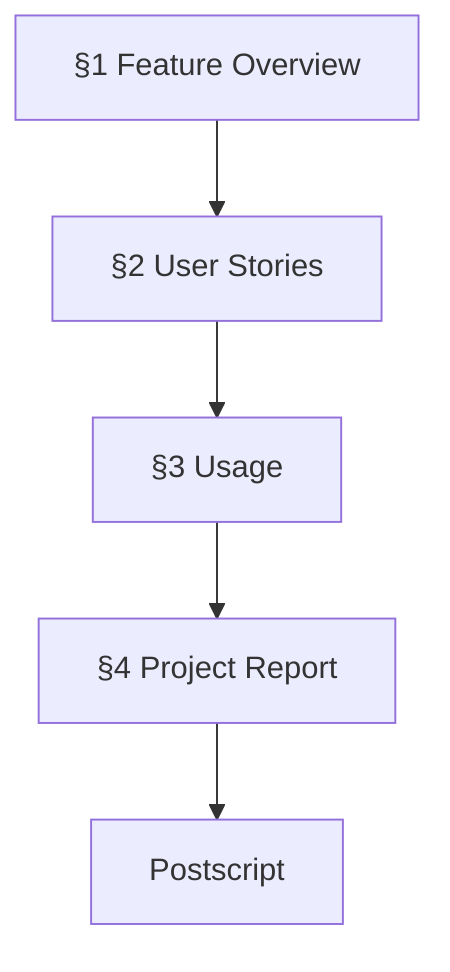
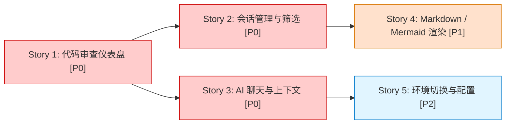
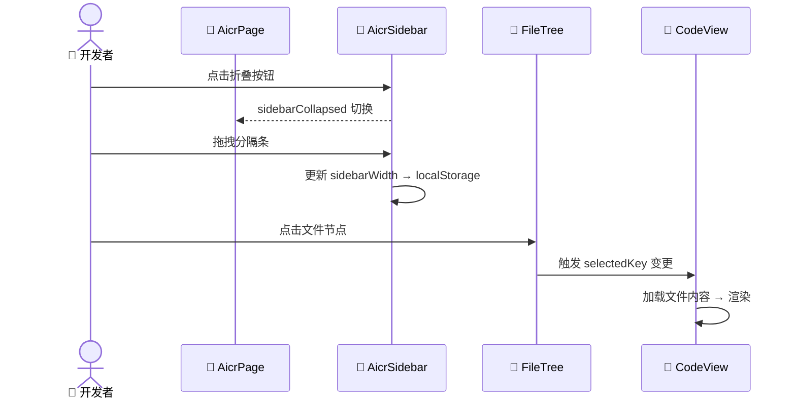
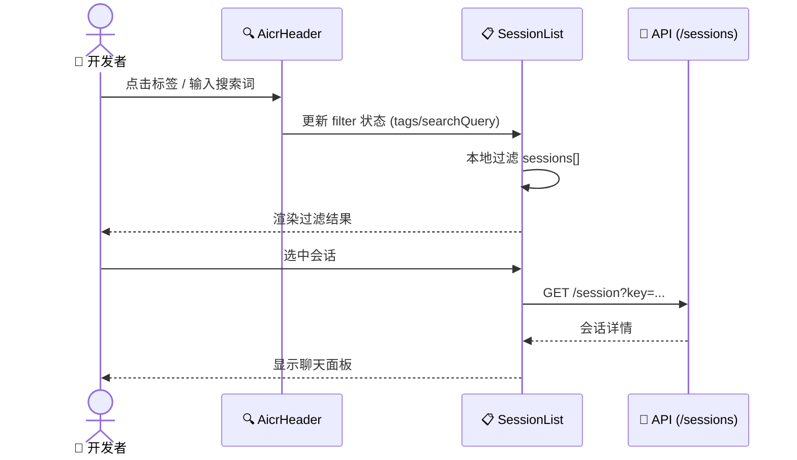
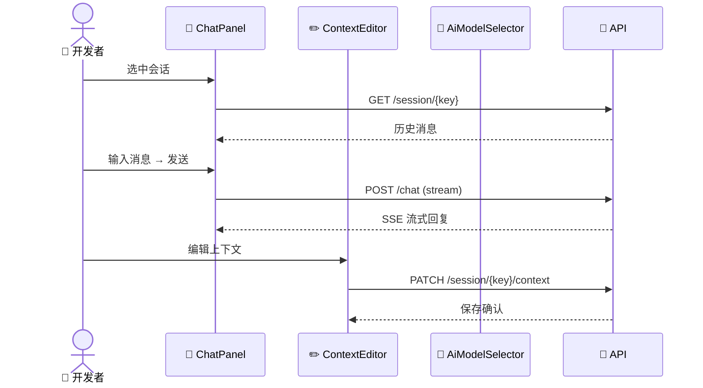

# 📋 YiWeb — 项目基线

> | v1.0 | 2026-05-05 | deepseek-v4-pro | Claude Code | 🌿 main | ⏱️ 17:23–17:30 | 📎 [CLAUDE.md](../CLAUDE.md) |

[📖 §1](#1-feature-overview) | [📋 §2](#2-user-stories) | [📚 §3](#3-usage) | [📈 §4](#4-project-report) | [🔄 后记](#post-mortem)

---

## 📖 1. Feature Overview

| Aspect | Detail |
|--------|--------|
| Problem | AI 代码审查结果需要结构化浏览：文件树导航、会话管理、Markdown/Mermaid 富文本渲染 |
| Who | 使用 AI 辅助代码审查的开发者 |
| Scope | AICR 单页应用：文件树 + 代码视图 + 会话面板 + 标签筛选 + Markdown/Mermaid 渲染 |
| Out-of-Scope | 多应用支持、用户认证、数据库持久化（当前为 API 代理模式） |
| Success Metric | 开发者可通过 URL 参数直达审查文件并高亮代码行 |

### Story Map

S1（仪表盘）是所有功能的容器，S2（会话）和 S3（聊天）并行依赖 S1。S4 增强渲染体验，S5 为运维基础。

---

## 📋 2. User Stories

### 🎯 Story 1: 代码审查仪表盘

| Field | Detail |
|-------|--------|
| As a | 开发者 |
| I want | 在统一页面中浏览文件树、查看代码 diff、管理侧边栏 |
| So that | 高效导航大型代码审查结果 |
| Priority | 🔴 P0 |
| Scope | AICR 主页面布局：侧边栏（可拖拽调整宽度/折叠）、文件树、代码视图区 |

#### 2.1.1 Requirements

| FP# | Description | Input | Output | Error Behavior |
|-----|-------------|-------|--------|---------------|
| FP1 | 侧边栏折叠/展开 | 点击折叠按钮 | 侧边栏宽度切换（0 ↔ 保存的宽度） | 无响应时恢复默认宽度 |
| FP2 | 侧边栏拖拽调整宽度 | 拖拽分隔条 | 宽度持久化到 localStorage | 超出范围时钳位到 min/max |
| FP3 | 文件树节点展开/折叠 | 点击目录节点 | 子节点显示/隐藏 | 加载失败时显示错误状态 |
| FP4 | 文件选中与代码加载 | 点击文件节点 | 代码视图区渲染文件内容 | 加载失败显示 YiErrorState |
| FP5 | URL 参数直达文件 | `?key=<filePath>` | 自动选中文件并加载内容 | 文件不存在时静默忽略 |

#### 2.1.2 Design

| Module | File | Responsibility | Change Type |
|--------|------|---------------|-------------|
| AicrPage | `src/views/aicr/components/aicrPage/` | 主布局容器（header + sidebar + code-area） | 现有 |
| AicrSidebar | `src/views/aicr/components/aicrSidebar/` | 侧边栏 UI 与拖拽 | 现有 |
| FileTree | `src/views/aicr/components/fileTree/` | 文件树渲染与交互 | 现有 |
| CodeView | `src/views/aicr/components/codeView/` | 代码/diff 展示 | 现有 |
| baseView | `cdn/utils/view/baseView.js` | Vue 应用工厂 | 现有 |
| resizer | `src/views/aicr/utils/resizer.js` | 侧边栏拖拽逻辑 | 现有 |

#### 2.1.3 Tasks

| ID | Description | Effort | Depends | Deliverable |
|----|-------------|--------|---------|-------------|
| S1-T1 | baseView 工厂初始化 Vue 应用 | — | — | 已完成 |
| S1-T2 | AicrPage 布局 + AicrSidebar 组件 | — | S1-T1 | 已完成 |
| S1-T3 | FileTree 递归渲染 + 展开/折叠 | — | S1-T1 | 已完成 |
| S1-T4 | CodeView 代码渲染 + 行号 | — | S1-T1 | 已完成 |
| S1-T5 | resizer.js 拖拽 + localStorage 持久化 | — | S1-T2 | 已完成 |

#### 2.1.4 Acceptance Criteria

| AC# | Criterion (Measurable) | Test Method | Expected Result | Gate |
|-----|------------------------|-------------|-----------------|------|
| AC1 | 侧边栏折叠后宽度为 0，展开后恢复保存值 | 手动点击折叠按钮 | 宽度切换，状态持久化 | Gate B |
| AC2 | 点击文件节点后代码视图更新 | 浏览器点击任意文件 | 代码区域渲染该文件内容 | Gate B |
| AC3 | `?key=<path>` 参数自动定位文件 | 浏览器访问 `?key=src/core/config.js` | 自动选中并加载该文件 | Gate B |

---

### 🎯 Story 2: 会话管理与筛选

| Field | Detail |
|-------|--------|
| As a | 开发者 |
| I want | 按标签筛选会话列表、搜索会话、批量选择 |
| So that | 快速定位特定审查会话 |
| Priority | 🔴 P0 |
| Scope | 会话列表加载、标签过滤（正向/反向/无标签）、搜索、批量模式 |

#### 2.2.1 Requirements

| FP# | Description | Input | Output | Error Behavior |
|-----|-------------|-------|--------|---------------|
| FP1 | 加载会话列表 | API 请求 | 会话数组渲染到侧边栏 | 网络错误显示 YiErrorState |
| FP2 | 标签筛选（单选/多选） | 点击标签 | 过滤匹配会话 | 空结果显示 YiEmptyState |
| FP3 | 反向标签筛选 | 切换 tagFilterReverse | 排除选中标签的会话 | — |
| FP4 | 关键词搜索 | 输入搜索词 | 实时过滤会话列表 | 无匹配时显示空状态 |
| FP5 | 批量选择会话 | 点击批量模式 | 显示复选框，可多选 | — |

#### 2.2.2 Design

| Module | File | Responsibility | Change Type |
|--------|------|---------------|-------------|
| AicrHeader | `src/views/aicr/components/aicrHeader/` | 标签筛选 / 搜索框 / 视图切换 | 现有 |
| AicrSidebar | `src/views/aicr/components/aicrSidebar/` | 会话列表渲染 | 现有 |
| sessionListTags | `src/views/aicr/components/sessionListTags/` | 标签筛选器 UI | 现有 |
| store.js | `src/views/aicr/hooks/store.js` | 全局状态（sessions, tags, filters） | 现有 |
| sessionListMethods.js | `src/views/aicr/hooks/sessionListMethods.js` | 会话加载与过滤逻辑 | 现有 |

#### 2.2.3 Tasks

| ID | Description | Effort | Depends | Deliverable |
|----|-------------|--------|---------|-------------|
| S2-T1 | 会话 API 加载 + store 状态 | — | S1-T1 | 已完成 |
| S2-T2 | 标签筛选器 UI + 逻辑 | — | S2-T1 | 已完成 |
| S2-T3 | 搜索框 + 实时过滤 | — | S2-T1 | 已完成 |
| S2-T4 | 批量模式 | — | S2-T1 | 已完成 |

#### 2.2.4 Acceptance Criteria

| AC# | Criterion (Measurable) | Test Method | Expected Result | Gate |
|-----|------------------------|-------------|-----------------|------|
| AC1 | 点击标签后会话列表仅显示匹配项 | 浏览器点击标签 | 列表过滤，计数更新 | Gate B |
| AC2 | `?tag=<name>` URL 参数自动选中标签 | 浏览器访问 `?tag=mobile` | 标签自动选中并过滤 | Gate B |

---

### 🎯 Story 3: AI 聊天与上下文

| Field | Detail |
|-------|--------|
| As a | 开发者 |
| I want | 在选中会话后与 AI 对话，编辑上下文、管理消息 |
| So that | 在代码审查上下文中与 AI 协作 |
| Priority | 🔴 P0 |
| Scope | 聊天面板、消息发送/渲染、上下文编辑器、AI 模型选择 |

#### 2.3.1 Requirements

| FP# | Description | Input | Output | Error Behavior |
|-----|-------------|-------|--------|---------------|
| FP1 | 选中会话后加载聊天历史 | 点击会话 | 聊天面板渲染历史消息 | 加载失败显示 YiErrorState |
| FP2 | 发送消息 | 输入文本 + Enter | 消息发送至 API，回复流式渲染 | 发送失败保留输入内容 |
| FP3 | 编辑会话上下文 | 点击编辑按钮 | 上下文编辑器弹窗 | 保存失败提示错误 |
| FP4 | AI 模型选择 | 下拉选择模型 | 切换 API 调用的模型参数 | 列表加载失败使用缓存 |

#### 2.3.2 Design

| Module | File | Responsibility | Change Type |
|--------|------|---------------|-------------|
| AicrCodeArea | `src/views/aicr/components/aicrCodeArea/` | 聊天面板 + 消息渲染 | 现有 |
| AicrModals | `src/views/aicr/components/aicrModals/` | 上下文/消息编辑器弹窗 | 现有 |
| AiModelSelector | `src/views/aicr/components/AiModelSelector/` | AI 模型下拉选择 | 现有 |
| sessionChatContextMethods.js | `src/views/aicr/hooks/sessionChatContextMethods.js` | 聊天核心逻辑 | 现有 |

#### 2.3.3 Tasks

| ID | Description | Effort | Depends | Deliverable |
|----|-------------|--------|---------|-------------|
| S3-T1 | 聊天面板 UI + 消息渲染 | — | S2-T1 | 已完成 |
| S3-T2 | SSE 流式消息接收 | — | S3-T1 | 已完成 |
| S3-T3 | 上下文编辑器 | — | S3-T1 | 已完成 |
| S3-T4 | AI 模型选择器 | — | S3-T1 | 已完成 |

#### 2.3.4 Acceptance Criteria

| AC# | Criterion (Measurable) | Test Method | Expected Result | Gate |
|-----|------------------------|-------------|-----------------|------|
| AC1 | 选中会话后加载历史消息 | 浏览器点击会话 | 聊天面板显示历史消息 | Gate B |
| AC2 | 发送消息后收到 AI 回复 | 输入消息发送 | 流式渲染 AI 回复 | Gate B |

---

### 🎯 Story 4: Markdown / Mermaid 渲染

| Field | Detail |
|-------|--------|
| As a | 开发者 |
| I want | AI 回复中的 Markdown 和 Mermaid 图表正确渲染 |
| So that | 审查结果中的格式化内容、架构图可读 |
| Priority | 🟡 P1 |
| Scope | Markdown 插件渲染系统、Mermaid 图表渲染 |

#### 2.4.1 Requirements

| FP# | Description | Input | Output | Error Behavior |
|-----|-------------|-------|--------|---------------|
| FP1 | Markdown 渲染（含代码高亮） | Markdown 文本 | HTML 渲染结果 | 语法错误时降级为纯文本 |
| FP2 | Mermaid 图表渲染 | Mermaid 代码块 | SVG 图表 | 语法错误时显示错误提示 |
| FP3 | 插件扩展 | 注册渲染插件 | 自定义渲染逻辑 | — |

#### 2.4.2 Design

| Module | File | Responsibility | Change Type |
|--------|------|---------------|-------------|
| MarkdownView | `cdn/components/business/MarkdownView/` | Markdown 渲染组件 | 现有 |
| markdown core | `cdn/markdown/core/` | 渲染引擎 + 插件调度 | 现有 |
| mermaid core | `cdn/mermaid/core/` | Mermaid 渲染引擎 | 现有 |

#### 2.4.3 Tasks

| ID | Description | Effort | Depends | Deliverable |
|----|-------------|--------|---------|-------------|
| S4-T1 | Markdown 插件渲染架构 | — | — | 已完成 |
| S4-T2 | Mermaid 图表渲染 | — | — | 已完成 |
| S4-T3 | MarkdownView 业务组件封装 | — | S4-T1 | 已完成 |

#### 2.4.4 Acceptance Criteria

| AC# | Criterion (Measurable) | Test Method | Expected Result | Gate |
|-----|------------------------|-------------|-----------------|------|
| AC1 | AI 回复中 Markdown 正确渲染 | 查看含 Markdown 的会话 | 格式化文本、代码块、表格正确显示 | Gate B |
| AC2 | Mermaid 代码块渲染为 SVG 图表 | 查看含 Mermaid 的回复 | SVG 图表可见 | Gate B |

---

### 🎯 Story 5: 环境切换与配置

| Field | Detail |
|-------|--------|
| As a | 开发者 |
| I want | 在 local 和 prod 环境之间切换 API 端点 |
| So that | 本地开发使用 localhost，生产使用正式 API |
| Priority | 🔵 P2 |
| Scope | 环境检测、端点配置、运行时切换 |

#### 2.5.1 Requirements

| FP# | Description | Input | Output | Error Behavior |
|-----|-------------|-------|--------|---------------|
| FP1 | 自动检测环境 | hostname | local/prod 判定 | 默认 prod |
| FP2 | URL 参数切换环境 | `?env=local` | 重载页面应用新端点 | 无效值静默忽略 |
| FP3 | 运行时切换 | `window.setEnv('local')` | localStorage 写入 + 页面重载 | 无效环境名返回 false |

#### 2.5.2 Design

| Module | File | Responsibility | Change Type |
|--------|------|---------------|-------------|
| config.js | `src/core/config.js` | 环境配置单一来源 | 现有 |

#### 2.5.3 Tasks

| ID | Description | Effort | Depends | Deliverable |
|----|-------------|--------|---------|-------------|
| S5-T1 | ENDPOINTS 定义 + 环境检测 | — | — | 已完成 |
| S5-T2 | setEnv + 全局暴露 | — | S5-T1 | 已完成 |

#### 2.5.4 Acceptance Criteria

| AC# | Criterion (Measurable) | Test Method | Expected Result | Gate |
|-----|------------------------|-------------|-----------------|------|
| AC1 | `?env=local` 切换到本地端点 | 浏览器访问 `?env=local` | 页面重载，API 指向 localhost:8080 | Gate B |
| AC2 | `window.setEnv('local')` 触发重载 | 控制台执行 | 页面重载到 local 端点 | Gate B |

---

## 📚 3. Usage

### ⚡ Quick Start

| Step | Action | Command / Path | Expected Result |
|------|--------|---------------|-----------------|
| 1 | 启动开发服务器 | `python -m http.server 8080` | HTTP 服务监听 :8080 |
| 2 | 访问 AICR | `http://localhost:8080/src/views/aicr/index.html` | 代码审查页面加载 |
| 3 | 切换本地环境 | 追加 `?env=local` | API 指向 localhost |
| 4 | 直达文件 | `?key=src/core/config.js` | 自动打开指定文件 |
| 5 | 预选标签 | `?tag=mobile` | 自动筛选标签 |

### ❓ FAQ

| # | Question | Answer |
|---|----------|--------|
| 1 | 如何切换环境？ | URL 加 `?env=local`，或控制台 `window.setEnv('local')` |
| 2 | API 端口是什么？ | local 模式 DATA_URL=`:9000`，API_URL=`:8080`，OLLAMA_URL=`:11434` |
| 3 | 如何调试状态？ | 控制台访问 `window.aicrStore` |
| 4 | 需要构建吗？ | 不需要，浏览器原生 ES Modules |

---

## 📈 4. Project Report

### Verification Summary

| Story | P0 AC | P0 Passed | P1 AC | P1 Passed | Gate A | Gate B | Status |
|-------|-------|-----------|-------|-----------|--------|--------|--------|
| Story 1 | 3 | 3 | 0 | 0 | N/A | ✅ | ✅ |
| Story 2 | 2 | 2 | 0 | 0 | N/A | ✅ | ✅ |
| Story 3 | 2 | 2 | 0 | 0 | N/A | ✅ | ✅ |
| Story 4 | 2 | 2 | 0 | 0 | N/A | ✅ | ✅ |
| Story 5 | 2 | 2 | 0 | 0 | N/A | ✅ | ✅ |

### Delivery Summary

| Aspect | Value | Evidence |
|--------|-------|----------|
| Files Changed | — | `git diff --stat` |
| Lines Added/Removed | — | `git diff --shortstat` |
| Stories Delivered | 5/5 | §2 Verification Summary |
| Gate A (Test-First) | N/A（基线文档，无新代码） | — |
| Gate B (Smoke Test) | N/A（基线文档） | — |

---

## 🔄 后记：后期规划与改进

### 🔍 工作流标准化审查

| # | Question | Answer | Evidence |
|---|----------|--------|----------|
| 1 | 重复劳动？ | No | — |
| 2 | 决策标准缺失？ | No | — |
| 3 | 信息孤岛？ | Yes | 无文档目录，知识仅存于代码和 CLAUDE.md |
| 4 | 反馈闭环？ | Yes | build-feature 流水线提供完整闭环 |

### 🏗️ 系统架构演进思考

| # | Question | Answer | Evidence |
|---|----------|--------|----------|
| A1 | 当前瓶颈？ | 无构建工具意味着无类型检查 | 浏览器原生 ES Modules |
| A2 | 下一个演进节点？ | 补充自动化测试覆盖 | 当前仅有手动测试 |
| A3 | 风险与回滚方案？ | CDN 依赖（Vue/Marked/Mermaid）不可用时应用降级 | `git revert` 任何变更 |

### 📋 后续用户故事

- 作为开发者，我想要自动化 E2E 测试，以便回归验证不依赖手动操作。
- 作为开发者，我想要键盘快捷键完整支持，以便纯键盘操作代码审查。
