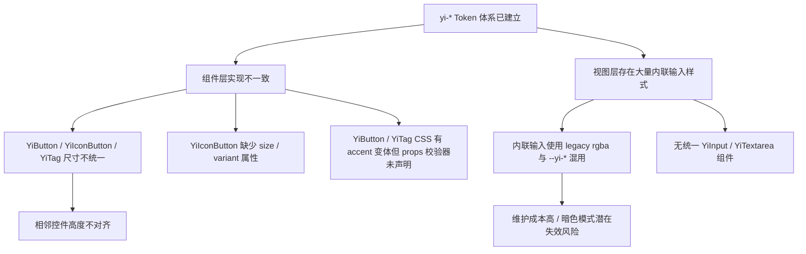
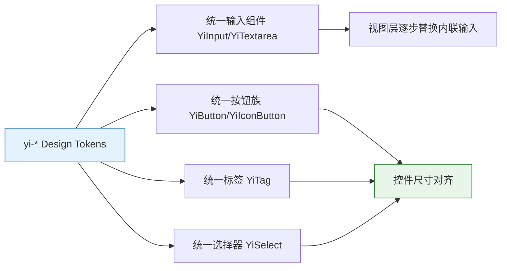

# 01 — 故事任务：优化统一基础组件大小与配色

## 项目信息

| 字段 | 值 |
|------|-----|
| 项目 | YiWeb |
| 故事 | YiWeb-unify-basic-components |
| 类型 | 前端优化 |
| 分支 | `feat/YiWeb-unify-basic-components` |
| 优先级 | P1 |

## 需求概述

基于现有 `yi-*` Design Token 体系，优化并统一输入框、按钮、标签按钮等基础组件的大小规范与配色方案，消除组件间视觉差异与 Token 使用不一致问题。

## 现状问题

### 数据证据

| 问题类型 | 数量 | 分布 |
|---------|------|------|
| 内联输入/文本域样式 | 8+ 处 | `src/views/aicr/styles/*.css` |
| 组件尺寸不一致 | 3 处 | YiButton / YiIconButton / YiTag |
| props 校验器缺失 | 2 处 | YiButton(accent) / YiTag(accent) |
| 组件能力缺失 | 2 处 | YiIconButton(size/variant) / YiSelect(size) |
| 无统一输入组件 | 1 处 | 需新建 YiInput / YiTextarea |

**关键文件**：
- `cdn/components/common/buttons/YiButton/` — 尺寸与校验器
- `cdn/components/common/buttons/YiIconButton/` — 缺少 size/variant
- `cdn/components/common/tags/YiTag/` — 尺寸与校验器
- `cdn/components/common/forms/YiSelect/` — 缺少 size 变体
- `src/views/aicr/styles/codePage.css` — 聊天输入域内联样式
- `src/views/aicr/styles/codePage.contextModals.css` — 设置/FAQ 输入内联样式

## 目标状态

### 统一尺寸规范

| 层级 | 控件高度 | 适用组件 |
|------|---------|---------|
| xs / compact | 32px | 小标签、紧凑图标按钮 |
| sm | 36px | 小按钮、小输入框 |
| md (default) | 44px | 标准按钮、标准输入、选择器触发器 |
| lg | 52px | 大按钮、大输入框 |

### 统一配色约束

- 所有组件背景、边框、文字必须使用 `--yi-*` Token
- Focus 状态统一使用 `box-shadow: var(--yi-shadow-focus)`
- Disabled 状态统一使用 `opacity: 0.5; cursor: not-allowed`
- 暗色/亮色/高对比/减少动效模式无回归

## 验收标准

1. `YiInput`、`YiTextarea` 组件可用，支持 `size`（sm/md/lg）、`variant`（default / error）、`disabled`
2. `YiButton` props 校验器包含 `accent`；`btn-block` 样式存在
3. `YiIconButton` 支持 `size`（sm/md/lg）与 `variant`（default/primary/ghost）
4. `YiTag` props 校验器包含 `accent`；尺寸命名统一为 sm/md/lg
5. `YiSelect` 支持 `size`（sm/md/lg）
6. 内联输入样式收敛：至少替换 `.aicr-session-settings-input`、`.aicr-session-faq-search-input`、`.pet-chat-textarea` 为统一组件或 Token
7. 相邻控件（按钮+输入框、按钮+选择器）在同一 size 下高度对齐
8. 无硬编码颜色值（文件类型图标等第三方品牌色除外）

## 范围边界

| 在范围内 | 在范围外 |
|---------|---------|
| `cdn/components/common/` 组件优化 | `cdn/` 第三方组件库（只读） |
| 新建 YiInput / YiTextarea | 重写 YiModal / YiLoading |
| 关键内联输入替换（settings、FAQ、chat） | 全部内联输入一次性替换（后续 story） |
| `theme.css` 如有缺失 Token 可补充 | 新增设计 token 体系 |

## 依赖与风险

- **依赖**：`YiWeb-unify-theme-colors` 已合并，Token 基线就绪
- **风险**：控件高度调整可能导致布局错位（需浏览器验证）
- **缓解**：零构建项目可直接浏览器验证，先改组件后改视图

## 预计产出

- `07-YiWeb-前端实施报告.md`
- `08-测试用例报告.md`
- `09-自改进复盘.md`
- `10-交互日志.md`
