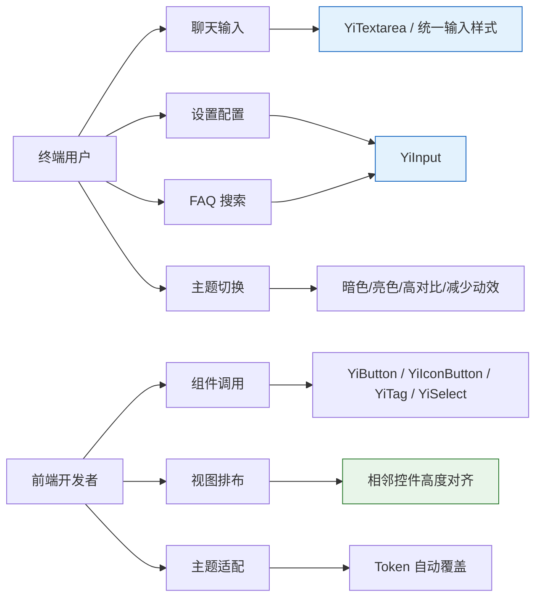
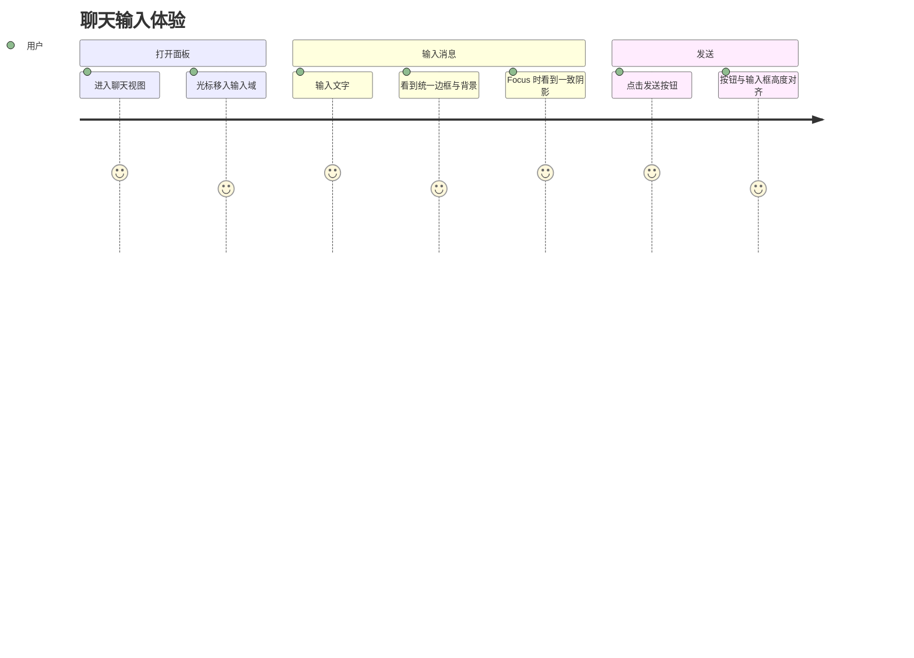
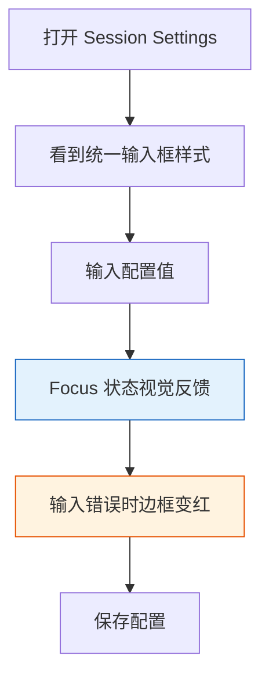
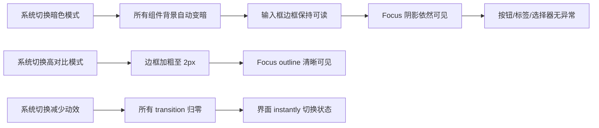
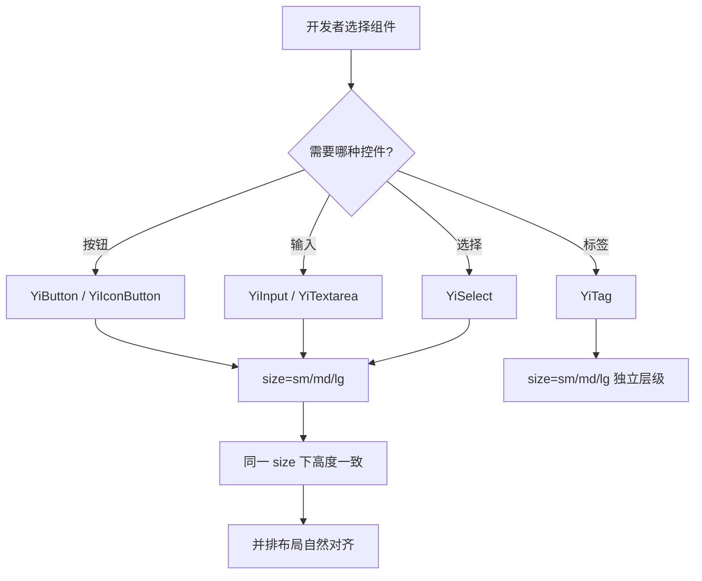

# 02 — 用户使用场景：优化统一基础组件大小与配色

## 角色定义

| 角色 | 描述 | 关注点 |
|------|------|--------|
| **终端用户** | 使用 YiWeb 应用进行交互的普通用户 | 界面美观、输入流畅、控件对齐、主题一致 |
| **前端开发者** | 在 YiWeb 项目中构建视图、调用组件的开发者 | 组件 API 统一、尺寸可预测、Token 覆盖全、暗色无回归 |

## 核心场景地图

---

## 场景一：聊天输入

> **角色**：终端用户  
> **触点**：聊天面板底部的消息输入域  
> **目标**：快速、舒适地输入多行消息，视觉与整体界面协调

### 用户旅程

### 痛点（优化前）

- 聊天输入域使用内联样式，含 legacy `rgba` 值，暗色模式下可能失效
- 输入框 focus 阴影与其他页面输入框不一致，割裂感明显
- 发送按钮（`YiButton`）与输入框高度未对齐，视觉重心偏移

### 期望（优化后）

- 输入域背景、边框、文字全部使用 `--yi-*` Token，暗色/亮色切换无闪烁
- Focus 状态统一为 `var(--yi-border-focus)` + `var(--yi-shadow-focus)`，与设置弹窗、FAQ 搜索输入体验一致
- 发送按钮与输入框在同一 size 下高度对齐（md=44px）

### 关联验收标准

- 验收标准 6：`.pet-chat-textarea` focus 相关 Token 已收敛
- 验收标准 7：相邻控件高度对齐

---

## 场景二：设置弹窗配置

> **角色**：终端用户  
> **触点**：Session Settings 弹窗内的表单输入  
> **目标**：在弹窗中修改配置项，输入框视觉统一、状态明确

### 用户旅程

### 痛点（优化前）

- 设置弹窗输入框使用 `.aicr-session-settings-input` 内联样式，6 处 focus 状态各自维护
- 无统一 `error` 状态样式，错误提示仅靠文字，缺少视觉层级
- 输入框高度（约 40px）与弹窗内的按钮（44px）不对齐

### 期望（优化后）

- 设置弹窗输入框可使用 `YiInput` 组件，或内联样式已收敛至统一 Token
- Focus 状态与全站输入框一致：边框 + 阴影统一
- Error 变体支持 `variant="error"`，边框为 `--yi-danger`，focus 阴影为红色系
- 输入框与按钮高度对齐（md=44px）

### 关联验收标准

- 验收标准 1：`YiInput` 可用，支持 `size`、`variant`、`disabled`
- 验收标准 6：`.aicr-session-settings-input` focus 状态已收敛
- 验收标准 7：相邻控件高度对齐

---

## 场景三：FAQ 搜索

> **角色**：终端用户  
> **触点**：FAQ Modal 顶部的搜索输入框  
> **目标**：快速检索常见问题，输入体验与全站一致

### 用户旅程

1. 打开 FAQ Modal
2. 光标移入搜索输入框
3. 输入关键词
4. 看到实时搜索结果

### 痛点（优化前）

- FAQ 搜索输入框使用 `.aicr-session-faq-search-input` 内联样式
- focus 状态与设置弹窗、聊天输入域不统一，用户在不同弹窗间切换时体验割裂

### 期望（优化后）

- FAQ 搜索输入框 focus 状态统一使用 `var(--yi-border-focus)` + `var(--yi-shadow-focus)`
- 视觉上与 YiInput 规范一致，为后续替换为 `YiInput` 组件做准备

### 关联验收标准

- 验收标准 6：`.aicr-session-faq-search-input` 已收敛

---

## 场景四：主题模式切换

> **角色**：终端用户  
> **触点**：系统主题偏好（暗色 / 亮色 / 高对比 / 减少动效）  
> **目标**：无论系统主题如何切换，所有控件视觉保持一致、可用

### 用户旅程

### 痛点（优化前）

- 部分内联输入使用硬编码 `rgba` 值，暗色模式下可能产生灰底黑字等不可读组合
- 组件间 Token 使用不一致，导致某些控件在特定主题下"掉队"

### 期望（优化后）

- 所有组件（YiInput、YiTextarea、YiButton、YiIconButton、YiTag、YiSelect）仅使用 `--yi-*` Token
- 暗色/亮色/高对比/减少动效四种模式无回归
- 无硬编码颜色值（第三方品牌色除外）

### 关联验收标准

- 验收标准 8：无硬编码颜色值

---

## 场景五：开发者调用组件

> **角色**：前端开发者  
> **触点**：在视图代码中引入 `YiButton`、`YiInput`、`YiSelect` 等组件  
> **目标**：组件 API 统一、尺寸可预测、排布自然对齐

### 用户旅程

### 痛点（优化前）

- `YiIconButton` 无 `size`/`variant` 属性，开发者无法统一控制尺寸和风格
- `YiSelect` 无 `size` 属性，与 `YiButton` 并排时高度不一致
- `YiButton` 和 `YiTag` 的 `accent` 变体 CSS 存在但 props 校验器未声明，开发者传入 `accent` 会触发警告
- 无统一 `YiInput`/`YiTextarea` 组件，开发者被迫写内联样式或复制粘贴

### 期望（优化后）

- 按钮族、输入族、选择器统一支持 `size`（sm/md/lg），同 size 高度对齐：sm=36px、md=44px、lg=52px
- `YiButton`、`YiTag` 的 `accent` 变体在 props 校验器中合法声明，开发者可放心使用
- `YiInput`、`YiTextarea` 作为标准组件提供，支持 `v-model`、`variant="error"`、`disabled`
- 控件并排时顶部自然对齐，无需手动调整 margin/padding

### 关联验收标准

- 验收标准 1：YiInput / YiTextarea 可用
- 验收标准 2：YiButton props 含 `accent`
- 验收标准 3：YiIconButton 支持 `size`/`variant`
- 验收标准 4：YiTag props 含 `accent`，尺寸命名统一
- 验收标准 5：YiSelect 支持 `size`
- 验收标准 7：相邻控件高度对齐

---

## 场景六：复杂表单排布

> **角色**：前端开发者  
> **触点**：需要按钮、输入框、选择器横向或纵向组合的视图  
> **目标**：多种控件组合时视觉整齐、间距可预测

### 示例组合

| 组合 | 组件 | size | 预期高度 |
|------|------|------|---------|
| 搜索栏 | YiInput + YiButton | md | 44px + 44px |
| 筛选行 | YiSelect + YiIconButton | sm | 36px + 36px |
| 大表单 | YiInput-lg + YiButton-lg + YiSelect-lg | lg | 52px + 52px + 52px |
| 标签组 | YiTag-sm × N | sm | 24px |

### 痛点（优化前）

- `YiButton(md)=44px`、`YiIconButton(默认)=40px`、`YiSelect(无 size)=~40px`，并排时顶部差 2–4px
- 开发者需要写额外的 `align-items: center` 或手动调整 padding 来弥补

### 期望（优化后）

- 同一 `size` 值在所有控件族中等高，组合布局零额外调整
- `YiTag` 保持独立高度体系（sm=24px, md=28px, lg=36px），因其视觉层级与控件不同，不强制对齐

### 关联验收标准

- 验收标准 7：相邻控件（按钮+输入框、按钮+选择器）在同一 size 下高度对齐
