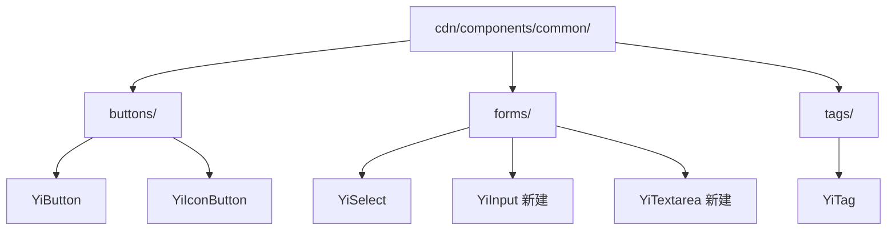

# 03 — 前端技术评审：优化统一基础组件大小与配色

## 架构现状

项目为零构建前端 SPA，组件通过 `registerGlobalComponent` 注册，CSS 与 HTML 分离。



## 技术方案

### 1. 新建 YiInput 组件

**目录**：`cdn/components/common/forms/YiInput/`

| 文件 | 说明 |
|------|------|
| `index.js` | Props: `type`, `size`(sm/md/lg), `variant`(default/error), `placeholder`, `disabled`, `modelValue` |
| `template.html` | `<input>` 或 `<textarea>` 根据 `multiline` 决定（或拆分为 YiTextarea） |
| `index.css` | 统一使用 `--yi-*` Token，高度 36/44/52px，focus 统一 `var(--yi-shadow-focus)` |

**关键实现点**：
- 支持 `v-model` 通过 `modelValue` + `update:modelValue`
- `size=md` 时高度 44px，与 YiButton(md)、YiSelect 触发器对齐
- `variant=error` 时边框使用 `--yi-danger`，focus shadow 使用 `--yi-danger-subtle`

### 2. 新建 YiTextarea 组件

**目录**：`cdn/components/common/forms/YiTextarea/`

- 与 YiInput 共享视觉规范，但支持 `rows`、`resize`、自动高度（可选）
- 默认最小高度 80px，与输入框保持相同的 padding 与 border 规范

### 3. YiButton 优化

**文件**：`cdn/components/common/buttons/YiButton/index.js`, `index.css`

- `variant` validator 追加 `'accent'`
- `index.css` 补充 `.btn-block { width: 100%; }`
- 统一尺寸：sm=36px, md=44px, lg=52px（当前 lg 未定义 min-height，需补充）

### 4. YiIconButton 增强

**文件**：`cdn/components/common/buttons/YiIconButton/index.js`, `index.css`

- 新增 `size` prop（sm/md/lg），默认值映射到现有 CSS 类
- 新增 `variant` prop（default/primary/ghost），CSS 补充对应变体
- 高度对齐：sm=36px, md=44px, lg=52px（当前 large=48px，需上调至 52px 以统一）

### 5. YiTag 优化

**文件**：`cdn/components/common/tags/YiTag/index.js`, `index.css`

- `variant` validator 追加 `'accent'`
- 尺寸命名统一：CSS 中 `.tag-small` → `.tag-sm`, `.tag-large` → `.tag-lg`
- 保持标签独立高度体系（sm=24px, md=28px, lg=36px），因为标签与控件视觉层级不同

### 6. YiSelect 增强

**文件**：`cdn/components/common/forms/YiSelect/index.js`, `index.css`

- 新增 `size` prop（sm/md/lg）
- 触发器高度：sm=36px, md=44px, lg=52px
- option 高度跟随触发器尺寸级联缩小/放大

### 7. 内联输入收敛

**目标样式**（逐步替换）：

```css
.yi-input,
.yi-textarea {
  width: 100%;
  border-radius: var(--yi-radius-md);
  padding: var(--yi-space-2) var(--yi-space-3);
  border: 1px solid var(--yi-border);
  background: var(--yi-surface);
  color: var(--yi-text);
  font-family: var(--yi-font-ui);
  font-size: var(--yi-text-base);
  transition: all var(--yi-duration-fast) var(--yi-easing-default);
  outline: none;
}
.yi-input:focus,
.yi-textarea:focus {
  border-color: var(--yi-border-focus);
  box-shadow: var(--yi-shadow-focus);
}
```

**本次替换范围**：
- `.aicr-session-settings-input` → YiInput
- `.aicr-session-faq-search-input` → YiInput
- `.pet-chat-textarea` → YiTextarea（或保持内联但收敛到统一 CSS 类）

## 影响分析

| 模块 | 影响类型 | 说明 |
|------|---------|------|
| `cdn/components/common/buttons/YiButton/` | 修改 | validator + CSS |
| `cdn/components/common/buttons/YiIconButton/` | 修改 | props + CSS |
| `cdn/components/common/tags/YiTag/` | 修改 | validator + CSS 类名 |
| `cdn/components/common/forms/YiSelect/` | 修改 | props + CSS |
| `cdn/components/common/forms/` | 新增 | YiInput / YiTextarea |
| `src/views/aicr/styles/codePage.css` | 修改 | 聊天输入域收敛 |
| `src/views/aicr/styles/codePage.contextModals.css` | 修改 | 设置/FAQ 输入收敛 |
| `cdn/components/index.js` | 修改 | 注册新组件 |

## 安全考量

- 所有 `registerGlobalComponent` 注册的组件为纯展示，无外部数据 fetch
- 输入组件不涉及 XSS，由调用方负责值过滤
- 保持 `credentials: 'omit'` 不受影响（无 API 变更）

## 性能考量

- 零构建项目，新增组件通过 CDN 懒加载，无打包体积问题
- CSS 增量增加，但组件级隔离，无全局污染
