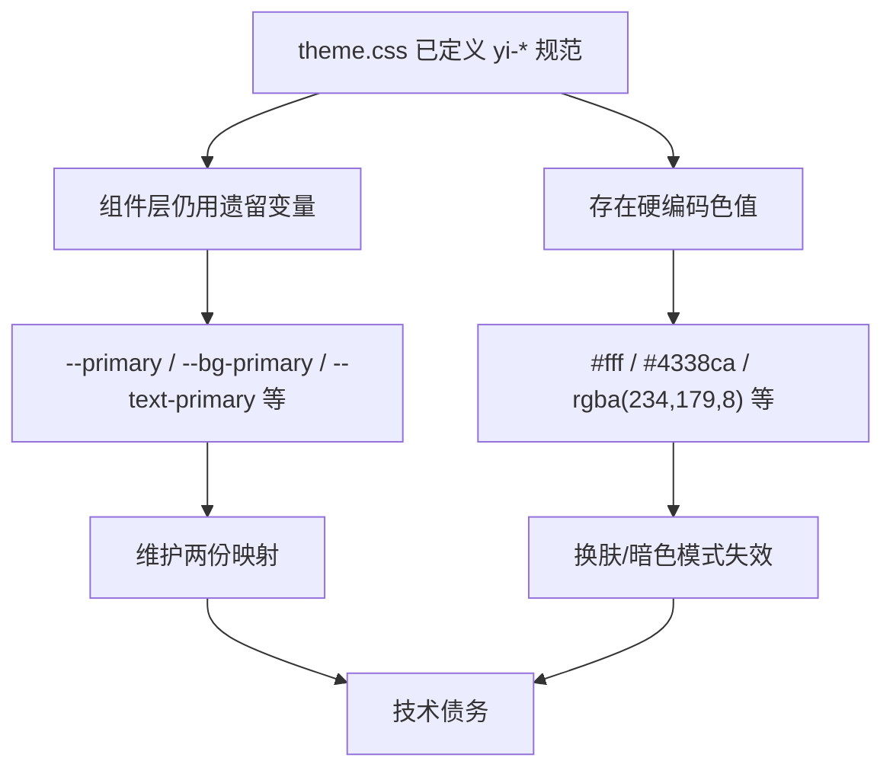
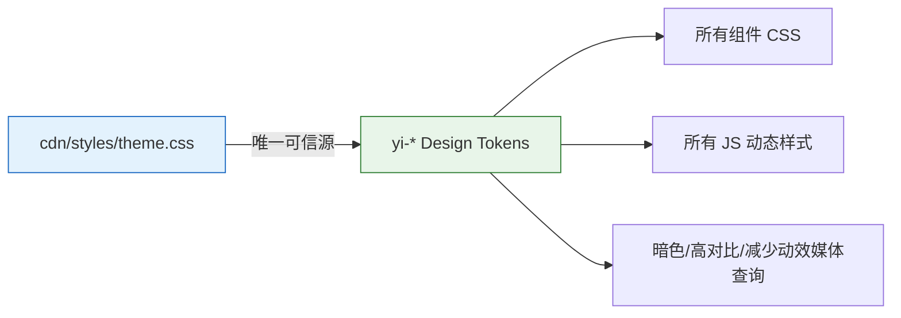

# 01 — 故事任务：统一主题色

## 项目信息

| 字段 | 值 |
|------|-----|
| 项目 | YiWeb |
| 故事 | YiWeb-unify-theme-colors |
| 类型 | 前端重构 |
| 分支 | `feat/YiWeb-unify-theme-colors` |
| 优先级 | P1 |

## 需求概述

基于现有 `yi-*` Design Token 体系，全面清理源码中的遗留变量和硬编码颜色，实现单一可信源（Single Source of Truth）的主题色管理。

## 现状问题

### 数据证据

| 问题类型 | 数量 | 分布 |
|---------|------|------|
| 遗留 CSS 变量使用 | 123 处 | 11 个 CSS 文件 |
| 硬编码 hex/rgba | 47+ 处 | CSS + JS 内联样式 |
| 主题不一致 | 2 处 | `--yi-primary:#2563EB` vs `#3b82f6` / `#6366f1` |

**关键文件**：`src/views/aicr/styles/*.css`（11 个文件）、`src/views/aicr/hooks/*.js`（3 个文件）、`src/views/aicr/utils/resizer.js`

## 目标状态

## 验收标准

1. `src/` 下所有 CSS 文件不直接使用遗留变量（`--primary`, `--bg-primary`, `--text-primary`, `--border-primary` 等）
2. `src/` 下所有 CSS/JS 无硬编码颜色值（文件类型图标等第三方品牌色除外）
3. `--pet-chat-main-color` 收敛至 `--yi-primary`
4. `theme.css` 遗留变量映射段标记 `@deprecated`，保留但不再新增引用
5. 暗色模式、高对比度模式、减少动效模式下无视觉回归

## 范围边界

| 在范围内 | 在范围外 |
|---------|---------|
| `src/views/aicr/**/*.css` | `cdn/` 第三方组件库（只读） |
| `src/views/aicr/**/*.js` 动态样式 | 新增设计 token（当前体系已覆盖） |
| `theme.css` 遗留映射标记 | 修改 HTML 结构 |

## 依赖与风险

- **依赖**：无外部依赖，纯样式重构
- **风险**：暗色模式视觉回归（需逐文件对比验证）
- **缓解**：零构建项目可直接浏览器验证，无需编译等待

## 预计产出

- `06-前端实施报告.md`
- `07-测试用例报告.md`
- `08-自改进复盘.md`
