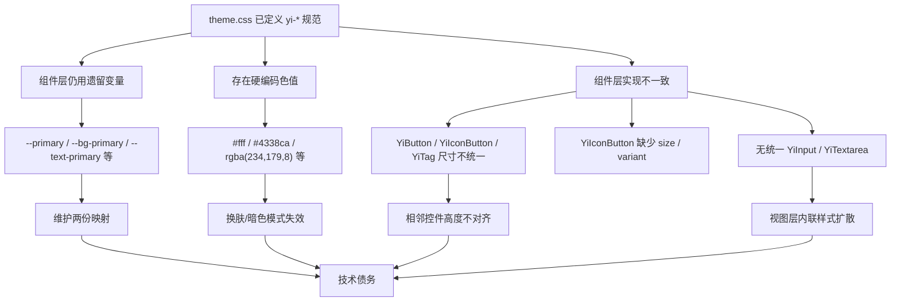
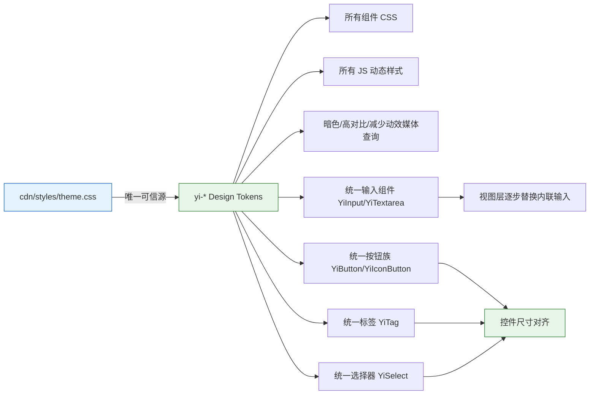

# 01 — 故事任务：统一主题色与基础组件

## 项目信息

| 字段 | 值 |
|------|-----|
| 项目 | YiWeb |
| 故事 | YiWeb-unify-theme-colors |
| 类型 | 前端重构 + 组件优化 |
| 分支 | `feat/YiWeb-unify-theme-colors` |
| 优先级 | P1 |

## 需求概述

基于现有 `yi-*` Design Token 体系，全面清理源码中的遗留变量和硬编码颜色，并统一基础组件（按钮、输入、标签、选择器）的大小规范与配色方案，实现单一可信源（Single Source of Truth）的主题色与组件规范管理。

## 现状问题

### 数据证据

| 问题类型 | 数量 | 分布 |
|---------|------|------|
| 遗留 CSS 变量使用 | 123 处 | 11 个 CSS 文件 |
| 硬编码 hex/rgba | 47+ 处 | CSS + JS 内联样式 |
| 主题不一致 | 2 处 | `--yi-primary:#2563EB` vs `#3b82f6` / `#6366f1` |
| 内联输入/文本域样式 | 8+ 处 | `src/views/aicr/styles/*.css` |
| 组件尺寸不一致 | 3 处 | YiButton / YiIconButton / YiTag |
| props 校验器缺失 | 2 处 | YiButton(accent) / YiTag(accent) |
| 组件能力缺失 | 2 处 | YiIconButton(size/variant) / YiSelect(size) |
| 无统一输入组件 | 1 处 | 需新建 YiInput / YiTextarea |

**关键文件**：`src/views/aicr/styles/*.css`（11 个文件）、`src/views/aicr/hooks/*.js`（3 个文件）、`src/views/aicr/utils/resizer.js`、`cdn/components/common/*`

## 目标状态

### 统一尺寸规范

| 层级 | 控件高度 | 适用组件 |
|------|---------|---------|
| sm | 36px | 小按钮、小输入框、小图标按钮、小选择器 |
| md (default) | 44px | 标准按钮、标准输入、标准图标按钮、标准选择器 |
| lg | 52px | 大按钮、大输入框、大图标按钮、大选择器 |

### 统一配色约束

- 所有组件背景、边框、文字必须使用 `--yi-*` Token
- Focus 状态统一使用 `box-shadow: var(--yi-shadow-focus)`
- Disabled 状态统一使用 `opacity: 0.5; cursor: not-allowed`
- 暗色/亮色/高对比/减少动效模式无回归

## 验收标准

### Phase 1：主题色统一（已完成）

1. `src/` 下所有 CSS 文件不直接使用遗留变量（`--primary`, `--bg-primary`, `--text-primary`, `--border-primary` 等）
2. `src/` 下所有 CSS/JS 无硬编码颜色值（文件类型图标等第三方品牌色除外）
3. `--pet-chat-main-color` 收敛至 `--yi-primary`
4. `theme.css` 遗留变量映射段标记 `@deprecated`，保留但不再新增引用
5. 暗色模式、高对比度模式、减少动效模式下无视觉回归

### Phase 2：基础组件统一（已完成）

6. 新建 YiInput / YiTextarea 组件，支持 size(sm/md/lg)、variant(error)、v-model
7. YiButton variant 校验器包含 accent，补充 block 与 lg min-height
8. YiIconButton 支持 size(sm/md/lg) 与 variant(primary/ghost)，基线 44px
9. YiTag variant 校验器包含 accent，尺寸命名统一为 sm/md/lg
10. YiSelect 支持 size(sm/md/lg)，option 级联尺寸，CSS 类名修复
11. 视图层 focus 状态统一收敛至 `var(--yi-border-focus)` + `var(--yi-shadow-focus)`

## 范围边界

| 在范围内 | 在范围外 |
|---------|---------|
| `src/views/aicr/**/*.css` | `cdn/` 第三方组件库（只读） |
| `src/views/aicr/**/*.js` 动态样式 | 新增设计 token（当前体系已覆盖） |
| `theme.css` 遗留映射标记 | 修改 HTML 结构 |
| `cdn/components/common/*` 组件优化 | 视图层完整组件化替换（本次仅收敛 focus Token） |

## 依赖与风险

- **依赖**：无外部依赖，纯样式重构 + 组件优化
- **风险**：暗色模式视觉回归（需逐文件对比验证）
- **缓解**：零构建项目可直接浏览器验证，无需编译等待

## 预计产出

- `02-用户使用场景.md`
- `04-YiWeb-前端技术评审.md`
- `05-测试用例评审.md`
- `07-YiWeb-前端实施报告.md`
- `08-测试用例报告.md`
- `09-自改进复盘.md`
- `10-交互日志.md`
