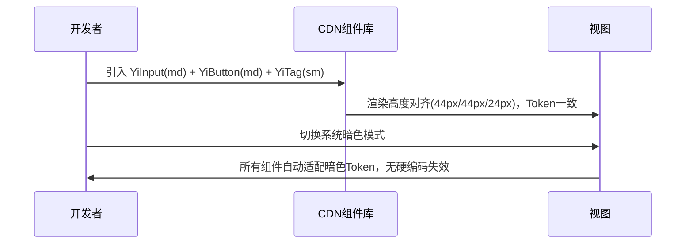
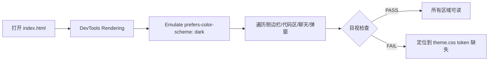

# 02 — 用户使用场景：统一主题色与基础组件

## 场景一：开发者新建功能模块

**角色**：前端开发者
**目标**：在 `src/views/aicr/` 下新增一个面板，需要输入框、按钮、标签
**路径**：

**关键收益**：无需手写内联样式，组件尺寸自动对齐，暗色模式零额外工作。

## 场景二：设计师调整品牌主色

**角色**：设计师 / 开发者
**目标**：将品牌主色从 `#2563EB` 调整为新品牌色
**路径**：

1. 打开 `cdn/styles/theme.css`
2. 修改 `:root` 中 `--yi-primary` 及关联 RGB token
3. 保存后刷新浏览器
4. 所有引用 `--yi-primary` 的组件、视图、JS 动态样式同步更新

**关键收益**：单一修改点，全局生效，无遗漏硬编码。

## 场景三：QA 执行暗色模式回归

**角色**：QA 工程师
**目标**：验证暗色模式下所有面板无亮色块、无低对比度文本
**路径**：

**关键收益**：暗色值为 `:root` 默认，亮色为可选媒体查询，检查维度减半。

## 场景四：开发者修复 YiSelect 样式不匹配

**角色**：前端开发者
**目标**：YiSelect 下拉选项样式与触发器不一致
**路径**：

1. 检查发现 `.select-trigger` 类在 CSS 中不存在，模板使用 `.select`
2. 将 CSS 中相关规则从 `.select-trigger` 修正为 `.select`
3. 同步添加 `size` 属性支持，option 级联尺寸
4. 验证触发器 44px 与相邻 YiButton 44px 顶部对齐

**关键收益**：类名修复 + 尺寸对齐一次性完成，消除历史债务。

## 场景五：无障碍审查

**角色**：无障碍工程师
**目标**：验证高对比度与减少动效模式
**路径**：

1. 开启系统高对比度 → 检查所有组件边框 ≥2px，focus outline 可见
2. 开启减少动效 → 检查所有 transition/animation 归零
3. 检查所有组件使用语义 Token（`--yi-danger` 用于错误，非硬编码红色）

**关键收益**：媒体查询与语义 Token 已内置，无需额外开发。

## 场景边界

| 覆盖 | 未覆盖 |
|------|--------|
| 主题色统一替换 | 业务逻辑变更 |
| 基础组件尺寸/配色对齐 | 新增复杂交互组件 |
| 暗色/亮色/高对比/减少动效 | 自定义主题切换器 |
| 视图层 focus 状态收敛 | 视图层完整组件化替换 |
