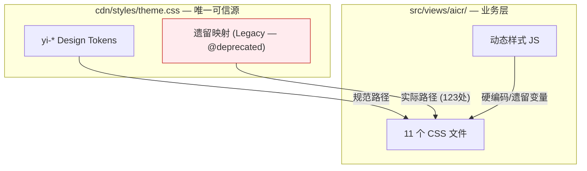
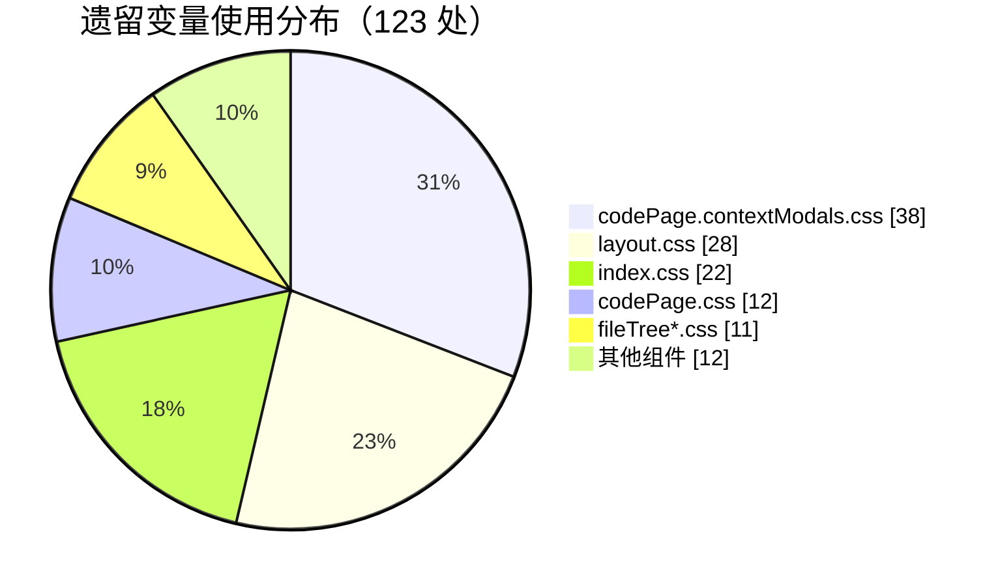
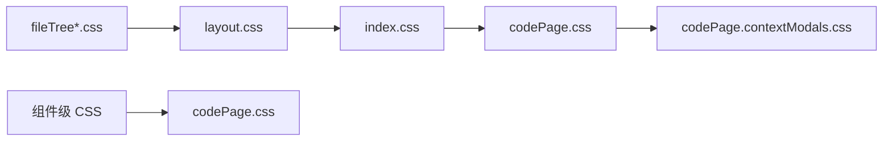

# 03 — 前端技术评审：统一主题色

## 项目类型判定

前端 / 零构建 / ESM / 自研 `createBaseView` 视图框架

## 架构现状

## Token 体系

### 规范层（Canonical）

| Namespace | 用途 | 示例 |
|-----------|------|------|
| `--yi-primary` | 主品牌色 | `#2563EB` |
| `--yi-primary-hover` | 主色悬停 | `#1D4ED8` |
| `--yi-primary-rgb` | RGB 分量 | `37, 99, 235` |
| `--yi-success/warning/danger/info` | 语义色 | `#10B981` / `#F59E0B` / `#EF4444` / `#06B6D4` |
| `--yi-bg` / `--yi-surface` | 表面色 | `#F8FAFC` / `#FFFFFF` |
| `--yi-text` / `--yi-text-secondary` / `--yi-text-muted` | 文本色 | `#0F172A` / `#475569` / `#94A3B8` |
| `--yi-border` / `--yi-border-subtle` | 边框色 | `#E2E8F0` / `#F1F5F9` |
| `--yi-shadow-*` / `--yi-radius-*` | 装饰 token | — |

### 遗留层（Legacy — 待清理引用）

| 遗留变量 | 映射目标 | 需替换文件数 |
|---------|---------|------------|
| `--primary` | `--yi-primary` | 11 |
| `--primary-hover` | `--yi-primary-hover` | 11 |
| `--bg-primary` / `--bg-primary-rgb` | `--yi-dark-surface` / `--yi-code-bg` | 9 |
| `--text-primary` / `--text-primary-rgb` | `--yi-code-text` / `--yi-text` | 10 |
| `--border-primary` | `--yi-border` | 8 |
| `--shadow-*` (旧) | `--yi-shadow-*` | 3 |

## 问题分布

### CSS 文件级

### JS 动态样式

| 文件 | 问题 | 替换策略 |
|------|------|---------|
| `resizer.js:98,114` | `rgba(59,130,246,...)` 硬编码 | 改为 `getComputedStyle` 读取 `--yi-primary-rgb` |
| `sessionChatContextMethods.js:309` | 内联 CSS 字符串 `#fff` | 改为 CSS 类或读取 token |
| `sessionChatContextShared.js:289` | 内联 CSS 字符串 `rgba(0,0,0,0.35)` | 改为语义变量 |
| `tagManagerMethods.js` | fallback 值 `#6366f1` / `#4f46e5` | 更新 fallback 为 `--yi-primary` 对应值 |

## 实施方案

### 阶段一：主题根文件收敛

1. `theme.css` 遗留映射段添加 `@deprecated` 注释
2. 补齐缺失的 RGB 分量 token（如 `--yi-text-secondary-rgb`）
3. 统一 `--pet-chat-main-color` → `--yi-primary`

### 阶段二：CSS 逐文件迁移

按依赖关系从底层到上层：

替换规则（机械映射）：

| 旧 | 新 |
|---|---|
| `var(--primary)` | `var(--yi-primary)` |
| `var(--bg-primary)` | `var(--yi-dark-surface)` |
| `var(--text-primary)` | `var(--yi-code-text)` / `var(--yi-text)`（按上下文） |
| `var(--border-primary)` | `var(--yi-border)` |
| `rgba(var(--bg-primary-rgb), x)` | `rgba(var(--yi-dark-surface-rgb), x)`（需新增 token） |

### 阶段三：JS 动态样式收敛

1. `resizer.js`：拖拽条颜色从 DOM `getComputedStyle` 读取 `--yi-primary-rgb`
2. 内联 HTML 字符串中的样式提取为 CSS 类或使用 CSS 变量继承
3. fallback 值更新为当前主题色值

### 阶段四：回归验证

- 浏览器直接打开 `index.html`
- 检查：亮色模式 / 暗色模式（`prefers-color-scheme: dark`）/ 高对比度
- 重点验证：侧边栏、代码区、弹窗、搜索面板、拖拽条

## 安全考量

- 无用户输入变更，纯样式替换
- `localStorage` 无改动
- `fetch` 无改动
- 不涉及第三方 CDN 组件内部样式

## 回滚策略

- 零构建项目，无编译产物
- 回滚 = `git revert` 或 `git checkout`
- 验证窗口：本地 file:// 或静态服务器直接预览
