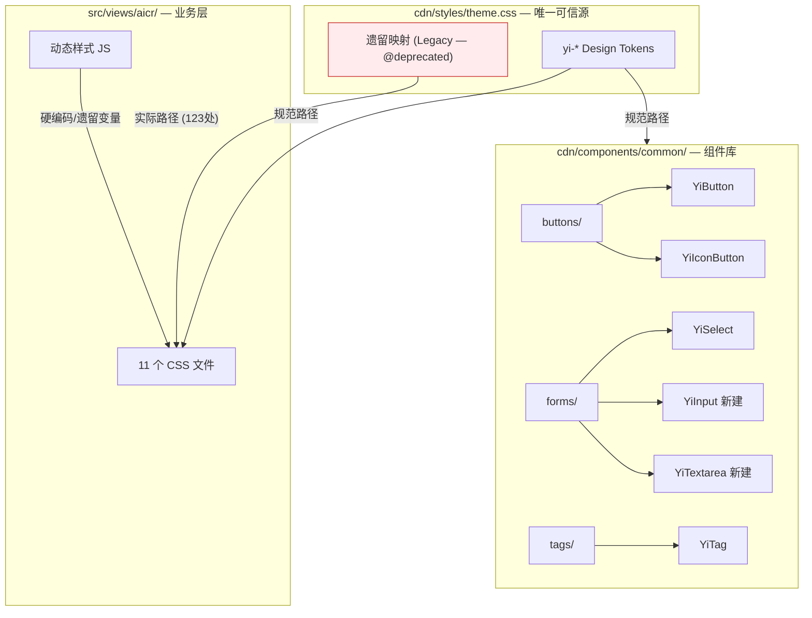
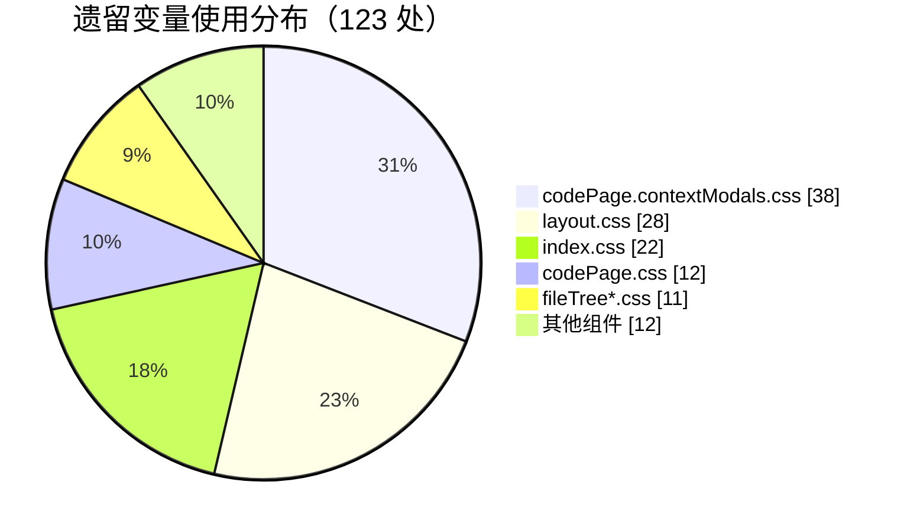
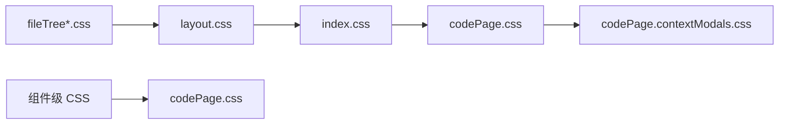

# 04 — 前端技术评审：统一主题色与基础组件

## 项目类型判定

前端 / 零构建 / ESM / 自研 `createBaseView` 视图框架

## 架构现状

## Token 体系

### 规范层（Canonical）

| Namespace | 用途 | 示例 |
|-----------|------|------|
| `--yi-primary` | 主品牌色 | `#2563EB` |
| `--yi-primary-hover` | 主色悬停 | `#1D4ED8` |
| `--yi-primary-rgb` | RGB 分量 | `37, 99, 235` |
| `--yi-success/warning/danger/info` | 语义色 | `#10B981` / `#F59E0B` / `#EF4444` / `#06B6D4` |
| `--yi-bg` / `--yi-surface` | 表面色 | `#0F172A` / `#1E293B`（暗色默认） |
| `--yi-text` / `--yi-text-secondary` / `--yi-text-muted` | 文本色 | `#F8FAFC` / `#CBD5E1` / `#94A3B8`（暗色默认） |
| `--yi-border` / `--yi-border-subtle` | 边框色 | `rgba(255,255,255,0.1)` / `rgba(255,255,255,0.06)`（暗色默认） |
| `--yi-shadow-*` / `--yi-radius-*` | 装饰 token | — |

### 遗留层（Legacy — 待清理引用）

| 遗留变量 | 映射目标 | 需替换文件数 |
|---------|---------|------------|
| `--primary` | `--yi-primary` | 11 |
| `--primary-hover` | `--yi-primary-hover` | 11 |
| `--bg-primary` / `--bg-primary-rgb` | `--yi-dark-surface` / `--yi-code-bg` | 9 |
| `--text-primary` / `--text-primary-rgb` | `--yi-code-text` / `--yi-text` | 10 |
| `--border-primary` | `--yi-border` | 8 |
| `--shadow-*` (旧) | `--yi-shadow-*` | 3 |

## 问题分布

### CSS 文件级

### JS 动态样式

| 文件 | 问题 | 替换策略 |
|------|------|---------|
| `resizer.js:98,114` | `rgba(59,130,246,...)` 硬编码 | 改为对齐 `--yi-primary` |
| `sessionChatContextMethods.js:309` | 内联 CSS 字符串 `#fff` | 语义变量替换 |
| `sessionChatContextShared.js:289` | 内联 CSS 字符串 `rgba(0,0,0,0.35)` | 语义变量替换 |
| `tagManagerMethods.js` | fallback 值 `#6366f1` / `#4f46e5` | 收敛至 `--yi-primary` |

### 组件级

| 组件 | 问题 | 策略 |
|------|------|------|
| YiButton | variant 缺 accent；lg 未定义 min-height；缺 block | 补 validator + CSS |
| YiIconButton | 无 size/variant；基线 40px 未对齐 | 新增 props + CSS 变体；基线改 44px |
| YiTag | variant 缺 accent；size 命名 small/large | 补 validator；统一为 sm/md/lg |
| YiSelect | 无 size；CSS 类名 .select-trigger 不匹配 | 新增 size prop；修正 CSS 类名 |
| YiInput / YiTextarea | 缺失 | 新建统一组件 |

## 实施方案

### Phase 1：主题根文件收敛

1. `theme.css` 遗留映射段添加 `@deprecated` 注释
2. 补齐缺失的 RGB 分量 token（如 `--yi-dark-surface-rgb`）
3. 统一 `--pet-chat-main-color` → `--yi-primary`
4. `:root` 默认值改为暗色优先，`@media (prefers-color-scheme: light)` 恢复亮色值

### Phase 2：CSS 逐文件迁移

按依赖关系从底层到上层：

替换规则（机械映射）：

| 旧 | 新 |
|---|---|
| `var(--primary)` | `var(--yi-primary)` |
| `var(--bg-primary)` | `var(--yi-dark-surface)` |
| `var(--text-primary)` | `var(--yi-code-text)` / `var(--yi-text)`（按上下文） |
| `var(--border-primary)` | `var(--yi-border)` |
| `rgba(var(--bg-primary-rgb), x)` | `rgba(var(--yi-dark-surface-rgb), x)`（需新增 token） |

### Phase 3：JS 动态样式收敛

1. `resizer.js`：拖拽条颜色收敛至 `--yi-primary-rgb`
2. 内联 HTML 字符串中的样式提取为 CSS 类或使用 CSS 变量继承
3. fallback 值更新为当前主题色值

### Phase 4：基础组件统一

#### 新建 YiInput 组件

**目录**：`cdn/components/common/forms/YiInput/`

| 文件 | 说明 |
|------|------|
| `index.js` | Props: `type`, `size`(sm/md/lg), `variant`(default/error), `placeholder`, `disabled`, `modelValue` |
| `template.html` | `<input>` 单文件 |
| `index.css` | 统一使用 `--yi-*` Token，高度 36/44/52px，focus 统一 `var(--yi-shadow-focus)` |

**关键实现点**：
- 支持 `v-model` 通过 `modelValue` + `update:modelValue`
- `size=md` 时高度 44px，与 YiButton(md)、YiSelect 触发器对齐
- `variant=error` 时边框使用 `--yi-danger`，focus shadow 使用 `--yi-danger-subtle`

#### 新建 YiTextarea 组件

**目录**：`cdn/components/common/forms/YiTextarea/`

- 与 YiInput 共享视觉规范，但支持 `rows`、`resize`、自动高度（可选）
- 默认最小高度 80px，与输入框保持相同的 padding 与 border 规范

#### YiButton 优化

- `variant` validator 追加 `'accent'`
- `index.css` 补充 `.btn-block { width: 100%; }` 与 `.btn-lg { min-height: 52px; }`

#### YiIconButton 增强

- 新增 `size` prop（sm/md/lg），默认值映射到现有 CSS 类
- 新增 `variant` prop（default/primary/ghost），CSS 补充对应变体
- 高度对齐：sm=36px, md=44px, lg=52px

#### YiTag 优化

- `variant` validator 追加 `'accent'`
- 尺寸命名统一：CSS 中 `.tag-small` → `.tag-sm`, `.tag-large` → `.tag-lg`
- 保持标签独立高度体系（sm=24px, md=28px, lg=36px）

#### YiSelect 增强

- 新增 `size` prop（sm/md/lg）
- 触发器高度：sm=36px, md=44px, lg=52px
- option 高度跟随触发器尺寸级联缩小/放大
- CSS 类名修复：`.select-trigger` → `.select`

### Phase 5：视图级收敛

- `.aicr-session-settings-input` / `.aicr-session-faq-search-input` focus 状态收敛
- `.pet-chat-textarea` focus 状态收敛
- 搜索输入框 `box-shadow` 收敛至 `var(--yi-shadow-focus)`

### Phase 6：回归验证

- 浏览器直接打开 `index.html`
- 检查：亮色模式 / 暗色模式（`prefers-color-scheme: dark`）/ 高对比度
- 重点验证：侧边栏、代码区、弹窗、搜索面板、拖拽条、基础组件

## 影响分析

| 模块 | 影响类型 | 说明 |
|------|---------|------|
| `cdn/styles/theme.css` | 修改 | 默认暗色值 + Light 媒体查询 + 遗留标记 |
| `src/views/aicr/styles/*.css` | 修改 | 遗留变量/硬编码替换 |
| `src/views/aicr/hooks/*.js` | 修改 | 动态样式收敛 |
| `src/views/aicr/utils/resizer.js` | 修改 | 颜色收敛 |
| `cdn/components/common/buttons/YiButton/` | 修改 | validator + CSS |
| `cdn/components/common/buttons/YiIconButton/` | 修改 | props + CSS |
| `cdn/components/common/tags/YiTag/` | 修改 | validator + CSS 类名 |
| `cdn/components/common/forms/YiSelect/` | 修改 | props + CSS |
| `cdn/components/common/forms/` | 新增 | YiInput / YiTextarea |
| `src/views/aicr/index.js` | 修改 | 注册新组件 |
| `cdn/components/index.js` | 修改 | 导出新组件 |

## 安全考量

- 无用户输入变更，纯样式替换 + 组件增强
- `localStorage` 无改动
- `fetch` 无改动
- 不涉及第三方 CDN 组件内部样式
- 输入组件为纯展示，XSS 由调用方负责值过滤

## 性能考量

- 零构建项目，新增组件通过 CDN 懒加载，无打包体积问题
- CSS 增量增加，但组件级隔离，无全局污染

## 回滚策略

- 零构建项目，无编译产物
- 回滚 = `git revert` 或 `git checkout`
- 验证窗口：本地 file:// 或静态服务器直接预览
