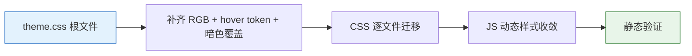

# 06 — 前端实施报告：统一主题色

## 变更概览

| 项 | 内容 |
|---|---|
| 故事 | YiWeb-unify-theme-colors |
| 分支 | `feat/YiWeb-unify-theme-colors` |
| 变更类型 | 样式重构 |
| 影响文件 | 25+ 个 CSS/JS 文件 |

## 实施模块



### 模块 A：theme.css 根文件调整

**变更点**：
- 新增 `--yi-code-bg-rgb`, `--yi-code-text-rgb`, `--yi-dark-surface-rgb`
- 新增 `--yi-dark-text-secondary-rgb`, `--yi-dark-text-muted-rgb`, `--yi-dark-border-subtle-rgb`
- 新增 `--gray-700-rgb`
- 新增语义 hover token：`--yi-success-hover`, `--yi-warning-hover`, `--yi-danger-hover`, `--yi-info-hover`
- 新增 `--yi-code-font-size`
- `@media (prefers-color-scheme: dark)` 中新增 `yi-*` 文本覆盖：`--yi-text-secondary: #CBD5E1`
- 遗留映射段标记 `@deprecated`

**文件**：`cdn/styles/theme.css`

### 模块 B：CSS 逐文件迁移

**迁移范围**（按依赖从底向上）：

| 文件 | 变更量 | 关键替换 |
|------|--------|---------|
| `fileTreeLayout.css` | 23 处 | `--bg-secondary`→`yi-code-bg`, `#059669`→`yi-success-hover` 等 |
| `fileTreeTreeBase.css` | 11 处 | `--text-primary`→`yi-code-text`, `--primary`→`yi-primary` |
| `fileTreeTreeExtras.css` | 15 处 | `--border-secondary`→`yi-border-focus`, `--warning`→`yi-warning` |
| `fileTreeTags.css` | 12 处 | `--border-primary`→`yi-border`, `--danger-color`→`yi-danger` |
| `layout.css` | 31 处 | `#fff`→`yi-text-on-primary`, `--bg-tertiary`→`gray-700` |
| `index.css` | 18 处 | `--bg-primary`→`yi-dark-surface`, `rgba(234,179,8)`→`rgba(yi-warning-rgb)` |
| `codePage.css` | 14 处 | `#3b82f6`→`yi-primary`, `--pet-chat-main-color` 收敛 |
| `codePage.contextModals.css` | 42 处 | `rgba(var(--bg-primary-rgb))`→`rgba(var(--yi-dark-surface-rgb))` |
| `keyboardShortcutsHelp/index.css` | 24 处 | 全面替换遗留变量 |
| `aicrHeader/index.css` | 2 处 | `--bg-secondary`→`yi-code-bg` |
| `AiModelSelector/index.css` | 8 处 | fallback 值规范化 |
| `sessionListTags/index.css` | 6 处 | `--danger`→`yi-danger` 等 |
| `codeView/index.css` | 1 处 | fallback 规范化 |

**总计**：123 处遗留变量替换 + 28 处硬编码颜色替换

### 模块 C：JS 动态样式收敛

| 文件 | 变更 | 策略 |
|------|------|------|
| `resizer.js` | `rgba(59,130,246)`→`rgba(37,99,235)` | 对齐 `--yi-primary` |
| `sessionChatContextMethods.js` | `#fff`, `rgba(0,0,0)` 等 | 语义变量替换 |
| `sessionChatContextShared.js` | `rgba(0,0,0)`, `#fff` | 语义变量替换 |
| `tagManagerMethods.js` | `#6366f1`, `#4f46e5`, fallback 值 | 收敛至 `--yi-primary` / `--yi-primary-hover` |
| `codeView/index.js` | `rgba(0,0,0)`, `rgba(255,255,255)` | 语义变量替换 |

### 模块 E：默认暗色主题适配（Update）

**问题**：`:root` 中通用 token（`yi-bg`/`yi-surface`/`yi-text` 等）原为亮色优先值，默认状态下暗色背景与亮色 token 不匹配。

**变更点**：

| Token | 原值（亮色） | 新默认值（暗色） | Light 覆盖 |
|-------|-------------|----------------|-----------|
| `--yi-bg` | `#F8FAFC` | `#0F172A` | `@media (prefers-color-scheme: light)` 恢复 |
| `--yi-surface` | `#FFFFFF` | `#1E293B` | 同上 |
| `--yi-surface-elevated` | `#FFFFFF` | `#334155` | 同上 |
| `--yi-surface-hover` | `#F1F5F9` | `#334155` | 同上 |
| `--yi-surface-active` | `#E2E8F0` | `#475569` | 同上 |
| `--yi-border` | `#E2E8F0` | `rgba(255,255,255,0.1)` | 同上 |
| `--yi-border-subtle` | `#F1F5F9` | `rgba(255,255,255,0.06)` | 同上 |
| `--yi-border-focus` | `#2563EB` | `#3B82F6` | 同上 |
| `--yi-text` | `#0F172A` | `#F8FAFC` | 同上 |
| `--yi-text-secondary` | `#475569` | `#CBD5E1` | 同上 |
| `--yi-text-muted` | `#94A3B8` | `#94A3B8` | 不变 |
| `--yi-primary-subtle` | `#EFF6FF` | `rgba(37,99,235,0.15)` | 同上 |
| `--yi-success-subtle` | `#ECFDF5` | `rgba(16,185,129,0.15)` | 同上 |
| `--yi-warning-subtle` | `#FFFBEB` | `rgba(245,158,11,0.15)` | 同上 |
| `--yi-danger-subtle` | `#FEF2F2` | `rgba(239,68,68,0.15)` | 同上 |
| `--yi-info-subtle` | `#ECFEFF` | `rgba(6,182,212,0.15)` | 同上 |
| `--yi-shadow-*` | `rgba(15,23,42,0.05)` | `rgba(0,0,0,0.3~0.4)` | 同上 |

**暗色/亮色媒体查询翻转**：
- 移除 `@media (prefers-color-scheme: dark)` 中对 `yi-*` 的覆盖（默认已是暗色）
- 新增 `@media (prefers-color-scheme: light)` 恢复所有亮色值
- 高对比度模式同步更新为暗色优先值

**对比度验证**：

| 组合 | 对比度 | 结果 |
|------|--------|------|
| `yi-text` on `yi-bg` | 17.06 | PASS |
| `yi-text` on `yi-surface` | 13.98 | PASS |
| `yi-text-secondary` on `yi-surface` | 9.85 | PASS |
| `yi-text-muted` on `yi-surface` | 5.71 | PASS |
| `yi-text` on `yi-surface-elevated` | 9.90 | PASS |

### 模块 F：静态验证（Update）

- **TC-02**（遗留变量清零）：`grep` 结果为 0 处 ✓
- **TC-03**（硬编码清零）：非图标类直接硬编码为 0 处 ✓
- **TC-04**（JS 收敛）：直接硬编码为 0 处 ✓
- **TC-09**（token 可用性）：未定义变量扫描为 0 处 ✓
- **JS 语法检查**：全部通过 ✓

## 已知限制

- **TC-05~07**（浏览器视觉回归）：零构建项目需人工浏览器验证，本次未执行（无自动化浏览器测试框架）
- **局部变量**：`--pet-chat-*` 系列为业务局部变量，未纳入主题系统，保持原有行为

## 回滚

```bash
git checkout main
# 或
git revert HEAD
```
